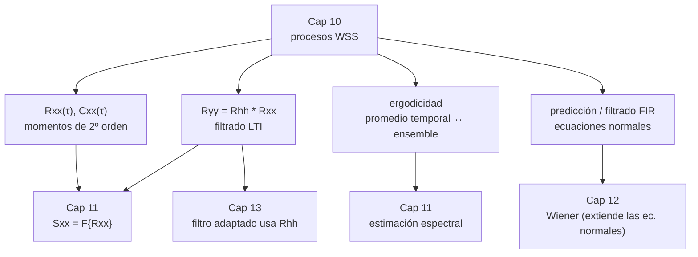

Complemento del capítulo 10 de [[PROCESAMIENTO DE SEÑALES]].

# Procesos Aleatorios — En Profundidad

El capítulo 10 del apunte principal arma bien la intuición: un proceso es un *ensemble* de señales, WSS es el nivel de estructura que vamos a usar siempre, y filtrar un proceso WSS por un LTI da otro proceso WSS. Pero al ser un resumen, varias afirmaciones quedan como "se puede demostrar que", los ejemplos quedan planteados sin la cuenta, y no se toca nada de qué pasa cuando esto se aplica a datos reales. Este documento se mete en eso:

- **Las demostraciones.** Por qué SSS implica WSS (y por qué no al revés), de dónde sale la cota $|C_{xx}(\tau)|\leq C_{xx}(0)$ sin pedir prestado el capítulo 7, el paso de rigor que el resumen saltea al filtrar, y la cuenta completa del criterio de ergodicidad.
- **Las cuentas.** La autocorrelación de la onda telegráfica derivada de punta a punta, la predicción lineal con números, el filtrado LTI con un ejemplo concreto, y la ergodicidad verificada por simulación.
- **La práctica.** Cómo estimar la media de un proceso correlacionado (y por qué "tenés menos datos de los que creés"), el estimador sesgado vs insesgado de $R_{xx}[m]$, cómo simular un proceso con la autocorrelación que quieras, y cómo chequear estacionariedad con datos.

###### **Cómo leer esto**
No hace falta ir en orden. Según lo que estés buscando:

| Si querés… | Andá a |
|---|---|
| ver por qué SSS $\Rightarrow$ WSS, con un contraejemplo del recíproco | Parte 1.1 |
| la demostración de $\lvert C_{xx}(\tau)\rvert\leq C_{xx}(0)$ hecha desde cero | Parte 1.2 |
| el paso de rigor que falta en "filtrar un WSS da un WSS" | Parte 1.3 |
| la cuenta completa del criterio de ergodicidad en media | Parte 1.4 |
| la autocorrelación de la onda telegráfica derivada entera | Parte 2.1 |
| predicción lineal y filtrado LTI con números | Parte 2.2 y 2.3 |
| por qué "tenés menos muestras de las que creés" | Parte 3.1 |
| estimador sesgado vs insesgado de $R_{xx}[m]$ | Parte 3.2 |
| simular un proceso con una autocorrelación dada | Parte 3.3 |
| conectar el capítulo con el 7, el 8, el 11 y el 12 | Parte 4 |
| practicar | Parte 5 |

---

# Parte 1 — Las demostraciones

## 1.1 SSS implica WSS (y por qué WSS no implica SSS)

El resumen dice "si toda la densidad es invariante, en particular lo son los momentos". Es cierto, pero vale la pena ver el mecanismo, porque el mismo argumento explica también el caso gaussiano.

###### **Recordá qué dice SSS**
Estricta (SSS): para **todo** $\ell$, para toda elección de instantes $t_1,\dots,t_\ell$ y para **todo** corrimiento $\alpha$,
$$f_{X(t_1+\alpha),\dots,X(t_\ell+\alpha)}(x_1,\dots,x_\ell) = f_{X(t_1),\dots,X(t_\ell)}(x_1,\dots,x_\ell)$$
O sea: la densidad conjunta de cualquier grupo de muestras no cambia si desplazás todos los instantes a la vez.

###### **Que la media es constante**
Tomá $\ell=1$. La condición dice $f_{X(t+\alpha)}(x)=f_{X(t)}(x)$ para todo $\alpha$ y todo $t$. En particular, poniendo $t=0$:
$$f_{X(\alpha)}(x)=f_{X(0)}(x)\qquad\text{para todo }\alpha$$
Es decir, $X(\alpha)$ tiene **la misma densidad marginal** que $X(0)$, sea cual sea $\alpha$. Y si la densidad es la misma, la media es la misma:
$$\mu_X(\alpha)=\int x\,f_{X(\alpha)}(x)\,dx=\int x\,f_{X(0)}(x)\,dx=\mu_X(0)$$
que no depende de $\alpha$. Entonces $\mu_X(t)=\mu_X$, constante. ∎

###### **Que la autocorrelación depende solo de la diferencia**
Tomá $\ell=2$. La condición dice $f_{X(t_1+\alpha),X(t_2+\alpha)}=f_{X(t_1),X(t_2)}$ para todo $\alpha$. Elegí el corrimiento particular $\alpha=-t_1$:
$$f_{X(0),\,X(t_2-t_1)}=f_{X(t_1),\,X(t_2)}$$
O sea: la densidad conjunta de $(X(t_1),X(t_2))$ es idéntica a la de $(X(0),X(\tau))$ con $\tau=t_2-t_1$. Depende **solo de $\tau$**. Por lo tanto:
$$R_{XX}(t_1,t_2)=\iint x_1x_2\,f_{X(t_1),X(t_2)}(x_1,x_2)\,dx_1dx_2=\iint x_1x_2\,f_{X(0),X(\tau)}(x_1,x_2)\,dx_1dx_2=R_{XX}(\tau)$$
depende solo de $\tau$. ∎

Juntando las dos cosas: **SSS $\Rightarrow$ WSS**, siempre.

###### **El recíproco es falso: un contraejemplo concreto**
Construimos un proceso de tiempo discreto que es WSS pero **no** SSS. Sean los $X[n]$ independientes entre sí, con
$$X[n]\sim \mathcal{N}(0,1)\quad\text{si }n\text{ es par}, \qquad X[n]\sim \mathcal{U}(-\sqrt3,\ \sqrt3)\quad\text{si }n\text{ es impar}$$
(la uniforme en $[-\sqrt3,\sqrt3]$ tiene varianza $\frac{(2\sqrt3)^2}{12}=1$).

**Es WSS.** Media: $E[X[n]]=0$ para todo $n$, constante. Autocorrelación: por independencia, $E[X[n]X[n+m]]=E[X[n]]\,E[X[n+m]]=0$ para $m\neq0$, y $E[X[n]^2]=1$ para $m=0$. O sea $R_{xx}[m]=\delta[m]$, que depende solo de $m$. ✓

**No es SSS.** La densidad marginal de $X[n]$ es gaussiana si $n$ es par y uniforme si $n$ es impar — dos curvas de forma completamente distinta, aunque tengan la misma media y la misma varianza. Corrés todo un instante ($\alpha=1$) y la densidad de orden 1 cambia. Ya falla en $\ell=1$.

![[c10p-contraejemplo-sss.svg]]

> La moraleja: WSS solo mira los momentos de primer y segundo orden. Todo lo que pase de la tercera potencia para arriba — asimetría, curtosis, la forma de la distribución — es invisible para WSS. Dos procesos pueden ser indistinguibles como WSS y ser cosas totalmente diferentes.

###### **El caso gaussiano: acá WSS sí implica SSS**
Un **proceso gaussiano** es aquel en el que cualquier colección finita de muestras $X(t_1),\dots,X(t_\ell)$ es un vector conjuntamente gaussiano. Y un vector gaussiano queda **completamente determinado** por su vector de medias $\boldsymbol\mu$ y su matriz de covarianza $\Sigma$, vía la fórmula
$$f(\mathbf{x})=(2\pi)^{-\ell/2}\,|\Sigma|^{-1/2}\,\exp\!\Big(-\tfrac12(\mathbf{x}-\boldsymbol\mu)^{\!\top}\Sigma^{-1}(\mathbf{x}-\boldsymbol\mu)\Big)$$
No hay ningún otro parámetro. La densidad **es** $(\boldsymbol\mu,\Sigma)$.

Ahora supongamos que el proceso gaussiano es WSS. Entonces:
- $\mu_X(t_i)=\mu_X$ para todo $i$ → el vector de medias es $\mu_X\cdot\mathbf{1}$, siempre el mismo.
- $\Sigma_{ij}=C_{XX}(t_i-t_j)$ → cada entrada depende solo de una diferencia.

Corré todos los instantes por $\alpha$: el nuevo vector de medias sigue siendo $\mu_X\cdot\mathbf{1}$ (no cambió), y la nueva matriz de covarianza tiene entradas $C_{XX}\big((t_i+\alpha)-(t_j+\alpha)\big)=C_{XX}(t_i-t_j)=\Sigma_{ij}$ (tampoco cambió, porque las diferencias no las toca un corrimiento común).

Como ni $\boldsymbol\mu$ ni $\Sigma$ cambiaron, y la densidad **es** $(\boldsymbol\mu,\Sigma)$, la densidad conjunta es idéntica antes y después de correr. Eso vale para cualquier $\ell$ y cualquier elección de instantes. Es SSS. ∎

> **Por qué esto importa.** En casi todo el resto de la materia (Wiener, Kalman, detección) el ruido se modela gaussiano. Para esos modelos, pedir WSS y pedir SSS es exactamente lo mismo — con lo cual siempre trabajás con la versión más cómoda (WSS) sin perder nada.

## 1.2 El truco cuadrático: de dónde sale $|C_{xx}(\tau)|\leq C_{xx}(0)$

El resumen deriva esta cota diciendo "sale directo del capítulo 7, porque el coeficiente de correlación vive entre $-1$ y $1$". Es correcto, pero se puede probar **desde cero**, sin invocar nada del capítulo 7, con un truco que después vas a reconocer en todos lados.

###### **La idea**
Trabajamos con el proceso **centrado** $\tilde{x}(t)=x(t)-\mu_x$. Para cualquier número real $\lambda$, construimos la variable aleatoria $\tilde{x}(t)-\lambda\,\tilde{x}(t+\tau)$ y miramos su segundo momento:
$$g(\lambda)=E\big[(\tilde{x}(t)-\lambda\,\tilde{x}(t+\tau))^2\big]$$

Esto es **la esperanza de un cuadrado**, así que $g(\lambda)\geq0$ para **todo** $\lambda$. Esa es toda la munición: una certeza que tenemos antes de calcular nada.

###### **Desarrollamos**
$$g(\lambda)=E[\tilde{x}(t)^2]-2\lambda\,E[\tilde{x}(t)\tilde{x}(t+\tau)]+\lambda^2\,E[\tilde{x}(t+\tau)^2]$$
Usando que el proceso es WSS (la varianza es la misma en todo instante, y el término cruzado es la autocovarianza en el lag $\tau$):
$$g(\lambda)=C_{xx}(0)-2\lambda\,C_{xx}(\tau)+\lambda^2\,C_{xx}(0)$$

Es una **parábola en $\lambda$**, con coeficientes $a=C_{xx}(0)$, $b=-2C_{xx}(\tau)$, $c=C_{xx}(0)$.

###### **El argumento**
Tenemos $g(\lambda)\geq0$ para todo $\lambda$, y $a=C_{xx}(0)\geq0$ (es una varianza). Una parábola con la boca hacia arriba que **nunca** baja de cero es exactamente una parábola **sin dos raíces reales distintas**, es decir con discriminante no positivo:
$$b^2-4ac\leq0$$
$$4\,C_{xx}(\tau)^2-4\,C_{xx}(0)^2\leq0$$
$$C_{xx}(\tau)^2\leq C_{xx}(0)^2$$
Y como $C_{xx}(0)\geq0$, tomando raíz:
$$\boxed{\ |C_{xx}(\tau)|\leq C_{xx}(0)\ }$$
∎

![[c10p-cuadratico.svg]]

En la figura: el caso típico ($|C_{xx}(\tau)|<C_{xx}(0)$) tiene mínimo positivo y nunca toca el eje; el caso límite ($|C_{xx}(\tau)|=C_{xx}(0)$) toca el eje en un punto (discriminante exactamente cero); el caso imposible ($|C_{xx}(\tau)|>C_{xx}(0)$) tendría una parábola que cruza a valores negativos — que es justo lo que $g(\lambda)\geq0$ prohíbe.

> **El caso de igualdad tiene significado.** Cuando $|C_{xx}(\tau)|=C_{xx}(0)$, la parábola toca el cero en algún $\lambda^\ast$, y eso quiere decir $E[(\tilde{x}(t)-\lambda^\ast\tilde{x}(t+\tau))^2]=0$, o sea $\tilde{x}(t)=\lambda^\ast\tilde{x}(t+\tau)$ casi seguramente. Las dos muestras son **una múltiplo exacta de la otra**, sin nada de aleatoriedad residual. Es la versión para procesos de "$|\rho_{XY}|=1$ significa que $Y$ es función afín de $X$".

## 1.3 Filtrado LTI de un proceso WSS: los pasos que el resumen saltea

El resumen hace la derivación completa de $\mu_y=H(j0)\mu_x$, $R_{yx}=h*R_{xx}$ y $R_{yy}=R_{hh}*R_{xx}$. Está bien, pero hay dos huecos de rigor que conviene tapar, porque explican **qué condiciones** hacen falta para que todo eso valga.

###### **Hueco 1: ¿se puede meter la esperanza adentro de la integral?**
El primer paso del resumen es
$$E[y(t)]=E\Big[\int_{-\infty}^{\infty}h(v)\,x(t-v)\,dv\Big]=\int_{-\infty}^{\infty}h(v)\,E[x(t-v)]\,dv$$
Ese intercambio de $E[\cdot]$ y $\int$ **no es gratis**: es el teorema de Fubini, y necesita una condición de integrabilidad absoluta. La condición suficiente es
$$\int_{-\infty}^{\infty}E\big[\,|h(v)\,x(t-v)|\,\big]\,dv<\infty$$

Verifiquémosla. $E[|h(v)x(t-v)|]=|h(v)|\,E[|x(t-v)|]$. Y por la desigualdad de Jensen (o Cauchy-Schwarz),
$$E[|x(t-v)|]\leq\sqrt{E[x(t-v)^2]}=\sqrt{R_{xx}(0)}=:K<\infty$$
donde $K$ es **la misma constante para todo instante**, porque el proceso es WSS (segundo momento constante). Entonces
$$\int E[|h(v)x(t-v)|]\,dv\leq K\int_{-\infty}^{\infty}|h(v)|\,dv<\infty$$
siempre que $h$ sea **absolutamente integrable** — que es exactamente la condición de estabilidad BIBO del sistema.

> **En resumen, qué se necesita:** que el proceso de entrada tenga **varianza finita** ($R_{xx}(0)<\infty$) y que el sistema sea **BIBO estable** ($h\in L^1$). Con eso, todos los intercambios de esperanza e integral que hace el resumen están justificados, y $y(t)$ es un proceso bien definido. (El mismo argumento, con Cauchy-Schwarz, cubre los pasos de $R_{yx}$ y $R_{yy}$.)

###### **Hueco 2: ¿por qué "no depende de $t$" es lo mismo que "conjuntamente WSS"?**
El resumen calcula
$$E[y(t+\tau)\,x(t)]=\int h(v)\,\underbrace{E[x(t+\tau-v)\,x(t)]}_{R_{xx}(\tau-v)}\,dv$$
y observa que el resultado "no depende de $t$, solo de $\tau$". Vale la pena decir explícitamente por qué eso es lo que hay que probar.

Por definición, dos procesos $x(\cdot)$ e $y(\cdot)$ son **conjuntamente WSS** si:
1. cada uno es WSS por separado (ya lo tenemos: $\mu_y$ constante, y $R_{yy}$ depende solo de $\tau$ por el mismo argumento repetido), y
2. la correlación cruzada $R_{xy}(t_1,t_2)=E[x(t_1)y(t_2)]$ depende **solo de la diferencia** $t_1-t_2$.

El cálculo de arriba es exactamente la verificación del punto 2: escribiendo $t_1=t+\tau$, $t_2=t$, se obtiene que $E[x(t_1)y(t_2)]$ es una función que solo depende de $t_1-t_2=\tau$ (la integral $\int h(v)R_{xx}(\tau-v)dv$ no contiene $t$ por ningún lado). Ese "no aparece $t$" **es** la condición de conjuntamente WSS, no un comentario al pasar.

## 1.4 Ergodicidad en media: de dónde sale el criterio

El resumen enuncia el criterio ("un proceso WSS con varianza finita cuya autocovarianza tiende a cero cuando el lag crece es ergódico en media") pero no lo prueba. Acá está la cuenta.

###### **La varianza del promedio temporal**
Sea $\bar{y}(T)=\dfrac{1}{2T}\displaystyle\int_{-T}^{T}x(t)\,dt$ el promedio de una realización sobre la ventana $[-T,T]$.

Es insesgado: $E[\bar{y}(T)]=\dfrac{1}{2T}\int_{-T}^{T}\mu_x\,dt=\mu_x$.

Su varianza:
$$\mathrm{Var}\big[\bar{y}(T)\big]=\frac{1}{(2T)^2}\int_{-T}^{T}\!\!\int_{-T}^{T}\mathrm{Cov}\big(x(t_1),x(t_2)\big)\,dt_1\,dt_2=\frac{1}{(2T)^2}\int_{-T}^{T}\!\!\int_{-T}^{T}C_{xx}(t_1-t_2)\,dt_1\,dt_2$$

Cambio de variable $\tau=t_1-t_2$. Para un $\tau$ fijo en $[-2T,2T]$, el conjunto de pares $(t_1,t_2)\in[-T,T]^2$ con $t_1-t_2=\tau$ tiene "largo" $2T-|\tau|$ (es el solapamiento de dos intervalos de largo $2T$ desplazados $\tau$ — el mismo triángulo que aparece en el teorema de Wiener-Khinchin del capítulo 11). Así que la integral doble colapsa a una simple:
$$\mathrm{Var}\big[\bar{y}(T)\big]=\frac{1}{(2T)^2}\int_{-2T}^{2T}(2T-|\tau|)\,C_{xx}(\tau)\,d\tau=\frac{1}{2T}\int_{-2T}^{2T}\Big(1-\frac{|\tau|}{2T}\Big)\,C_{xx}(\tau)\,d\tau$$

###### **El criterio, con un argumento $\varepsilon$**
**Afirmación:** si $C_{xx}(\tau)\to0$ cuando $\tau\to\infty$ (y recordá que $|C_{xx}(\tau)|\leq C_{xx}(0)<\infty$ siempre, por 1.2), entonces $\mathrm{Var}[\bar{y}(T)]\to0$ cuando $T\to\infty$. Y eso es exactamente **ergódico en media** (convergencia en media cuadrática al valor $\mu_x$).

**Prueba.** Sea $\varepsilon>0$. Como $C_{xx}(\tau)\to0$, existe $T_0$ tal que $|C_{xx}(\tau)|<\varepsilon$ para todo $|\tau|>T_0$. Llamemos $\Lambda(\tau)=1-\frac{|\tau|}{2T}\in[0,1]$ al peso triangular. Partimos la integral en dos zonas:

$$\mathrm{Var}[\bar{y}(T)]=\underbrace{\frac{1}{2T}\int_{|\tau|\leq T_0}\Lambda(\tau)\,C_{xx}(\tau)\,d\tau}_{\text{(A)}}+\underbrace{\frac{1}{2T}\int_{T_0<|\tau|\leq 2T}\Lambda(\tau)\,C_{xx}(\tau)\,d\tau}_{\text{(B)}}$$

**(A):** en valor absoluto está acotada por $\dfrac{1}{2T}\displaystyle\int_{-T_0}^{T_0}|C_{xx}(\tau)|\,d\tau\leq\dfrac{1}{2T}\cdot2T_0\cdot C_{xx}(0)=\dfrac{T_0}{T}\,C_{xx}(0)\ \xrightarrow[T\to\infty]{}\ 0$

(porque $T_0$ y $C_{xx}(0)$ son fijos).

**(B):** como $\Lambda\leq1$ y $|C_{xx}(\tau)|<\varepsilon$ en esa zona,
$$|\text{(B)}|<\frac{1}{2T}\int_{T_0<|\tau|\leq2T}\varepsilon\,d\tau\leq\frac{1}{2T}\cdot4T\cdot\varepsilon=2\varepsilon$$

Entonces, para $T$ suficientemente grande (tan grande que (A) sea menor que $\varepsilon$), tenemos $\mathrm{Var}[\bar{y}(T)]<\varepsilon+2\varepsilon=3\varepsilon$. Como $\varepsilon$ era arbitrario, $\mathrm{Var}[\bar{y}(T)]\to0$. ∎

> **Lo que hace el argumento.** El triángulo $\Lambda(\tau)$ y el factor $\frac{1}{2T}$ conspiran para que la contribución de los lags donde $C_{xx}$ todavía es grande se diluya a medida que $T$ crece, mientras que la contribución de los lags donde $C_{xx}$ ya es chica está acotada por $\varepsilon$. No hace falta que $C_{xx}$ sea absolutamente integrable: alcanza con que tienda a cero.

###### **El contraejemplo, con la cuenta**
El proceso "batería" del resumen: cada realización es una **constante** $x[n]=A$, con $A$ una variable aleatoria de media 0 y varianza $\sigma_A^2$. Su autocovarianza es $C_{xx}[m]=\mathrm{Cov}(A,A)=\sigma_A^2$ para **todo** $m$ — nunca decae. Metiendo esto en la fórmula (versión discreta):
$$\mathrm{Var}[\bar{y}(N)]=\frac{1}{N}\sum_{k=-(N-1)}^{N-1}\Big(1-\frac{|k|}{N}\Big)\sigma_A^2=\sigma_A^2\cdot\frac{1}{N}\sum_k\Big(1-\frac{|k|}{N}\Big)=\sigma_A^2\cdot\frac{1}{N}\cdot N=\sigma_A^2$$
(la suma de los pesos triangulares da exactamente $N$). O sea: **la varianza del promedio nunca baja de $\sigma_A^2$, por más que promedies**. Tiene sentido: el promedio temporal de una realización constante *es* esa constante, que vale $A$ — nunca se acerca a $E[A]=0$.

La figura muestra las dos curvas: para $C_{xx}[m]=4\,(0{,}6)^{|m|}$ (que decae), $\mathrm{Var}[\bar{y}]\to0$ como $1/N$; para $C_{xx}[m]=4$ constante, se queda clavada en 4.

![[c10p-ergodicidad-varianza.svg]]

Los puntos son Monte Carlo (4000 realizaciones AR(1) por cada $N$), y caen exactamente sobre la fórmula:

| $N$ | Var teórica | Var Monte Carlo |
|---|---|---|
| 20 | $0{,}725$ | $0{,}714$ |
| 100 | $0{,}157$ | $0{,}158$ |
| 500 | $0{,}0319$ | $0{,}0312$ |
| 2000 | $0{,}00799$ | $0{,}00811$ |

---

# Parte 2 — Ejemplos resueltos con números

## 2.1 La autocorrelación de la onda telegráfica, derivada completa

El resumen tira el resultado $R_{xx}(\tau)=e^{-2\lambda|\tau|}$ y dice "se puede demostrar". Hagámoslo.

###### **El proceso**
$x(t)=\pm1$, con $x(0)=+1$ o $-1$ con probabilidad $\tfrac12$ cada uno. La señal **cambia de signo en instantes de Poisson** con tasa $\lambda$: el número de cambios de signo en un intervalo de largo $T$ es Poisson con parámetro $\lambda T$,
$$P(k\text{ cambios en un intervalo de largo }T)=\frac{(\lambda T)^k\,e^{-\lambda T}}{k!}$$

###### **La media es cero**
Por simetría: $x(0)$ es $\pm1$ equiprobable, y un cambio de signo no privilegia ninguna dirección, así que $x(t)$ sigue siendo $\pm1$ equiprobable en todo instante. Entonces $\mu_x(t)=0$.

###### **La autocorrelación**
$R_{xx}(t_1,t_2)=E[x(t_1)x(t_2)]$. El producto $x(t_1)x(t_2)$ vale $+1$ si las dos muestras tienen **el mismo signo**, y $-1$ si tienen signos distintos. Y las dos tienen el mismo signo **si y solo si hubo un número par de cambios** entre $t_1$ y $t_2$ (cada cambio invierte el signo; un número par de inversiones vuelve al original). Con $T=|t_2-t_1|$:
$$R_{xx}(t_1,t_2)=(+1)\cdot P(\text{par de cambios en }T)+(-1)\cdot P(\text{impar de cambios en }T)$$
$$=P(\text{par})-P(\text{impar})=e^{-\lambda T}\Big[\sum_{k\text{ par}}\frac{(\lambda T)^k}{k!}-\sum_{k\text{ impar}}\frac{(\lambda T)^k}{k!}\Big]$$

El corchete es $\displaystyle\sum_{k=0}^{\infty}(-1)^k\frac{(\lambda T)^k}{k!}$ (el $(-1)^k$ vale $+1$ en los pares y $-1$ en los impares), y esa suma es la serie de $e^{-\lambda T}$:
$$\sum_{k=0}^{\infty}\frac{(-\lambda T)^k}{k!}=e^{-\lambda T}$$

Entonces:
$$R_{xx}(t_1,t_2)=e^{-\lambda T}\cdot e^{-\lambda T}=e^{-2\lambda T}=\boxed{\ e^{-2\lambda|t_2-t_1|}\ }$$
Depende solo de $|t_1-t_2|$: el proceso es **WSS**. ∎

###### **Verificación numérica**
Sumando la Poisson directamente (sin usar la identidad de la serie), $P(\text{par})-P(\text{impar})$ da:

| $T$ | $P(\text{par})-P(\text{impar})$ | $e^{-2\lambda T}$ |
|---|---|---|
| $0{,}3$ | $0{,}6570468$ | $0{,}6570468$ |
| $1{,}0$ | $0{,}2465970$ | $0{,}2465970$ |
| $2{,}5$ | $0{,}0301974$ | $0{,}0301974$ |

Y simulando 6 realizaciones del proceso (con $\lambda=0{,}7$) y estimando la autocorrelación por promedio, la curva empírica se pega a $e^{-2\lambda|\tau|}$:

![[c10p-telegrafica-verificada.svg]]

> **El parámetro tiene doble lectura.** En el tiempo, $2\lambda$ es la velocidad a la que el proceso se olvida de su pasado. En el capítulo 11 vas a ver que también es el ancho de banda: la PSD de este proceso es $\dfrac{4\lambda}{4\lambda^2+\omega^2}$, una lorentziana cuyo punto de $-3$ dB cae en $\omega=2\lambda$. Memoria corta $\Leftrightarrow$ espectro ancho.

## 2.2 Predicción lineal con números

El resumen deriva el predictor lineal $\hat{x}[n_0+m]=\mu_x+\dfrac{C_{xx}[m]}{C_{xx}[0]}(x[n_0]-\mu_x)$. Pongámosle números.

Tomemos un proceso con $C_{xx}[m]=9\,(0{,}7)^{|m|}$ (o sea $\sigma_x^2=9$, correlación geométrica con razón $0{,}7$) y media $\mu_x=10$.

###### **El peso de la medición según cuánto predecimos**
El factor $\dfrac{C_{xx}[m]}{C_{xx}[0]}=(0{,}7)^m$ es el coeficiente de correlación entre el presente y el instante que queremos predecir:

| $m$ (pasos al futuro) | $\rho=(0{,}7)^m$ | MMSE $=\sigma_x^2(1-\rho^2)$ |
|---|---|---|
| 1 | $0{,}700$ | $4{,}59$ |
| 3 | $0{,}343$ | $7{,}94$ |
| 10 | $0{,}0282$ | $8{,}99$ |

A un paso, la medición pesa $0{,}70$ y el error baja a la mitad de la varianza. A diez pasos, la medición ya casi no aporta ($\rho\approx0{,}03$): el predictor devuelve prácticamente la media, y el error es casi la varianza entera. **La predicción lineal tiene un horizonte** más allá del cual no sirve para nada.

###### **Un caso concreto**
Si $x[n_0]=16$ (o sea $6$ por encima de la media) y queremos predecir 3 pasos adelante:
$$\hat{x}[n_0+3]=10+(0{,}7)^3\cdot(16-10)=10+0{,}343\cdot6=\boxed{12{,}058}$$
con MMSE $=9\,(1-0{,}343^2)=\boxed{7{,}94}$.

El predictor "tira hacia la media": de los $6$ de desvío que muestra la medición, solo se anima a proyectar $2{,}06$ al futuro, porque a 3 pasos la correlación ya se debilitó.

## 2.3 Filtrado LTI con números

El resumen da $R_{yy}(\tau)=R_{hh}(\tau)*R_{xx}(\tau)$. Calculemos la varianza de la salida en un caso concreto.

###### **El planteo**
- Entrada: proceso WSS con $R_{xx}(\tau)=e^{-2|\tau|}$ (o sea $\alpha=2$, varianza $1$).
- Filtro: pasabajos exponencial causal $h(t)=3\,e^{-3t}\,u(t)$ (o sea $\beta=3$, ganancia en continua $H(j0)=\int h=1$).

Queremos $R_{yy}(0)=\mathrm{Var}\,y(t)$.

###### **La cuenta, en el tiempo**
Como $R_{yy}(\tau)=R_{hh}(\tau)*R_{xx}(\tau)$, evaluando en $\tau=0$:
$$R_{yy}(0)=\int_{-\infty}^{\infty}R_{hh}(s)\,R_{xx}(0-s)\,ds=\int_{-\infty}^{\infty}R_{hh}(s)\,R_{xx}(s)\,ds$$
(usando que $R_{xx}$ es par).

Necesitamos $R_{hh}$, la autocorrelación **determinística** del filtro. Para $\tau\geq0$:
$$R_{hh}(\tau)=\int_{0}^{\infty}h(t+\tau)\,h(t)\,dt=\int_{0}^{\infty}3e^{-3(t+\tau)}\cdot3e^{-3t}\,dt=9\,e^{-3\tau}\int_{0}^{\infty}e^{-6t}\,dt=9\,e^{-3\tau}\cdot\frac{1}{6}=\frac{3}{2}\,e^{-3\tau}$$
y por simetría $R_{hh}(\tau)=\dfrac{3}{2}\,e^{-3|\tau|}$.

Entonces:
$$R_{yy}(0)=\int_{-\infty}^{\infty}\frac{3}{2}\,e^{-3|s|}\cdot e^{-2|s|}\,ds=\frac{3}{2}\cdot2\int_{0}^{\infty}e^{-5s}\,ds=3\cdot\frac{1}{5}=\boxed{\ \frac{3}{5}=0{,}6\ }$$

En general, para $R_{xx}(\tau)=e^{-\alpha|\tau|}$ y $h(t)=\beta e^{-\beta t}u(t)$, sale $R_{yy}(0)=\dfrac{\beta}{\alpha+\beta}$.

![[c10p-filtrado-numerico.svg]]

###### **Verificación**
- Integral numérica de $\int R_{hh}(s)R_{xx}(s)\,ds$: da $0{,}600000$. ✓
- Simulación (genero $x$ con la autocorrelación pedida, lo filtro con $h$ discretizado, mido la varianza de la salida): $\mathrm{Var}\,y=0{,}612$. ✓

> Fijate que $R_{yy}(0)<R_{xx}(0)=1$: el filtro pasabajos **le sacó potencia** al proceso, porque recortó las componentes de alta frecuencia. Cuánto le saca depende de cuán rápido decae $h$ comparado con la memoria de $x$: si $\beta\gg\alpha$ (filtro casi transparente), $R_{yy}(0)\to1$; si $\beta\ll\alpha$ (filtro muy lento), $R_{yy}(0)\to0$.

## 2.4 Ergodicidad, verificada numéricamente

Retomamos la fórmula de 1.4, $\mathrm{Var}[\bar{y}(N)]=\dfrac{1}{N}\sum_{k=-(N-1)}^{N-1}\Big(1-\dfrac{|k|}{N}\Big)C_{xx}[k]$, y la contrastamos contra Monte Carlo para dos procesos.

**Proceso que decae:** $C_{xx}[m]=4\,(0{,}6)^{|m|}$ (AR(1)). Ya vimos la tabla en 1.4: teoría y simulación coinciden a tres cifras, y $\mathrm{Var}[\bar{y}]\to0$ como $1/N$. **Ergódico en media.** ✓

**Proceso constante por realización:** $x[n]=A$ con $A\sim\mathcal{N}(0,4)$. La fórmula da $\mathrm{Var}[\bar{y}(N)]=4$ para todo $N$. Monte Carlo (6000 realizaciones): $\mathrm{Var}(\text{promedio})=4{,}06$. **No ergódico** — el promedio temporal no se acerca nunca a $E[A]=0$, se queda en el valor de $A$ que le tocó a cada realización. ✓

> Esto conecta con un resultado del capítulo 11: un proceso es ergódico en media **si y solo si su densidad espectral de fluctuaciones no tiene un impulso en $\Omega=0$**. El proceso $x[n]=A$ tiene toda su "potencia" en frecuencia cero (es constante), o sea un impulso puro en el origen — exactamente el caso que rompe la ergodicidad.

---

# Parte 3 — Lo que pasa cuando lo hacés de verdad

Todo lo anterior asume que conocés $\mu_x$, $C_{xx}(\tau)$ y tenés infinitas muestras. En la práctica tenés un archivo con $N$ números. Esta parte es sobre eso, y no está en el libro.

## 3.1 Estimando la media: el tamaño de muestra efectivo

El estimador obvio de la media es el promedio muestral $\hat{\mu}=\dfrac{1}{N}\sum_{n=0}^{N-1}x[n]$. La pregunta práctica: **¿qué tan preciso es?**

Si los datos fueran i.i.d., la respuesta de siempre: $\mathrm{Var}[\hat{\mu}]=\dfrac{\sigma_x^2}{N}$. Pero un proceso correlacionado **no** te da $N$ datos independientes. Usando la fórmula de 1.4, para $N$ grande (cuando el peso triangular $\Lambda\approx1$ sobre el grueso de la suma):
$$\mathrm{Var}[\hat{\mu}]\approx\frac{1}{N}\sum_{k=-\infty}^{\infty}C_{xx}[k]=\frac{C_{xx}[0]}{N}\underbrace{\sum_{k=-\infty}^{\infty}\frac{C_{xx}[k]}{C_{xx}[0]}}_{\text{sumatoria de la ACF normalizada}}$$

Definimos el **tamaño de muestra efectivo**:
$$\boxed{\ N_{\text{eff}}=\frac{N}{\displaystyle\sum_{k}\rho_{xx}[k]}\ }\qquad\text{con}\qquad\rho_{xx}[k]=\frac{C_{xx}[k]}{C_{xx}[0]}$$
de modo que $\mathrm{Var}[\hat{\mu}]\approx\dfrac{\sigma_x^2}{N_{\text{eff}}}$. Es la cantidad de datos i.i.d. que valdría tu registro correlacionado.

###### **Un número que impresiona**
Para un AR(1) con $\rho=0{,}6$:
$$\sum_{k=-\infty}^{\infty}(0{,}6)^{|k|}=-1+2\sum_{k=0}^{\infty}(0{,}6)^k=-1+\frac{2}{1-0{,}6}=\frac{1+0{,}6}{1-0{,}6}=4$$
Entonces $N_{\text{eff}}\approx N/4$. **Con 1000 muestras correlacionadas tenés el poder estadístico de 250 independientes.** Y verificado contra la fórmula exacta de 1.4: para $N=1000$, $\mathrm{Var}[\hat{\mu}]=0{,}01597$, contra $\sigma_x^2/N_{\text{eff}}=4/250=0{,}016$. Clavado.

> La fórmula general: para un AR(1) con parámetro $a$, $\sum_k a^{|k|}=\dfrac{1+a}{1-a}$. Con $a=0{,}9$ eso da $19$: casi todo tu registro es redundante. La lección práctica: **antes de reportar una media con su error, dividí $N$ por la sumatoria de la autocorrelación normalizada.** El error "$\sigma/\sqrt{N}$" ingenuo puede estar subestimado por un factor grande.

## 3.2 Estimando $R_{xx}[m]$: sesgado contra insesgado

Hay dos estimadores estándar de la autocorrelación a partir de $N$ muestras:
$$\hat{R}_{xx}^{\text{ses}}[m]=\frac{1}{N}\sum_{n=0}^{N-|m|-1}x[n+|m|]\,x[n] \qquad\qquad \hat{R}_{xx}^{\text{ins}}[m]=\frac{1}{N-|m|}\sum_{n=0}^{N-|m|-1}x[n+|m|]\,x[n]$$
Mismo numerador; el sesgado divide siempre por $N$, el insesgado por la cantidad real de términos sumados, $N-|m|$.

###### **El de nombre "insesgado" es peor en la práctica**
$E[\hat{R}_{xx}^{\text{ins}}[m]]=R_{xx}[m]$ exactamente — de ahí el nombre. Pero para lags grandes, $|m|$ cerca de $N$, hay **muy pocos pares de datos** para promediar ($N-|m|$ términos), así que su varianza **explota**. Con $|m|=N-1$ hay un solo término: el estimador es el producto de dos muestras sueltas, sin promediar nada.

El sesgado, en cambio, tiene $E[\hat{R}_{xx}^{\text{ses}}[m]]=\dfrac{N-|m|}{N}R_{xx}[m]$, o sea que **encoge sistemáticamente hacia cero** a lags grandes (un "taper" incorporado). Pero como siempre divide por el $N$ completo, su varianza se mantiene controlada.

![[c10p-estimacion-momentos.svg]]

Medido sobre un proceso blanco ($\sigma^2=3$, $N=300$), la razón de varianzas $\dfrac{\mathrm{Var}(\text{insesgado})}{\mathrm{Var}(\text{sesgado})}$:

| $|m|$ | 5 | 50 | 150 | 250 | 285 |
|---|---|---|---|---|---|
| razón | $1{,}0$ | $1{,}4$ | $4{,}0$ | $36$ | $400$ |

A lags moderados están parejos; a lags grandes el insesgado es cientos de veces más ruidoso.

> **Cuál usar: el sesgado, casi siempre.** Y hay una razón de fondo, además de la varianza. El estimador sesgado es literalmente $\dfrac{1}{N}(x\star x)[m]$ — la autocorrelación determinística de la secuencia finita $x[0],\dots,x[N-1]$. Por el mismo argumento del complemento del capítulo 11 (Parte 1.2): cualquier cosa de la forma $g\star g$ tiene transformada $|G(e^{j\Omega})|^2\geq0$, así que el estimador sesgado **automáticamente produce una secuencia con transformada no negativa** — es decir, una PSD estimada válida. El insesgado no garantiza eso: podés terminar con una "PSD" que se hace negativa, que es un absurdo.

## 3.3 Simulando un proceso con la autocorrelación que quieras

La forma más simple de generar un proceso WSS con memoria es el **AR(1)**:
$$x[n]=a\,x[n-1]+w[n]$$
con $w[n]$ ruido blanco de varianza $\sigma_w^2$, y $|a|<1$ para que sea estable.

###### **Su autocovarianza, derivada**
**En el origen:** tomando varianza de los dos lados de la recursión, y usando que $w[n]$ es independiente de $x[n-1]$ (que depende solo de $w$'s pasados):
$$C_{xx}[0]=a^2\,C_{xx}[0]+\sigma_w^2\quad\Rightarrow\quad C_{xx}[0](1-a^2)=\sigma_w^2\quad\Rightarrow\quad\boxed{\ C_{xx}[0]=\frac{\sigma_w^2}{1-a^2}\ }$$

**Para $m\geq1$:** multiplicando la recursión por $x[n-m]$ y tomando esperanza:
$$E[x[n]x[n-m]]=a\,E[x[n-1]x[n-m]]+\underbrace{E[w[n]x[n-m]]}_{=0\ \text{para }m\geq1}$$
(el último término es cero porque $w[n]$ es independiente de $x[n-m]$, que solo contiene $w$'s hasta el instante $n-m<n$). Queda $C_{xx}[m]=a\,C_{xx}[m-1]$, o sea una progresión geométrica:
$$\boxed{\ C_{xx}[m]=\frac{\sigma_w^2}{1-a^2}\,a^{|m|}\ }$$

###### **Verificación**
Con $a=0{,}7$, $\sigma_w^2=2$: teórico $C_{xx}[0]=\dfrac{2}{0{,}51}=3{,}9216$. Simulado (4 millones de muestras): $3{,}931$.

| $m$ | $C_{xx}[m]$ teórico | empírico |
|---|---|---|
| 0 | $3{,}9216$ | $3{,}931$ |
| 1 | $2{,}7451$ | $2{,}754$ |
| 2 | $1{,}9216$ | $1{,}927$ |
| 5 | $0{,}6591$ | $0{,}658$ |

> Este es el "hola mundo" del **filtro modelador** del capítulo 11: pasar ruido blanco por un filtro para darle la forma espectral que quieras. El AR(1) es el filtro modelador más chico posible (un solo polo). Para autocorrelaciones más elaboradas se usan filtros de más orden, pero la idea es idéntica: la memoria del proceso la pone el filtro.

## 3.4 Chequeando estacionariedad con datos

No hay un test infalible, pero el chequeo informal más útil es **partir el registro en $B$ bloques y comparar sus estadísticas**:

1. Dividí las $N$ muestras en $B$ bloques consecutivos (por ejemplo $B=8$).
2. Calculá la media y la varianza muestral de cada bloque.
3. Miralas: ¿fluctúan alrededor de un valor fijo, o hay una **tendencia** (la media que sube, la varianza que crece)?

Fluctuación aleatoria de bloque a bloque es normal — de hecho, la barra de error de la media de cada bloque la podés estimar con la corrección de $N_{\text{eff}}$ de 3.1. Lo que delata no-estacionariedad es un patrón **sistemático**: media con deriva lineal (tendencia), varianza creciente (proceso que "se abre"), o cambios abruptos en algún bloque (un evento).

> **Lo primero que hay que sacar siempre: la tendencia.** Si el registro tiene una rampa o un escalón, ningún método que asuma WSS va a funcionar. Se le resta una recta ajustada por mínimos cuadrados (*detrending*) antes de estimar autocorrelaciones o espectros. En el capítulo 11 esto reaparece como "sacale la media al registro antes de la FFT".

## 3.5 Receta práctica

Un checklist para trabajar con datos de un proceso:

1. **Graficá el registro entero.** Buscá tendencias, escalones, cambios de varianza. Si los hay, no es WSS: hacé *detrending* o segmentá.
2. **Restale la media.** Casi todo lo que sigue asume media cero.
3. **Estimá la autocorrelación con el estimador sesgado** (dividí por $N$, no por $N-|m|$). Es menos ruidoso a lags grandes y garantiza una PSD válida.
4. **No te creas los lags grandes.** La parte confiable de $\hat{R}_{xx}[m]$ es $|m|\lesssim N/10$; más allá es casi todo ruido de estimación.
5. **Antes de reportar la media con su error, corregí por $N_{\text{eff}}$** (Parte 3.1). El $\sigma/\sqrt{N}$ ingenuo subestima el error si el proceso tiene memoria.
6. **Para chequear estacionariedad, partí en bloques** y compará medias y varianzas (Parte 3.4).
7. **Para simular un proceso con memoria, empezá con un AR(1)** (Parte 3.3); si necesitás una forma espectral concreta, pasá al filtro modelador del capítulo 11.
8. **Verificá con la potencia:** $\hat{R}_{xx}[0]$ tiene que dar aproximadamente la varianza muestral de la señal. Si no, hay un error.

---

# Parte 4 — Intuición y conexiones

## 4.1 ¿De quién es la estadística?

Una confusión que conviene resolver de raíz: cuando decimos "la autocorrelación del proceso", **no** es una propiedad de ninguna señal en particular.

- Cada **realización** es una señal determinística concreta. Tiene su propia forma, su propio "promedio temporal", su propia autocorrelación temporal.
- La **autocorrelación del proceso** $R_{xx}(\tau)=E[x(t)x(t+\tau)]$ es una propiedad del **ensemble**: es un promedio *vertical*, sobre todas las realizaciones posibles, a instantes fijos.

Estas dos cosas coinciden solo si el proceso es **ergódico** — y por eso la ergodicidad es el permiso que necesitás para estimar la estadística del ensemble a partir de una sola realización, que es lo único que tenés en la práctica.

## 4.2 Por qué casi nadie usa SSS

SSS es una condición muy fuerte: pide que **todas** las densidades conjuntas, de todos los órdenes, sean invariantes al desplazamiento. WSS pide muchísimo menos: solo que la media sea constante y la autocorrelación dependa del lag.

¿Y por qué alcanza con WSS? Porque **todo lo que viene después usa solo momentos de primer y segundo orden**:
- El estimador **LMMSE** del capítulo 8 se arma con medias, varianzas y covarianzas. Nada más.
- El **filtro de Wiener** del capítulo 12 se arma con densidades espectrales, que son transformadas de autocorrelaciones y correlaciones cruzadas. Momentos de segundo orden.
- El **filtro adaptado** del capítulo 13 usa autocorrelaciones determinísticas y varianzas.

En ninguno de esos lugares aparece un momento de tercer orden ni una densidad conjunta completa. WSS es exactamente el nivel de estructura que la maquinaria necesita — ni más ni menos. Pedir SSS sería cargar con una hipótesis que nunca vas a usar; y (por 1.1) para el caso gaussiano, que es el más común, son lo mismo de todos modos.

## 4.3 El truco cuadrático que aparece en todos lados

La demostración de 1.2 —armar $g(\lambda)=E[(\text{algo})^2]\geq0$, ver que es una parábola en $\lambda$, y usar que el discriminante no puede ser positivo— no es exclusiva de este capítulo. Es **el mismo argumento**, en tres niveles de abstracción:

| Dónde | Qué se arma | Qué sale |
|---|---|---|
| Capítulo 7 (variables) | $g(\lambda)=E[(X-\lambda Y)^2]$ | $\sigma_{XY}^2\leq\sigma_X^2\sigma_Y^2$, o sea $\lvert\rho_{XY}\rvert\leq1$ |
| Capítulo 10 (este doc, 1.2) | $g(\lambda)=E[(\tilde{x}(t)-\lambda\tilde{x}(t+\tau))^2]$ | $\lvert C_{xx}(\tau)\rvert\leq C_{xx}(0)$ |
| Capítulo 11 (complemento, 1.4) | cuadrática en $\lambda$ sobre $D_{zz}(j\omega)\geq0$ | $\lvert D_{yx}(j\omega)\rvert^2\leq D_{xx}D_{yy}$ |

Primero para dos números, después para la misma señal en dos instantes, después para dos señales distintas en cada frecuencia. Si reconocés el patrón "esperanza de un cuadrado $\Rightarrow$ discriminante $\leq0$", tenés estas tres cotas y varias más.

## 4.4 Hacia dónde va todo esto

El capítulo 10 parece un capítulo de definiciones, pero es la base de los tres que siguen:

Concretamente:
- **$R_{xx}(\tau)$ y $C_{xx}(\tau)$** son lo que se transforma en el capítulo 11 para obtener la PSD.
- **$R_{yy}=R_{hh}*R_{xx}$** y su versión en frecuencia $S_{yy}=|H|^2S_{xx}$ es la herramienta con la que se construyen procesos coloreados a partir de blanco (filtro modelador, cap 11) y se diseñan filtros de Wiener (cap 12).
- **Las ecuaciones normales del filtrado FIR** (Parte 10.5 del apunte) son literalmente el caso finito del filtro de Wiener del capítulo 12.
- **La autocorrelación determinística $R_{hh}$** reaparece en el capítulo 13: la salida del filtro adaptado, cuando entra la señal limpia, es $R_{ss}[n]$.
- **La ergodicidad** es lo que justifica que toda la estimación espectral del capítulo 11 (promediar trozos de una realización) tenga sentido.

## 4.5 Para llevar

**Definiciones**

| | fórmula |
|---|---|
| Media | $\mu_X(t)=E[X(t)]$;  WSS $\Rightarrow$ constante |
| Autocorrelación | $R_{XX}(t_1,t_2)=E[X(t_1)X(t_2)]$;  WSS $\Rightarrow$ $R_{XX}(\tau)$ |
| Autocovarianza | $C_{XX}(\tau)=R_{XX}(\tau)-\mu_X^2$ |
| Filtrado LTI | $\mu_y=H(j0)\mu_x$,  $R_{yx}=h*R_{xx}$,  $R_{yy}=R_{hh}*R_{xx}$,  $S_{yy}=\lvert H\rvert^2S_{xx}$ |
| Predictor lineal | $\hat{x}[n_0+m]=\mu_x+\dfrac{C_{xx}[m]}{C_{xx}[0]}(x[n_0]-\mu_x)$,  MMSE $=\sigma_x^2\big(1-\rho^2\big)$ con $\rho=\dfrac{C_{xx}[m]}{C_{xx}[0]}$ |

**Hechos que se usan todo el tiempo**

| hecho | dónde está |
|---|---|
| SSS $\Rightarrow$ WSS siempre; el recíproco no, salvo para procesos gaussianos | 1.1 |
| $\lvert C_{xx}(\tau)\rvert\leq C_{xx}(0)$ (truco cuadrático) | 1.2 |
| Filtrar un WSS por un LTI estable da un proceso conjuntamente WSS | 1.3 |
| WSS con $C_{xx}(\tau)\to0$ $\Rightarrow$ ergódico en media | 1.4 |
| Onda telegráfica: $R_{xx}(\tau)=e^{-2\lambda\lvert\tau\rvert}$ | 2.1 |
| AR(1): $C_{xx}[m]=\dfrac{\sigma_w^2}{1-a^2}\,a^{\lvert m\rvert}$ | 3.3 |

**Números para trabajar con datos**

| cantidad | valor |
|---|---|
| Var del promedio muestral | $\approx\sigma_x^2/N_{\text{eff}}$ con $N_{\text{eff}}=N\big/\sum_k\rho_{xx}[k]$ |
| Para un AR(1): $\sum_k a^{\lvert k\rvert}$ | $\dfrac{1+a}{1-a}$  (con $a=0{,}6$ da $4$; con $a=0{,}9$ da $19$) |
| Lag confiable de $\hat{R}_{xx}[m]$ | $\lvert m\rvert\lesssim N/10$ |
| Estimador de $R_{xx}$ recomendado | el **sesgado** (dividir por $N$) |

---

# Parte 5 — Ejercicios de práctica

Estos no son del libro. Son originales, del mismo tipo conceptual que los del capítulo. Cada uno tiene su resolución al lado, colapsada — intentá primero.

### Ejercicio 1 — ¿Puede ser una autocovarianza?

Un proceso WSS tiene $C_{xx}(0)=5$.

**a)** ¿Puede ser $C_{xx}(3)=6$?
**b)** ¿Puede ser $C_{xx}(3)=-4$?
**c)** Si además te dicen que $C_{xx}(3)=-5$ exactamente, ¿qué podés afirmar sobre la relación entre $x(t)$ y $x(t+3)$?

> [!success]- Solución
> Todo sale de la cota $|C_{xx}(\tau)|\leq C_{xx}(0)$ de la Parte 1.2.
>
> **a)** $|6|=6>5$. **No puede ser.** Una autocovarianza nunca supera su valor en el origen.
>
> **b)** $|-4|=4\leq5$. **Sí puede ser** (en cuanto a esta cota; podría fallar por otras razones, como que la transformada dé negativa en alguna frecuencia, pero la restricción del enunciado no la viola).
>
> **c)** $|-5|=5=C_{xx}(0)$: es el **caso de igualdad** de la cota. Como vimos en 1.2, eso significa que la parábola $g(\lambda)=C_{xx}(0)-2\lambda C_{xx}(\tau)+\lambda^2C_{xx}(0)$ toca el cero en algún $\lambda^\ast$, y por lo tanto $E[(\tilde{x}(t)-\lambda^\ast\tilde{x}(t+3))^2]=0$. Con $C_{xx}(3)=-C_{xx}(0)$, el vértice está en $\lambda^\ast=C_{xx}(3)/C_{xx}(0)=-1$. O sea:
> $$\tilde{x}(t)=-\tilde{x}(t+3)\quad\text{(casi seguramente)}$$
> Las desviaciones respecto de la media en instantes separados por 3 son **exactamente opuestas**. El proceso, centrado, se da vuelta cada 3 unidades de tiempo — como una onda cuadrada de período 6.

### Ejercicio 2 — SSS, WSS, ninguno

Para cada proceso, decidí si es SSS, WSS (pero no SSS), o ninguno. Justificá.

**a)** $X(t)=A\cos(\omega_0 t)$, con $\omega_0$ constante y $A\sim\mathcal{N}(0,1)$.
**b)** $X(t)=\cos(\omega_0 t+\Theta)$, con $\Theta\sim\mathcal{U}(0,2\pi)$.
**c)** $X[n]$ i.i.d. con $X[n]\sim\mathcal{N}(0,1)$ para todo $n$, pero multiplicado por una envolvente: $Y[n]=(1+0{,}1\,n)\,X[n]$.

> [!success]- Solución
> **a) Ninguno.** Media: $E[X(t)]=E[A]\cos(\omega_0 t)=0$, constante (parece prometer). Pero la autocorrelación:
> $$R_{XX}(t_1,t_2)=E[A^2]\cos(\omega_0 t_1)\cos(\omega_0 t_2)=\cos(\omega_0 t_1)\cos(\omega_0 t_2)$$
> que **depende de $t_1$ y $t_2$ por separado**, no solo de la diferencia. Por ejemplo $R_{XX}(0,0)=1$ pero $R_{XX}(\pi/2\omega_0,\ \pi/2\omega_0)=0$. **No es WSS**, y por lo tanto tampoco SSS.
>
> *(Lo que le falta es la fase aleatoria: sin ella, el proceso "sabe" dónde está el origen de tiempos.)*
>
> **b) SSS.** Este es el ejemplo del apunte principal. Media cero (coseno de fase uniforme integra a cero). Autocorrelación: $R_{XX}(\tau)=\tfrac12\cos(\omega_0\tau)$, depende solo de $\tau$ → **WSS**. ¿Y SSS? Sí: se puede mostrar que todas las densidades conjuntas son invariantes al desplazamiento (la fase uniforme "borra" el origen para cualquier grupo de muestras, no solo para los momentos de segundo orden). No es del todo trivial de probar en detalle, pero el resultado es SSS.
>
> **c) Ninguno.** $E[Y[n]]=(1+0{,}1n)\cdot0=0$, constante. Pero la varianza:
> $$\mathrm{Var}(Y[n])=(1+0{,}1n)^2\cdot1$$
> **crece con $n$**. Un proceso cuya varianza depende del tiempo no puede ser WSS (falla ya en $R_{YY}(n,n)=(1+0{,}1n)^2$, que depende de $n$). Ni WSS ni SSS. Es el caso "envolvente creciente" de la Parte 3.4: hay que sacarle la modulación antes de tratarlo.

### Ejercicio 3 — Ergodicidad, con la cuenta

Un proceso WSS de media 0 tiene $C_{xx}[m]=6{,}25\,(0{,}5)^{|m|}$.

**a)** ¿Es ergódico en media? Justificá con el criterio de 1.4.
**b)** Estimá $\mathrm{Var}[\hat{\mu}]$ para $N=1000$ usando la aproximación de la Parte 3.1.
**c)** ¿Cuántas muestras i.i.d. equivaldría ese registro de 1000?

> [!success]- Solución
> **a) Sí.** $C_{xx}[m]=6{,}25\,(0{,}5)^{|m|}\to0$ cuando $|m|\to\infty$ (geométrica con razón $<1$). El criterio de 1.4 dice: WSS con varianza finita y autocovarianza que tiende a cero $\Rightarrow$ ergódico en media. Se cumple.
>
> **b)** Por 3.1, $\mathrm{Var}[\hat{\mu}]\approx\dfrac{1}{N}\displaystyle\sum_{k=-\infty}^{\infty}C_{xx}[k]$. La sumatoria:
> $$\sum_k 6{,}25\,(0{,}5)^{|k|}=6{,}25\Big(-1+\frac{2}{1-0{,}5}\Big)=6{,}25\cdot3=18{,}75$$
> Entonces $\mathrm{Var}[\hat{\mu}]\approx\dfrac{18{,}75}{1000}=\boxed{0{,}01875}$.
>
> *(La fórmula exacta de 1.4, con el peso triangular, da $0{,}018725$ para $N=1000$ — la aproximación es casi perfecta porque $N$ es mucho más grande que la memoria del proceso.)*
>
> **c)** $\sigma_x^2=C_{xx}[0]=6{,}25$. El tamaño efectivo:
> $$N_{\text{eff}}=\frac{\sigma_x^2}{\mathrm{Var}[\hat{\mu}]}=\frac{6{,}25}{0{,}01875}=\boxed{333}$$
> O directamente: $N_{\text{eff}}=N\big/\sum_k\rho_{xx}[k]=1000/3\approx333$. Tu registro de 1000 muestras vale como 333 independientes.

### Ejercicio 4 — Filtrado LTI

Una señal WSS con $R_{xx}(\tau)=8\,e^{-4|\tau|}$ entra a un filtro $h(t)=5\,e^{-5t}\,u(t)$.

**a)** Hallá $R_{hh}(\tau)$.
**b)** Hallá $\mathrm{Var}\,y(t)=R_{yy}(0)$.
**c)** ¿La salida tiene más o menos potencia que la entrada? ¿Tiene sentido?

> [!success]- Solución
> **a)** Igual que en 2.3, para un $h$ exponencial causal $h(t)=\beta e^{-\beta t}u(t)$ con $\beta=5$:
> $$R_{hh}(\tau)=\frac{\beta}{2}e^{-\beta|\tau|}=\frac{5}{2}\,e^{-5|\tau|}$$
>
> **b)** $R_{yy}(0)=\displaystyle\int_{-\infty}^{\infty}R_{hh}(s)\,R_{xx}(s)\,ds=\int_{-\infty}^{\infty}\frac{5}{2}e^{-5|s|}\cdot 8\,e^{-4|s|}\,ds=20\cdot2\int_{0}^{\infty}e^{-9s}\,ds=40\cdot\frac{1}{9}$
> $$\boxed{\ R_{yy}(0)=\frac{40}{9}\approx4{,}444\ }$$
> (Fórmula general: $R_{yy}(0)=\dfrac{A\,\beta}{\alpha+\beta}$ con $A=8$, $\alpha=4$, $\beta=5$: $\dfrac{8\cdot5}{9}=\dfrac{40}{9}$. Verificado por integración numérica: $4{,}44444$.)
>
> **c)** La entrada tiene $R_{xx}(0)=8$. La salida tiene $\approx4{,}44$. **Menos potencia.** Tiene sentido: el filtro es pasabajos y recorta las componentes rápidas del proceso. Como $\beta=5$ y $\alpha=4$ son parecidos, el filtro no es ni transparente ni muy agresivo, y se lleva un poco más de la mitad de la potencia.

### Ejercicio 5 — Predicción lineal

Un proceso WSS tiene $C_{xx}[m]=16\,(0{,}4)^{|m|}$ y media $\mu_x=5$. Observás $x[n_0]=25$.

**a)** Predecí $x[n_0+2]$ con el predictor lineal óptimo.
**b)** ¿Cuál es el MMSE?
**c)** Compará con predecir "a ciegas" con la media. ¿Cuánto ganaste?

> [!success]- Solución
> **a)** $\rho=\dfrac{C_{xx}[2]}{C_{xx}[0]}=(0{,}4)^2=0{,}16$. El predictor:
> $$\hat{x}[n_0+2]=\mu_x+\rho\,(x[n_0]-\mu_x)=5+0{,}16\,(25-5)=5+3{,}2=\boxed{8{,}2}$$
> De los $20$ de desvío que muestra la medición, el predictor solo proyecta $3{,}2$ al futuro — a 2 pasos la correlación ($0{,}16$) ya es débil.
>
> **b)** $\text{MMSE}=\sigma_x^2(1-\rho^2)=16\,(1-0{,}16^2)=16\cdot0{,}9744=\boxed{15{,}59}$
>
> **c)** Predecir con la media a secas da un error cuadrático medio de $\sigma_x^2=16$. El predictor lineal lo baja a $15{,}59$. La ganancia es de apenas $0{,}41$, o sea un **2,6%**. A 2 pasos con razón $0{,}4$, el proceso ya casi se olvidó de dónde venía: la medición sirve de muy poco. (Si en cambio predijeras a 1 paso, $\rho=0{,}4$ y MMSE $=16(1-0{,}16)=13{,}44$, una mejora del 16%.)

### Ejercicio 6 — Verdadero o falso

Indicá si cada afirmación es verdadera o falsa, con una explicación breve.

**a)** Todo proceso i.i.d. es SSS.
**b)** Si $x(t)$ es WSS y $y(t)=x(t)+x(t-T)$ para una constante $T$, entonces $y(t)$ es WSS.
**c)** Un proceso WSS con $C_{xx}(\tau)=1$ para todo $\tau$ es ergódico en media.
**d)** Si $\mu_X(t)$ es constante, el proceso es WSS.
**e)** Filtrar un proceso SSS por un LTI estable da un proceso SSS.

> [!success]- Solución
> **a) VERDADERO.** En un proceso i.i.d., la densidad conjunta de cualquier grupo de muestras se factoriza como producto de marginales idénticas: $f(x_1,\dots,x_\ell)=\prod f_X(x_i)$. Ese producto no cambia si desplazás los instantes (las marginales son todas iguales y la independencia se mantiene). Es SSS. (Ver Parte 1.1.)
>
> **b) VERDADERO.** $y(t)$ es $x(t)$ filtrado por un LTI con $h(t)=\delta(t)+\delta(t-T)$, que es absolutamente integrable (estable). Por 1.3, filtrar un WSS por un LTI estable da un proceso WSS.
>
> **c) FALSO.** $C_{xx}(\tau)=1$ constante **no tiende a cero**, así que el criterio de 1.4 no aplica — y de hecho no es ergódico. Es el caso "proceso constante por realización" de 1.4: $\mathrm{Var}[\bar{y}(N)]=1$ para todo $N$, nunca baja. El promedio temporal no converge a la media del ensemble.
>
> **d) FALSO.** Media constante es **una** de las dos condiciones de WSS; falta la otra: que $R_{xx}(t_1,t_2)$ dependa solo de $t_1-t_2$. Contraejemplo: $X(t)=A\cos(\omega_0 t)$ con $A\sim\mathcal{N}(0,1)$ tiene media cero constante pero autocorrelación $\cos(\omega_0 t_1)\cos(\omega_0 t_2)$, que depende de los dos instantes. (Ejercicio 2a.)
>
> **e) VERDADERO.** Si $x$ es SSS, todas sus densidades conjuntas son invariantes al desplazamiento. Filtrar por un LTI es aplicar la misma transformación (una combinación lineal fija de muestras) en cada instante; si desplazás la entrada, la salida se desplaza igual, y su estructura estadística completa se mantiene. Formalmente: para todo $\alpha$, $\{y(t_i+\alpha)\}$ es la misma funcional de $\{x(\cdot+\alpha)\}$ que $\{y(t_i)\}$ de $\{x(\cdot)\}$, y como la distribución de $\{x(\cdot+\alpha)\}$ es la de $\{x(\cdot)\}$, también lo es la de la salida.

### Ejercicio 7 — Identificación de sistema

El apunte principal menciona que se puede medir la respuesta al impulso de un sistema LTI midiendo la correlación cruzada entrada-salida, si la entrada es blanca. Pongámoslo en números.

Entrada: proceso blanco $x[n]$ con $R_{xx}[m]=\sigma_x^2\,\delta[m]$, $\sigma_x^2=1$. La salida $y[n]$ pasa por un sistema del que solo sabés que es un FIR de a lo sumo 3 taps. Medís:
$$\hat{R}_{yx}[0]=1{,}997,\quad \hat{R}_{yx}[1]=-0{,}998,\quad \hat{R}_{yx}[2]=0{,}500,\quad \hat{R}_{yx}[3]\approx-0{,}002$$

**a)** ¿Cuánto vale $h[n]$?
**b)** Predecí $R_{yy}[0]=\mathrm{Var}\,y[n]$ y decí cómo lo verificarías.

> [!success]- Solución
> **a)** Del capítulo 10: $R_{yx}[m]=h[m]*R_{xx}[m]$. Con $R_{xx}[m]=\sigma_x^2\delta[m]$, la convolución colapsa:
> $$R_{yx}[m]=h[m]*\sigma_x^2\delta[m]=\sigma_x^2\,h[m]$$
> Como $\sigma_x^2=1$, la correlación cruzada medida **es** directamente $h[m]$:
> $$h[0]\approx2,\quad h[1]\approx-1,\quad h[2]\approx0{,}5,\quad h[m]=0\text{ para }m\geq3$$
> O sea $\boxed{\ h=[\,2,\ -1,\ 0{,}5\,]\ }$. (Los valores medidos $1{,}997$, $-0{,}998$, etc. son las estimaciones con ruido; los reales son $2$, $-1$, $0{,}5$.)
>
> **b)** Con el sistema ya identificado, $R_{yy}[0]=R_{hh}[0]*R_{xx}[0]$. Pero más directo: $R_{yy}[0]=\sigma_x^2\displaystyle\sum_n h[n]^2$ (la potencia de salida es la de entrada por la energía del filtro). Entonces:
> $$R_{yy}[0]=1\cdot(2^2+(-1)^2+0{,}5^2)=4+1+0{,}25=\boxed{5{,}25}$$
> **Cómo verificarlo:** medís directamente la varianza muestral de $y[n]$ sobre el registro. Si el proceso está bien caracterizado, tiene que dar $\approx5{,}25$. (Simulando 4 millones de muestras: la varianza de $y$ da $5{,}24$. ✓)
>
> *Fijate el truco completo: con una entrada blanca conocida, una sola pasada de correlación cruzada te da toda la respuesta al impulso, sin necesidad de excitar el sistema con un impulso de verdad — que en la práctica es difícil (energía concentrada, satura). Esto es la base de la identificación de sistemas por correlación.*
