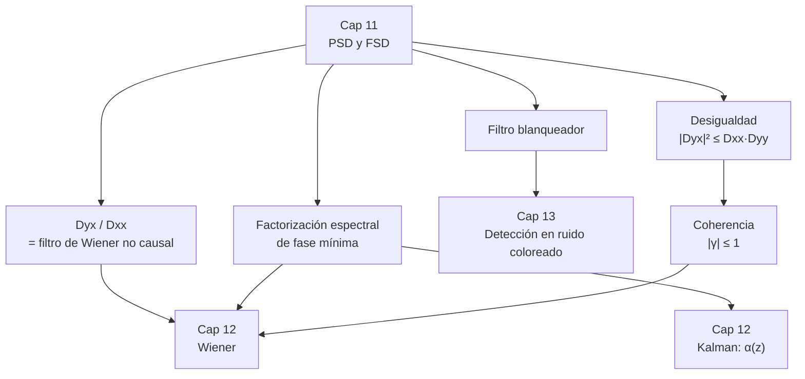

Complemento del capítulo 11 de [[PROCESAMIENTO DE SEÑALES]].

# Densidad Espectral De Potencia — En Profundidad

El capítulo 11 del apunte principal cuenta bien **qué** es la PSD y **para qué** sirve. Este documento se mete en las tres cosas que ahí quedaron enunciadas sin desarrollar:

- **Las demostraciones.** Todo lo que en el resumen aparece como "se puede mostrar que", acá está hecho paso a paso.
- **Las cuentas.** Los ejemplos resueltos de punta a punta, con las integrales escritas y los números verificados.
- **La práctica.** Qué pasa realmente cuando estimás un espectro con una FFT. Nada de esto está en el libro, y es donde uno mete la pata.

###### **Cómo leer esto**
No hace falta ir en orden. Según lo que estés buscando:

| Si querés… | Andá a |
|---|---|
| entender por qué la PSD no puede ser negativa | Parte 1.1 |
| saber qué funciones pueden ser una autocorrelación | Parte 1.2 |
| ver la demostración completa del teorema EWK | Parte 1.3 |
| entender de dónde sale $\lvert D_{yx}\rvert^2 \le D_{xx}D_{yy}$ | Parte 1.4 |
| ver cuentas hechas con números | Parte 2 |
| estimar un espectro sin equivocarte | Parte 3 |
| estimar coherencia sin engañarte | Parte 3.6 |
| conectar el capítulo con el 10, el 12 y el 13 | Parte 4 |
| practicar | Parte 5 |

---

# Parte 1 — Las demostraciones

## 1.1 La PSD es real, par y no negativa

Estas tres propiedades se usan todo el tiempo, así que vale la pena verlas salir.

###### **Real y par**
Arrancamos de lo único que sabemos: $R_{xx}(\tau)$ es **real** y **par** (eso se demostró en el capítulo 10). Escribimos la transformada abriendo la exponencial:
$$S_{xx}(j\omega)=\int_{-\infty}^{\infty}R_{xx}(\tau)\ e^{-j\omega\tau}\ d\tau = \int_{-\infty}^{\infty}R_{xx}(\tau)\big[\cos(\omega\tau)-j\sin(\omega\tau)\big]d\tau$$

Miremos el término imaginario:
$$-j\int_{-\infty}^{\infty}\underbrace{R_{xx}(\tau)}_{\text{par}}\ \underbrace{\sin(\omega\tau)}_{\text{impar}}\ d\tau$$
El producto de una función par por una impar es **impar**, y la integral de una función impar sobre un intervalo simétrico es **cero**. Así que ese término desaparece y queda
$$\boxed{\ S_{xx}(j\omega)=\int_{-\infty}^{\infty}R_{xx}(\tau)\cos(\omega\tau)\ d\tau\ }$$
que es **real**, porque no quedó ninguna $j$ dando vueltas. Y como $\cos(\omega\tau)=\cos(-\omega\tau)$, cambiar $\omega$ por $-\omega$ no altera nada: es **par** en $\omega$. ∎

###### **No negativa**
Esta es más interesante, porque el argumento tiene una sutileza que el resumen pasa por alto. Vale la pena armarla despacio, en cuatro pasos: el filtro, por qué elevamos al cuadrado, la desigualdad de partida, y el límite.

**Paso 1 — el filtro que necesitamos**

Queremos poder preguntar "¿cuánta potencia tiene $x(t)$ alrededor de una frecuencia $\omega_0$?". Para eso construimos un filtro pasabanda **ideal**: ganancia $1$ en una franja angosta de ancho $\Delta$ alrededor de $\omega_0$, y $0$ en todo lo demás.

Con una salvedad importante. $x(t)$ es una señal **real**, y para que el filtro devuelva otra señal real ($y(t)$, no un número complejo) su respuesta en frecuencia tiene que tener simetría conjugada — para un módulo que solo vale $0$ o $1$ (sin fase), eso significa que **la banda tiene que venir de a dos**: una franja centrada en $+\omega_0$ y su espejo centrada en $-\omega_0$.

$$H(j\omega)=\begin{cases}1 & \omega\in\left[\omega_0-\frac{\Delta}{2},\ \omega_0+\frac{\Delta}{2}\right]\cup\left[-\omega_0-\frac{\Delta}{2},\ -\omega_0+\frac{\Delta}{2}\right]\\[4pt] 0 & \text{en cualquier otro caso}\end{cases}$$

![[c11p-pasabanda-filtro.svg]]

El panel de arriba es $H(j\omega)$ solo — el filtro, aislado, para que se vea su forma exacta: dos ventanitas rectangulares de altura $1$. El panel de abajo es $S_{xx}(j\omega)$, lo que $x(t)$ trae consigo, con las mismas dos franjas resaltadas: eso —y nada más que eso— es lo que le queda a $y(t)$ después de pasar por el filtro.

**Paso 2 — por qué $y^2(t)$ y no $y(t)$**

Acá conviene pararse un segundo, porque no es un detalle técnico: es la razón de ser de toda la definición de PSD.

Lo que queremos medir es **potencia**, no amplitud. Volvé a la definición del arranque del capítulo: si $x(t)$ es el voltaje sobre una resistencia de $1\,\Omega$, entonces $x^2(t)$ **es**, por definición física, la potencia instantánea disipada. Toda la maquinaria de la PSD se apoya en esa idea — $R_{xx}(0)=E[x^2(t)]$ es la potencia total, y $S_{xx}$ reparte esa potencia entre las frecuencias. Si vamos a medir "cuánta potencia hay en una banda", tiene que ser con el cuadrado, porque la potencia **es** el cuadrado.

Si en cambio mirásemos $E[y(t)]$ sin elevar al cuadrado, el argumento se cae por dos motivos distintos:

1. **No mide energía, mide un promedio con signo.** Un proceso de media nula (el caso más común, y el único que de verdad nos interesa acá) tiene $E[y(t)]=0$ para *cualquier* filtro, tenga o no tenga contenido real en esa banda. Lo positivo se cancela con lo negativo, y ese cero no dice nada sobre cuánta señal hay ahí.
2. **No hay ningún motivo para que sea $\geq0$.** $y(t)$ oscila arriba y abajo de cero como cualquier señal; su valor esperado puede salir positivo, negativo o nulo sin que eso implique nada sobre $S_{xx}$.

$y^2(t)$, en cambio, es un **cuadrado**: no importa si $y(t)$ es positivo o negativo en un instante, $y^2(t)$ siempre suma. Por eso $E[y^2(t)]\geq0$ es una certeza *que ya sabíamos antes de calcular nada* — y es exactamente esa certeza la que en el paso siguiente vamos a trasladar a $S_{xx}$.

**Paso 3 — la desigualdad de partida**

La potencia esperada de la salida es
$$0\ \leq\ E[y^2(t)]=\frac{1}{2\pi}\int_{\text{banda}}S_{xx}(j\omega)\ d\omega$$
La igualdad de la derecha es la relación potencia-PSD de siempre ($R_{yy}(0)=E[y^2(t)]$, y $S_{yy}=|H|^2S_{xx}$ vale $S_{xx}$ dentro de la banda y $0$ afuera, así que la integral sobre todas las frecuencias se reduce a la integral sobre la banda). La desigualdad de la izquierda es exactamente el Paso 2.

**Paso 4 — achicar la banda y dividir**

Si $\Delta$ es chico y $S_{xx}$ es continua en $\omega_0$, cada una de las dos franjas aporta aproximadamente "altura por ancho": $\Delta\,S_{xx}(j\omega_0)$ la de la derecha, $\Delta\,S_{xx}(-j\omega_0)$ la de la izquierda (es la aproximación usual de una integral sobre un intervalo angosto por un rectángulo). Reemplazando en la desigualdad del Paso 3:
$$0\ \leq\ \frac{1}{2\pi}\Big[\Delta\ S_{xx}(j\omega_0)+\Delta\ S_{xx}(-j\omega_0)\Big]$$
Ya probamos en la sección anterior que $S_{xx}$ es **par**, así que $S_{xx}(-j\omega_0)=S_{xx}(j\omega_0)$ y los dos términos son idénticos:
$$0\ \leq\ \frac{1}{2\pi}\cdot 2\Delta\ S_{xx}(j\omega_0)=\frac{\Delta}{\pi}\ S_{xx}(j\omega_0)$$

Ahora el paso de "dividir por $\Delta$", con todos los detalles. Tenemos
$$0\ \leq\ \frac{\Delta}{\pi}\ S_{xx}(j\omega_0)$$
y $\Delta>0$ (es el ancho de una banda de frecuencias: no puede ser cero ni negativo). Multiplicamos los dos lados por el número **positivo** $\dfrac{\pi}{\Delta}$ — dividir por $\Delta$ es lo mismo que multiplicar por $\pi/\Delta$ y después simplificar el $\pi$, así que lo escribimos así para que quede explícito qué cancela con qué:
$$0\cdot\frac{\pi}{\Delta}\ \leq\ \frac{\Delta}{\pi}\ S_{xx}(j\omega_0)\cdot\frac{\pi}{\Delta}$$
A la izquierda, cualquier cosa por $0$ da $0$. A la derecha, $\dfrac{\Delta}{\pi}\cdot\dfrac{\pi}{\Delta}=1$, así que ese factor desaparece y queda únicamente $S_{xx}(j\omega_0)$:
$$0\ \leq\ S_{xx}(j\omega_0)$$

>**El detalle que hay que cuidar:** multiplicar (o dividir) los dos lados de una desigualdad por un número **positivo** conserva el sentido de la desigualdad — el $\leq$ sigue siendo $\leq$. Si $\Delta$ pudiera ser negativo habría que dar vuelta la desigualdad, pero un ancho de banda siempre es positivo, así que acá no hay ninguna ambigüedad.

Y como $\omega_0$ era una frecuencia cualquiera, la conclusión vale para **toda** frecuencia. ∎

>**¿Por qué hace falta además el límite $\Delta\to0$?**
>Fijate que en el Paso 4 usamos "$\Delta$ chico" para aproximar la integral por un rectángulo, pero para cualquier $\Delta>0$ fijo esa aproximación tiene un error. Sin tomar el límite $\Delta\to0$, lo único que quedaría probado con rigor es que **el promedio** de $S_{xx}$ sobre cada banda de ancho $\Delta$ es no negativo. Y eso es más débil de lo que parece: una función puede tener promedio positivo en toda banda y aun así ser negativa en algún pedacito, si ese pedacito está compensado por valores grandes al lado.
>
>El límite $\Delta\to0$ es lo que convierte "el promedio sobre cualquier banda es $\geq0$" en "**el valor puntual** es $\geq0$", porque a medida que la banda se angosta la aproximación de altura-por-ancho deja de tener error. Por eso la conclusión vale donde $S_{xx}$ es continua — que en la práctica es en todos lados salvo donde haya impulsos. Para los impulsos, el mismo argumento (con la integral del impulso en vez de altura por ancho) dice que su **área tiene que ser positiva**.

>**Corolario que se usa mucho:** juntando las tres propiedades, si alguien te da una función y te pregunta si puede ser una PSD, el chequeo es mecánico: ¿es real? ¿es par? ¿es $\geq0$ en toda frecuencia? Si falla cualquiera de las tres, no lo es.

## 1.2 Bochner y Herglotz: el recíproco

El resumen dice que "el recíproco también vale". Eso es un teorema con nombre y merece verse.

> **Teorema (Bochner en CT, Herglotz en DT).** Una función $R(\tau)$ es la autocorrelación de **algún** proceso WSS **si y solo si** su transformada $S(j\omega)$ es real, par, no negativa y de integral finita.

La ida ($\Rightarrow$) es lo que acabamos de hacer en 1.1. Lo interesante es la vuelta.

###### **La vuelta, con una construcción**
Supongamos que me dan una $S(j\omega)$ real, par, no negativa e integrable. Quiero **fabricar** un proceso que la tenga por PSD. La receta:

1. Como $S(j\omega)\geq0$, puedo tomarle raíz cuadrada: defino
$$H(j\omega)=\sqrt{S(j\omega)}$$
Esa raíz existe y es real (porque el radicando no es negativo), es par (porque $S$ lo es) y es no negativa. O sea: es una respuesta en frecuencia perfectamente legítima. Su respuesta al impulso es real y par — el filtro no es causal, pero eso no importa acá, solo queremos que exista.

2. Meto ruido blanco de intensidad unitaria a ese filtro. Por el resultado del capítulo 10, la salida $x$ tiene
$$S_{xx}(j\omega)=|H(j\omega)|^2\cdot 1 = S(j\omega)$$

3. Listo: existe un proceso WSS cuya PSD es exactamente la $S$ que me dieron. Por lo tanto su transformada inversa $R(\tau)$ **es** una autocorrelación válida. ∎

>Fijate lo que hizo la demostración: **el filtro modelador de la sección de aplicaciones no es un truco práctico, es la demostración del teorema**. Cada vez que construís un proceso coloreado filtrando ruido blanco, estás ejecutando la prueba de Bochner.

###### **Los dos ejemplos, con la cuenta hecha**
**Candidata rectangular.** $F(\tau)=K$ para $|\tau|<\tau_0$, y $0$ afuera.
$$\mathcal{F}\{F\}=\int_{-\tau_0}^{\tau_0}K\ e^{-j\omega\tau}d\tau = K\left[\frac{e^{-j\omega\tau}}{-j\omega}\right]_{-\tau_0}^{\tau_0}=\frac{K}{j\omega}\left(e^{j\omega\tau_0}-e^{-j\omega\tau_0}\right)$$
y como $e^{j\theta}-e^{-j\theta}=2j\sin\theta$:
$$=\frac{K}{j\omega}\cdot 2j\sin(\omega\tau_0)=\frac{2K\sin(\omega\tau_0)}{\omega}$$
Esta función **se hace negativa**: apenas $\omega\tau_0$ pasa de $\pi$, el seno cambia de signo. Por ejemplo en $\omega\tau_0=3\pi/2$ vale $\sin=-1$ y la transformada es negativa. **No puede ser una autocorrelación.** ✗

**Candidata triangular.** $F(\tau)=1-|\tau|/\tau_0$ para $|\tau|<\tau_0$.

Acá conviene no calcular la integral sino reconocer una estructura. El triángulo es, salvo un factor, **la convolución de un rectángulo consigo mismo**:
$$\text{triángulo} \ \propto\ \text{rect}*\text{rect}$$
Y la transformada de una convolución es el producto de las transformadas, así que
$$\mathcal{F}\{F\}\ \propto\ \big(\mathcal{F}\{\text{rect}\}\big)^2=\tau_0\ \text{sinc}^2\!\left(\frac{\omega\tau_0}{2\pi}\right)\ \geq 0$$
Es un **cuadrado**, y los cuadrados no son negativos. **Sí puede ser una autocorrelación.** ✓

>**La moraleja general, que vale la pena guardarse:** cualquier función que sea la **autocorrelación determinística** de algo, $g*g^-$, tiene transformada $|G(j\omega)|^2\geq0$ y por lo tanto es automáticamente una autocorrelación válida. No hace falta ni verificar. Es la misma idea que en 1.2: la construcción y la validez son la misma cosa vista de dos lados.

## 1.3 El teorema de Einstein-Wiener-Khinchin, completo

El resumen presenta el resultado y dice que "se llega". Acá está el camino entero, porque el paso intermedio es el que después explica todos los problemas prácticos de la Parte 3.

###### **El planteo**
Enventanamos una realización al intervalo $(-T,T)$:
$$x_T(t)=w_T(t)\ x(t), \qquad w_T(t)=\begin{cases}1 & |t|<T\\ 0 & \text{si no}\end{cases}$$
Ahora $x_T$ tiene energía finita y transformada $X_T(j\omega)$ perfectamente definida.

![[c11p-ewk.svg]]

###### **Paso 1: el par de transformadas de partida**
Del capítulo 1 sabemos que la densidad espectral de energía de una señal es la transformada de su autocorrelación determinística. Para $x_T$:
$$\int_{-\infty}^{\infty}x_T(\sigma)\ x_T(\sigma-\tau)\ d\sigma \ \ \longleftrightarrow\ \ |X_T(j\omega)|^2$$
Reemplazando $x_T=w_T\,x$ en el lado izquierdo:
$$\int_{-\infty}^{\infty}w_T(\sigma)\ w_T(\sigma-\tau)\ x(\sigma)\ x(\sigma-\tau)\ d\sigma \ \ \longleftrightarrow\ \ |X_T(j\omega)|^2$$

###### **Paso 2: normalizar por la duración**
Dividimos los dos lados por $2T$ (escalar una señal escala su transformada por lo mismo, así que el par sigue siendo válido):
$$\frac{1}{2T}\int_{-\infty}^{\infty}w_T(\sigma)w_T(\sigma-\tau)x(\sigma)x(\sigma-\tau)\ d\sigma \ \ \longleftrightarrow\ \ \underbrace{\frac{1}{2T}|X_T(j\omega)|^2}_{\text{periodograma}}$$
El lado derecho es el **periodograma**. Sus unidades: la densidad espectral de energía se mide en energía/Hz, y al dividir por un tiempo queda potencia/Hz. Es decir, ya tiene las unidades correctas de una densidad espectral de potencia.

###### **Paso 3: tomar esperanza**
Hasta acá todo vale para **una** realización. Para hablar del proceso, promediamos sobre el ensemble. Como la transformada de Fourier es lineal y la esperanza también, la esperanza de la transformada es la transformada de la esperanza — el par se mantiene. Metiendo la esperanza adentro de la integral:
$$\frac{1}{2T}\int_{-\infty}^{\infty}w_T(\sigma)w_T(\sigma-\tau)\ \underbrace{E[x(\sigma)x(\sigma-\tau)]}_{=\ R_{xx}(\tau)}\ d\sigma \ \ \longleftrightarrow\ \ \frac{1}{2T}E\big[|X_T(j\omega)|^2\big]$$

###### **Paso 4: acá aparece el triángulo**
Y ahora el paso clave. Como el proceso es **WSS**, $E[x(\sigma)x(\sigma-\tau)]=R_{xx}(\tau)$ **no depende de $\sigma$**. Entonces sale de la integral como una constante:
$$R_{xx}(\tau)\cdot\underbrace{\frac{1}{2T}\int_{-\infty}^{\infty}w_T(\sigma)\ w_T(\sigma-\tau)\ d\sigma}_{\text{esto es puramente geométrico}}$$

Esa integral que queda es el **solapamiento entre la ventana y la ventana corrida en $\tau$**. Para dos rectángulos de ancho $2T$ desplazados $\tau$, el solapamiento vale $2T-|\tau|$ mientras $|\tau|<2T$, y cero después. Dividido por $2T$:
$$\Lambda(\tau)=1-\frac{|\tau|}{2T}\ \ \text{para } |\tau|<2T$$
un **triángulo de altura 1 y base $4T$**. Nos queda entonces el resultado intermedio:
$$\boxed{\ R_{xx}(\tau)\ \Lambda(\tau)\ \ \longleftrightarrow\ \ \frac{1}{2T}E\big[|X_T(j\omega)|^2\big]\ }$$

>**Este es el resultado más importante de toda la sección**, más que el teorema en sí. Dice que el periodograma esperado **no** es la PSD: es la transformada de $R_{xx}$ **multiplicada por un triángulo**. Con $T$ finito siempre estás midiendo una versión deformada. Toda la Parte 3 es la consecuencia práctica de esta línea.

###### **Paso 5: el límite**
Cuando $T\to\infty$, el triángulo $\Lambda(\tau)$ se ensancha indefinidamente y tiende a valer $1$ para todo $\tau$ fijo. Entonces el lado izquierdo tiende a $R_{xx}(\tau)$ y queda
$$\boxed{\ S_{xx}(j\omega)=\lim_{T\to\infty}\frac{1}{2T}E\big[|X_T(j\omega)|^2\big]\ }$$
que es el teorema de **Einstein-Wiener-Khinchin**. ∎

###### **El mismo paso 4, pero en frecuencia**
Multiplicar por $\Lambda(\tau)$ en el tiempo es **convolucionar** por su transformada en frecuencia. La transformada de un triángulo de altura 1 y base $4T$ es
$$\mathcal{F}\{\Lambda\}=2T\ \text{sinc}^2\!\left(\frac{\omega T}{\pi}\right)=\frac{2\sin^2(\omega T)}{\omega^2 T}$$
así que
$$\boxed{\ \frac{1}{2T}E\big[|X_T(j\omega)|^2\big]=\frac{1}{2\pi}\ S_{xx}(j\omega)*\frac{2\sin^2(\omega T)}{\omega^2T}\ }$$

Leído en criollo: **el periodograma esperado es la PSD verdadera pasada por un desenfoque**. El núcleo del desenfoque es una $\text{sinc}^2$ cuyo lóbulo principal mide $\pm\pi/T$.

De acá salen dos cosas que vamos a usar mucho:
- **La resolución.** Dos picos separados por menos de $\pi/T$ se funden en uno. Para separarlos no hay otra que agrandar $T$.
- **La recuperación del teorema.** Cuando $T\to\infty$ ese núcleo se vuelve un impulso, convolucionar con un impulso no hace nada, y volvemos a $S_{xx}$.

###### **La versión cruzada**
El mismo argumento con dos procesos, cambiando $x_T(\sigma-\tau)$ por $y_T(\sigma-\tau)$, da
$$S_{xy}(j\omega)=\lim_{T\to\infty}\frac{1}{2T}E\big[X_T(j\omega)\ Y_T(-j\omega)\big]$$
y es la base de cómo se estima una densidad espectral cruzada en la práctica: se promedian productos $X_T Y_T^*$ en vez de módulos al cuadrado.

## 1.4 La desigualdad espectral cruzada

El resumen enuncia $|D_{yx}(j\omega)|^2\leq D_{xx}(j\omega)D_{yy}(j\omega)$ y dice que es la versión en frecuencia de la desigualdad del capítulo 7. Veamos que es literalmente **la misma demostración**.

###### **El truco: armar una tercera señal**
Definimos un proceso auxiliar mezclando los dos, con dos perillas libres: una ganancia $\alpha$ real y un retardo $\Delta$.
$$z(t)=x(t)+\alpha\ y(t-\Delta)$$

Trabajamos con las desviaciones respecto de la media (o sea con covarianzas). La autocovarianza de $z$ es
$$C_{zz}(\tau)=C_{xx}(\tau)+\alpha\big[C_{xy}(\tau+\Delta)+C_{yx}(\tau-\Delta)\big]+\alpha^2 C_{yy}(\tau)$$

Transformando (un corrimiento en el tiempo es una exponencial en frecuencia):
$$D_{zz}(j\omega)=D_{xx}(j\omega)+\alpha\big[e^{j\omega\Delta}D_{xy}(j\omega)+e^{-j\omega\Delta}D_{yx}(j\omega)\big]+\alpha^2 D_{yy}(j\omega)$$

Para procesos reales vale $D_{xy}=D_{yx}^*$, así que el corchete es un número más su conjugado, o sea el doble de la parte real:
$$D_{zz}(j\omega)=\alpha^2 D_{yy}(j\omega)+2\alpha\ \text{Re}\big\{e^{-j\omega\Delta}D_{yx}(j\omega)\big\}+D_{xx}(j\omega)$$

###### **El argumento**
Ahora la clave: $D_{zz}$ es una FSD, así que por 1.1 **tiene que ser $\geq0$ en toda frecuencia**. Y mirá la forma que tiene: es una **cuadrática en $\alpha$**.
$$\underbrace{D_{yy}}_{a}\alpha^2+\underbrace{2\,\text{Re}\{e^{-j\omega\Delta}D_{yx}\}}_{b}\ \alpha+\underbrace{D_{xx}}_{c}\ \geq\ 0 \qquad \text{para todo } \alpha \text{ real}$$

Una parábola con $a\geq0$ que **nunca** baja de cero es exactamente una parábola **sin dos raíces reales distintas**, es decir con discriminante no positivo:
$$b^2-4ac\leq0 \ \ \implies\ \ \big(\text{Re}\{e^{-j\omega\Delta}D_{yx}\}\big)^2\leq D_{xx}\ D_{yy}$$

###### **Para qué servía el retardo**
Hasta acá tenemos una cota sobre la **parte real**, no sobre el módulo. Y acá entra $\Delta$, que todavía no usamos.

Escribamos $D_{yx}(j\omega)=|D_{yx}|e^{j\varphi}$. Entonces
$$\text{Re}\{e^{-j\omega\Delta}D_{yx}\}=|D_{yx}|\cos(\varphi-\omega\Delta)$$
Como la desigualdad vale **para cualquier $\Delta$**, podemos elegirlo para que el coseno valga $1$ (basta tomar $\omega\Delta=\varphi$ en la frecuencia que estemos mirando). Con esa elección el lado izquierdo alcanza su máximo, que es $|D_{yx}|^2$, y queda
$$\boxed{\ |D_{yx}(j\omega)|^2\leq D_{xx}(j\omega)\ D_{yy}(j\omega)\ }$$
∎

>**El retardo no estaba de adorno.** Estaba para poder **rotar la fase** de $D_{yx}$ y así extraer el módulo en vez de quedarnos con la parte real, que es una cota más débil.

###### **La conexión con el capítulo 7**
Comparemos con la demostración de $\sigma_{XY}^2\leq\sigma_X^2\sigma_Y^2$ para dos variables aleatorias. Se hace así: se arma $Z=X+\alpha Y$, se usa que $\text{Var}(Z)\geq0$, queda
$$\alpha^2\sigma_Y^2+2\alpha\sigma_{XY}+\sigma_X^2\geq0 \ \ \text{para todo }\alpha$$
y el discriminante da el resultado.

**Es la misma demostración, palabra por palabra.** La única diferencia es que la versión de procesos se ejecuta **en cada frecuencia por separado**, y como los números ahí son complejos hace falta el retardo extra para manejar la fase.

Por eso el resumen dice que en frecuencia dos procesos conjuntamente WSS se analizan como si fueran dos variables aleatorias. No es una analogía: es el mismo teorema aplicado frecuencia por frecuencia.

>**Consecuencia inmediata.** Definiendo la **coherencia**
>$$\gamma_{yx}(j\omega)=\frac{D_{yx}(j\omega)}{\sqrt{D_{xx}(j\omega)D_{yy}(j\omega)}}$$
>la desigualdad dice exactamente $|\gamma_{yx}|\leq1$ — igual que $|\rho_{XY}|\leq1$ del capítulo 7. Y el caso de igualdad tiene un significado fuerte, que vemos en el ejercicio 7 de la Parte 5.

---

# Parte 2 — Ejemplos resueltos con números

## 2.1 La PSD del proceso exponencialmente correlacionado

El resumen tira el resultado $S_{xx}=2\alpha/(\alpha^2+\omega^2)$. Hagamos la integral.

Partimos de $R_{xx}(\tau)=e^{-\alpha|\tau|}$ con $\alpha>0$. El módulo obliga a **partir la integral en dos**, porque $|\tau|$ vale $-\tau$ a la izquierda y $\tau$ a la derecha:
$$S_{xx}(j\omega)=\int_{-\infty}^{0}e^{\alpha\tau}e^{-j\omega\tau}d\tau+\int_{0}^{\infty}e^{-\alpha\tau}e^{-j\omega\tau}d\tau$$

**Primera mitad:**
$$\int_{-\infty}^{0}e^{(\alpha-j\omega)\tau}d\tau=\left[\frac{e^{(\alpha-j\omega)\tau}}{\alpha-j\omega}\right]_{-\infty}^{0}=\frac{1}{\alpha-j\omega}-0=\frac{1}{\alpha-j\omega}$$
(el término en $-\infty$ se anula porque $\alpha>0$ hace que $e^{\alpha\tau}\to0$).

**Segunda mitad:**
$$\int_{0}^{\infty}e^{-(\alpha+j\omega)\tau}d\tau=\left[\frac{e^{-(\alpha+j\omega)\tau}}{-(\alpha+j\omega)}\right]_{0}^{\infty}=0+\frac{1}{\alpha+j\omega}=\frac{1}{\alpha+j\omega}$$

**Sumando**, con denominador común:
$$S_{xx}(j\omega)=\frac{1}{\alpha-j\omega}+\frac{1}{\alpha+j\omega}=\frac{(\alpha+j\omega)+(\alpha-j\omega)}{(\alpha-j\omega)(\alpha+j\omega)}=\boxed{\ \frac{2\alpha}{\alpha^2+\omega^2}\ }$$

###### **Los tres chequeos de siempre**
- **Real** ✓ (no quedó ninguna $j$).
- **Par** ✓ (solo aparece $\omega^2$).
- **No negativa** ✓ ($\alpha>0$ y el denominador es suma de cuadrados).

###### **Y un chequeo más, el de la potencia**
La potencia total tiene que dar $R_{xx}(0)=e^0=1$. Verifiquemos:
$$\frac{1}{2\pi}\int_{-\infty}^{\infty}\frac{2\alpha}{\alpha^2+\omega^2}d\omega=\frac{2\alpha}{2\pi}\cdot\frac{\pi}{\alpha}=1\ \ ✓$$
usando la integral conocida $\int_{-\infty}^{\infty}\frac{d\omega}{\alpha^2+\omega^2}=\frac{\pi}{\alpha}$.

###### **Un dato lindo para tener a mano**
¿Dónde está la frecuencia de media potencia? Evaluamos en $\omega=\alpha$:
$$S_{xx}(j\alpha)=\frac{2\alpha}{\alpha^2+\alpha^2}=\frac{1}{\alpha} \qquad\text{y}\qquad S_{xx}(j0)=\frac{2}{\alpha}$$
o sea **exactamente la mitad**. El punto de $-3$ dB cae justo en $\omega=\alpha$.

> Esto le da sentido físico al parámetro: $\alpha$ es a la vez **la velocidad a la que el proceso se olvida de su pasado** (en el tiempo) y **el ancho de banda que ocupa** (en frecuencia). Memoria corta ⟺ espectro ancho. Es la dualidad de Fourier de siempre, ahora aplicada a la memoria de un proceso aleatorio.

## 2.2 El proceso correlacionado a un paso, por dos caminos

Este es el ejemplo del apunte donde $|\rho|\leq\tfrac12$. Vale la pena obtenerlo de dos maneras, porque explica algo de fondo.

El proceso tiene
$$C_{xx}[m]=\sigma_x^2\big(\rho\ \delta[m-1]+\delta[m]+\rho\ \delta[m+1]\big)$$
o sea: correlacionado con su vecino inmediato, e incorrelado con todo lo demás.

###### **Camino A: por la frecuencia**
Transformamos (la DTFT de $\delta[m-k]$ es $e^{-j\Omega k}$):
$$D_{xx}(e^{j\Omega})=\sigma_x^2\big(\rho e^{-j\Omega}+1+\rho e^{j\Omega}\big)=\sigma_x^2\big(1+2\rho\cos\Omega\big)$$

Por 1.1 esto tiene que ser $\geq0$ **para toda** $\Omega$. El caso más desfavorable es cuando $2\rho\cos\Omega$ es lo más negativo posible, es decir cuando $\cos\Omega=-\text{sign}(\rho)$, y ahí vale $-2|\rho|$. Entonces:
$$1-2|\rho|\geq0 \ \ \implies\ \ \boxed{\ |\rho|\leq\tfrac12\ }$$

###### **Camino B: por el tiempo, construyendo el filtro**
Ahora al revés: intentemos **fabricar** el proceso. Como la correlación llega solo hasta un paso, probemos con un filtro de dos coeficientes alimentado con ruido blanco unitario:
$$h[n]=a\ \delta[n]+b\ \delta[n-1]$$
Su autocorrelación determinística es
$$R_{hh}[m]=ab\ \delta[m-1]+(a^2+b^2)\ \delta[m]+ab\ \delta[m+1]$$
Igualando con lo que queremos, $C_{xx}[m]=R_{hh}[m]$:
$$a^2+b^2=\sigma_x^2 \qquad\qquad ab=\rho\ \sigma_x^2$$

Y ahora el truco. Sumamos y restamos las dos ecuaciones, aprovechando que $(a\pm b)^2=a^2+b^2\pm2ab$:
$$(a+b)^2=\sigma_x^2(1+2\rho)\ \geq 0 \qquad\qquad (a-b)^2=\sigma_x^2(1-2\rho)\ \geq 0$$
Son cuadrados de números reales, así que **no pueden ser negativos**. La primera exige $\rho\geq-\tfrac12$, la segunda $\rho\leq\tfrac12$. Juntas:
$$\boxed{\ |\rho|\leq\tfrac12\ }$$

###### **¿Por qué coinciden?**
No es casualidad, y la respuesta ya la tenemos: **es Bochner**. El camino A pregunta "¿la FSD es no negativa?". El camino B pregunta "¿existe un filtro real que genere este proceso?". Bochner dice que esas dos preguntas son **la misma pregunta**. Los dos caminos tenían que dar lo mismo.

###### **Y de yapa, el filtro explícito**
Resolviendo el sistema: $a^2$ y $b^2$ son las raíces de $t^2-\sigma_x^2\ t+\rho^2\sigma_x^4=0$, o sea
$$a^2=\frac{\sigma_x^2}{2}\left(1+\sqrt{1-4\rho^2}\right), \qquad b=\frac{\rho\ \sigma_x^2}{a}$$
Los dos casos extremos son muy elocuentes:

| $\rho$ | filtro | qué hace |
|---|---|---|
| $+\tfrac12$ | $h\propto\delta[n]+\delta[n-1]$ | **promedia** dos muestras vecinas → suaviza |
| $-\tfrac12$ | $h\propto\delta[n]-\delta[n-1]$ | **resta** dos muestras vecinas → alterna |

Máxima correlación positiva entre vecinos = promediar. Máxima correlación negativa = diferenciar. Y en el medio, la raíz cuadrada se vuelve compleja apenas $|\rho|>\tfrac12$ — que es exactamente el punto donde el proceso deja de existir.

## 2.3 Factorización espectral, completa

Tomemos una PSD compleja racional concreta:
$$S_{xx}(z)=\frac{\left(1-\tfrac12 z\right)\left(1-\tfrac12 z^{-1}\right)}{\left(1-\tfrac45 z\right)\left(1-\tfrac45 z^{-1}\right)}$$

###### **Paso 1: ubicar polos y ceros**
- $1-\tfrac12 z=0\ \Rightarrow\ z=2$
- $1-\tfrac12 z^{-1}=0\ \Rightarrow\ z=\tfrac12$
- $1-\tfrac45 z=0\ \Rightarrow\ z=\tfrac54$
- $1-\tfrac45 z^{-1}=0\ \Rightarrow\ z=\tfrac45$

**Ceros en $\tfrac12$ y $2$. Polos en $\tfrac45$ y $\tfrac54$.** Fijate que vienen en pares recíprocos: $2=1/\tfrac12$ y $\tfrac54=1/\tfrac45$. **Eso siempre pasa**, y es consecuencia de que $S_{xx}(z)=S_{xx}(z^{-1})$ (que a su vez viene de que $R_{xx}$ es par).

![[c11p-factorizacion.svg]]

###### **Paso 2: repartir**
El factor de **fase mínima** se lleva todo lo que está **dentro** del círculo unidad:
$$F(z)=\frac{1-\tfrac12 z^{-1}}{1-\tfrac45 z^{-1}}$$
- Polo en $\tfrac45$, dentro → **estable y causal** ✓
- Cero en $\tfrac12$, dentro → su inversa $1/F(z)=\dfrac{1-\tfrac45 z^{-1}}{1-\tfrac12 z^{-1}}$ tiene polo en $\tfrac12$, dentro → **inversa estable y causal** ✓

Verificación de que la factorización cierra:
$$F(z)F(z^{-1})=\frac{\left(1-\tfrac12 z^{-1}\right)}{\left(1-\tfrac45 z^{-1}\right)}\cdot\frac{\left(1-\tfrac12 z\right)}{\left(1-\tfrac45 z\right)}=S_{xx}(z)\ \ ✓$$

###### **Paso 3: la ambigüedad del pasa-todo, con números**
El resumen advierte que el factor espectral no es único. Construyamos el segundo, para que quede claro que no es un tecnicismo.

Tomamos el pasa-todo
$$A(z)=\frac{z^{-1}-\tfrac12}{1-\tfrac12 z^{-1}}$$
Sobre el círculo unidad su módulo es exactamente $1$ (numerador y denominador son conjugados entre sí salvo un factor de módulo unitario). Entonces
$$G(z)=F(z)\ A(z)=\frac{1-\tfrac12 z^{-1}}{1-\tfrac45 z^{-1}}\cdot\frac{z^{-1}-\tfrac12}{1-\tfrac12 z^{-1}}=\frac{z^{-1}-\tfrac12}{1-\tfrac45 z^{-1}}$$

Y este $G$ también cumple $G(z)G(z^{-1})=S_{xx}(z)$ — **verificado numéricamente**, la diferencia da del orden de $10^{-16}$.

Pero $G$ tiene su cero en $z=2$, **afuera** del círculo. Es estable y causal, sí, pero su inversa **no** lo es. O sea: sirve como filtro modelador, pero **no** como blanqueador causal.

> Y esa es toda la razón por la que en el capítulo 12 se insiste tanto con "fase mínima". Cualquier factor espectral sirve para *generar* el proceso. Solo el de fase mínima sirve para *deshacerlo causalmente*, que es lo que necesita el filtro de Wiener causal.

## 2.4 El filtro blanqueador, verificado numéricamente

Seguimos con el mismo proceso. El blanqueador es la inversa del factor de fase mínima:
$$H_w(z)=\frac{1}{F(z)}=\frac{1-\tfrac45 z^{-1}}{1-\tfrac12 z^{-1}}$$

En ecuación en diferencias, si $x$ entra y $u$ sale:
$$u[n]=\tfrac12\ u[n-1]+x[n]-\tfrac45\ x[n-1]$$

###### **La prueba de fuego**
Generé $400\,000$ muestras de $x$ pasando ruido blanco por $F(z)$, y después pasé $x$ por $H_w(z)$. Estas son las autocorrelaciones normalizadas medidas:

| lag $m$ | 0 | 1 | 2 | 3 | 4 |
|---|---|---|---|---|---|
| $x[n]$ (coloreado) | $1{,}000$ | $+0{,}399$ | $+0{,}321$ | $+0{,}256$ | $+0{,}206$ |
| $u[n]$ (blanqueado) | $1{,}000$ | $-0{,}003$ | $+0{,}001$ | $-0{,}001$ | $+0{,}001$ |

La entrada tenía una memoria clarísima que decae geométricamente. La salida es **blanca**: todas las correlaciones fuera del origen son ruido de estimación, del orden de $1/\sqrt{N}\approx0{,}0016$. Y la varianza de la salida dio $0{,}998$, o sea $\approx1$ como corresponde.

>Notá el patrón de la entrada: $0{,}399$ — $0{,}321$ — $0{,}256$ — $0{,}206$. Cada uno es $\approx0{,}8$ veces el anterior. Es exactamente el polo en $\tfrac45$ del filtro modelador manifestándose en el tiempo. Los polos no son una abstracción: se ven en los datos.

---

# Parte 3 — Lo que pasa cuando lo hacés de verdad

Todo lo anterior es teoría exacta. Pero en la práctica vos no tenés $R_{xx}(\tau)$ ni infinitas muestras: tenés un archivo con $N$ números y una FFT. Esta parte es sobre eso, y no está en el libro.

## 3.1 Qué calcula realmente la FFT

Hay tres objetos distintos que conviene no confundir:

| | qué es | qué necesita |
|---|---|---|
| **DTFT** $X(e^{j\Omega})$ | función **continua** de $\Omega$ | infinitas muestras |
| **DFT** $X[k]$ | $N$ **números** | $N$ muestras |
| **FFT** | un algoritmo rápido para calcular la DFT | lo mismo que la DFT |

La FFT no es un objeto matemático distinto de la DFT: es solo la forma eficiente de calcularla. Lo importante es la relación entre DFT y DTFT:

> La DFT de tus $N$ muestras es la DTFT de la señal **enventanada**, evaluada en $N$ frecuencias equiespaciadas $\Omega_k=\dfrac{2\pi k}{N}$.

O sea, la FFT te mete **dos** modificaciones a la vez, y conviene separarlas mentalmente porque tienen remedios distintos:

1. **Enventanado.** Cortaste la señal. Eso te convoluciona el espectro con el de la ventana → **leakage** y pérdida de resolución. Es el $\Lambda(\tau)$ de la Parte 1.3.
2. **Muestreo en frecuencia.** Solo ves la curva en $N$ puntos, no entera. Es el efecto de "reja": podés estar mirando entre dos picos y no verlos.

**El zero-padding arregla el problema 2 y no toca el problema 1.** Esa frase resuelve la confusión más común del tema, y la desarrollamos en 3.3.

## 3.2 Leakage

###### **La versión intuitiva**
La DFT trata a tu bloque de $N$ muestras como **un período** de una señal periódica. Si la sinusoide que mediste entra un número **entero** de veces en la ventana, la repetición pega perfecto. Si no, al pegar el final con el principio queda un **salto**, y un salto tiene contenido en todas las frecuencias. Ese contenido espurio es el leakage.

###### **La versión en frecuencia**
Multiplicar por una ventana rectangular en el tiempo equivale a convolucionar el espectro por el de la ventana, que es un núcleo tipo sinc con **lóbulos laterales que decaen lento**. Una sinusoide pura, que debería ser una raya, se convierte en ese núcleo centrado en su frecuencia.

![[c11p-leakage.svg]]

###### **El detalle que casi siempre se malinterpreta**
Mirando la figura uno diría: "en el caso de la izquierda no hay leakage". **Falso.** El núcleo sinc está en los dos casos por igual. Lo que pasa es que cuando la frecuencia cae **justo en un bin**, los ceros de ese núcleo caen **justo en todos los demás bins**. Estás muestreando la curva exactamente en sus nulos.

> No es que el leakage desaparezca: es que no lo estás mirando. Es una coincidencia afortunada de alineación, no una propiedad de la señal. Y en datos reales nunca ocurre, porque la frecuencia de lo que medís no tiene por qué ser múltiplo de $f_s/N$.

## 3.3 Zero-padding contra resolución

Esta es *la* confusión clásica del tema, así que vale detenerse.

**El zero-padding** consiste en agregar ceros al final del bloque antes de la FFT, para calcularla en más puntos. La pregunta es: ¿mejora la resolución?

**No.** Y el motivo es exactamente lo de 3.1: agregar ceros no agrega datos. La DTFT de tu señal enventanada **ya está determinada** por las $N$ muestras que tenés. Rellenar con ceros solo te deja **evaluar esa misma curva en más puntos**. Es interpolación, no información.

![[c11p-zeropadding.svg]]

Los tres paneles son el mismo par de tonos, separados por $0{,}010$ ciclos/muestra:
- **Izquierda ($N=64$, sin relleno):** unos pocos puntos, un solo bulto.
- **Centro ($N=64$ + relleno hasta 2048):** la curva ahora se ve suave y completa… y **sigue siendo un solo bulto**. Los ceros no inventaron nada.
- **Derecha ($N=256$, datos de verdad):** ahora sí, dos picos separados, justo en $f_1$ y $f_2$.

###### **Entonces, ¿la resolución de qué depende?**
Del **ancho del lóbulo principal de la ventana**, que es inversamente proporcional al largo **real** del registro:
$$\Delta\Omega_{\min}\approx\frac{2\pi}{N}\ \text{(rectangular)}, \qquad \frac{4\pi}{N}\ \text{(Hann)}$$
Para mejorar la resolución solo hay un camino: **medir más tiempo**.

###### **Entonces, ¿el zero-padding sirve para algo?**
Sí, para dos cosas legítimas:
- **Ubicar mejor un pico que ya sabés que es único.** Sin relleno, el máximo de la DFT puede caer entre bins y errarle a la frecuencia hasta medio bin.
- **No subestimar la altura de un pico.** Ese mismo efecto de reja hace que un pico entre bins se vea más bajo de lo que es (hasta $-3{,}9$ dB con ventana rectangular).

Lo que **no** hace es separar dos cosas que la ventana ya fundió en una.

## 3.4 Ventanas

Si la ventana rectangular derrama, la solución es usar una que baje suave a cero en los bordes, para que la repetición periódica no tenga saltos.

![[c11p-ventanas.svg]]

Los números, **medidos** sobre ventanas de 64 muestras:

| ventana | lóbulo principal | lóbulo lateral máximo |
|---|---|---|
| rectangular | $\pm1{,}00$ bins | $-13{,}3$ dB |
| Hann | $\pm2{,}03$ bins | $-31{,}5$ dB |
| Hamming | $\pm2{,}08$ bins | $-42{,}4$ dB |
| Blackman | $\pm3{,}05$ bins | $-58{,}1$ dB |

El patrón es inequívoco y es **un compromiso, no una mejora**:

> Cuanto más suave la ventana, **más bajos los lóbulos laterales** (menos leakage) pero **más ancho el lóbulo principal** (peor resolución).

###### **Cuál elegir**
- **Rectangular:** cuando necesitás la máxima resolución y sabés que no hay componentes de amplitudes muy distintas. También cuando la señal ya es un transitorio que empieza y termina dentro de la ventana (ahí no hay salto y no hay leakage que combatir).
- **Hann:** la opción por defecto para estimación espectral. Buen equilibrio, y tiene una propiedad extra para Welch que vemos en 3.5.
- **Hamming:** lóbulo lateral más bajo que Hann cerca del pico, pero decae más lento lejos.
- **Blackman:** cuando tenés que ver una componente chiquita al lado de una enorme, y estás dispuesto a pagar resolución.

>**Un caso concreto de por qué importa:** si buscás una armónica $60$ dB por debajo de la fundamental, con ventana rectangular ($-13$ dB de lóbulo lateral) la vas a enterrar en el leakage de la fundamental. Con Blackman ($-58$ dB) tenés chance.

## 3.5 Welch en detalle

El método de Welch junta las tres ideas anteriores. La receta:

1. Partir el registro en $M$ segmentos de largo $T$, **solapados** (típicamente 50%).
2. **Enventanar** cada segmento (típicamente Hann).
3. Calcular el periodograma de cada uno.
4. **Promediar** los $M$ periodogramas.

![[c11p-welch.svg]]

###### **Por qué se enventana**
Ya lo vimos: para bajar el leakage. Pero enventanar cambia la potencia total, así que hay que **normalizar** o el resultado queda mal escalado. La normalización correcta es dividir por
$$T\cdot U, \qquad U=\frac{1}{T}\sum_{n=0}^{T-1}w^2[n]$$
donde $U$ es la potencia media de la ventana. Si te olvidás de esto, la PSD te da sistemáticamente baja (con Hann, un factor $\approx0{,}375$).

###### **Por qué se solapa**
Dos razones que se refuerzan:

1. **Recuperás los datos de los bordes.** La ventana Hann aplasta a cero los extremos de cada segmento. Sin solapamiento, esas muestras prácticamente no aportan. Con 50% de solapamiento, lo que en un segmento cae en el borde, en el siguiente cae en el centro.
2. **Conseguís más segmentos.** Con $N$ muestras y ventanas de largo $T$, pasás de $M=N/T$ a $M\approx2N/T$. Casi el doble de promedios sin conseguir más datos.

> **¿Por qué justo 50%?** Porque para la ventana Hann, dos ventanas solapadas al 50% **suman exactamente una constante**. Cada muestra del registro contribuye entonces con el mismo peso total, sin zonas privilegiadas ni ignoradas. Más solapamiento que eso agrega segmentos cada vez más parecidos entre sí, y como no son independientes, la varianza ya casi no baja: pagás cómputo sin ganar nada.

###### **Cuánto se gana, sin exagerar**
La figura muestra la banda de $\pm1$ desvío del estimador sobre 300 repeticiones. La banda de Welch (verde) queda **claramente adentro** de la del método sin solapar (ámbar). Pero seamos honestos con la magnitud: pasar de $M=8$ a $M=15$ promedios baja el desvío en un factor $\sqrt{15/8}\approx1{,}4$. Es una mejora real y gratis, no un salto espectacular. El grueso del beneficio de Welch está en el **enventanado** (menos leakage), no en el solapamiento.

## 3.6 Estimar la coherencia, y una trampa clásica

La coherencia de 1.4 se estima igual que la PSD: promediando sobre segmentos. Con $M$ segmentos indexados por $i$:
$$\hat\gamma_{yx}=\frac{\sum_{i=1}^{M}X_i\ Y_i^{*}}{\sqrt{\left(\sum_{i=1}^{M}|X_i|^2\right)\left(\sum_{i=1}^{M}|Y_i|^2\right)}}$$

###### **La trampa**
Mirá qué pasa con **un solo segmento**, $M=1$:
$$\hat\gamma_{yx}=\frac{X\,Y^{*}}{\sqrt{|X|^2\,|Y|^2}}=\frac{X\,Y^{*}}{|X|\,|Y|} \qquad\Longrightarrow\qquad |\hat\gamma_{yx}|=1$$

**Exactamente 1. Siempre. Cualesquiera sean los datos.** Es una identidad algebraica, no un resultado experimental: el numerador y el denominador son el mismo número. Si estimás coherencia sin promediar, te va a dar 1 aunque las dos señales no tengan absolutamente nada que ver.

###### **Cuánto promediar**
No es que con $M=2$ ya esté. El sesgo decae despacio: para dos señales **independientes** (coherencia verdadera **cero**), el valor esperado del estimado es aproximadamente
$$E\big[|\hat\gamma|^2\big]\approx\frac{1}{M}$$

Lo verifiqué simulando dos ruidos blancos independientes, 400 repeticiones cada uno:

| $M$ | 1 | 2 | 4 | 8 | 16 | 32 | 64 |
|---|---|---|---|---|---|---|---|
| $\lvert\hat\gamma\rvert^2$ medido | $1{,}000$ | $0{,}502$ | $0{,}252$ | $0{,}124$ | $0{,}062$ | $0{,}031$ | $0{,}016$ |
| $1/M$ | $1{,}000$ | $0{,}500$ | $0{,}250$ | $0{,}125$ | $0{,}063$ | $0{,}031$ | $0{,}016$ |

Clavado. Con $M=8$ segmentos, dos señales sin ninguna relación te muestran una coherencia aparente de $0{,}12$ — y si no sabés esto, la interpretás como que "algo hay".

> **Regla práctica:** antes de creerte una coherencia de valor $c$, fijate que $c$ sea bastante mayor que $1/M$. Con $M<10$ no reportes coherencias, y menos que menos con $M=1$.

*Y notá el paralelo conceptual: es el mismo fenómeno que un coeficiente de correlación calculado con dos puntos. Con dos puntos siempre da $\pm1$, porque por dos puntos pasa exactamente una recta. Acá pasa lo mismo, frecuencia por frecuencia.*

## 3.7 Receta práctica

Un checklist para no meter la pata:

1. **Sacale la media al registro** antes de todo. Si no, el impulso en $\Omega=0$ te derrama sobre todo el espectro y te tapa lo que querías ver. (En rigor pasás a estimar la FSD en vez de la PSD, que es casi siempre lo que querés.)
2. **Elegí $T$ por la resolución que necesitás**, no por comodidad. Si querés separar dos cosas a $\Delta f$ de distancia, necesitás $T\gtrsim 4 f_s/\Delta f$ con Hann.
3. **Recién después mirá cuántos promedios te quedan.** $M\approx 2N/T$ con 50% de solapamiento. Si $M$ te da menos de $\sim8$, el resultado va a ser ruidoso y no podés confiar en picos individuales.
4. **Si $T$ y $M$ no cierran los dos, necesitás más datos.** No hay parámetro que arregle eso.
5. **Ventana Hann** salvo que tengas un motivo concreto para otra.
6. **Normalizá por $T\cdot U$.**
7. **Zero-padding** solo para ver la curva más suave o ubicar un pico con precisión; nunca esperando resolución.
8. **Verificá con la potencia total:** la integral de tu PSD estimada tiene que dar aproximadamente la varianza de la señal. Si no da, hay un error de normalización.
9. **Desconfiá de los picos que aparecen en un solo estimado.** Repetí con otro tramo de datos: lo real reaparece, el ruido no.
10. **Si estimás coherencia, mirá primero cuánto vale $1/M$** (ver 3.6). Todo lo que esté por debajo de ese piso es ruido del estimador, no relación entre las señales.

---

# Parte 4 — Intuición y conexiones

## 4.1 ¿De quién es el espectro?

Una confusión que conviene resolver de raíz: cuando decimos "el espectro del proceso", **no** es el espectro de ninguna señal en particular.

- Cada **realización** tiene su propia transformada, y son todas distintas. Si mirás dos realizaciones del mismo proceso, sus espectros no se parecen en el detalle.
- La **PSD** es una propiedad del **ensemble**: describe cómo se reparte la potencia esperada, promediada sobre todas las realizaciones posibles.

Por eso el periodograma de una sola realización es tan ruidoso: estás usando **una** muestra del ensemble para estimar un promedio sobre **todo** el ensemble. Y por eso promediar ayuda: cada segmento del registro funciona como una realización adicional aproximada.

## 4.2 Ergodicidad: el permiso para estimar

Acá se ve por qué el capítulo 10 tenía que venir antes.

Todo el método de estimación espectral consiste en **promediar en el tiempo** trozos de **una sola** realización, y usar eso para estimar un promedio de **ensemble**. Ese salto no es gratis: es exactamente lo que autoriza la **ergodicidad**.

Si el proceso no es ergódico, promediar más tiempo no te acerca a la PSD del ensemble — te acerca a la del pedazo del ensemble que te tocó.

>**El ejemplo del capítulo 11 que conecta esto.** Se muestra ahí que un proceso es **ergódico en media si y solo si su FSD no tiene un impulso en $\Omega=0$**.
>
>Tiene sentido si lo pensás: un impulso en el origen de la FSD significa que hay una componente aleatoria **constante en el tiempo** (una variable aleatoria que se sorteó una vez y quedó fija). El promedio temporal de una realización te va a dar el valor que le tocó a *esa* realización, no la media del ensemble. El proceso $y[n]=A+x[n]$ con $A$ aleatoria de media nula es exactamente ese caso: tiene media nula, pero ninguna realización promedia a cero.

## 4.3 Los tres males del estimador

Conviene tener los tres separados, porque se arreglan con perillas distintas.

![[c11p-sesgo-varianza.svg]]

| mal | qué es | de qué depende | cómo se arregla |
|---|---|---|---|
| **Sesgo** | tu estimado converge a la PSD **borroneada**, no a la verdadera | del largo $T$ de la ventana | $T$ más grande |
| **Varianza** | tu estimado salta alrededor del valor esperado | de la cantidad $M$ de promedios | $M$ más grande |
| **Resolución** | dos picos cercanos se funden | del largo $T$ y de la forma de la ventana | $T$ más grande, ventana más angosta |

Y el problema, que es el corazón de toda la estimación espectral:

> Con un registro de largo fijo $N$, tenés $M\approx N/T$. **Subir $T$ baja el sesgo y mejora la resolución, pero baja $M$ y sube la varianza.** No existe una elección que gane en las tres. Solo más datos mueven la frontera.

En la figura, los paneles 1 y 2 aíslan cada efecto (usando un registro gigante para que el otro no moleste), y el tercero muestra el compromiso real con un presupuesto de 4096 muestras: o una curva suave con el pico achatado, o el pico fiel pero ahogado en ruido.

## 4.4 De dónde sale Paley-Wiener

En el capítulo 12 aparece una condición de aspecto raro: para que exista el factor espectral de fase mínima hace falta que
$$\int_{-\pi}^{\pi}\big|\log D_{xx}(e^{j\Omega})\big|\ d\Omega<\infty$$

¿Por qué un logaritmo? La intuición es esta. El factor de fase mínima $F(z)$ tiene que cumplir dos cosas a la vez: ser causal y estable, y que $1/F(z)$ **también** lo sea. Ese $1/F$ es el blanqueador.

Ahora fijate qué pasa si $D_{xx}$ se anula en algún intervalo de frecuencias. Ahí el proceso **no tiene nada de potencia**. El blanqueador tendría que amplificar por infinito esa banda para llevarla al nivel plano del ruido blanco — y no existe ningún filtro estable que haga eso.

La condición del logaritmo es la forma precisa de decir "$D_{xx}$ no se anula en ningún intervalo". Se anula en puntos aislados, bueno; en toda una banda, no.

> En criollo: **no podés blanquear lo que no existe**. Si el proceso es sordo en una banda, no hay filtro que le devuelva el oído.

## 4.5 Hacia dónde va todo esto

El capítulo 11 parece un desvío teórico, pero es la caja de herramientas de los dos capítulos que siguen. El mapa:

Concretamente:

- **La PSD y la densidad cruzada** son literalmente los ingredientes del filtro de Wiener: $H=D_{yx}/D_{xx}$.
- **La desigualdad espectral cruzada** garantiza que la coherencia cumple $|\gamma|\leq1$, y por lo tanto que el MMSE del capítulo 12 nunca da negativo.
- **La factorización de fase mínima** es el paso central del Wiener **causal**, y reaparece como la ecuación $\alpha(z)\alpha(z^{-1})=r\beta(z)\beta(z^{-1})+a(z)a(z^{-1})$ del filtro de Kalman.
- **El filtro blanqueador** es la estrategia completa para detectar señales en **ruido coloreado** en el capítulo 13: blanquear primero, aplicar el filtro adaptado después.

## 4.6 Para llevar

Todo lo anterior condensado, para consultar rápido.

**Definiciones**

| | fórmula |
|---|---|
| PSD | $S_{xx}(j\omega)=\mathcal{F}\{R_{xx}(\tau)\}$ |
| FSD | $D_{xx}(j\omega)=\mathcal{F}\{C_{xx}(\tau)\}$ |
| Relación entre ambas | $S_{xx}=D_{xx}+2\pi\mu_x^2\,\delta(\omega)$ |
| Potencia total | $E[x^2(t)]=R_{xx}(0)=\frac{1}{2\pi}\int S_{xx}\,d\omega$ |
| Coherencia | $\gamma_{yx}=D_{yx}\big/\sqrt{D_{xx}D_{yy}}$ |

**Los hechos que se usan todo el tiempo**

| hecho | dónde está |
|---|---|
| $S_{xx}$ es real, par y $\geq0$ | 1.1 |
| $R$ es autocorrelación válida $\Leftrightarrow$ su transformada es real, par y $\geq0$ | 1.2 |
| El periodograma esperado con $T$ finito es $\mathcal{F}\{R_{xx}\Lambda\}$, no $S_{xx}$ | 1.3 |
| $\lvert D_{yx}\rvert^2\leq D_{xx}D_{yy}$, y por lo tanto $\lvert\gamma_{yx}\rvert\leq1$ | 1.4 |
| Blanco $\Leftrightarrow$ espectro plano $\Leftrightarrow$ incorrelado en el tiempo, media nula | cap 11 |
| $S_{yy}=\lvert H\rvert^2 S_{xx}$ al filtrar con un LTI | cap 10 |
| Existe factor espectral de fase mínima si $\log D_{xx}$ es integrable | 4.4 |

**Números para estimación espectral**

| cantidad | valor |
|---|---|
| Resolución (ventana rectangular) | $\Delta\Omega\approx2\pi/T$ |
| Resolución (Hann) | $\Delta\Omega\approx4\pi/T$ |
| Caída de la varianza al promediar | $\propto 1/M$ |
| Segmentos con 50% de solapamiento | $M\approx2N/T$ |
| Piso de coherencia espuria | $\lvert\hat\gamma\rvert^2\approx1/M$ |
| Lóbulos laterales | rect $-13$ dB · Hann $-31$ dB · Hamming $-42$ dB · Blackman $-58$ dB |

**Los tres compromisos que no se pueden esquivar**

1. Ventana más larga → mejor resolución y menos sesgo, pero **menos promedios**.
2. Ventana más suave → menos leakage, pero **peor resolución**.
3. Con $N$ fijo, mejorar cualquiera de los dos anteriores **empeora el otro**. Solo más datos corren la frontera.

---

# Parte 5 — Ejercicios de práctica

Estos no son del libro. Son originales, del mismo tipo conceptual que los del capítulo. Cada uno tiene su resolución al lado, colapsada — intentá primero.

### Ejercicio 1 — ¿Puede ser una autocorrelación?

Para un proceso WSS de tiempo discreto, considere la candidata
$$R[m]=A\ \delta[m]+B\big(\delta[m-2]+\delta[m+2]\big)$$

**a)** Halle la condición sobre $A$ y $B$ para que $R[m]$ sea una autocorrelación válida.
**b)** ¿Es válida con $A=4$, $B=1$? ¿Y con $A=4$, $B=3$?
**c)** Para el caso válido de b), ¿en qué frecuencia se concentra más potencia?

> [!success]- Solución
> **a)** Transformamos:
> $$S(e^{j\Omega})=A+B\left(e^{-j2\Omega}+e^{j2\Omega}\right)=A+2B\cos(2\Omega)$$
> Tiene que ser $\geq0$ para toda $\Omega$. Como $\cos(2\Omega)$ recorre todo $[-1,1]$, el valor más chico es $A-2|B|$. Entonces:
> $$\boxed{\ A\geq 2|B|\ }$$
> (y además $A\geq0$, que ya viene implicado).
>
> **b)** Con $A=4$, $B=1$: $4\geq2$ ✓ **válida**. Con $A=4$, $B=3$: haría falta $4\geq6$, **falso** → **no es válida**.
>
> **c)** Con $A=4,B=1$: $S(e^{j\Omega})=4+2\cos(2\Omega)$, que es máximo cuando $\cos(2\Omega)=1$, o sea en $\Omega=0$ y $\Omega=\pm\pi$. La potencia se concentra en **continua y en Nyquist** por igual, y el mínimo está en $\Omega=\pm\pi/2$.
>
> *Comparalo con el ejemplo del apunte ($|\rho|\leq1/2$): es la misma lógica, pero como la correlación está a **dos** pasos en vez de uno, aparece $\cos(2\Omega)$ y el espectro tiene el doble de oscilaciones.*

### Ejercicio 2 — PSD de un proceso resonante

Un proceso WSS de tiempo continuo tiene autocorrelación
$$R_{xx}(\tau)=e^{-2|\tau|}\cos(5\tau)$$

**a)** Halle $S_{xx}(j\omega)$.
**b)** Verifique que cumple las tres propiedades obligatorias.
**c)** ¿Qué tipo de señal física modela?

> [!success]- Solución
> **a)** No hace falta integrar de nuevo: usamos el resultado de 2.1 más la propiedad de modulación.
>
> De 2.1 sabemos que $e^{-\alpha|\tau|}\ \leftrightarrow\ \dfrac{2\alpha}{\alpha^2+\omega^2}$. Con $\alpha=2$:
> $$G(\omega)=\frac{4}{4+\omega^2}$$
> Multiplicar por $\cos(\omega_0\tau)$ en el tiempo **desdobla y corre** el espectro:
> $$\mathcal{F}\{g(\tau)\cos(\omega_0\tau)\}=\tfrac12 G(\omega-\omega_0)+\tfrac12 G(\omega+\omega_0)$$
> Con $\omega_0=5$:
> $$\boxed{\ S_{xx}(j\omega)=\frac{2}{4+(\omega-5)^2}+\frac{2}{4+(\omega+5)^2}\ }$$
> *(verificado numéricamente contra la integral directa: coincide a 5 decimales).*
>
> **b)** **Real** ✓ (no hay $j$). **Par** ✓ (cambiar $\omega\to-\omega$ intercambia los dos términos). **No negativa** ✓ (suma de dos fracciones con numerador positivo y denominador positivo).
>
> **c)** Son **dos lorentzianas centradas en $\pm5$**, cada una de ancho gobernado por el $2$. Modela una **oscilación amortiguada de fase aleatoria**: algo que "quiere" oscilar a $\omega=5$ pero se desordena con constante de tiempo $1/2$. Es el modelo típico de una resonancia con pérdidas — una cuerda que vibra y se apaga, un circuito RLC con ruido.
>
> *Los dos casos límite ayudan: si el amortiguamiento tendiera a cero, las lorentzianas se afinarían hasta volverse los dos impulsos de una sinusoide pura; si fuera enorme, se ensancharían hasta fundirse en un espectro casi plano.*

### Ejercicio 3 — Un filtro que descolorea… o no

Sea $x[n]$ un proceso blanco de intensidad $\sigma^2$, y definamos
$$y[n]=x[n]-x[n-2]$$

**a)** Halle $R_{yy}[m]$.
**b)** Halle $S_{yy}(e^{j\Omega})$ y simplifíquela.
**c)** ¿Es $y[n]$ blanco? ¿En qué frecuencias se anula su espectro, y qué significa eso?

> [!success]- Solución
> **a)** El filtro es $h[n]=\delta[n]-\delta[n-2]$. Su autocorrelación determinística:
> $$R_{hh}[m]=2\ \delta[m]-\delta[m-2]-\delta[m+2]$$
> (el $2$ en el origen es $1^2+(-1)^2$; los términos cruzados dan $-1$ en $m=\pm2$).
>
> Por el resultado del capítulo 10, $R_{yy}=R_{hh}*R_{xx}$ y como $R_{xx}[m]=\sigma^2\delta[m]$:
> $$\boxed{\ R_{yy}[m]=\sigma^2\big(2\delta[m]-\delta[m-2]-\delta[m+2]\big)\ }$$
>
> **b)** Dos caminos, el mismo resultado. Por $|H|^2$:
> $$S_{yy}=\sigma^2\left|1-e^{-j2\Omega}\right|^2=\sigma^2\left(1-e^{-j2\Omega}\right)\left(1-e^{j2\Omega}\right)=\sigma^2\left(2-2\cos 2\Omega\right)$$
> y usando $1-\cos\theta=2\sin^2(\theta/2)$:
> $$\boxed{\ S_{yy}(e^{j\Omega})=4\sigma^2\sin^2\Omega\ }$$
>
> **c)** **No es blanco**: su espectro depende de $\Omega$ (y además $R_{yy}$ tiene valores no nulos en $m=\pm2$). Se anula donde $\sin\Omega=0$, o sea en
> $$\Omega=0 \quad\text{y}\quad \Omega=\pm\pi$$
> O sea: **mata la continua y mata Nyquist**. Tiene sentido — restar $x[n-2]$ elimina exactamente lo que se repite cada 2 muestras: lo constante (período 1, también constante cada 2) y lo que alterna con período 2.
>
> *Consecuencia interesante: como $S_{yy}$ se anula en intervalos… no, en **puntos aislados**. Por eso este proceso sí satisface Paley-Wiener y sí admite blanqueador. Si el espectro se anulara en toda una banda, no.*

### Ejercicio 4 — Factorización espectral

Un proceso WSS de tiempo discreto tiene
$$S_{xx}(e^{j\Omega})=5-4\cos\Omega$$

**a)** Escriba $S_{xx}(z)$ y ubique sus ceros.
**b)** Halle el factor espectral de fase mínima $F(z)$.
**c)** Halle el filtro blanqueador.
**d)** Construya un segundo factor espectral válido que **no** sea de fase mínima.

> [!success]- Solución
> **a)** Usando $\cos\Omega=\tfrac12(e^{j\Omega}+e^{-j\Omega})$ y $z=e^{j\Omega}$:
> $$S_{xx}(z)=5-2z-2z^{-1}$$
> Para ver los ceros, sacamos factor común:
> $$S_{xx}(z)=-2z^{-1}\left(z^2-\tfrac52 z+1\right)=-2z^{-1}(z-2)\left(z-\tfrac12\right)$$
> **Ceros en $z=\tfrac12$ y $z=2$** — el par recíproco de siempre.
>
> **b)** El de fase mínima se queda con el cero de adentro:
> $$F(z)=a\left(1-\tfrac12 z^{-1}\right)$$
> Para hallar $a$, imponemos $F(z)F(z^{-1})=S_{xx}(z)$:
> $$a^2\left(1-\tfrac12 z^{-1}\right)\left(1-\tfrac12 z\right)=a^2\left(\tfrac54-\tfrac12 z-\tfrac12 z^{-1}\right)$$
> Comparando con $5-2z-2z^{-1}$: el cociente es $5/\tfrac54=4$ y también $2/\tfrac12=4$ ✓ consistente. Entonces $a^2=4$, $a=2$:
> $$\boxed{\ F(z)=2\left(1-\tfrac12 z^{-1}\right)\ }$$
> *(verificado numéricamente: $\big|S_{xx}-|F|^2\big|\sim10^{-15}$).*
>
> **c)** El blanqueador es la inversa:
> $$H_w(z)=\frac{1}{F(z)}=\frac{1}{2\left(1-\tfrac12 z^{-1}\right)}=\frac{0{,}5}{1-\tfrac12 z^{-1}}$$
> Estable y causal (polo en $\tfrac12$, adentro) ✓. En ecuación en diferencias: $u[n]=\tfrac12 u[n-1]+\tfrac12 x[n]$.
>
> **d)** Nos quedamos con el cero de **afuera** en vez del de adentro:
> $$G(z)=-1+2z^{-1}$$
> Verificación: $G(z)G(z^{-1})=(-1+2z^{-1})(-1+2z)=1-2z-2z^{-1}+4=5-2z-2z^{-1}$ ✓
> *(también verificado numéricamente).*
>
> $G$ es estable y causal (es un FIR), pero su cero está en $z=2$, afuera del círculo. Sirve como **modelador**, no como base de un blanqueador causal.

### Ejercicio 5 — El presupuesto de un espectro

Tenés un registro de $8192$ muestras tomadas a $f_s=10$ kHz, y querés distinguir dos tonos separados por $12$ Hz. Vas a usar Welch con ventana Hann y 50% de solapamiento. Tomá como criterio de resolución el ancho del lóbulo principal de Hann, $\Delta f\approx 4f_s/T$.

**a)** ¿Qué largo de ventana $T$ necesitás?
**b)** ¿Cuántos promedios te quedan?
**c)** Si en cambio exigieras al menos $M=16$ promedios, ¿cuál sería la mínima separación resoluble?
**d)** ¿Qué conclusión sacás?

> [!success]- Solución
> **a)** Necesitamos $\dfrac{4f_s}{T}\leq12$ Hz, o sea
> $$T\geq\frac{4\cdot10000}{12}\approx3333$$
> Tomando la potencia de 2 siguiente: $T=4096$, que da $\Delta f=4\cdot10000/4096\approx\boxed{9{,}8\ \text{Hz}}$ ✓ (alcanza).
>
> **b)** Sin solapamiento serían $M=8192/4096=2$ segmentos. Con 50%:
> $$M\approx\frac{2\cdot8192}{4096}-1=\boxed{3}$$
> **Tres promedios es malísimo.** El estimado va a estar dominado por el ruido: no vas a poder distinguir un pico real de una fluctuación.
>
> **c)** Con $M=16$ (sin solape) necesitás $T\leq8192/16=512$, y entonces
> $$\Delta f=\frac{4\cdot10000}{512}\approx\boxed{78\ \text{Hz}}$$
> Es decir, más de **seis veces peor** que lo que querías.
>
> **d)** Con este registro **no se puede tener las dos cosas**. O resolvés los 12 Hz y no confiás en el resultado, o tenés un estimado confiable pero ciego a esa separación.
>
> La única salida es **más datos**. Para resolver 12 Hz *con* $M=16$ promedios harían falta $T=4096$ y $M=16$, o sea del orden de $16\cdot4096/2\approx32768$ muestras — unas cuatro veces lo que tenés, es decir grabar $3{,}3$ segundos en lugar de $0{,}8$.
>
> *Este es exactamente el compromiso de 4.3, con números. Y notá que la respuesta útil no es un parámetro sino una decisión de medición.*

### Ejercicio 6 — Verdadero o falso

Indicá si cada afirmación es verdadera o falsa, con una explicación breve.

**a)** Rellenar con ceros hasta $4N$ puntos mejora la resolución en frecuencia.
**b)** Una sinusoide cuya frecuencia cae exactamente en un bin no produce leakage con ventana rectangular.
**c)** Usar Hann en lugar de rectangular reduce el leakage y además mejora la resolución.
**d)** Promediar $M$ periodogramas de largo $T$ fijo reduce la varianza pero no cambia el sesgo.
**e)** Si $S_{xx}(e^{j\Omega})$ se anula en un intervalo de frecuencias, el proceso igual admite un filtro blanqueador estable.

> [!success]- Solución
> **a) FALSO.** El zero-padding **interpola** la DTFT de la señal ya enventanada: agrega puntos de evaluación, no información. La resolución la fija el largo real del registro a través del ancho del lóbulo principal. (Ver 3.3.)
>
> **b) FALSO, con matiz.** El leakage **está** — el espectro se convoluciona con el núcleo de la ventana igual que siempre. Lo que pasa es que al caer la frecuencia en un bin, **los ceros del núcleo caen justo en todos los demás bins**, así que no lo ves. Es alineación afortunada, no ausencia del fenómeno. (Ver 3.2.)
>
> **c) FALSO.** Reduce el leakage, sí, pero **empeora** la resolución: el lóbulo principal de Hann mide $\pm2{,}03$ bins contra $\pm1{,}00$ de la rectangular. Es un compromiso, no una mejora gratis. (Ver 3.4.)
>
> **d) VERDADERO.** El sesgo lo determina la forma y el largo $T$ de la ventana, a través de la convolución con el núcleo $\text{sinc}^2$. Promediar más segmentos del mismo largo no cambia el valor esperado del estimador: solo reduce su dispersión alrededor de ese valor. (Ver 1.3 y 4.3.)
>
> **e) FALSO.** El blanqueador tendría que amplificar por infinito la banda donde no hay potencia, y no existe filtro estable que lo haga. Es exactamente lo que prohíbe la condición de Paley-Wiener. (Ver 4.4.)

### Ejercicio 7 — Coherencia máxima

Dos procesos conjuntamente WSS tienen densidades espectrales planas
$$D_{xx}(e^{j\Omega})=4, \qquad D_{yy}(e^{j\Omega})=1$$
y densidad espectral cruzada
$$D_{yx}(e^{j\Omega})=2\ e^{-j3\Omega}$$

**a)** ¿Es esto posible? Verificalo con la desigualdad de 1.4.
**b)** Calculá la coherencia $\gamma_{yx}$ e interpretá el resultado.
**c)** Deducí la relación exacta entre $x[n]$ e $y[n]$.

> [!success]- Solución
> **a)** La desigualdad pide $|D_{yx}|^2\leq D_{xx}D_{yy}$:
> $$|D_{yx}|^2=|2e^{-j3\Omega}|^2=4 \qquad\qquad D_{xx}D_{yy}=4\cdot1=4$$
> $$4\leq4\ \ ✓$$
> Es posible, pero **está justo en el borde**: se cumple con **igualdad** en todas las frecuencias.
>
> **b)** La coherencia:
> $$\gamma_{yx}=\frac{D_{yx}}{\sqrt{D_{xx}D_{yy}}}=\frac{2e^{-j3\Omega}}{\sqrt{4}}=e^{-j3\Omega} \qquad\Longrightarrow\qquad |\gamma_{yx}|=1$$
> Coherencia de módulo **1 en toda frecuencia**.
>
> Recordando el paralelo con el capítulo 7: $|\rho_{XY}|=1$ significa que $Y$ es una función **afín exacta** de $X$, sin nada de aleatoriedad residual. La versión para procesos dice lo análogo: **$y$ es exactamente una función LTI de $x$**, sin ningún componente independiente.
>
> **c)** Si $y$ sale de filtrar $x$ con $H$, entonces $D_{yx}=H\ D_{xx}$, así que
> $$H(e^{j\Omega})=\frac{D_{yx}}{D_{xx}}=\frac{2e^{-j3\Omega}}{4}=\tfrac12\ e^{-j3\Omega}$$
> Una ganancia de $\tfrac12$ y un retardo puro de 3 muestras:
> $$\boxed{\ y[n]=\tfrac12\ x[n-3]\ }$$
> **Verificación:** $D_{yy}=|H|^2D_{xx}=\tfrac14\cdot4=1$ ✓ coincide con el dato.
>
> *Y fijate lo que acabás de hacer: $H=D_{yx}/D_{xx}$ es **exactamente** la fórmula del filtro de Wiener no causal del capítulo 12. Cuando la coherencia vale 1, ese filtro no estima nada — reconstruye $y$ perfectamente, con MMSE cero. La coherencia es, frecuencia por frecuencia, cuánto de $y$ es explicable linealmente a partir de $x$.*
