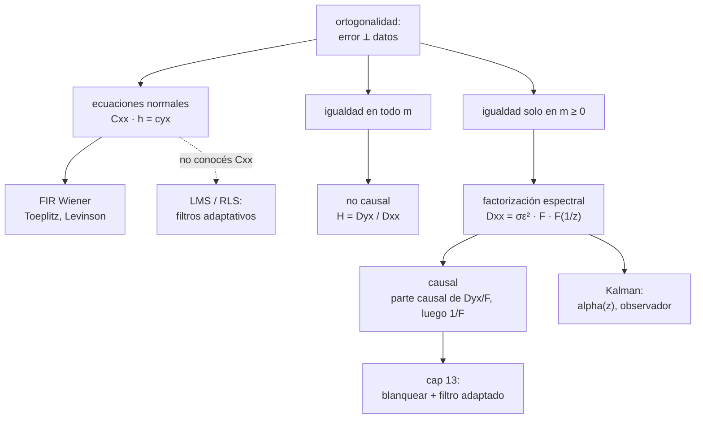

Complemento del capítulo 12 de [[PROCESAMIENTO DE SEÑALES]].

# Estimación De Señales — En Profundidad

El capítulo 12 del apunte principal arma bien el arco: el filtro de Wiener es el LMMSE del capítulo 8 pasado a procesos, y viene en tres versiones (FIR, no causal, causal) más la extensión de Kalman. Pero al ser un resumen, los resultados aparecen en cajita con dos líneas de glosa, y la parte más difícil —la técnica de Wiener-Hopf del filtro causal— queda como "el detalle está en el libro". Este documento se mete en eso:

- **Las demostraciones.** De la ortogonalidad a las ecuaciones normales, por qué en el caso no causal *sí* se puede transformar y en el causal *no*, la derivación completa del filtro causal por innovaciones, y de dónde sale la ecuación de factorización espectral de Kalman (con un factor de escala que el resumen se come).
- **Las cuentas.** Un único sistema —AR(1) más ruido— resuelto de punta a punta en las tres versiones, con los números verificados numéricamente y una tabla que compara los MMSE. Filtrado contra predicción en ese mismo sistema. Deconvolución.
- **La práctica.** Qué pasa cuando no conocés $C_{xx}$ ni $C_{yx}$ y las tenés que estimar, por qué no se invierte la matriz de las ecuaciones normales a lo bruto (Levinson-Durbin), y el puente hacia los filtros adaptativos.

###### **Cómo leer esto**
No hace falta ir en orden. Según lo que estés buscando:

| Si querés… | Andá a |
|---|---|
| de dónde salen las ecuaciones normales, desde la ortogonalidad | Parte 1.1 |
| por qué el filtro no causal se despeja transformando y el causal no | Parte 1.2 |
| la derivación completa del filtro de Wiener causal | Parte 1.3 |
| de dónde sale $\Delta\text{MMSE}$, el "precio de la causalidad" | Parte 1.4 |
| de dónde sale $\alpha(z)\alpha(z^{-1})=\dots$ de Kalman (y el factor que falta) | Parte 1.5 |
| un sistema resuelto entero en las tres versiones, con números | Parte 2.1 |
| la diferencia real entre filtrar y predecir | Parte 2.2 y 2.4 |
| por qué el filtro inverso explota y Wiener no | Parte 2.3 |
| qué pasa cuando no conocés las correlaciones | Parte 3.1 |
| por qué Levinson-Durbin en vez de invertir la matriz | Parte 3.2 |
| el puente a los filtros adaptativos (LMS) | Parte 3.5 |
| filtrado, predicción y suavizado ordenados | Parte 4.1 |
| conectar el capítulo con el 7, el 8, el 10, el 11 y el 13 | Parte 4 |
| practicar | Parte 5 |

---

# Parte 1 — Las demostraciones

## 1.1 De la ortogonalidad a las ecuaciones normales

El resumen dice "las ecuaciones normales quedan escritas con las funciones de covarianza". Veamos salir eso desde el principio, porque es el mismo argumento en las tres versiones del filtro.

###### **El planteo**
Queremos estimar $y[n]$ con una combinación lineal de mediciones de $x[\cdot]$. Para el FIR:
$$\hat y[n]=\sum_{k=0}^{L-1}h[k]\ x[n-k]$$
(tomamos media nula para no arrastrar $\mu_y$; con media se resta a la entrada y se suma a la salida). Queremos los $h[k]$ que minimizan
$$J(h)=E\big[(y[n]-\hat y[n])^2\big]$$

###### **Derivar e igualar a cero**
$J$ es una cuadrática en cada $h[j]$, así que tiene un único mínimo donde todas las derivadas parciales se anulan:
$$\frac{\partial J}{\partial h[j]}=E\left[2\big(y[n]-\hat y[n]\big)\cdot\frac{\partial(-\hat y[n])}{\partial h[j]}\right]=-2\,E\big[(y[n]-\hat y[n])\ x[n-j]\big]=0$$
porque $\partial\hat y[n]/\partial h[j]=x[n-j]$. Entonces, para cada $j=0,\dots,L-1$:
$$\boxed{\ E\big[e[n]\ x[n-j]\big]=0, \qquad e[n]=y[n]-\hat y[n]\ }$$

Esto es la **condición de ortogonalidad**: el error del mejor estimador lineal es ortogonal a cada dato que se usó para construirlo. No es un truco de este capítulo — es exactamente lo mismo que en el capítulo 8, y antes de eso la proyección ortogonal del capítulo 7.

![[c12p-proyeccion.svg]]

###### **Escribirla con correlaciones**
Metemos $\hat y[n]=\sum_k h[k]x[n-k]$ adentro:
$$E\left[\Big(y[n]-\sum_{k}h[k]x[n-k]\Big)x[n-j]\right]=0$$
$$E\big[y[n]\,x[n-j]\big]=\sum_{k}h[k]\ E\big[x[n-k]\,x[n-j]\big]$$
El de la izquierda es la correlación cruzada; el de la derecha, la autocorrelación de $x$ en el lag $j-k$:
$$\boxed{\ \sum_{k=0}^{L-1}h[k]\ C_{xx}[j-k]=C_{yx}[j], \qquad j=0,\dots,L-1\ }$$
donde uso $C_{yx}[j]=E[y[n]\,x[n-j]]$ (con procesos WSS de media nula, $C=R$).

Estas son las **ecuaciones normales**. En forma matricial, $C_{xx}\,\mathbf h=\mathbf c_{yx}$, con
$$C_{xx}=\begin{bmatrix}C_{xx}[0]&C_{xx}[1]&\cdots&C_{xx}[L-1]\\ C_{xx}[1]&C_{xx}[0]&\cdots&C_{xx}[L-2]\\ \vdots&&\ddots&\vdots\\ C_{xx}[L-1]&\cdots&&C_{xx}[0]\end{bmatrix}$$

>**La matriz es Toeplitz** (constante en cada diagonal) **y simétrica**, porque $C_{xx}[m]=C_{xx}[-m]$. Esa estructura no es un detalle estético: es lo que permite resolver el sistema en $O(L^2)$ en vez de $O(L^3)$ (Levinson-Durbin, Parte 3.2), y lo que conecta con la predicción lineal y el modelado autorregresivo.

###### **El MMSE**
Con el $h$ óptimo, usando la ortogonalidad ($e\perp x[n-k]$ para todo $k$, y por lo tanto $e\perp\hat y$):
$$\text{MMSE}=E[e^2]=E[e\,(y-\hat y)]=E[e\,y]=E\big[(y-\textstyle\sum_k h[k]x[n-k])\,y\big]=C_{yy}[0]-\sum_{k}h[k]\,C_{yx}[k]$$
$$\boxed{\ \text{MMSE}=C_{yy}[0]-\mathbf c_{yx}^{\!\top}\,C_{xx}^{-1}\,\mathbf c_{yx}\ }$$
Es literalmente $\sigma_Y^2-c_{XY}^\top C_{XX}^{-1}c_{XY}$ del capítulo 8, con matrices Toeplitz.

## 1.2 El filtro no causal: por qué acá SÍ se puede transformar

Ahora usamos **todo** $x[\cdot]$, pasado y futuro:
$$\hat y[n]=\sum_{j=-\infty}^{\infty}h[j]\ x[n-j]$$
La ortogonalidad ahora vale para **todo** $m$ (no solo $m\geq0$):
$$E\big[e[n]\,x[n-m]\big]=0\quad\text{para todo }m\in\mathbb{Z}$$
Y como antes esto da
$$\sum_j h[j]\ C_{xx}[m-j]=C_{yx}[m], \qquad \text{es decir}\qquad (h*C_{xx})[m]=C_{yx}[m]$$

###### **El paso que el resumen hace de un saludo**
El resumen dice "como la igualdad vale en todo el eje, podemos transformar los dos lados". Vale la pena ver por qué eso es legítimo y por qué en el caso causal **deja de serlo**.

Una identidad entre dos secuencias, $p[m]=q[m]$ **para todo $m$**, implica que sus DTFT son iguales: $P(e^{j\Omega})=Q(e^{j\Omega})$. Eso es todo — la transformada es una biyección entre secuencias (sumables) y sus espectros, así que si dos secuencias coinciden en todo $m$, sus espectros coinciden en todo $\Omega$.

Acá tenemos $(h*C_{xx})[m]=C_{yx}[m]$ para todo $m$. Transformando, la convolución se vuelve producto:
$$H(e^{j\Omega})\,D_{xx}(e^{j\Omega})=D_{yx}(e^{j\Omega})$$
y despejamos directo:
$$\boxed{\ H(e^{j\Omega})=\frac{D_{yx}(e^{j\Omega})}{D_{xx}(e^{j\Omega})}\ }$$

>**¿Por qué en el causal no?** Porque ahí la identidad $(h*C_{xx})[m]=C_{yx}[m]$ vale **solo para $m\geq0$**. Para $m<0$ los dos lados son distintos (y el lado izquierdo es una cantidad desconocida que depende de $h$). Dos secuencias que coinciden solo en la mitad del eje **no** tienen por qué tener la misma transformada — de hecho, en general no la tienen. Por eso el caso causal necesita toda la maquinaria de la Parte 1.3.

###### **El MMSE y la coherencia**
El resumen tira $D_{ee}=D_{yy}(1-|\gamma_{yx}|^2)$. Sale así. El error es $e=y-\hat y$ con $\hat y=h*x$. Su autoespectro:
$$D_{ee}=D_{yy}-H\,D_{xy}-H^*D_{yx}+|H|^2D_{xx}$$
(esto es solo desarrollar $E[e[n+m]e[n]]$ y transformar). Metemos $H=D_{yx}/D_{xx}$. Los términos:
$$-H\,D_{xy}=-\frac{D_{yx}D_{xy}}{D_{xx}}=-\frac{|D_{yx}|^2}{D_{xx}}\qquad(\text{porque }D_{xy}=D_{yx}^*)$$
$$-H^*D_{yx}=-\frac{|D_{yx}|^2}{D_{xx}}\qquad\qquad |H|^2D_{xx}=\frac{|D_{yx}|^2}{D_{xx}^2}D_{xx}=\frac{|D_{yx}|^2}{D_{xx}}$$
Sumando: $-\,2\dfrac{|D_{yx}|^2}{D_{xx}}+\dfrac{|D_{yx}|^2}{D_{xx}}=-\dfrac{|D_{yx}|^2}{D_{xx}}$. Entonces
$$D_{ee}=D_{yy}-\frac{|D_{yx}|^2}{D_{xx}}=D_{yy}\left(1-\frac{|D_{yx}|^2}{D_{xx}D_{yy}}\right)=D_{yy}\big(1-|\gamma_{yx}|^2\big)$$
con $\gamma_{yx}=D_{yx}/\sqrt{D_{xx}D_{yy}}$ la **coherencia** — el coeficiente de correlación, frecuencia por frecuencia. El MMSE total es
$$\text{MMSE}=\frac{1}{2\pi}\int_{-\pi}^{\pi}D_{yy}(e^{j\Omega})\big(1-|\gamma_{yx}(e^{j\Omega})|^2\big)\,d\Omega$$
Comparalo con $\sigma_Y^2(1-\rho^2)$ del capítulo 8: es lo mismo, integrado. Y la desigualdad espectral cruzada del capítulo 11 ($|\gamma_{yx}|\leq1$) es exactamente lo que garantiza que el integrando —y por lo tanto el MMSE— nunca da negativo.

## 1.3 El filtro de Wiener causal, entero

Este es el resultado difícil. El resumen lo pone en cajita:
$$H(z)=\frac{1}{F(z)}\left[\frac{D_{yx}(z)}{F(z^{-1})}\right]_+$$
y lo glosa como "blanquear, resolver el fácil, deshacer el blanqueo". Acá está la derivación completa, con la **interpretación por innovaciones**, que es la más limpia.

###### **Paso 0: el problema fácil, otra vez**
Si $x[n]$ fuera **blanco** con $C_{xx}[m]=\sigma^2\delta[m]$, las ecuaciones normales causales
$$(h*C_{xx})[m]=C_{yx}[m], \quad m\geq0$$
se vuelven $\sigma^2 h[m]=C_{yx}[m]$ para $m\geq0$. O sea:
$$h[m]=\frac{1}{\sigma^2}C_{yx}[m]\ \text{ para }m\geq0, \qquad h[m]=0\ \text{ para }m<0$$
**Se calcula la solución no causal y se le corta la parte no causal.** Fácil. La idea de toda la sección es reducir el caso general a este.

###### **Paso 1: blanquear con el factor de fase mínima**
Factorizamos $D_{xx}(z)=\sigma_\varepsilon^2\,F(z)\,F(z^{-1})$, con $F(z)$ de **fase mínima** (mónica en $z^{-1}$: $F(\infty)=1$; polos y ceros dentro del círculo; $F$ y $1/F$ ambos causales y estables) y $\sigma_\varepsilon^2>0$.

Definimos la **innovación** $\varepsilon[n]$ como $x[n]$ pasado por el blanqueador $1/F(z)$:
$$\varepsilon[n]=\frac{1}{F(z)}\,x[n]$$
Es blanca, de varianza $\sigma_\varepsilon^2$ (porque $D_{\varepsilon\varepsilon}=|1/F|^2 D_{xx}=\sigma_\varepsilon^2$).

![[c12p-innovaciones.svg]]

**La clave:** como $F$ es de fase mínima, $1/F$ es causal y estable, así que $\varepsilon[n]$ depende solo de $\{x[k]:k\leq n\}$. Y al revés: $F$ es causal, así que $x[n]=\sum_{k\geq0}f[k]\varepsilon[n-k]$ depende solo de $\{\varepsilon[k]:k\leq n\}$. Los dos conjuntos **generan el mismo subespacio**. Por lo tanto:
$$\text{el mejor estimador causal de }y[n]\text{ a partir de }\{x[k]:k\leq n\}\ =\ \text{el mejor a partir de }\{\varepsilon[k]:k\leq n\}$$

###### **Paso 2: estimar desde el proceso blanco**
Estimamos $y[n]$ con $\hat y[n]=\sum_{m\geq0}g[m]\,\varepsilon[n-m]$. Como $\varepsilon$ es blanca, sus componentes son ortogonales entre sí, y cada $g[m]$ se resuelve por separado (Paso 0):
$$g[m]=\frac{1}{\sigma_\varepsilon^2}\,E\big[y[n]\,\varepsilon[n-m]\big]\cdot u[m]=\frac{1}{\sigma_\varepsilon^2}\,R_{y\varepsilon}[m]\,u[m]$$
En transformada, con $[\,\cdot\,]_+$ = "quedarse con la parte causal ($m\geq0$)":
$$G(z)=\frac{1}{\sigma_\varepsilon^2}\big[D_{y\varepsilon}(z)\big]_+$$

Y $D_{y\varepsilon}$ sale de que $\varepsilon=(1/F)*x$: la regla es $D_{yb}(z)=D_{ya}(z)\,H(z^{-1})$ cuando $b=h*a$, así que
$$D_{y\varepsilon}(z)=D_{yx}(z)\cdot\frac{1}{F(z^{-1})}$$

###### **Paso 3: rearmar**
El filtro total de $x$ a $\hat y$ es el blanqueador seguido de $G$:
$$H(z)=G(z)\cdot\frac{1}{F(z)}=\frac{1}{\sigma_\varepsilon^2\,F(z)}\left[\frac{D_{yx}(z)}{F(z^{-1})}\right]_+$$

Esa es la fórmula del resumen (con $\sigma_\varepsilon^2$ absorbido en la normalización de $F$ si se toma $F$ no mónica). Leída de derecha a izquierda: **$1/F(z^{-1})$ blanquea, $[\,\cdot\,]_+$ resuelve el fácil, $1/F(z)$ deshace.**

>**Filtrar no es lo mismo que predecir.** Este $H(z)$ estima $y[n]$ usando $x[n]$ y su pasado (**filtrado**). Si en cambio querés $y[n]$ a partir de $x[n-1]$ y su pasado (**predicción de un paso**), la cuenta es igual pero $D_{yx}(z)$ se reemplaza por $z\,D_{yx}(z)$ dentro del corchete, y $h[0]$ te va a dar $0$. El resumen mezcla un poco las dos cosas en la sección de Kalman; en la Parte 2.2 se ven lado a lado con números.

## 1.4 El precio de la causalidad, demostrado

El resumen dice que el MMSE causal supera al no causal en
$$\Delta\text{MMSE}=\frac{1}{2\pi}\int_{-\pi}^{\pi}\left|\left[\frac{D_{yx}(e^{j\Omega})}{F(e^{-j\Omega})}\right]_-\right|^2 d\Omega$$
Sale por Parseval. En el dominio de las innovaciones, con $\varepsilon$ blanca de varianza $\sigma_\varepsilon^2$, cualquier estimador lineal $\hat y=\sum_m g[m]\varepsilon[n-m]$ tiene
$$\text{MMSE}(g)=\sigma_y^2-2\sum_m g[m]\,R_{y\varepsilon}[m]+\sigma_\varepsilon^2\sum_m g[m]^2$$
Cada término del sumatorio depende de **un solo** $g[m]$ (porque $\varepsilon$ es blanca). Minimizar sin restricciones da $g[m]=R_{y\varepsilon}[m]/\sigma_\varepsilon^2$ para **todo** $m$; con la restricción causal ($g[m]=0$ para $m<0$) da lo mismo para $m\geq0$ y $0$ para $m<0$. Entonces
$$\text{MMSE}_{\text{no causal}}=\sigma_y^2-\frac{1}{\sigma_\varepsilon^2}\sum_{m\in\mathbb{Z}}R_{y\varepsilon}[m]^2, \qquad \text{MMSE}_{\text{causal}}=\sigma_y^2-\frac{1}{\sigma_\varepsilon^2}\sum_{m\geq0}R_{y\varepsilon}[m]^2$$
La diferencia es exactamente la energía de la **parte que se tira**:
$$\Delta\text{MMSE}=\frac{1}{\sigma_\varepsilon^2}\sum_{m<0}R_{y\varepsilon}[m]^2\ \overset{\text{Parseval}}{=}\ \frac{1}{2\pi}\int_{-\pi}^{\pi}\left|\big[D_{y\varepsilon}(e^{j\Omega})\big]_-\right|^2 d\Omega$$
con $D_{y\varepsilon}=D_{yx}/F(e^{-j\Omega})$ (Paso 2 de arriba) y absorbiendo $\sigma_\varepsilon^2$ en $F$. **Lo que perdés por ser causal es exactamente lo que hubieras aprovechado del futuro.**

## 1.5 De dónde sale $\alpha(z)\alpha(z^{-1})=\dots$ (y el factor que el resumen se come)

En la sección de Kalman el resumen dice "el detalle está en la sección 12.5.1 del libro" y usa esta ecuación:
$$\alpha(z)\alpha(z^{-1})=r\,\beta(z)\beta(z^{-1})+a(z)a(z^{-1})$$
con $\alpha$ mónico. **Cuidado: así, exacto, no cierra.** Veamos.

###### **El planteo**
La señal es la salida de un sistema en espacio de estados:
$$q[n+1]=A q[n]+b\,w[n], \qquad y[n]=c^\top q[n], \qquad x[n]=y[n]+v[n]$$
con $w,v$ blancos, no correlacionados, de varianzas $\sigma_w^2,\sigma_v^2$. La transferencia de $w$ a $y$ es $G(z)=c^\top(zI-A)^{-1}b=\beta(z)/a(z)$, con $a(z)=\det(zI-A)$ mónico de grado $L$ y $\deg\beta<L$.

###### **La cuenta que sí es exacta**
$D_{yy}(z)=\sigma_w^2\,G(z)G(z^{-1})=\sigma_w^2\,\dfrac{\beta(z)\beta(z^{-1})}{a(z)a(z^{-1})}$, y como $x=y+v$ con $v$ blanco:
$$D_{xx}(z)=D_{yy}(z)+\sigma_v^2=\frac{\sigma_w^2\,\beta(z)\beta(z^{-1})+\sigma_v^2\,a(z)a(z^{-1})}{a(z)a(z^{-1})}$$
El numerador, llamémoslo $\Psi(z)$, es un polinomio de Laurent **auto-recíproco** ($\Psi(z)=\Psi(z^{-1})$) y positivo sobre el círculo. Sacando $\sigma_v^2$ y con $r=\sigma_w^2/\sigma_v^2$:
$$\Psi(z)=\sigma_v^2\big[\,r\,\beta(z)\beta(z^{-1})+a(z)a(z^{-1})\,\big]$$

###### **El factor que falta**
El resumen quiere escribir $\Psi(z)/\sigma_v^2=\alpha(z)\alpha(z^{-1})$ con $\alpha$ **mónico**. Probémoslo con el caso más chico, $L=1$: $a(z)=z-A$, $\beta(z)=$ constante. Entonces
$$r\,\beta^2+a(z)a(z^{-1})=(r\beta^2+1+A^2)-A(z+z^{-1})$$
Para que esto sea $\alpha(z)\alpha(z^{-1})$ con $\alpha(z)=z-\rho$ mónico, necesitaríamos que valga $(1+\rho^2)-\rho(z+z^{-1})$. Igualando: el coeficiente de $(z+z^{-1})$ pide $\rho=A$, y el término constante pide $1+A^2=r\beta^2+1+A^2$, o sea $r\beta^2=0$. **Contradicción** (para $r>0$).

Lo que sí es cierto: cualquier $\Psi$ auto-recíproco se factoriza tomando sus raíces (que vienen en pares $\rho,1/\rho$) y quedándose con las de adentro. Si $\alpha(z)=z-\rho$ es el factor mónico con la raíz de adentro, entonces
$$\Psi(z)/\sigma_v^2\ =\ \kappa\cdot\alpha(z)\alpha(z^{-1}), \qquad \kappa=\frac{\text{coef. del término de grado }L\text{ de }\Psi/\sigma_v^2}{\text{el de }\alpha(z)\alpha(z^{-1})}$$
Para el $L=1$ de arriba, $\kappa=A/\rho$. Entonces la relación correcta es
$$\boxed{\ D_{xx}(z)=\sigma_\varepsilon^2\ \frac{\alpha(z)\alpha(z^{-1})}{a(z)a(z^{-1})}, \qquad \sigma_\varepsilon^2=\sigma_v^2\,\kappa\ }$$
y el factor de fase mínima es $F(z)=\dfrac{\alpha(z)}{a(z)}$ (mónico), con $\sigma_\varepsilon^2$ la varianza de la innovación. En la Parte 2.4 esto se hace con números y se verifica.

![[c12p-factorizacion-kalman.svg]]

###### **El observador da el predictor**
El resumen dice que el observador con ganancia $\ell$ elegida para que su polinomio característico sea $\alpha(z)$ tiene "exactamente" la transferencia del Wiener causal. Con el matiz de arriba: la transferencia del observador
$$\hat q[n+1]=(A+\ell c^\top)\hat q[n]-\ell\,x[n], \qquad \hat y[n]=c^\top\hat q[n]$$
es, de $x$ a $\hat y$,
$$H_{\text{obs}}(z)=c^\top(zI-A-\ell c^\top)^{-1}(-\ell)=\frac{\alpha(z)-a(z)}{\alpha(z)}$$
Esta $\hat y[n]=c^\top\hat q[n\,|\,n-1]$ usa datos hasta $n-1$: es el **predictor de un paso**, no el filtro. Y efectivamente $H_{\text{obs}}(z)$ tiene $h[0]=0$ (el numerador $\alpha(z)-a(z)$ tiene grado $\leq L-1$, un orden menos que el denominador). El Wiener causal de **filtrado** —que sí usa $x[n]$— es otro; en la Parte 2.4 se ven los dos.

---

# Parte 2 — Ejemplos resueltos con números

## 2.1 Un sistema, las tres versiones

Tomamos un sistema concreto y lo resolvemos entero. Es el que se usa en todo el resto del documento.
$$y[n]=0{,}7\,y[n-1]+w[n], \qquad x[n]=y[n]+v[n]$$
con $w$ blanco de varianza $\sigma_w^2=1-0{,}7^2=0{,}51$ (para que $\text{Var}(y)=1$) y $v$ blanco de varianza $\sigma_v^2=0{,}3$, independiente de $w$. Las correlaciones:
$$C_{yy}[m]=0{,}7^{|m|}, \qquad C_{xx}[m]=0{,}7^{|m|}+0{,}3\,\delta[m], \qquad C_{yx}[m]=0{,}7^{|m|}$$

###### **FIR (filtrado, ventana al pasado)**
Estimamos $y[n]$ con $x[n],\dots,x[n-L+1]$. Para $L=2$, las ecuaciones normales:
$$\begin{bmatrix}1{,}3&0{,}7\\ 0{,}7&1{,}3\end{bmatrix}\begin{bmatrix}h[0]\\ h[1]\end{bmatrix}=\begin{bmatrix}1\\ 0{,}7\end{bmatrix} \ \Longrightarrow\ h=\begin{bmatrix}0{,}675\\ 0{,}175\end{bmatrix}, \quad \text{MMSE}=1-(1\cdot0{,}675+0{,}7\cdot0{,}175)=0{,}2025$$
Subiendo $L$ (verificado numéricamente):

| $L$ | 1 | 2 | 3 | 5 | 8 |
|---|---|---|---|---|---|
| MMSE | $0{,}23077$ | $0{,}20250$ | $0{,}20102$ | $0{,}20093$ | $0{,}20093$ |

Converge rápido. Los coeficientes del filtro largo resultan $h[m]=h_0\,\rho^m$ con $h_0=0{,}66977$ y $\rho=0{,}23116$ — una exponencial pura. O sea, el Wiener causal de filtrado es de **un solo polo**:
$$\boxed{\ H(z)=\frac{0{,}66977}{1-0{,}23116\,z^{-1}}\ }$$

###### **No causal (ventana a los dos lados)**
$H(e^{j\Omega})=D_{yx}/D_{xx}$ con $D_{yy}(e^{j\Omega})=\dfrac{0{,}51}{|1-0{,}7e^{-j\Omega}|^2}$ y $D_{xx}=D_{yy}+0{,}3$. El MMSE se calcula con la integral de la coherencia:
$$\text{MMSE}_{\text{no causal}}=1-\frac{1}{2\pi}\int_{-\pi}^{\pi}\frac{|D_{yx}|^2}{D_{xx}}\,d\Omega=0{,}17793$$
(verificado con la integral numérica y con un FIR de dos lados de $L=50$: $0{,}17793$).

###### **Causal (Wiener-Hopf)**
Factorizamos $D_{xx}(z)$. El numerador $\Psi(z)$ dividido por $a(z)a(z^{-1})$: se llega a $\Psi(z)/\sigma_v^2 = 3{,}19-0{,}7(z+z^{-1})$, cuya raíz de adentro es $z_{\rm in}=0{,}23116$ (la otra, $1/z_{\rm in}=4{,}326$, se descarta). La innovación tiene varianza $\sigma_\varepsilon^2=\sigma_v^2\cdot A/z_{\rm in}=0{,}3\cdot0{,}7/0{,}23116=0{,}90846$. Y el filtro es el mismo de un polo de arriba, con
$$h_0=\frac{\sigma_w^2}{\sigma_\varepsilon^2\,(1-A\,z_{\rm in})}=\frac{0{,}51}{0{,}90846\cdot0{,}83819}=0{,}66977, \qquad \text{MMSE}=0{,}20093$$
que coincide **exactamente** con el límite del FIR. Bien: el FIR "ventana al pasado" es un Wiener causal truncado.

![[c12p-fir-convergencia.svg]]

###### **La tabla que importa**

| estimador | qué datos usa | MMSE |
|---|---|---|
| por la media ($\hat y=\mu_y$) | ninguno | $1{,}00000$ |
| **predicción** 1 paso | $x[n-1],x[n-2],\dots$ | $0{,}60846$ |
| **filtrado** (causal) | $x[n],x[n-1],\dots$ | $0{,}20093$ |
| **suavizado** (no causal) | todo $x[\cdot]$ | $0{,}17793$ |

>El salto grande no está entre filtrar y suavizar (poder mirar el futuro): eso baja el MMSE de $0{,}201$ a $0{,}178$, un $11\%$. El salto grande está entre **predecir y filtrar** — poder usar la muestra *actual* $x[n]$ baja el MMSE de $0{,}608$ a $0{,}201$. La muestra de ahora vale más que todo el futuro junto.

![[c12p-tres-sabores.svg]]

## 2.2 Filtrar contra predecir, en el mismo sistema

El predictor de un paso estima $y[n]$ con $x[n-1],x[n-2],\dots$. Resolviendo las ecuaciones normales causales sin la fila $m=0$, el filtro resulta $h[m]=(A-z_{\rm in})\,z_{\rm in}^{\,m-1}$ para $m\geq1$, es decir
$$\boxed{\ H_{\text{pred}}(z)=\frac{(A-z_{\rm in})\,z^{-1}}{1-z_{\rm in}\,z^{-1}}=\frac{0{,}46884\,z^{-1}}{1-0{,}23116\,z^{-1}}\ }$$
Nótese el $z^{-1}$ de más: $h[0]=0$. Y esto **es** la fórmula $\dfrac{\alpha(z)-a(z)}{\alpha(z)}$ de la sección de Kalman del resumen — que, ahora se ve, describe el **predictor**, no el filtro. El MMSE de predicción es $0{,}60846$: predecir sin la muestra actual cuesta tres veces más error que filtrar.

>La intuición: en este sistema, $x[n]=y[n]+v[n]$ le da al filtro una mirada *directa* (aunque ruidosa) de $y[n]$. El predictor solo tiene el pasado, y como el proceso "se olvida" a ritmo $0{,}7$ por paso, la extrapolación pierde mucho ya en un solo paso.

## 2.3 Deconvolución: los números de por qué el inverso explota

Sea $x[n]=g[n]*y[n]+v[n]$, con $G$ un canal pasa-bajos que atenúa las altas frecuencias (sin anularlas). El resumen dice que el filtro inverso $1/G$ "amplificaría el ruido brutalmente" donde $|G|$ es chico. Con números: si $|G(e^{j\Omega})|\to0{,}3$ en $\Omega=\pi$, entonces $|1/G|\to3{,}3$ ahí, y sigue creciendo cuanto más chico sea $|G|$ — pero en esa banda la señal casi no llegó, así que esa ganancia enorme se le aplica **al ruido**. El Wiener,
$$H(e^{j\Omega})=\frac{1}{G(e^{j\Omega})}\cdot\frac{D_{rr}}{D_{rr}+D_{vv}}$$
tiene el mismo $1/G$, pero multiplicado por un factor $\dfrac{D_{rr}}{D_{rr}+D_{vv}}$ que **tiende a cero** justo donde $D_{rr}=|G|^2D_{yy}$ es chico. El producto se queda acotado.

![[c12p-deconvolucion.svg]]

## 2.4 El mismo sistema, ahora como Kalman

El AR(1)+ruido de la Parte 2.1 ya es un sistema en espacio de estados de orden $1$:
$$q[n+1]=0{,}7\,q[n]+w[n], \quad y[n]=q[n]\ (c=1,\ b=1), \quad x[n]=y[n]+v[n]$$
Entonces $a(z)=z-0{,}7$, $\beta(z)=1$, $r=\sigma_w^2/\sigma_v^2=0{,}51/0{,}3=1{,}7$.

**Factorización espectral.** $\Psi(z)/\sigma_v^2=r\cdot1+a(z)a(z^{-1})=1{,}7+\big[(1+0{,}49)-0{,}7(z+z^{-1})\big]=3{,}19-0{,}7(z+z^{-1})$. Multiplicando por $z$: $-0{,}7z^2+3{,}19z-0{,}7=0\Rightarrow z^2-4{,}557z+1=0$, raíces $z_{\rm in}=0{,}23116$ y $1/z_{\rm in}=4{,}326$. Así $\alpha(z)=z-0{,}23116$, y el factor de escala $\kappa=A/z_{\rm in}=0{,}7/0{,}23116=3{,}028$, con $\sigma_\varepsilon^2=\sigma_v^2\kappa=0{,}90846$.

**El observador / predictor.** $H_{\text{obs}}(z)=\dfrac{\alpha(z)-a(z)}{\alpha(z)}=\dfrac{(z-0{,}23116)-(z-0{,}7)}{z-0{,}23116}=\dfrac{0{,}46884}{z-0{,}23116}$, que es el predictor de un paso de la Parte 2.2. La ganancia del observador $\ell$ se elige para poner el polo del observador en $z_{\rm in}=0{,}23116$: para este sistema escalar, $A+\ell c=z_{\rm in}$ da $\ell=z_{\rm in}-A=-0{,}46884$.

>**El puente completo.** Wiener (arrancando de $D_{xx}$) y Kalman (arrancando del modelo de estados) llegan al mismo predictor. Wiener lo hace factorizando un espectro; Kalman, colocando un polo de observador. Y el "filtro" de Wiener causal —el que usa $x[n]$— corresponde al Kalman **filtrado** $\hat q[n\,|\,n]$, que se obtiene del predictor $\hat q[n\,|\,n-1]$ con un paso extra de corrección con la medición nueva.

---

# Parte 3 — Lo que pasa cuando lo hacés de verdad

Todo lo anterior supone que conocés $C_{xx}$, $C_{yx}$ y el modelo. En la práctica tenés un registro de datos y nada más.

## 3.1 No conocés las correlaciones: las estimás

Las ecuaciones normales necesitan $C_{xx}[m]$ y $C_{yx}[m]$. Con datos, se reemplazan por estimados:
$$\hat C_{xx}[m]=\frac{1}{N}\sum_{n}x[n+m]\,x[n]$$
y ahí caés en todos los problemas del capítulo 11, Parte 3: el estimado tiene **sesgo** (el divisor $1/N$ en vez de $1/(N-|m|)$ tira los lags grandes hacia cero) y **varianza** (que no baja para lags cercanos a $N$). El filtro que sale de resolver las ecuaciones normales con $\hat C$ en vez de $C$ hereda ese error, y puede quedar bastante peor que el Wiener teórico si el registro es corto o el proceso tiene memoria larga.

>Regla práctica: para estimar un Wiener FIR de largo $L$ con confianza, querés $N\gg L$ — como mínimo un orden de magnitud, y más si el proceso está cerca de ser determinístico (polos cerca del círculo).

## 3.2 Resolver las ecuaciones normales: Levinson-Durbin

Invertir la matriz $C_{xx}$ ($L\times L$) cuesta $O(L^3)$ y, si el proceso tiene polos cerca del círculo, la matriz está **mal condicionada** (número de condición enorme), así que la inversión numérica pierde precisión.

Pero $C_{xx}$ es **Toeplitz simétrica**, y para esa estructura existe **Levinson-Durbin**: un algoritmo recursivo que resuelve el sistema en $O(L^2)$ y, de paso, da la solución para *todos* los órdenes $1,2,\dots,L$ por el camino. La recursión construye el predictor de orden $p+1$ a partir del de orden $p$ usando un **coeficiente de reflexión** $k_{p+1}\in(-1,1)$; que ese coeficiente esté acotado por $1$ en módulo es a la vez una consecuencia de que $C_{xx}$ sea una autocorrelación válida y un chequeo numérico gratis (si sale $|k|>1$, tus datos o tu estimación de $C_{xx}$ tienen un problema).

>Los coeficientes de reflexión son los mismos que aparecen en modelado de tracto vocal (codificación LPC de voz), en filtros de escalera (lattice), y en el criterio de estabilidad de Schur-Cohn. Un solo objeto, muchos nombres.

## 3.3 Elegir $L$: cuándo el FIR alcanza

En el ejemplo de la Parte 2.1 el FIR convergió con $L\approx5$, porque el filtro de Wiener causal decae como $0{,}23^m$ — rapidísimo. Pero eso depende del sistema: si el polo de la factorización espectral está cerca del círculo (proceso con memoria larga, SNR alto), el filtro causal decae lento y hace falta $L$ grande. La regla: mirá $z_{\rm in}$; necesitás $L$ tal que $z_{\rm in}^{\,L}$ sea despreciable (digamos $L\gtrsim 5/\ln(1/z_{\rm in})$).

## 3.4 Factorización espectral numérica

Para factorizar $D_{xx}(z)$ en la práctica: se arma el polinomio numerador (después de poner $D_{xx}$ como cociente de polinomios en $z$), se le buscan las raíces con un solver, y se separan en "adentro" y "afuera" del círculo. Dos cuidados:

- **Raíces cerca de $|z|=1$.** Si el proceso tiene un cero espectral casi sobre el círculo, la separación adentro/afuera se vuelve numéricamente ambigua y el blanqueador queda casi inestable. Es la versión concreta de la condición de Paley-Wiener (capítulo 11, Parte 4.4): no se puede blanquear bien lo que casi no tiene potencia en alguna banda.
- **Pares recíprocos.** Las raíces vienen en pares $\rho,1/\rho$. Si el solver te devuelve dos raíces que no son recíprocas dentro de la tolerancia, hay un error de redondeo en los coeficientes del polinomio.

## 3.5 Cuando no conocés el modelo: LMS y el gradiente estocástico

Si no tenés $C_{xx}$, $C_{yx}$ *ni* querés estimarlas primero, hay otro camino: **aproximarse al Wiener con un algoritmo adaptativo**. El filtro de Wiener FIR minimiza $J(h)=E[e^2]$, una cuadrática con mínimo único. El **LMS** (least mean squares) hace descenso por gradiente sobre $J$, pero reemplazando el gradiente verdadero $\nabla J=-2\,E[e[n]\,\mathbf x[n]]$ por su versión instantánea $-2\,e[n]\,\mathbf x[n]$ (sin la esperanza):
$$\mathbf h[n+1]=\mathbf h[n]+\mu\,e[n]\,\mathbf x[n]$$
Con paso $\mu$ chico, $\mathbf h[n]$ converge (en media) al Wiener FIR sin haber calculado nunca una correlación. El precio es un **exceso de error** ("misadjustment") proporcional a $\mu$: paso grande, converge rápido pero queda temblando lejos del óptimo; paso chico, converge lento pero fino. Es el mismo compromiso velocidad/varianza de siempre.

>Esto es la base de la cancelación de eco, la cancelación activa de ruido, la ecualización de canal adaptativa y el *beamforming* adaptativo. El Wiener es el norte; el LMS (y sus primos RLS, NLMS) son cómo se llega sin mapa.

## 3.6 Receta práctica

1. **Sacale la media** a todas las señales antes de estimar correlaciones.
2. **Estimá $\hat C_{xx}[m]$, $\hat C_{yx}[m]$** hasta un lag máximo $\ll N$. Si podés, promediá sobre segmentos.
3. **Resolvé con Levinson-Durbin**, no con inversión directa. Mirá los coeficientes de reflexión: si alguno se acerca a $\pm1$, el orden ya es demasiado alto o los datos son casi deterministas.
4. **Elegí $L$** mirando cómo decae el filtro (o el MMSE) al subir el orden; parás cuando deja de bajar.
5. **Verificá con el MMSE empírico**: filtrá un tramo que no usaste para estimar y medí el error cuadrático medio real. Si es mucho peor que el MMSE teórico, tu $\hat C$ está mal o $N$ es corto.
6. **Si el sistema es no estacionario o no conocés el modelo**, andá a un filtro adaptativo (LMS/RLS) en vez de un Wiener fijo.

---

# Parte 4 — Intuición y conexiones

## 4.1 Filtrado, predicción, suavizado: los tres sabores

Todo el capítulo son variantes de una misma pregunta —estimar $y[n]$ con datos de $x[\cdot]$— que se distinguen por **qué datos**:

| sabor | usa | ejemplo típico |
|---|---|---|
| **predicción** | $x[k]$, $k\leq n-d$ ($d\geq1$ pasos adelante) | pronóstico, control anticipativo |
| **filtrado** | $x[k]$, $k\leq n$ | tiempo real: quitar ruido a medida que llega |
| **suavizado** | $x[k]$, todo $k$ (o $k\leq n+d$) | post-proceso: ya tenés todo el registro |

El MMSE siempre ordena igual: $\text{suavizado}\leq\text{filtrado}\leq\text{predicción}\leq\text{Var}(y)$. Más datos, menos error — y el último término es "no usar datos", que da la varianza de la señal (estimar por la media).

## 4.2 "Más datos" no siempre ayuda igual: el proceso bandeado

El resumen tiene el ejemplo del proceso donde $x[n-1]$ y $x[n-2]$ están **no correlacionados** con $x[n+1]$ y sin embargo el predictor óptimo les da peso no nulo. Es el mismo fenómeno que en el capítulo 8: una variable puede ser útil aunque no correlacione con el objetivo, si ayuda a **limpiar** lo que dice otra variable. Formalmente: lo que importa no es $C_{yx}[k]$ aislado, sino $C_{xx}^{-1}\mathbf c_{yx}$ — la inversa de la matriz mezcla todo. "No correlacionado con el objetivo" $\neq$ "inútil" apenas hay más de un regresor.

## 4.3 La proyección ortogonal, otra vez

Es la tercera vez que aparece la misma geometría:
- **Capítulo 7:** dos variables aleatorias como vectores; la correlación es el coseno del ángulo.
- **Capítulo 8:** LMMSE = proyectar $Y$ sobre el subespacio generado por $X_1,\dots,X_L$.
- **Capítulo 12:** Wiener = proyectar $y[n]$ sobre el subespacio generado por $\{x[n-k]\}$ — infinito en el caso no causal, semi-infinito en el causal.

El error ortogonal al subespacio, siempre. Lo único que cambia es qué tan grande es el subespacio.

## 4.4 Kalman contra Wiener: cuándo cada uno

| | Wiener | Kalman |
|---|---|---|
| proceso | estacionario (WSS) | puede ser no estacionario, variante en el tiempo |
| forma de la solución | filtro LTI fijo | recursión: estado + ganancia (posiblemente variable) |
| dato de entrada | espectros $D_{xx}$, $D_{yx}$ | modelo de estados $(A,b,c)$ + varianzas |
| cómo se resuelve | factorización espectral | ecuación de Riccati (propaga la covarianza del error) |
| cuándo coinciden | sistema LTI, estacionario, régimen permanente: **misma estimación óptima** |

Kalman es Wiener "hecho recursivo y generalizado". Si el problema es estacionario y batch, Wiener alcanza y es más directo; si es en línea, variante o multivariable, Kalman.

## 4.5 El puente al capítulo 13

El factor de fase mínima $F(z)$ y el blanqueador $1/F(z)$ **reaparecen** en detección. Para detectar una señal conocida en **ruido coloreado**, la estrategia del capítulo 13 es: blanquear la medición con $1/F(z)$ (convirtiendo el problema en "señal en ruido blanco"), y después aplicar el **filtro adaptado**. La factorización espectral de este capítulo es el primer paso de esa cadena. La derivación completa de ese blanqueo, entera, está en [[PROCESAMIENTO DE SEÑALES - Cap 13 en profundidad]] (Parte 1.5).

## 4.6 Mapa y para llevar

**Las fórmulas**

| | fórmula |
|---|---|
| Ortogonalidad | $E[e[n]\,x[n-j]]=0$ para los $j$ disponibles |
| Ecuaciones normales | $C_{xx}\,\mathbf h=\mathbf c_{yx}$ (Toeplitz simétrica) |
| MMSE (FIR / general) | $C_{yy}[0]-\mathbf c_{yx}^\top C_{xx}^{-1}\mathbf c_{yx}$ |
| Wiener no causal | $H=D_{yx}/D_{xx}$ |
| MMSE no causal | $\frac{1}{2\pi}\int D_{yy}(1-|\gamma_{yx}|^2)\,d\Omega$ |
| Wiener causal | $H(z)=\frac{1}{F(z)}\big[\frac{D_{yx}(z)}{F(z^{-1})}\big]_+$ |
| Precio de la causalidad | $\frac{1}{2\pi}\int\big|[D_{yx}/F(e^{-j\Omega})]_-\big|^2 d\Omega$ |
| Factorización | $D_{xx}(z)=\sigma_\varepsilon^2\,F(z)F(z^{-1})$, $F$ fase mínima |
| Kalman (predictor) | $H_{\text{obs}}(z)=\frac{\alpha(z)-a(z)}{\alpha(z)}$ |

**Los hechos que se usan todo el tiempo**

| hecho | dónde |
|---|---|
| El error óptimo es ortogonal a cada dato usado | 1.1 |
| Se puede transformar cuando la igualdad vale en TODO $m$, no cuando vale solo en $m\geq0$ | 1.2 |
| $D_{ee}=D_{yy}(1-|\gamma_{yx}|^2)$, y $|\gamma_{yx}|\leq1$ garantiza MMSE $\geq0$ | 1.2 |
| El FIR "ventana al pasado" converge al Wiener CAUSAL, no al no causal | 2.1 |
| Usar la muestra actual (filtrar vs predecir) es lo que más baja el MMSE | 2.1 |
| La ecuación $\alpha\alpha^*=r\beta\beta^*+aa^*$ lleva un factor de escala $\sigma_\varepsilon^2/\sigma_v^2$ | 1.5 |
| El observador de Kalman da el PREDICTOR ($h[0]=0$), no el filtro | 1.5, 2.4 |

---

# Parte 5 — Ejercicios de práctica

No son del libro. Son originales, del mismo tipo conceptual que los del capítulo. Cada uno tiene su resolución al lado, colapsada — intentá primero.

### Ejercicio 1 — FIR Wiener de dos coeficientes, a mano

Un proceso $y[n]$ WSS de media nula tiene $C_{yy}[m]=(0{,}5)^{|m|}$. Se observa $x[n]=y[n]+v[n]$ con $v$ blanco de varianza $\sigma_v^2=0{,}25$, independiente de $y$. Se quiere estimar $y[n]$ con $\hat y[n]=h[0]\,x[n]+h[1]\,x[n-1]$.

**a)** Escribí las ecuaciones normales ($2\times2$).
**b)** Resolvé para $h[0]$, $h[1]$.
**c)** Calculá el MMSE. ¿Cuánto vale $\text{Var}(y)$, y qué te dice comparar?

> [!success]- Solución
> **a)** $C_{xx}[0]=C_{yy}[0]+\sigma_v^2=1+0{,}25=1{,}25$, $C_{xx}[1]=C_{yy}[1]=0{,}5$, $C_{yx}[0]=C_{yy}[0]=1$, $C_{yx}[1]=C_{yy}[1]=0{,}5$.
> $$\begin{bmatrix}1{,}25 & 0{,}5\\ 0{,}5 & 1{,}25\end{bmatrix}\begin{bmatrix}h[0]\\ h[1]\end{bmatrix}=\begin{bmatrix}1\\ 0{,}5\end{bmatrix}$$
>
> **b)** $\det=1{,}25^2-0{,}5^2=1{,}5625-0{,}25=1{,}3125$. Por Cramer:
> $$h[0]=\frac{1\cdot1{,}25-0{,}5\cdot0{,}5}{1{,}3125}=\frac{1{,}0}{1{,}3125}=\boxed{0{,}76190}$$
> $$h[1]=\frac{1{,}25\cdot0{,}5-0{,}5\cdot1}{1{,}3125}=\frac{0{,}125}{1{,}3125}=\boxed{0{,}09524}$$
>
> **c)** $\text{MMSE}=C_{yy}[0]-\big(h[0]\,C_{yx}[0]+h[1]\,C_{yx}[1]\big)=1-\big(0{,}76190\cdot1+0{,}09524\cdot0{,}5\big)=1-0{,}80952=\boxed{0{,}19048}$
> *(verificado numéricamente).*
>
> $\text{Var}(y)=C_{yy}[0]=1$. Estimar $y[n]$ por su media daría MMSE $=1$; con solo dos muestras de $x$ bajamos a $0{,}19$ — el $81\%$ de la incertidumbre se fue. El grueso lo hace $h[0]$: la muestra actual, aunque tenga ruido, es lo que más informa.

### Ejercicio 2 — Wiener no causal para señal en ruido

$y[n]$ es un AR(1) de media nula con $C_{yy}[m]=(0{,}6)^{|m|}$, es decir $D_{yy}(e^{j\Omega})=\dfrac{0{,}64}{|1-0{,}6e^{-j\Omega}|^2}$. Se observa $x[n]=y[n]+v[n]$ con $v$ blanco de varianza $1$, independiente.

**a)** Escribí $H(e^{j\Omega})$, el filtro de Wiener no causal.
**b)** ¿A qué tiende $H$ en las frecuencias donde $D_{yy}$ es grande? ¿Y donde es chica?
**c)** El MMSE no causal de este problema da exactamente $0{,}4$. ¿Qué fracción de la varianza de $y$ representa, y por qué tiene sentido que no sea más chico?

> [!success]- Solución
> **a)** $H=\dfrac{D_{yx}}{D_{xx}}=\dfrac{D_{yy}}{D_{yy}+D_{vv}}=\dfrac{D_{yy}(e^{j\Omega})}{D_{yy}(e^{j\Omega})+1}$.
>
> **b)** Donde $D_{yy}\gg1$ (bajas frecuencias, porque el AR(1) con polo positivo concentra potencia ahí): $H\to1$, el filtro deja pasar la señal casi intacta. Donde $D_{yy}\ll1$ (altas frecuencias): $H\to D_{yy}\to0$, corta. Es un pasa-bajos que sigue la forma del SNR.
>
> **c)** $\text{Var}(y)=C_{yy}[0]=1$, así que el MMSE es el $40\%$ de la varianza. No puede ser mucho más chico porque el ruido tiene la misma potencia que la señal ($\sigma_v^2=1=\text{Var}(y)$): un SNR de $0$ dB en promedio. Con tanto ruido, ni mirando todo el registro (pasado y futuro) se puede recuperar más del $60\%$ de la señal. *(verificado con la integral y con un FIR de dos lados.)*

### Ejercicio 3 — Factorización espectral

Un proceso WSS de tiempo discreto tiene $S_{xx}(e^{j\Omega})=1{,}25-\cos\Omega$.

**a)** Escribí $S_{xx}(z)$ y hallá sus ceros.
**b)** Hallá el factor de fase mínima $F(z)$ (con $F(\infty)=1$) y el $\sigma_\varepsilon^2$ tal que $S_{xx}(z)=\sigma_\varepsilon^2 F(z)F(z^{-1})$.
**c)** Escribí el filtro blanqueador y su ecuación en diferencias.

> [!success]- Solución
> **a)** Con $\cos\Omega=\tfrac12(z+z^{-1})$ y $z=e^{j\Omega}$: $S_{xx}(z)=1{,}25-0{,}5(z+z^{-1})$. Multiplicando por $z$: $-0{,}5z^2+1{,}25z-0{,}5=0$, o sea $z^2-2{,}5z+1=0$, con raíces $z=2$ y $z=\tfrac12$ (par recíproco).
>
> **b)** El de fase mínima se queda con el cero de adentro, $z=\tfrac12$: $F(z)=1-\tfrac12 z^{-1}$ (mónico en $z^{-1}$). Para el $\sigma_\varepsilon^2$: $\sigma_\varepsilon^2 F(z)F(z^{-1})=\sigma_\varepsilon^2\big(1{,}25-0{,}5(z+z^{-1})\big)$; comparando con $S_{xx}(z)$, $\sigma_\varepsilon^2=1$.
> $$\boxed{\ F(z)=1-\tfrac12 z^{-1}, \qquad \sigma_\varepsilon^2=1\ }$$
> *(verificado: $\max_\Omega|F F^*-S_{xx}|\sim10^{-15}$.)*
>
> **c)** Blanqueador $=1/F(z)=\dfrac{1}{1-\tfrac12 z^{-1}}$. En ecuación en diferencias, si $x$ entra y $\varepsilon$ sale: $\varepsilon[n]=\tfrac12\,\varepsilon[n-1]+x[n]$. Estable y causal (polo en $\tfrac12$).

### Ejercicio 4 — Predictor causal con ruido

$y[n]=0{,}8\,y[n-1]+w[n]$ con $\text{Var}(y)=1$ (o sea $\sigma_w^2=0{,}36$). Se observa $x[n]=y[n]+v[n]$ con $v$ blanco de varianza $0{,}5$. Se quiere el **predictor causal de un paso**: estimar $y[n]$ con $\{x[k]:k\leq n-1\}$.

**a)** Planteá la factorización de $D_{xx}(z)$ y hallá la raíz de adentro $z_{\rm in}$.
**b)** Escribí el filtro predictor $H(z)$.
**c)** El MMSE de predicción da $0{,}5237$. Compará con: (i) estimar $y[n]$ por su media; (ii) el MMSE de **filtrado** en el mismo sistema, que da $0{,}2558$.

> [!success]- Solución
> **a)** $a(z)=z-0{,}8$, $\beta(z)=1$, $r=\sigma_w^2/\sigma_v^2=0{,}36/0{,}5=0{,}72$. El numerador de $D_{xx}$ sobre $a(z)a(z^{-1})$:
> $$\Psi(z)/\sigma_v^2=r+\big[(1+0{,}64)-0{,}8(z+z^{-1})\big]=2{,}36-0{,}8(z+z^{-1})$$
> Multiplicando por $z$: $-0{,}8z^2+2{,}36z-0{,}8=0\Rightarrow z^2-2{,}95z+1=0$, raíces $z_{\rm in}=\boxed{0{,}39074}$ y $1/z_{\rm in}=2{,}559$.
>
> **b)** El predictor es $H(z)=\dfrac{\alpha(z)-a(z)}{\alpha(z)}=\dfrac{(z-0{,}39074)-(z-0{,}8)}{z-0{,}39074}=\dfrac{0{,}40926}{z-0{,}39074}$, es decir
> $$\boxed{\ H(z)=\frac{0{,}40926\,z^{-1}}{1-0{,}39074\,z^{-1}}\ }$$
> con $h[1]=A-z_{\rm in}=0{,}40926$, $h[m]=0{,}40926\cdot0{,}39074^{\,m-1}$. Nótese $h[0]=0$: no usa $x[n]$.
> *(verificado: FIR de predicción con $L=50$ da los mismos coeficientes y MMSE.)*
>
> **c)** (i) Por la media, MMSE $=\text{Var}(y)=1$; el predictor lo baja a $0{,}524$, casi la mitad. (ii) El filtrado da $0{,}256$: usar la muestra $x[n]$ (aunque tenga ruido) baja el error a la mitad **otra vez**. En este sistema, con memoria más larga ($0{,}8$) que el de la Parte 2, la predicción de un paso todavía pierde bastante, pero menos que en aquel ($0{,}8$ se olvida más lento que $0{,}7$).

### Ejercicio 5 — El precio de la causalidad

Para el sistema del Ejercicio 4, el MMSE de **suavizado** (no causal) da $0{,}2075$.

**a)** ¿Cuál es el "precio de la causalidad", es decir, cuánto MMSE de más paga el filtrado causal frente al suavizado?
**b)** ¿Y el "precio de la predicción" frente al filtrado?
**c)** Ordená los cuatro números (media, predicción, filtrado, suavizado) y decí en una frase dónde está el salto grande.

> [!success]- Solución
> **a)** $\Delta_{\text{caus}}=\text{MMSE}_{\text{filtrado}}-\text{MMSE}_{\text{suavizado}}=0{,}2558-0{,}2075=\boxed{0{,}0483}$. Es lo que se pierde por no poder mirar el futuro: acá, un $19\%$ más de error sobre el suavizado. Corresponde a la energía de la parte anticausal de $D_{y\varepsilon}$ (Parte 1.4).
>
> **b)** $\Delta_{\text{pred}}=\text{MMSE}_{\text{predicción}}-\text{MMSE}_{\text{filtrado}}=0{,}5237-0{,}2558=\boxed{0{,}2679}$. Renunciar a la muestra actual cuesta mucho más ($+105\%$) que renunciar al futuro.
>
> **c)** $1{,}0\ >\ 0{,}5237\ >\ 0{,}2558\ >\ 0{,}2075$. El salto grande está entre **predicción y filtrado**: poder usar $x[n]$ importa más que poder usar todo lo que viene después.

### Ejercicio 6 — Verdadero o falso

Indicá si cada afirmación es verdadera o falsa, con una explicación breve.

**a)** El filtro de Wiener FIR "ventana al pasado", al hacer $L\to\infty$, converge al filtro de Wiener no causal.
**b)** El filtro de Wiener causal de *filtrado* (el que usa $x[n]$) tiene siempre $h[0]=0$.
**c)** La matriz de las ecuaciones normales es simétrica y Toeplitz porque $C_{xx}[m]=C_{xx}[-m]$.
**d)** Si la coherencia $|\gamma_{yx}(e^{j\Omega})|=1$ en toda frecuencia, el filtro de Wiener no causal reconstruye $y[n]$ con MMSE cero.
**e)** Para el problema causal, se puede despejar $H(e^{j\Omega})$ transformando la ecuación $(h*C_{xx})[m]=C_{yx}[m]$, igual que en el no causal.

> [!success]- Solución
> **a) FALSO.** Converge al filtro de Wiener **causal**, no al no causal. El FIR "ventana al pasado" solo usa $x[n],x[n-1],\dots$; por más que agrandes $L$ nunca mira el futuro. Su límite es el filtro causal infinito, cuyo MMSE es $\geq$ el del no causal. (Ver 2.1.)
>
> **b) FALSO.** El que tiene $h[0]=0$ es el **predictor** de un paso, no el filtro. El filtro de filtrado usa $x[n]$ y por lo tanto $h[0]\neq0$ en general (en el ejemplo de la Parte 2.1, $h[0]=0{,}67$). El resumen mezcla un poco las dos cosas en la parte de Kalman. (Ver 1.5, 2.2.)
>
> **c) VERDADERO.** El elemento $(i,j)$ es $C_{xx}[i-j]$: depende solo de $i-j$ (Toeplitz), y $C_{xx}[i-j]=C_{xx}[j-i]$ hace la matriz simétrica. Esa estructura es la que aprovecha Levinson-Durbin. (Ver 1.1, 3.2.)
>
> **d) VERDADERO.** $|\gamma_{yx}|=1$ significa que $y$ es exactamente una función LTI de $x$, sin componente independiente. El integrando del MMSE, $D_{yy}(1-|\gamma_{yx}|^2)$, se anula en toda frecuencia, así que $\text{MMSE}=0$: el filtro $H=D_{yx}/D_{xx}$ *reconstruye* $y$, no lo estima. (Ver 1.2, y Ejercicio 7.)
>
> **e) FALSO.** En el caso causal la igualdad vale **solo para $m\geq0$**, y dos secuencias que coinciden en media recta no tienen por qué tener la misma transformada. Por eso hace falta la factorización espectral y el operador $[\,\cdot\,]_+$. (Ver 1.2, 1.3.)

### Ejercicio 7 — Coherencia máxima y reconstrucción perfecta

Dos procesos conjuntamente WSS tienen densidades planas $D_{xx}(e^{j\Omega})=9$, $D_{yy}(e^{j\Omega})=4$, y densidad cruzada $D_{yx}(e^{j\Omega})=6\,e^{-j2\Omega}$.

**a)** Verificá con la desigualdad espectral cruzada que esto es posible.
**b)** Calculá la coherencia y el filtro de Wiener no causal $H(e^{j\Omega})$.
**c)** ¿Cuánto vale el MMSE? Deducí la relación exacta entre $x$ e $y$.

> [!success]- Solución
> **a)** La desigualdad pide $|D_{yx}|^2\leq D_{xx}D_{yy}$: $|6e^{-j2\Omega}|^2=36$ y $D_{xx}D_{yy}=9\cdot4=36$. $36\leq36$ ✓ — se cumple con **igualdad** en toda frecuencia.
>
> **b)** $\gamma_{yx}=\dfrac{D_{yx}}{\sqrt{D_{xx}D_{yy}}}=\dfrac{6e^{-j2\Omega}}{\sqrt{36}}=e^{-j2\Omega}$, de módulo $1$. El filtro:
> $$H(e^{j\Omega})=\frac{D_{yx}}{D_{xx}}=\frac{6e^{-j2\Omega}}{9}=\tfrac{2}{3}\,e^{-j2\Omega}$$
>
> **c)** $\text{MMSE}=\dfrac{1}{2\pi}\int D_{yy}(1-|\gamma_{yx}|^2)\,d\Omega=\dfrac{1}{2\pi}\int 4\cdot0\ d\Omega=\boxed{0}$. El "estimador" reconstruye $y$ exactamente:
> $$\boxed{\ y[n]=\tfrac23\,x[n-2]\ }$$
> **Verificación:** $D_{yy}=|H|^2D_{xx}=\tfrac49\cdot9=4$ ✓. Cuando la coherencia vale $1$, el filtro de Wiener no estima nada — reconstruye. La coherencia es, frecuencia por frecuencia, cuánto de $y$ es explicable linealmente a partir de $x$. *(Es la misma lógica que el Ejercicio 7 del complemento del capítulo 11, ahora del lado del filtro.)*
