Complemento del capítulo 13 de [[PROCESAMIENTO DE SEÑALES]].

# Detección De Señales — En Profundidad

El capítulo 13 junta pruebas de hipótesis (cap. 9) con estimación de señales (cap. 12): en vez de decidir a partir de un número, se decide a partir de una señal entera. El resumen llega rápido a lo importante —el filtro adaptado, $H=D_{yx}/D_{xx}$ pero para detección— y deja varias cosas en cajita: por qué toda la señal se puede resumir en un solo número $g$, qué tan buena es esa reducción, y qué cambia cuando el ruido no es blanco. Este documento se mete en eso:

- **Las demostraciones.** Por qué $g=\sum r[n]s[n]$ alcanza y sobra (es estadístico suficiente), de dónde salen $P_{FA}$ y $P_M$ paso a paso, la letra chica de "decae más rápido que exponencialmente", la derivación vectorial completa para ruido coloreado, y la geometría exacta de on-off/ortogonal/antipodal.
- **Las cuentas.** Un detector armado con un pulso concreto (umbral, $P_{FA}$, $P_M$, Neyman-Pearson), cuánto se pierde con un filtro desadaptado, un sistema con ruido AR(1) resuelto entero, una tabla de $P_e$ para las tres señalizaciones, y los números de compresión de pulso (Barker contra rectangular) con Monte Carlo.
- **La práctica.** Implementación causal, $\sigma^2$ desconocida, amplitud o retardo desconocidos, ruido coloreado estimado con las herramientas de los capítulos 11 y 12, y cuántas simulaciones hacen falta para confiar en un $P_e$ chico.

###### **Cómo leer esto**
No hace falta ir en orden. Según lo que estés buscando:

| Si querés… | Andá a |
|---|---|
| por qué $g=\sum r[n]s[n]$ alcanza (estadístico suficiente) | Parte 1.1 |
| las fórmulas de $P_{FA}$, $P_M$ y la ROC del detector, paso a paso | Parte 1.2 |
| qué quiere decir exactamente "decae más rápido que exponencialmente" | Parte 1.3 |
| la ganancia del filtro adaptado frente a usar una sola muestra | Parte 1.4, 2.3 |
| la derivación completa para ruido coloreado (blanquear + adaptado) | Parte 1.5 |
| de dónde sale $P_e=Q(\|s_1-s_0\|/2\sigma)$ y las tres señalizaciones | Parte 1.6, 2.5 |
| un detector completo armado con números | Parte 2.2 |
| cuánto se pierde con un filtro que no es el adaptado | Parte 2.3 |
| un sistema con ruido coloreado resuelto entero | Parte 2.4 |
| Barker contra rectangular, con Monte Carlo del error de retardo | Parte 2.6 |
| implementación causal, $\sigma^2$ desconocida, retardo desconocido | Parte 3.1 a 3.4 |
| estimar el ruido coloreado en la práctica | Parte 3.5 |
| geometría del espacio de señales y las conexiones con los demás capítulos | Parte 4 |
| practicar | Parte 5 |

---

# Parte 1 — Las demostraciones

## 1.1 Por qué $g=\sum r[n]s[n]$ alcanza y sobra

El resumen dice "todo el problema se redujo a un solo número". Vale la pena ver **por qué** ese único número no pierde nada, y por qué la misma estructura sobrevive a cualquier criterio de decisión.

###### **El argumento geométrico**
Pensá $\mathbf r=(r[0],\dots,r[L-1])$ como un vector en $\mathbb R^L$, y $\mathbf s$ como otro vector fijo. Cualquier vector se descompone en la parte paralela a $\mathbf s$ y la parte ortogonal:
$$\mathbf r = \underbrace{\frac{g}{\|\mathbf s\|^2}\,\mathbf s}_{\text{paralela}} + \ \mathbf r_\perp, \qquad g=\mathbf r^\top\mathbf s=\sum_n r[n]s[n]$$
Bajo las dos hipótesis, $\mathbf r=\pm\mathbf s\cdot\mathbb 1_{H_1}+\mathbf W$ con $\mathbf W$ ruido blanco gaussiano isótropo. Como $\mathbf W$ es isótropo (su densidad no distingue direcciones) y $\mathbf s$ solo mueve la parte paralela, la parte ortogonal $\mathbf r_\perp=\mathbf W_\perp$ tiene **la misma distribución bajo $H_0$ y bajo $H_1$**: no aporta ninguna información para decidir. Toda la evidencia está en $g$, la coordenada a lo largo de $\mathbf s$.

![[c13p-suficiencia.svg]]

###### **La demostración algebraica (la que hace el libro, pero llegando a lo mismo)**
Es la cuenta de la Parte 1.1 del resumen: se cancela $\sum r^2[n]$ porque aparece igual a ambos lados de la desigualdad de MAP. Esa cancelación **es** la manifestación algebraica de que $\mathbf r_\perp$ no importa — $\sum r^2[n]=g^2/\|\mathbf s\|^2+\|\mathbf r_\perp\|^2$, y el segundo término, al ser común a las dos hipótesis, se cancela solo. Que la regla óptima dependa solo de $g$ **es** la afirmación de que $g$ es un **estadístico suficiente** para decidir entre $H_0$ y $H_1$: contiene toda la información de $\mathbf r$ que es relevante para la decisión, ni más ni menos. Es la misma idea del capítulo 12 —proyectar sobre lo que importa e ignorar lo ortogonal— ahora aplicada a una decisión en vez de a una estimación.

>**Formalmente.** $g$ es suficiente porque la densidad conjunta se factoriza como $f(\mathbf r|H_i)=h(\mathbf r)\cdot k_i(g)$, con $h(\mathbf r)=\exp(-\|\mathbf r_\perp\|^2/2\sigma^2)\cdot(\cdots)$ **independiente de $i$**. El teorema de factorización de Fisher-Neyman dice que eso alcanza para que $g$ sea suficiente. Se puede verificar directo desarrollando $f(\mathbf r|H_i)$ de la Parte del resumen: el término $\sum r^2[n]$ es $h(\mathbf r)$, y todo lo que depende de $i$ va en $k_i(g)$.

###### **Por qué la estructura no cambia con Neyman-Pearson o riesgo mínimo**
El cociente de verosimilitud es
$$\Lambda(\mathbf r)=\frac{f(\mathbf r|H_1)}{f(\mathbf r|H_0)}=\exp\!\left(\frac{2g-E}{2\sigma^2}\right)$$
que es una función **estrictamente creciente** de $g$ (la exponencial de algo lineal y creciente en $g$). Cualquier regla de la forma $\Lambda(\mathbf r)\gtrless\eta$ —MAP, Neyman-Pearson, riesgo mínimo, todas tienen esa forma, solo cambia $\eta$— es entonces equivalente a $g\gtrless\gamma$ para algún $\gamma$ que depende de $\eta$ pero no de la estructura. Por eso "lo único que cambia es cómo se elige $\gamma$": el detector en sí (correlacionar con $s$) es el mismo, cambia solo dónde se pone la marca.

## 1.2 Las fórmulas de desempeño, paso a paso

###### **Estandarizar**
Bajo $H_0$: $G\sim\mathcal N(0,\sigma^2 E)$. Bajo $H_1$: $G\sim\mathcal N(E,\sigma^2E)$. Restando la media y dividiendo por el desvío $\sigma\sqrt E$ se obtiene una $\mathcal N(0,1)$ en cada caso, así que:
$$P_{FA}=P(G>\gamma\,|\,H_0)=P\!\left(\frac{G}{\sigma\sqrt E}>\frac{\gamma}{\sigma\sqrt E}\right)=Q\!\left(\frac{\gamma}{\sigma\sqrt E}\right)$$
$$P_M=P(G<\gamma\,|\,H_1)=P\!\left(\frac{G-E}{\sigma\sqrt E}<\frac{\gamma-E}{\sigma\sqrt E}\right)=1-Q\!\left(\frac{\gamma-E}{\sigma\sqrt E}\right)=Q\!\left(\frac{E-\gamma}{\sigma\sqrt E}\right)$$
(usando $1-Q(x)=Q(-x)$ por la simetría de la gaussiana). Sustituyendo $\gamma=\sigma^2\ln(p_0/p_1)+E/2$ quedan las fórmulas del resumen.

###### **La ROC de este detector**
Despejando $\gamma$ de $P_{FA}=Q(\gamma/\sigma\sqrt E)$: $\gamma=\sigma\sqrt E\,Q^{-1}(P_{FA})$. Metiendo esto en $P_D=1-P_M=Q\big((\gamma-E)/\sigma\sqrt E\big)$:
$$\boxed{\ P_D=Q\!\left(Q^{-1}(P_{FA})-\frac{\sqrt E}{\sigma}\right)\ }$$
Es una familia de curvas ROC parametrizada por un solo número, $d=\sqrt E/\sigma$ (la "distancia" entre las dos gaussianas en desvíos estándar). Cuanto más grande $d$, más se acerca la curva a la esquina superior izquierda ($P_{FA}=0$, $P_D=1$).

![[c13p-roc-detector.svg]]

>Este es exactamente el mismo tipo de ROC del capítulo 9 (dos gaussianas de igual varianza, medias distintas) — acá la "medición" es $g$ en vez de una muestra cruda, y $d=\sqrt E/\sigma$ hace de SNR efectivo.

## 1.3 "Decae más rápido que exponencialmente": la letra chica

La frase del resumen es correcta pero merece precisión, porque **exponencial en qué variable** cambia la lectura.

###### **La cota de Chernoff**
Con $Q(x)\leq\tfrac12 e^{-x^2/2}$ (la misma cota del capítulo 9, demostrable acotando el integrando de $Q$):
$$P_e=Q\!\left(\frac{\sqrt E}{2\sigma}\right)\leq\frac12\,e^{-E/(8\sigma^2)}$$
Esto **sí** es exponencial, pero en el **SNR lineal** $E/\sigma^2$, no en $\sqrt E/\sigma$. "Duplicar la energía" multiplica el exponente por dos, así que $P_e$ se eleva al cuadrado (aproximadamente) — de ahí el efecto dramático.

###### **La asintótica**
Para $x$ grande, $Q(x)\sim\dfrac{e^{-x^2/2}}{x\sqrt{2\pi}}$. El prefactor $1/x$ decae más lento que la exponencial, así que en escala logarítmica $\ln P_e\approx -E/(8\sigma^2)-\ln(\sqrt E/2\sigma)-\text{cte}$: el término dominante sigue siendo lineal en $E/\sigma^2$ (con signo negativo), pero hay una corrección logarítmica de menos.

![[c13p-cotas-q.svg]]

>**Qué significa "más rápido que exponencial".** Mirado en función de $\sqrt E/\sigma$ (el eje "natural" de la gaussiana), $Q(x)$ decae como $e^{-x^2/2}$: una **gaussiana**, que cae más rápido que cualquier exponencial pura $e^{-cx}$ para $x$ grande. Mirado en función de $E/\sigma^2$ (el SNR, que es lo que uno controla con potencia de transmisión), la caída **es** esencialmente exponencial. Las dos afirmaciones son consistentes — son solo dos ejes distintos de la misma curva.

## 1.4 El filtro adaptado: SNR de entrada y la ganancia real

###### **Qué es "SNR de entrada"**
El resumen define $\text{SNR}_{out}$ como $\mu^2/\sigma_G^2$ en la salida del filtro. El **SNR de entrada**, con el que se compara, es la misma cantidad pero mirando la señal cruda: la "separación de medias" de una muestra $r[n]=s[n]+w[n]$ contra $w[n]$ sería $s[n]^2/\sigma^2$, y sumando en energía sobre las $L$ muestras (como si se usara toda la energía disponible sin combinarla) da $\text{SNR}_{in}=E/\sigma^2$. La demostración de Cauchy-Schwarz (Parte 1 del resumen) dice que **ningún filtro LTI puede superar esto**, y el adaptado lo alcanza exacto.

###### **La ganancia real frente a "mirar una sola muestra"**
Si en cambio decidieras mirando solo la muestra más grande de $s[n]$ (la estrategia ingenua), el SNR de esa muestra sola es $s_{\max}^2/\sigma^2$. La ganancia del filtro adaptado sobre esa estrategia es
$$\frac{\text{SNR}_{\text{adaptado}}}{\text{SNR}_{\text{1 muestra}}}=\frac{E}{s_{\max}^2}=\frac{\sum_n s^2[n]}{s_{\max}^2}\geq1$$
con igualdad solo si toda la energía está concentrada en una muestra. Para $s=[2,2,1]$: $E=9$, $s_{\max}^2=4$, ganancia $=9/4$, o sea $3{,}52$ dB — combinar las tres muestras gana más de $3$ dB sobre quedarse con la mejor. *(Ver 2.3 para más ejemplos con números.)*

>**La desigualdad de Cauchy-Schwarz que hace todo el trabajo** no se repite acá: es la misma demostración —una parábola en $\lambda$ que nunca se hace negativa— que en [[PROCESAMIENTO DE SEÑALES - Cap 7 en profundidad]] (Parte 1.4) y en la densidad espectral cruzada del capítulo 11. Es, literalmente, la tercera vez que aparece el mismo truco en la materia.

## 1.5 Ruido coloreado, la derivación entera

El resumen comprime esto en "blanquear y después aplicar el resultado conocido". Veamos la cuenta completa, primero en forma vectorial (más simple) y después en la forma de filtro que da el resumen.

###### **Planteo vectorial**
$H_0:\mathbf r=\mathbf v$, $H_1:\mathbf r=\mathbf s+\mathbf v$, con $\mathbf v\sim\mathcal N(0,C)$, $C$ la matriz de covarianza del ruido (ya no $\sigma^2 I$). La densidad multivariada es
$$f(\mathbf r|H_i)=\frac{1}{(2\pi)^{L/2}|C|^{1/2}}\exp\!\left(-\tfrac12(\mathbf r-\boldsymbol\mu_i)^\top C^{-1}(\mathbf r-\boldsymbol\mu_i)\right)$$
Repitiendo exactamente el mismo desarrollo del cuadrado de la Parte 1.1 (ahora con $C^{-1}$ en el medio en vez de $I/\sigma^2$), el término $\mathbf r^\top C^{-1}\mathbf r$ se cancela y queda
$$\boxed{\ g=\mathbf r^\top C^{-1}\mathbf s\underset{H_0}{\overset{H_1}{\gtrless}}\gamma=\ln\!\left(\frac{p_0}{p_1}\right)+\frac{d^2}{2}, \qquad d^2=\mathbf s^\top C^{-1}\mathbf s\ }$$
con $d^2$ haciendo el papel de $E/\sigma^2$ de antes: $G|H_0\sim\mathcal N(0,d^2)$, $G|H_1\sim\mathcal N(d^2,d^2)$ (se verifica igual que en 1.2), y $P_e=Q(\sqrt{d^2}/2)$ en el caso equiprobable. **Todo el capítulo 13 con ruido blanco es el caso particular $C=\sigma^2I$, donde $d^2=E/\sigma^2$.**

###### **Por qué blanquear no pierde nada**
$C^{-1}\mathbf s$ es exactamente lo que hace un filtro más su transpuesto: si $C=\sigma^2 MM^\top$ con $M$ el modelador (Toeplitz, causal, de la factorización espectral del capítulo 11), entonces $C^{-1}=\sigma^{-2}(M^\top)^{-1}M^{-1}$, y $d^2=\sigma^{-2}\|M^{-1}\mathbf s\|^2$ es la energía del **pulso blanqueado** $\mathbf p=M^{-1}\mathbf s$ sobre ruido blanco de varianza $\sigma^2$. Blanquear ($M^{-1}$) es una transformación **invertible** (porque $M$ y $M^{-1}$ son estables y causales, cap. 12), así que no descarta información: solo reexpresa el problema en una base donde el ruido es isótropo y ya sabemos resolverlo.

###### **La forma de filtro**
Pasando al dominio de la frecuencia (procesos y señales de duración finita, $L\to\infty$ con las sumas volviéndose integrales), $d^2\to E_p/\sigma^2$ con $E_p$ la energía del pulso blanqueado, y el filtro compuesto (blanqueador $1/M(z)$ seguido del adaptado al pulso blanqueado $p[n]=(1/M * s)[n]$) da, después de juntar los dos factores $1/M(e^{j\Omega})$ y $1/M(e^{-j\Omega})$ en $|M|^2=D_{vv}/\sigma^2$:
$$\boxed{\ H(e^{j\Omega})=\frac{S(e^{-j\Omega})}{D_{vv}(e^{j\Omega})/\sigma^2}\ }$$
que es la fórmula del resumen, y
$$\frac{E_p}{\sigma^2}=\frac{1}{2\pi}\int_{-\pi}^{\pi}\frac{|S(e^{j\Omega})|^2}{D_{vv}(e^{j\Omega})}\,d\Omega$$
sale de Parseval aplicado a $p[n]=(1/M*s)[n]$ igual que $\Delta\text{MMSE}$ salía de Parseval en el capítulo 12.

## 1.6 Discriminación binaria: de la distancia a las tres señalizaciones

###### **$P_e$ como una distancia**
Con $M=2$, el resumen ya deriva $g=\sum r[n](s_1[n]-s_0[n])\gtrless\gamma$. Bajo $H_i$, $G$ es gaussiana de varianza $\sigma^2\|s_1-s_0\|^2$ y media $\mp\tfrac12\|s_1-s_0\|^2+(\text{término de energía})$; haciendo la cuenta completa con $p_0=p_1$ y $E_0=E_1=\mathcal E$ (energías iguales) se llega a
$$P_e=Q\!\left(\frac{\|s_1-s_0\|}{2\sigma}\right)$$
—la misma fórmula del capítulo 9 para dos gaussianas, con la distancia entre señales en el rol de la separación de medias. Expandiendo $\|s_1-s_0\|^2=E_1+E_0-2X=2\mathcal E-2X$ con $X=\sum s_0[n]s_1[n]$, sale $P_e=Q\big(\sqrt{(\mathcal E-X)/2\sigma^2}\big)$, la fórmula del resumen.

###### **Las tres señalizaciones, ordenadas**
Minimizar $P_e$ es minimizar $X$ (maximizar $\|s_1-s_0\|$). Por Cauchy-Schwarz, $-\mathcal E\leq X\leq\mathcal E$:

| señalización | condición sobre $X$ | $\|s_1-s_0\|^2$ | $P_e$ |
|---|---|---|---|
| **on-off** ($s_0=0$) | $X=0$ | $\mathcal E$ | $Q(\sqrt{\mathcal E}/2\sigma)=Q(\sqrt{E/\sigma^2}/2)$ |
| **ortogonal** ($X=0$, ambas $\neq0$) | $X=0$ | $2\mathcal E$ | $Q(\sqrt{2\mathcal E}/2\sigma)$ |
| **antipodal** ($s_1=-s_0$) | $X=-\mathcal E$ (mínimo) | $4\mathcal E$ | $Q(\sqrt{4\mathcal E}/2\sigma)=Q(\sqrt{\mathcal E}/\sigma)$ |

On-off y ortogonal dan **el mismo** $P_e$ (ambas tienen $X=0$) — la diferencia entre "apagado" y "una señal distinta pero incorrelacionada" no importa para $P_e$, solo importa qué tan **negativamente correlacionadas** puedan estar $s_0$ y $s_1$. Antipodal, al llevar $X$ a su mínimo posible, duplica $\|s_1-s_0\|$ respecto de las otras dos y por lo tanto **cuadruplica el $d^2$ efectivo** frente a on-off. *(Los números con SNR concretos están en 2.5.)*

![[c13p-constelaciones.svg]]

---

# Parte 2 — Ejemplos resueltos con números

## 2.1 "Dos mediciones son mejores que una... si las usás bien", con números

El resumen da los números ($P_e=\tfrac14$ con una medición y con el promedio, $\tfrac3{16}$ con dos usadas óptimamente) sin especificar las densidades. Un par que los reproduce exactamente: $H_0$ con $p_0=\tfrac34$ y $X\sim U[-1,1]$; $H_1$ con $p_1=\tfrac14$ y $X\sim U[-\tfrac12,\tfrac12]$. *(No tengo el enunciado exacto del libro a mano — esto es una reconstrucción que da los mismos números, no necesariamente el mismo ejemplo.)*

###### **Con una medición**
$f_0(x)=\tfrac12$ en $[-1,1]$, $f_1(x)=1$ en $[-\tfrac12,\tfrac12]$. La regla óptima compara $p_1f_1(x)=\tfrac14$ (donde $f_1\neq0$) contra $p_0f_0(x)=\tfrac38$. Como $\tfrac14<\tfrac38$ **en todo punto donde ambas están definidas**, la regla óptima es declarar **siempre $H_0$**: nunca conviene decidir $H_1$. Con esa regla, el error solo ocurre cuando realmente era $H_1$: $P_e=p_1\cdot1=\tfrac14$.

###### **Con dos mediciones independientes**
$f_0(x_1,x_2)=\tfrac14$ en el cuadrado $[-1,1]^2$; $f_1(x_1,x_2)=1$ en el cuadrado chico $[-\tfrac12,\tfrac12]^2$. Ahora $p_1f_1=\tfrac14$ contra $p_0f_0=\tfrac{3}{16}$ **dentro del cuadrado chico**: como $\tfrac14>\tfrac{3}{16}$, ahí conviene decidir $H_1$; fuera, sigue ganando $H_0$. El error:
$$P_e=p_0\cdot P(\text{cuadrado chico}|H_0)+p_1\cdot P(\text{fuera del chico}|H_1)=\tfrac34\cdot\tfrac14+\tfrac14\cdot0=\tfrac{3}{16}$$
(bajo $H_1$ nunca se sale del cuadrado chico, así que el segundo término es $0$; verificado con $2\times10^6$ simulaciones: $0{,}1877\pm0{,}0008$, y $3/16=0{,}1875$).

![[c13p-dos-mediciones.svg]]

###### **Por qué promediar vuelve a $\tfrac14$**
El promedio $A=(x_1+x_2)/2$ tiene densidad triangular: $f_{A|H_0}$ un triángulo en $[-1,1]$ de altura $1$, $f_{A|H_1}$ un triángulo en $[-\tfrac12,\tfrac12]$ de altura $2$ (verificado: pico simulado $\approx1{,}96$). Multiplicando por los priors, $p_1f_{A|H_1}(a)=\tfrac12$ en $a=0$ contra $p_0f_{A|H_0}(a)=\tfrac34$ ahí mismo — **la curva azul está siempre por encima de la roja**, en todo $a$. La regla óptima sobre $A$ vuelve a ser "siempre $H_0$", y $P_e=\tfrac14$ otra vez: exactamente lo que tenías con una sola medición. **El promedio destruyó la información que las dos mediciones juntas sí tenían** (la forma del par $(x_1,x_2)$, no solo su suma).

## 2.2 Un detector completo, con números

Sea $s=[2,2,1]$ (una señal de duración $L=3$), $\sigma^2=1$, $E=9$.

###### **Caso equiprobable**
$\gamma=E/2=4{,}5$. $P_{FA}=Q(4{,}5/3)=Q(1{,}5)=0{,}0668$. Por simetría (equiprobable, mismo $E$), $P_M=P_{FA}=0{,}0668$, y $P_e=0{,}0668$. *(Verificado con $10^6$ simulaciones: $0{,}0667$ y $0{,}0667$.)*

###### **Caso $p_1=0{,}2$ (menos probable que $H_0$)**
$$\gamma=\sigma^2\ln\!\left(\frac{0{,}8}{0{,}2}\right)+\frac{9}{2}=\ln4+4{,}5=5{,}8863$$
$$P_{FA}=Q\!\left(\frac{5{,}8863}{3}\right)=Q(1{,}9621)=0{,}0249, \qquad P_M=Q\!\left(\frac{9-5{,}8863}{3}\right)=Q(1{,}0379)=0{,}1497$$
$$P_e=0{,}8\cdot0{,}0249+0{,}2\cdot0{,}1497=0{,}0498$$
*(Verificado: MC da $P_{FA}=0{,}0249$, $P_M=0{,}1501$.)* Nótese que el umbral **subió** respecto del equiprobable ($5{,}89>4{,}5$): como $H_0$ ahora es más probable a priori, hace falta más evidencia para decidir $H_1$, así que $P_{FA}$ baja y $P_M$ sube — el detector se vuelve más conservador. Si en cambio se usara el umbral equiprobable $\gamma=4{,}5$ con estas probabilidades, $P_e=0{,}8\cdot0{,}0668+0{,}2\cdot0{,}0668=0{,}0668$: **peor** que el óptimo $0{,}0498$, aunque cada $P_{FA}$ y $P_M$ individual sea la misma — usar el prior importa.

###### **Diseño Neyman-Pearson**
Para $P_{FA}$ objetivo $=0{,}01$: $\gamma=\sigma\sqrt E\,Q^{-1}(0{,}01)=3\cdot2{,}3263=6{,}979$. Con este $\gamma$, $P_D=Q\big(Q^{-1}(0{,}01)-\sqrt E/\sigma\big)=Q(2{,}3263-3)=Q(-0{,}6737)=0{,}7497$. *(Verificado: MC da $P_D=0{,}7494$.)*

## 2.3 Cuánto se pierde con un filtro desadaptado

Dos pulsos de igual duración pero formas distintas: $s_A=[2,2,1]$ (parecido) y $s_B=[1,-2,1]$ (con un signo cambiado). Se comparan tres receptores: el adaptado ($h=s$), un promediador simple ($h=[1,1,1]$), y "una sola muestra" (la de mayor $|s[n]|$, con su signo).

| filtro | $\cos^2\theta$ con $s_A$ | pérdida (dB) | $\cos^2\theta$ con $s_B$ | pérdida (dB) |
|---|---|---|---|---|
| adaptado | $1$ | $0$ | $1$ | $0$ |
| promediador $[1,1,1]$ | $0{,}926$ | $-0{,}33$ | $0$ | $-\infty$ |
| una muestra | $0{,}889$ | $-0{,}51$ | $0{,}667$ | $-1{,}76$ |

![[c13p-desadaptado.svg]]

Con $s_A$ el promediador pierde poco (las tres muestras tienen signos parecidos, casi alineado con $s_A$), pero con $s_B$ el promediador queda **exactamente ortogonal** a la señal ($\sum s_B[n]=0$): $\cos\theta=0$, pérdida infinita — el promediador directamente no detecta nada, aunque la energía de $s_B$ sea la misma que la de $s_A$ menos un signo. Es el argumento de Cauchy-Schwarz (1.4) llevado al extremo: cualquier desalineación con $s$ cuesta SNR, y puede costar todo.

## 2.4 Ruido coloreado: un sistema resuelto entero

Ruido AR(1), $C_{vv}[m]=a^{|m|}$ con $a=0{,}8$ (varianza unitaria, $\sigma_v^2=1-a^2=0{,}36$ si se genera como $v[n]=a\,v[n-1]+w[n]$ — acá se toma directamente $\text{Var}(v)=1$). Dos pulsos de la misma energía ($E=4$, si estuviera en ruido blanco):

| pulso | $d^2$ óptimo ($\mathbf s^\top C^{-1}\mathbf s$) | $d^2$ del adaptado "ingenuo" ($E^2/\mathbf s^\top C\mathbf s$) | $P_e$ óptimo | $P_e$ ingenuo |
|---|---|---|---|---|
| $s=[1,1,1,1]$ (plana, energía en bajas frec.) | $4{,}89$ | $1{,}29$ | $0{,}1345$ | $0{,}2849$ |
| $s=[1,-1,1,-1]$ (alternada, energía en altas frec.) | $31{,}56$ | $21{,}74$ | $0{,}0025$ | $0{,}0099$ |
| referencia: mismo $E$, ruido **blanco** de igual varianza | $4$ | — | $0{,}1587$ | — |

*(Verificado: $d^2$ óptimo coincide exacto entre la forma vectorial $\mathbf s^\top C^{-1}\mathbf s$ y la integral $\frac{1}{2\pi}\int|S|^2/D_{vv}\,d\Omega$; Monte Carlo con bloque de $40$ muestras confirma $P_e=0{,}1353\pm0{,}0023$ contra el teórico $0{,}1345$.)*

![[c13p-ruido-coloreado.svg]]

**El "adaptado ingenuo"** —correlacionar con $s$ tal cual, ignorando que el ruido está coloreado— sale sistemáticamente peor que el óptimo, pero la brecha depende de **dónde** vive la energía de $s$ relativa a $D_{vv}$: como este ruido concentra su potencia en bajas frecuencias, el pulso alternado (que vive en altas frecuencias, donde el ruido es débil) tiene un $d^2$ mucho mayor que el pulso plano, y **también** es donde el ingenuo se acerca más al óptimo — porque ahí el ruido ya se parece más a blanco (relativamente). Conviene diseñar $s$ para vivir donde el ruido es débil, y blanquear si de verdad se quiere el óptimo.

## 2.5 Tabla de señalización a SNR fijo, y el diseño inverso

Con $E/\sigma^2=9$ ($9{,}5$ dB), energía de pico igual en las tres:

| señalización | $d/\sigma=\|s_1-s_0\|/\sigma$ | argumento de $Q$ | $P_e$ |
|---|---|---|---|
| on-off | $3{,}00$ | $1{,}50$ | $0{,}0668$ |
| ortogonal | $4{,}24$ | $2{,}12$ | $0{,}0170$ |
| antipodal | $6{,}00$ | $3{,}00$ | $0{,}00135$ |

Y al revés: para llegar a $P_e=10^{-5}$ ($Q^{-1}(10^{-5})=4{,}265$), la energía necesaria (a igual $\sigma^2=1$) es $E_{\text{antip}}=18{,}19$, $E_{\text{ortog}}=36{,}38$ (el doble), $E_{\text{on-off}}=72{,}76$ (el cuádruple) — exactamente los factores $1$, $2$, $4$ que predice la Parte 1.6, o sea $3$ dB de diferencia entre cada escalón.

>**Ojo con "a igual energía de pico" contra "a igual energía media".** La tabla de arriba compara a igual $E$ de **cada símbolo individual**. Pero on-off transmite $s_0=0$ la mitad del tiempo, así que su energía **media** es $E/2$ mientras que antipodal transmite $E$ siempre. Si en cambio se compara a igual energía **media** $E_{\text{avg}}$: on-off tiene $E=2E_{\text{avg}}$ en el símbolo activo, y su $P_e=Q(\sqrt{E_{\text{avg}}/2}/\sigma)$ coincide **exactamente** con el de ortogonal. La ventaja de $3$ dB de antipodal sobre ortogonal se sostiene siempre (es a igual energía, de pico o media, porque ambas transmiten con la misma energía en todo símbolo); la ventaja de ortogonal sobre on-off **desaparece** si la comparación es a igual potencia media en vez de a igual pico — que es la comparación que de verdad importa cuando lo que limita el sistema es la potencia media transmitida, no el pico.

## 2.6 Compresión de pulso: Barker contra rectangular, con números

###### **Los lóbulos laterales**
Autocorrelación determinística $R_{ss}[k]$ para tres pulsos de $13$ y $E=13$: rectangular ($R_1=12$, casi tan grande como $R_0$: PSL $\approx-0{,}7$ dB, prácticamente sin compresión), Barker-13 ($\max_{k\neq0}|R_{ss}[k]|=1$: PSL $=-22{,}3$ dB), chirp de $13$ muestras (PSL $\approx-12{,}5$ dB, peor que Barker a esta duración corta, pero un chirp de $64$ muestras da PSL $\approx-21{,}3$ dB con un lóbulo principal de un solo lag de ancho — el chirp escala a pulsos largos donde no existe una secuencia Barker).

###### **Estimar el retardo con ruido**
Con $E/\sigma^2=13$ ($11{,}1$ dB) y un registro de $64$ muestras, buscando el máximo de $g[k]$ sobre $52$ posiciones posibles:

| pulso | $P(\hat D\neq D)$ | error RMS (muestras) |
|---|---|---|
| rectangular | $0{,}56$ | $3{,}54$ |
| Barker-13 | $0{,}12$ | $4{,}91$ |

*(Monte Carlo, $40\,000$ corridas.)* El rectangular falla el retardo exacto casi 6 de cada 10 veces —su autocorrelación tiene una meseta ancha (todos los desplazamientos parciales dan casi lo mismo), así que el ruido lo hace resbalar fácilmente a un lag vecino— pero cuando falla, tiende a fallar por poco. Barker acierta el lag exacto casi 9 de cada 10 veces —su pico es angosto y aislado— pero en la rara vez que el ruido logra tirarlo del pico verdadero a un lóbulo lateral, el error puede ser grande (de ahí el RMS más alto pese a fallar menos seguido: son errores raros pero grandes, contra errores frecuentes pero chicos).

![[c13p-compresion-retardo.svg]]

###### **Dos blancos cercanos, sin ruido**
Con dos ecos a $3$ muestras de distancia: el rectangular funde los dos picos en una **meseta única** de valor $23$ entre $k=20$ y $k=23$ — imposible saber si hay uno o dos blancos, ni dónde exactamente. Barker resuelve los dos picos, **cada uno con la altura completa** $R_0=13$ (no se degradan por la superposición), separados con un valle claro en el medio. Esta es la razón de fondo de la compresión de pulso: no es solo precisión en el retardo, es **capacidad de resolución** entre blancos próximos.

---

# Parte 3 — Lo que pasa cuando lo hacés de verdad

## 3.1 Implementación causal

El filtro adaptado ideal $h[k]=s[-k]$ no es causal si $s[n]$ está soportada en $n\geq0$ (necesita $h[k]\neq0$ para $k\leq0$). La solución estándar: usar $h[n]=s[L-1-n]$ (la señal invertida **y corrida** $L-1$ muestras) y muestrear la salida en $n=L-1$ en vez de $n=0$. La salida en ese instante,
$$g[L-1]=\sum_k r[k]\,h[L-1-k]=\sum_k r[k]\,s[k]$$
es exactamente el mismo $g$ de siempre — solo se recibe con un retardo de $L-1$ muestras (el tiempo que tarda en "entrar" todo el pulso al filtro). Es la misma relación entre correlación y convolución causal que aparece cada vez que se implementa un filtro adaptado real.

## 3.2 $\sigma^2$ desconocida

Si no se conoce $\sigma^2$, hay que estimarla —típicamente de un tramo de solo ruido, o de celdas de distancia/tiempo vecinas a la de interés que se asume que no tienen blanco— y usar $\hat\sigma^2$ en $\gamma$. Esta es la idea detrás de **CFAR** (*constant false alarm rate*): en vez de un umbral fijo, el umbral se recalcula localmente como $\gamma=k\,\hat\sigma^2$ para mantener $P_{FA}$ constante aunque el nivel de ruido cambie de una celda a otra (por ejemplo, clutter de radar que varía con el ángulo o la distancia). El precio es una pérdida de SNR (la "pérdida CFAR") por usar $\hat\sigma^2$ en vez del $\sigma^2$ verdadero, típicamente de un par de dB con un número razonable de celdas de referencia.

## 3.3 Amplitud, signo o fase desconocidos

Si la amplitud de la señal recibida es $A\,s[n]$ con $A>0$ **desconocido**, la regla óptima ya no es un umbral simple sobre $g$ para todos los $A$: la regla de Neyman-Pearson uniformemente más potente (UMP) para "$A=0$ contra $A>0$" resulta ser, de nuevo, $g\gtrless\gamma$ — la estructura no cambia (el LR sigue siendo monótono en $g$ para cualquier $A>0$ fijo), pero elegir $\gamma$ requiere fijar $P_{FA}$, no un $A$ específico.

Si en cambio no se sabe el **signo** de $A$ (podría ser $+A$ o $-A$, ambos posibles), la estadística relevante pasa a ser $|g|$ en vez de $g$: se decide $H_1$ si $|g|>\gamma$. Y si lo que se desconoce es la **fase** de una portadora (radar/comunicaciones con fase no sincronizada), el resultado análogo es el **detector de envolvente**: en vez de correlacionar con $s[n]$ y comparar $g$, se calcula la magnitud de la correlación compleja (correlacionando con $s[n]$ y con su versión en cuadratura) y se compara esa magnitud contra un umbral. En los tres casos la receta es la misma: identificar qué parte de la información es irrelevante para decidir (el signo, la fase) y usar la estadística que ya no depende de ella.

## 3.4 Retardo desconocido: el costo de buscar en muchos lugares

Si no se conoce el retardo, la práctica común es tomar el máximo de $g[k]$ sobre todos los $k$ posibles y compararlo con un umbral. Pero si se prueban $N$ lags **bajo $H_0$ pura** (sin blanco en ninguno), la probabilidad de que **al menos uno** cruce el umbral crece con $N$: con $P_{FA,\text{lag}}$ la probabilidad de falsa alarma en un solo lag,
$$P_{FA,\text{total}}\approx1-(1-P_{FA,\text{lag}})^N\approx N\cdot P_{FA,\text{lag}}\quad(\text{si }P_{FA,\text{lag}}\ll1/N)$$
Para mantener $P_{FA,\text{total}}$ fija (digamos $10^{-3}$) buscando en $N=1000$ lags, hace falta $P_{FA,\text{lag}}\approx10^{-6}$ por lag — mucho más estricto que el $10^{-3}$ que bastaría con un solo lag conocido. En términos de SNR requerido para un $P_D$ objetivo dado ($90\%$), eso se traduce en unos $2$–$3$ dB más de energía necesaria solo por el hecho de tener que **buscar** el retardo en vez de conocerlo. *(Verificado numéricamente para $N=500$ y $N=1000$: la diferencia en $d$ requerido da $2{,}8$–$3{,}5$ dB.)* Es el mismo fenómeno de "comparaciones múltiples" que aparece en estadística cada vez que se prueban muchas hipótesis simultáneamente y hay que corregir el umbral (tipo Bonferroni).

## 3.5 Ruido coloreado, en la práctica

Para aplicar el detector óptimo de la Parte 1.5 hace falta $D_{vv}$ (o $C$), que en la práctica no se conoce:

1. **Estimar $D_{vv}$** de un tramo de solo ruido, con Welch (cap. 11, Parte 3) para controlar varianza contra resolución.
2. **O ajustar un modelo AR** al ruido (Levinson-Durbin, cap. 12, Parte 3.2), lo cual da directamente el blanqueador $1/F(z)$ sin necesidad de invertir $C$ a lo bruto — la misma ventaja de Toeplitz que en el filtro de Wiener.
3. **Regularizar** si $C$ (estimada) resulta casi singular, igual que con las ecuaciones normales del capítulo 12.

El filtro final hereda el error de estimación de $D_{vv}$ o del modelo AR, así que la regla práctica es la misma del capítulo 12: cuanto más corto el registro de ruido disponible, más conviene un modelo paramétrico (AR de orden bajo) frente a una estimación no paramétrica cruda del espectro.

## 3.6 Cuántas simulaciones hacen falta

Para verificar un $P_e$ teórico con Monte Carlo, el error relativo de la estimación con $N$ corridas es aproximadamente $\sqrt{(1-p)/(Np)}$ (por el desvío estándar de una proporción binomial). Para un $10\%$ de error relativo:

| $P_e$ objetivo | $N$ aproximado |
|---|---|
| $10^{-2}$ | $\sim10^4$ |
| $10^{-3}$ | $\sim10^5$ |
| $10^{-5}$ | $\sim10^7$ |

Cuanto más chico el $P_e$ que se quiere validar, más simulaciones hacen falta —crece como $1/p$—, que es exactamente por qué en el capítulo 9 (Parte 3) y acá se prefiere, siempre que se pueda, la fórmula analítica en términos de $Q(\cdot)$ antes que estimar $P_e$ por fuerza bruta cuando el SNR es alto.

## 3.7 Receta práctica

1. **Identificá qué es señal y qué es ruido**: si el ruido no es blanco, andá a 3.5 antes de armar el filtro.
2. **Diseñá o elegí $s[n]$** pensando en dónde vive el ruido (2.4): más energía donde el ruido es débil.
3. **Si necesitás resolver blancos cercanos o medir retardo con precisión**, usá un pulso con autocorrelación angosta (Barker, chirp), no uno arbitrario.
4. **Si el retardo, la amplitud o la fase son desconocidos**, no uses $g$ directo: usá $\max_k g[k]$, $|g|$, o el detector de envolvente según corresponda (3.3, 3.4), y ajustá el umbral por el costo de la búsqueda.
5. **Si $\sigma^2$ no es constante**, pensá en CFAR (3.2) en vez de un umbral fijo.
6. **Verificá con Monte Carlo** cuando el SNR es bajo (ahí $N$ razonable alcanza); confiá en la fórmula de $Q(\cdot)$ cuando el SNR es alto (3.6).

---

# Parte 4 — Intuición y conexiones

## 4.1 La geometría del espacio de señales

Todo el capítulo se resume en una imagen: cada señal candidata es un **punto** en $\mathbb R^L$ (o en un espacio de Hilbert de señales, en tiempo continuo), el ruido gaussiano isótropo es una **nube esférica** de radio típico $\sigma$ alrededor de ese punto, y decidir entre hipótesis es decidir de qué punto vino la medición ruidosa. La regla óptima siempre traza una frontera **perpendicular** al segmento que une los puntos candidatos, a mitad de camino si son equiprobables y de igual energía. $P_e$ depende únicamente de la **distancia** entre los puntos medida en desvíos estándar de ruido — nunca de la forma de las señales en sí, solo de cuán separadas quedan. Eso es lo que unifica: detección de una señal contra ruido puro ($s_0=0$), discriminación binaria, discriminación con $M$ señales, y hasta el problema de estimar el retardo (donde "las hipótesis" son un continuo de puntos $s[n-D]$ para cada $D$).

## 4.2 Filtro de Wiener contra filtro adaptado: dos objetivos distintos

| | Wiener (cap. 12) | Adaptado (cap. 13) |
|---|---|---|
| pregunta | ¿cuál es la mejor **estimación** de $y[n]$? | ¿**hay o no** una señal conocida? |
| criterio | minimizar $E[(y-\hat y)^2]$ | minimizar $P_e$ (o maximizar SNR de una muestra) |
| qué preserva | la **forma** de $y[n]$, muestra a muestra | un solo número, $g$, en un instante |
| ante ruido coloreado | $H=D_{yx}/D_{xx}$ | blanquear + adaptado, $H=S^*/D_{vv}$ |
| la señal de interés | un **proceso aleatorio** | una forma **determinística y conocida** |

Los dos usan la misma herramienta (blanquear con el factor de fase mínima del capítulo 11) para el mismo problema de fondo —el ruido no es blanco—, pero la apuntan a objetivos distintos: reconstruir contra decidir.

## 4.3 Los puentes con el resto de la materia

- **Capítulo 7:** la desigualdad de Cauchy-Schwarz que maximiza el SNR del filtro adaptado (1.4) es la misma parábola que acota $|\rho_{XY}|\leq1$ ([[PROCESAMIENTO DE SEÑALES - Cap 7 en profundidad]], Parte 1.4).
- **Capítulo 8 y 12:** la proyección ortogonal —"lo que no está alineado con $s$ no informa"— es la misma geometría del LMMSE y del filtro de Wiener, ahora aplicada a una decisión (1.1, 4.1).
- **Capítulo 9:** todo el aparato de MAP, Neyman-Pearson, ROC y riesgo mínimo se hereda sin cambios estructurales — cambia solo qué es "la medición" ($g$ en vez de $r$).
- **Capítulo 11:** blanquear con el factor de fase mínima $F(z)$ para lidiar con ruido coloreado (1.5) es la misma factorización espectral que en la ecualización y el modelado AR.
- **Capítulo 12:** el filtro compuesto blanqueador + adaptado (1.5) es formalmente idéntico al filtro de Wiener causal (blanquear, resolver el problema fácil, deshacer); ver [[PROCESAMIENTO DE SEÑALES - Cap 12 en profundidad]] (Parte 4.5) para el puente en la otra dirección.

## 4.4 Mapa y para llevar

```mermaid
flowchart TD
    G["g = suma r[n]s[n]<br/>estadístico suficiente"] --> STR["misma estructura<br/>MAP / NP / riesgo minimo"]
    G --> PERF["P_FA, P_M, ROC:<br/>dos gaussianas separadas E/sigma"]
    STR --> MF["filtro adaptado<br/>h[k]=s[-k]"]
    MF --> SNR["SNR_out = SNR_in<br/>Cauchy-Schwarz"]
    MF -.->|ruido coloreado| WB["blanquear 1/M(z)<br/>+ adaptado al pulso blanqueado"]
    WB --> C12["cap 12:<br/>mismo F(z), mismo blanqueo"]
    G --> BIN["M señales:<br/>filtro adaptado a la diferencia"]
    BIN --> SIG["on-off, ortogonal, antipodal<br/>P_e = Q(distancia/2sigma)"]
    MF --> COMP["compresión de pulso:<br/>Barker, chirp"]
    COMP --> RES["resolución de blancos cercanos"]
```

**Las fórmulas**

| | fórmula |
|---|---|
| Estadístico suficiente | $g=\sum_n r[n]s[n]$ |
| Umbral óptimo | $\gamma=\sigma^2\ln(p_0/p_1)+E/2$ |
| $P_{FA}$, $P_M$ | $Q(\gamma/\sigma\sqrt E)$, $Q((E-\gamma)/\sigma\sqrt E)$ |
| ROC del detector | $P_D=Q(Q^{-1}(P_{FA})-\sqrt E/\sigma)$ |
| Filtro adaptado | $h[k]=s[-k]$, o $h[n]=s[L-1-n]$ causal |
| Ruido coloreado (vectorial) | $g=\mathbf r^\top C^{-1}\mathbf s$, $d^2=\mathbf s^\top C^{-1}\mathbf s$ |
| Ruido coloreado (filtro) | $H(e^{j\Omega})=S(e^{-j\Omega})\,\sigma^2/D_{vv}(e^{j\Omega})$ |
| Discriminación binaria | $P_e=Q(\|s_1-s_0\|/2\sigma)$ |
| Antipodal / ortogonal / on-off | $Q(\sqrt E/\sigma)$, $Q(\sqrt{2E}/\sigma)$, $Q(\sqrt E/2\sigma)$ |

**Los hechos que se usan todo el tiempo**

| hecho | dónde |
|---|---|
| El ruido ortogonal a $s$ no informa nada: $g$ es suficiente | 1.1 |
| El LR es monótono en $g$, por eso NP y riesgo mínimo no cambian la estructura | 1.1 |
| "Más rápido que exponencial" es exponencial en $E/\sigma^2$, gaussiano en $\sqrt E/\sigma$ | 1.3 |
| El filtro adaptado logra SNR$_{out}=$ SNR$_{in}$, ni más ni menos | 1.4 |
| Blanquear es invertible: no pierde información, solo reexpresa el problema | 1.5 |
| On-off y ortogonal dan el mismo $P_e$; antipodal cuadruplica el $d^2$ | 1.6, 2.5 |
| Un pulso desadaptado puede perder SNR **infinito** si queda ortogonal a $s$ | 2.3 |
| Barker/chirp no solo estiman mejor el retardo: **resuelven** blancos que el rectangular funde | 2.6 |
| Buscar en $N$ retardos desconocidos cuesta unos dB extra de SNR frente a conocerlo | 3.4 |

---

# Parte 5 — Ejercicios de práctica

No son del libro. Son originales, del mismo tipo conceptual que los del capítulo. Cada uno tiene su resolución al lado, colapsada — intentá primero.

### Ejercicio 1 — Detector con prior asimétrico

Se transmite $s[n]=[1,1,-2]$ en ruido blanco gaussiano de varianza $\sigma^2=\tfrac23$. $P(H_1)=\tfrac13$.

**a)** Calculá $E$ y el umbral óptimo $\gamma$.
**b)** Calculá $P_{FA}$, $P_M$ y $P_e$.
**c)** Compará con el $P_e$ que resultaría de usar el umbral equiprobable $\gamma=E/2$ en cambio.

> [!success]- Solución
> **a)** $E=1+1+4=6$. $\gamma=\sigma^2\ln(p_0/p_1)+E/2=\tfrac23\ln2+3=\tfrac23(0{,}6931)+3=\boxed{3{,}4621}$.
>
> **b)** El desvío de $G$ es $\sigma\sqrt E=\sqrt{\tfrac23\cdot6}=\sqrt4=2$.
> $$P_{FA}=Q\!\left(\frac{3{,}4621}{2}\right)=Q(1{,}7311)=\boxed{0{,}0417}, \qquad P_M=Q\!\left(\frac{6-3{,}4621}{2}\right)=Q(1{,}2690)=\boxed{0{,}1022}$$
> $$P_e=\tfrac23\cdot0{,}0417+\tfrac13\cdot0{,}1022=\boxed{0{,}0619}$$
> *(verificado con $10^6$ simulaciones: $0{,}0620$.)*
>
> **c)** Con $\gamma=E/2=3$: $P_{FA}=P_M=Q(3/2)=0{,}0668$, y $P_e=0{,}0668$ (sin importar los priors, porque quedan simétricos). Es **peor** que el óptimo $0{,}0619$: no usar el prior correcto cuesta, aunque la diferencia acá sea chica porque $p_1=\tfrac13$ no está tan lejos de $\tfrac12$.

### Ejercicio 2 — Diseño Neyman-Pearson y el precio de no conocer el retardo

Un radar necesita $P_{FA}=10^{-3}$ por celda de distancia y $P_D\geq0{,}9$, con $\sigma^2=0{,}5$.

**a)** ¿Cuánta energía $E$ mínima necesita el pulso (sabiendo el retardo exacto)?
**b)** Si en cambio hay que buscar en $10$ celdas de distancia posibles (retardo desconocido) manteniendo el mismo $P_{FA}$ **total**, ¿alcanza la misma $E$? Si no, ¿qué $P_D$ da esa $E$ buscando en las $10$ celdas?

> [!success]- Solución
> **a)** Necesitamos $d=\sqrt E/\sigma$ tal que $Q(Q^{-1}(10^{-3})-d)=0{,}9$, o sea $Q^{-1}(10^{-3})-d=Q^{-1}(0{,}9)=-1{,}2816$. Con $Q^{-1}(10^{-3})=3{,}0902$: $d=3{,}0902+1{,}2816=4{,}3718$. Entonces $E/\sigma^2=d^2=19{,}11$, y con $\sigma^2=0{,}5$: $\boxed{E\geq9{,}56}$.
>
> **b)** Con $10$ celdas y $P_{FA,\text{total}}=10^{-3}$: $P_{FA,\text{lag}}\approx10^{-3}/10=10^{-4}$ (aproximación de unión). Con la misma $E=9{,}56$ (mismo $d=4{,}3718$): $P_D=Q(Q^{-1}(10^{-4})-4{,}3718)=Q(3{,}7190-4{,}3718)=Q(-0{,}6528)=\boxed{0{,}743}$. **No alcanza**: cae bastante por debajo del $0{,}9$ requerido. Hace falta más energía para compensar la búsqueda en $10$ celdas — del orden de $1$–$2$ dB extra, consistente con la Parte 3.4.

### Ejercicio 3 — Pérdida por desadaptación

$s[n]=[1,2,3,2,1]$, ruido blanco $\sigma^2=1$, caso equiprobable.

**a)** Calculá $P_e$ con el filtro adaptado.
**b)** Calculá $P_e$ con un filtro rectangular $h=[1,1,1,1,1]$.
**c)** Calculá $P_e$ con un filtro que solo mira la muestra central, $h=[0,0,1,0,0]$.

> [!success]- Solución
> **a)** $E=1+4+9+4+1=19$. $P_e=Q(\sqrt{19}/2)=Q(2{,}1794)=\boxed{0{,}0146}$.
>
> **b)** $\cos^2\theta=(\sum s)^2/(5\cdot E)=81/(5\cdot19)=0{,}8526$ ($-0{,}69$ dB). $P_e=Q(\sqrt{0{,}8526\cdot19}/2)=Q(2{,}0126)=\boxed{0{,}0221}$.
>
> **c)** $\cos^2\theta=s[2]^2/(1\cdot E)=9/19=0{,}4737$ ($-3{,}25$ dB). $P_e=Q(\sqrt{0{,}4737\cdot19}/2)=Q(1{,}5000)=\boxed{0{,}0668}$.
>
> El rectangular pierde poco (el pulso ya es "suave" y parecido a una ventana), pero mirar solo el centro —tirando el $79\%$ de la energía— casi cuadriplica $P_e$ frente al adaptado.

### Ejercicio 4 — Ruido coloreado AR(1) con memoria negativa

Ruido con $C_{vv}[m]=(-0{,}5)^{|m|}$ (varianza $1$, correlación negativa a un paso). Dos pulsos candidatos de duración $2$: $s=[1,1]$ y $s=[1,-1]$.

**a)** Para cada uno, calculá $d^2$ óptimo (podés invertir la matriz $2\times2$ a mano) y compará con el $d^2$ que daría un adaptado ingenuo que ignora la correlación.
**b)** ¿Cuál de los dos pulsos conviene diseñar para este ruido, y por qué tiene sentido con el signo de la correlación?

> [!success]- Solución
> **a)** $C=\begin{bmatrix}1&-0{,}5\\-0{,}5&1\end{bmatrix}$, $C^{-1}=\dfrac{1}{0{,}75}\begin{bmatrix}1&0{,}5\\0{,}5&1\end{bmatrix}$.
> Para $s=[1,1]$: $d^2=\mathbf s^\top C^{-1}\mathbf s=\dfrac{1+0{,}5+0{,}5+1}{0{,}75}=\dfrac{3}{0{,}75}=\boxed{4{,}00}$. Ingenuo: $(\sum s)^2/(\mathbf s^\top C\mathbf s)=4/(1-0{,}5-0{,}5+1)=4/1=\boxed{4{,}00}$ — **coinciden**, porque $[1,1]$ resulta ser un vector propio de $C$.
> Para $s=[1,-1]$: $d^2=\dfrac{1-0{,}5-0{,}5+1}{0{,}75}=\dfrac{1}{0{,}75}=\boxed{1{,}333}$. Ingenuo: $(\sum s)^2/(\mathbf s^\top C\mathbf s)=0/(\cdots)=\boxed{0}$: el ingenuo con $[1,-1]$ **no ve nada**, porque su correlación cruda con el ruido correlacionado se cancela en la suma — pero el óptimo, que sí usa $C^{-1}$, sigue extrayendo información ($d^2=1{,}333>0$).
> *(Verificado numéricamente con la forma completa $200\times200$: mismos valores.)*
>
> **b)** Conviene $s=[1,1]$ ($d^2=4$ contra $1{,}333$): con correlación **negativa** a un paso, el ruido tiende a alternar de signo, así que una señal que **también** alterna ($[1,-1]$) se confunde más fácilmente con el patrón típico del ruido. Una señal que no alterna ($[1,1]$) se distingue mejor de ese ruido — señal y ruido "no se parecen".

### Ejercicio 5 — Diseñar para un $P_e$ objetivo

Se necesita $P_e\leq10^{-4}$ en un enlace binario equiprobable, con $\sigma^2=1$.

**a)** ¿Cuánta energía mínima hace falta con antipodal? ¿Y con on-off?
**b)** Si el sistema está limitado en **potencia de pico** (no puede superar cierta $E_{\max}$) pero no en potencia media, ¿cambia la respuesta?

> [!success]- Solución
> **a)** $Q^{-1}(10^{-4})=3{,}7190$. Antipodal: $E=d^2=(3{,}7190)^2/1$... con $P_e=Q(\sqrt E/\sigma)$, $\sqrt E=3{,}7190\Rightarrow E=\boxed{13{,}83}$. On-off: $P_e=Q(\sqrt E/2\sigma)$, $\sqrt E/2=3{,}7190\Rightarrow E=\boxed{55{,}32}$ — cuatro veces más.
>
> **b)** Si el límite es de **pico**, antipodal transmite siempre con energía $E_{\max}$ (no puede evitarlo, ya que nunca "apaga"), así que directamente necesita $E_{\max}\geq13{,}83$. On-off, en cambio, solo llega a $E_{\max}$ la mitad del tiempo — su energía **media** es la mitad de su pico. Si lo que en realidad limita el diseño es la energía **media** disponible (por ejemplo, batería), on-off con pico $E_{\max}=55{,}32$ tiene media $27{,}66$, que sigue siendo el doble de lo que gasta antipodal en media ($13{,}83$, porque siempre transmite a esa energía). **Antipodal sigue ganando en cualquiera de las dos comparaciones** — la limitación de pico solo cambia cuánto hay que sobre-diseñar el transmisor on-off, no quién gana.

### Ejercicio 6 — Verdadero o falso

**a)** El estadístico $g=\sum r[n]s[n]$ deja de ser suficiente si el criterio de decisión es Neyman-Pearson en vez de MAP.
**b)** Si dos filtros $h_1$ y $h_2$ dan el mismo $\cos^2\theta$ con $s$, tienen el mismo $P_e$.
**c)** Barker-13 tiene siempre menor $P_e$ que un pulso rectangular de la misma energía y duración, para cualquier tarea de detección.
**d)** Antipodal siempre logra $3$ dB menos de $P_e$ (en escala logarítmica del argumento de $Q$) que ortogonal, a igual energía por símbolo.
**e)** Blanquear el ruido antes de aplicar el filtro adaptado pierde información, porque se está filtrando la señal recibida.

> [!success]- Solución
> **a) FALSO.** $g$ es suficiente porque la densidad se factoriza independientemente del criterio (Parte 1.1); el cociente de verosimilitud es monótono en $g$ sin importar si el umbral se elige por MAP, NP o riesgo mínimo. Lo único que cambia con el criterio es **dónde** se pone $\gamma$, no si $g$ alcanza.
>
> **b) VERDADERO,** siempre que $\sigma^2$ y $E$ (la energía de $s$) sean los mismos: $P_e=Q(\sqrt{\cos^2\theta\cdot E}/2\sigma)$ en el caso equiparable depende solo de $\cos^2\theta\cdot E/\sigma^2$. (Ver 2.3.)
>
> **c) FALSO.** Para **detectar si hay señal o no** (la tarea del capítulo, $g\gtrless\gamma$), Barker y rectangular dan **el mismo** $P_e$ a igual energía — la forma de $s$ no importa para eso en ruido blanco (Parte 1.2, "la forma no importa, solo la energía"). Donde Barker gana es en **estimar el retardo** y **resolver blancos cercanos** (2.6), una tarea distinta.
>
> **d) VERDADERO.** $d^2_{\text{antip}}/d^2_{\text{ortog}}=4E/2E=2$, y $10\log_{10}2\approx3$ dB en el $d^2$ (que es lo que entra al argumento de $Q$ al cuadrado). Ver la tabla de 1.6 y 2.5.
>
> **e) FALSO.** El blanqueador $1/M(z)$ es **invertible** (porque $M$ y su inversa son estables y causales), así que no descarta ninguna información — solo la reexpresa en una base donde el ruido es isótropo. Lo que sí puede perderse es *SNR* si $M$ no está bien estimado, pero eso es un problema práctico (3.5), no una pérdida estructural del blanqueo en sí. (Ver 1.5.)
