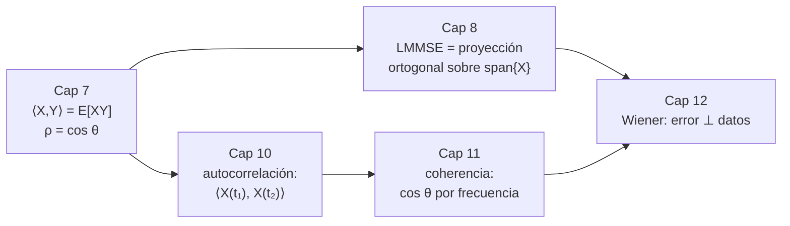
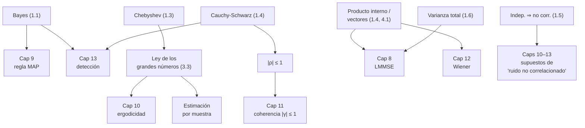

Complemento del capítulo 7 de [[PROCESAMIENTO DE SEÑALES]].

# Modelos Probabilísticos — En Profundidad

El capítulo 7 del apunte principal repasa las definiciones (probabilidad condicional, Bayes, variable aleatoria, distribuciones, media, varianza, covarianza, correlación) y cierra con la idea linda de pensar las variables aleatorias como vectores. Pero al ser un resumen, deja varias cosas enunciadas sin demostrar, y no toca nada de qué pasa cuando estos conceptos se aplican a **datos reales**. Este documento se mete en eso:

- **Las demostraciones.** Bayes generalizado, por qué la PDF es no negativa, la desigualdad de Chebyshev (que el apunte solo enuncia), la de $|\rho|\le1$ (que el apunte dice que "está verificada en el libro"), y la ley de la varianza total.
- **Las cuentas.** Los momentos de la uniforme con las integrales escritas, un ejemplo bivariado completo con su interpretación geométrica, el contraejemplo clásico de "no correlacionadas pero no independientes", y Chebyshev puesta a prueba con números.
- **La práctica.** Cómo se estiman media, varianza y correlación a partir de una muestra, por qué se divide por $n-1$, cómo la ley de los grandes números garantiza que eso funcione, y las trampas en las que uno cae al confiar en un $\rho$ estimado.

###### **Cómo leer esto**
No hace falta ir en orden. Según lo que estés buscando:

| Si querés… | Andá a |
|---|---|
| ver la regla de Bayes generalizada demostrada | Parte 1.1 |
| entender por qué la PDF es siempre $\geq0$ y por qué integra $1$ | Parte 1.2 |
| ver la desigualdad de Chebyshev demostrada de cero | Parte 1.3 |
| entender de dónde sale $\lvert\rho_{XY}\rvert\le1$ | Parte 1.4 |
| ver por qué independencia $\Rightarrow$ no correlación (y por qué el revés falla) | Parte 1.5 |
| descomponer una varianza en "dentro de grupo" y "entre grupos" | Parte 1.6 |
| ver cuentas hechas con números | Parte 2 |
| estimar media, varianza y correlación a partir de datos | Parte 3 |
| no dejarte engañar por un coeficiente de correlación | Parte 3.4 |
| conectar el capítulo con el 8, el 9, el 10 y el 12 | Parte 4 |
| practicar | Parte 5 |

---

# Parte 1 — Las demostraciones

## 1.1 La regla de Bayes generalizada

El apunte da la fórmula para una partición de eventos:
$$P(B_\ell\mid A) = \frac{P(A\mid B_\ell)\,P(B_\ell)}{\sum_j P(A\mid B_j)\,P(B_j)}$$
(en el apunte hay una errata de tipeo en el denominador, un `<` colado; así es como va). Veamos de dónde sale, porque el argumento es corto y aclara qué son los ingredientes.

###### **Primero, la ley de probabilidad total**
Sea $\{B_1, B_2, \dots\}$ una **partición** del espacio muestral: eventos mutuamente excluyentes ($B_i\cap B_j=\varnothing$ si $i\neq j$), que cubren todo ($\bigcup_j B_j = \psi$), y cada uno con $P(B_j)>0$.

Tomá cualquier evento $A$. Como los $B_j$ cubren todo, podemos partir $A$ en pedazos, uno por cada $B_j$:
$$A = A\cap\psi = A\cap\Big(\bigcup_j B_j\Big) = \bigcup_j (A\cap B_j)$$
Y como los $B_j$ son disjuntos, los pedazos $A\cap B_j$ también lo son. La probabilidad de una unión disjunta es la suma:
$$P(A) = \sum_j P(A\cap B_j) = \sum_j P(A\mid B_j)\,P(B_j)$$
donde en el último paso usamos la definición de probabilidad condicional, $P(A\cap B_j) = P(A\mid B_j)\,P(B_j)$. Esto es la **ley de probabilidad total**: partís el "cómo puede pasar $A$" según en cuál $B_j$ estás.

###### **Ahora, Bayes**
Arrancamos de la definición de probabilidad condicional, escrita para $B_\ell$ dado $A$:
$$P(B_\ell\mid A) = \frac{P(A\cap B_\ell)}{P(A)} = \frac{P(A\mid B_\ell)\,P(B_\ell)}{P(A)}$$
y reemplazamos el $P(A)$ del denominador por la ley de probabilidad total:
$$\boxed{\ P(B_\ell\mid A) = \frac{P(A\mid B_\ell)\,P(B_\ell)}{\sum_j P(A\mid B_j)\,P(B_j)}\ }$$

La lectura es la que ya conocés: el numerador es "qué tan compatible es $B_\ell$ con lo que observé" (verosimilitud $\times$ prior), y el denominador normaliza para que las probabilidades a posteriori sumen $1$.

> El caso de dos eventos del apunte, $P(A\mid B) = \dfrac{P(B\mid A)\,P(A)}{P(B)}$, es este mismo con la partición $\{A, \bar A\}$: el denominador $P(B) = P(B\mid A)P(A) + P(B\mid\bar A)P(\bar A)$.

>**Por qué esto importa después.** En el capítulo 9, la regla MAP consiste en elegir la hipótesis $H_i$ que maximiza $P(H_i\mid r)$. Aplicando Bayes, eso equivale a maximizar $p_i\,f(r\mid H_i)$ — el denominador $f(r)$ es el mismo para todas las hipótesis y se cancela. La detección óptima **es** esta fórmula.

## 1.2 La CDF: por qué la PDF es no negativa (y por qué integra 1)

El apunte dice que la densidad es "netamente positiva, gracias a que la función acumulativa es siempre creciente". Veamos por qué la CDF es creciente, y de paso saquemos dos hechos más que el apunte usa sin demostrar.

###### **La CDF es no decreciente**
Por definición, $F_X(x) = P(X\leq x)$. Tomá dos valores $a < b$. El evento $\{X\leq a\}$ está **contenido** en el evento $\{X\leq b\}$ (si $X$ es menor o igual que $a$, también es menor o igual que $b$). Y la probabilidad es **monótona**: si un evento contiene a otro, tiene al menos tanta probabilidad. Entonces:
$$a < b \ \Longrightarrow\ \{X\leq a\}\subseteq\{X\leq b\} \ \Longrightarrow\ P(X\leq a)\leq P(X\leq b) \ \Longrightarrow\ F_X(a)\leq F_X(b)$$
O sea: $F_X$ nunca baja.

###### **De ahí, la PDF es $\geq0$**
La densidad es la derivada de la CDF: $f_X(x) = \dfrac{dF_X}{dx}$. La derivada de una función que no decrece es $\geq0$ en todo punto donde exista. Por lo tanto:
$$\boxed{\ f_X(x)\geq0 \ \ \text{para todo } x\ }$$

###### **La PDF integra 1**
Los límites de la CDF son $F_X(-\infty) = P(X\leq-\infty) = P(\varnothing) = 0$ y $F_X(+\infty) = P(X\leq+\infty) = P(\psi) = 1$. Entonces, por el teorema fundamental del cálculo:
$$\int_{-\infty}^{\infty} f_X(x)\ dx = \int_{-\infty}^{\infty}\frac{dF_X}{dx}\ dx = F_X(+\infty) - F_X(-\infty) = 1 - 0 = 1$$
Toda la "masa de probabilidad" suma $1$. Es lo que hace que $f_X$ sea una densidad de verdad y no una función cualquiera positiva.

###### **Y la regla $P(a<X\leq b) = F_X(b) - F_X(a)$**
Sale del mismo argumento de partir eventos. El evento $\{X\leq b\}$ se parte en dos pedazos disjuntos:
$$\{X\leq b\} = \{X\leq a\}\ \sqcup\ \{a < X\leq b\}$$
Tomando probabilidad de ambos lados:
$$F_X(b) = F_X(a) + P(a<X\leq b) \ \Longrightarrow\ P(a<X\leq b) = F_X(b) - F_X(a)$$

## 1.3 La desigualdad de Chebyshev, desde cero

El apunte enuncia Chebyshev sin demostrarla. Se construye en dos pasos: primero la desigualdad de Markov, y después Chebyshev cae sola.

###### **Paso 1 — Markov**
> **Desigualdad de Markov.** Si $Y$ es una variable aleatoria **no negativa** ($Y\geq0$) y $a>0$, entonces
> $$P(Y\geq a)\ \leq\ \frac{E[Y]}{a}$$

**Demostración.** Escribimos la esperanza y la vamos acotando por abajo, tirando términos positivos:
$$E[Y] = \int_0^{\infty} y\,f_Y(y)\ dy \ \geq\ \int_a^{\infty} y\,f_Y(y)\ dy \ \geq\ \int_a^{\infty} a\,f_Y(y)\ dy \ =\ a\int_a^{\infty} f_Y(y)\ dy \ =\ a\,P(Y\geq a)$$

Los tres pasos, uno por uno:
1. La primera desigualdad: tiramos el pedazo de la integral entre $0$ y $a$. Como $y\geq0$ y $f_Y\geq0$, ese pedazo es $\geq0$, así que sacarlo solo puede achicar el valor.
2. La segunda: en la región $y\geq a$, reemplazamos $y$ por $a$ (que es más chico o igual). Al achicar el integrando, la integral baja.
3. La última: $a$ es constante, sale de la integral, y lo que queda es $P(Y\geq a)$ por definición.

Reordenando $E[Y]\geq a\,P(Y\geq a)$ queda $P(Y\geq a)\leq E[Y]/a$. ∎

La idea intuitiva de Markov: si $Y$ nunca es negativa y su promedio es chico, entonces no puede pasar demasiado tiempo tomando valores grandes.

###### **Paso 2 — Chebyshev**
Ahora aplicamos Markov a una variable auxiliar bien elegida. Tomá
$$Y = (X - \mu_X)^2 \qquad\text{y}\qquad a = \alpha^2\sigma_X^2 \quad (\alpha>0)$$
$Y$ es un cuadrado, así que $Y\geq0$: Markov aplica. Y $E[Y] = E[(X-\mu_X)^2] = \sigma_X^2$ por definición de varianza. Markov dice:
$$P\big((X-\mu_X)^2 \geq \alpha^2\sigma_X^2\big)\ \leq\ \frac{\sigma_X^2}{\alpha^2\sigma_X^2}\ =\ \frac{1}{\alpha^2}$$

Falta traducir el evento de la izquierda. Como ambos lados de $(X-\mu_X)^2\geq\alpha^2\sigma_X^2$ son no negativos, podemos sacar raíz cuadrada sin cambiar el sentido:
$$(X-\mu_X)^2 \geq \alpha^2\sigma_X^2 \ \Longleftrightarrow\ |X-\mu_X| \geq \alpha\,\sigma_X \ \Longleftrightarrow\ \frac{|X-\mu_X|}{\sigma_X} \geq \alpha$$

Y llegamos a la forma del apunte:
$$\boxed{\ P\!\left(\frac{|X-\mu_X|}{\sigma_X}\geq\alpha\right)\ \leq\ \frac{1}{\alpha^2}\ }$$

>**Lo que Chebyshev te da y lo que no.** Te da una cota **universal**: vale para *cualquier* distribución con varianza finita, sin importar su forma. El precio de esa generalidad es que la cota suele ser floja (ver 2.4). Pero es exactamente esa universalidad la que la vuelve la herramienta para demostrar la **ley de los grandes números** en 3.3 — que a su vez es lo que autoriza toda la estimación a partir de datos, y la ergodicidad del capítulo 10.

## 1.4 De dónde sale que el coeficiente de correlación vive entre -1 y 1

El apunte dice que la correlación cumple tres propiedades de producto interno "verificadas en la sección 7.8 del libro", y de ahí deduce que $\rho_{XY}=\cos\theta$. Pero que el coseno viva entre $-1$ y $1$ **es** una desigualdad con nombre: **Cauchy-Schwarz**. Vale la pena verla salir, porque la técnica —una parábola que nunca se hace negativa— reaparece en el capítulo 11 (densidad espectral cruzada) y en el 13 (filtro adaptado).

###### **La desigualdad, en general**
> **Cauchy-Schwarz para variables aleatorias.** Para cualquier par $U, V$ con segundo momento finito,
> $$|E[UV]|\ \leq\ \sqrt{E[U^2]\,E[V^2]}$$

**Demostración.** Para cualquier número real $\lambda$, definimos
$$g(\lambda) = E\big[(U - \lambda V)^2\big]$$
Como $(U-\lambda V)^2$ es un cuadrado, su esperanza no puede ser negativa: $g(\lambda)\geq0$ **para todo $\lambda$**.

Ahora desarrollamos el cuadrado y usamos linealidad de la esperanza:
$$g(\lambda) = E[U^2] - 2\lambda\,E[UV] + \lambda^2\,E[V^2]$$

Esto es una **parábola en $\lambda$**, con coeficiente principal $E[V^2]>0$ (asumimos $V$ no idénticamente nula), o sea abierta hacia arriba. Una parábola abierta hacia arriba que **nunca baja de cero** no puede tener dos raíces reales distintas — a lo sumo toca el cero una vez. Eso obliga a que su **discriminante sea $\leq0$**:
$$\underbrace{\big(-2E[UV]\big)^2}_{b^2}\ -\ 4\,\underbrace{E[V^2]}_{a}\,\underbrace{E[U^2]}_{c}\ \leq\ 0$$
$$4\,E[UV]^2 \leq 4\,E[U^2]\,E[V^2] \ \Longrightarrow\ E[UV]^2 \leq E[U^2]\,E[V^2]$$
y sacando raíz, $|E[UV]|\leq\sqrt{E[U^2]\,E[V^2]}$. ∎

![[c7p-cauchy-schwarz.svg]]

###### **Especializando a la covarianza**
Tomá $U = X - \mu_X$ y $V = Y - \mu_Y$ (las variables centradas). Entonces:
$$E[UV] = E[(X-\mu_X)(Y-\mu_Y)] = \sigma_{XY}, \qquad E[U^2] = \sigma_X^2, \qquad E[V^2] = \sigma_Y^2$$
Cauchy-Schwarz dice directamente:
$$|\sigma_{XY}|\ \leq\ \sigma_X\,\sigma_Y$$
y dividiendo ambos lados por $\sigma_X\sigma_Y>0$:
$$\boxed{\ |\rho_{XY}| = \frac{|\sigma_{XY}|}{\sigma_X\,\sigma_Y}\ \leq\ 1\ }$$

Que es lo mismo que decir que $\rho_{XY} = \cos\theta$ está entre $-1$ y $1$: no puede haber un "coseno" mayor que $1$ porque no puede haber un ángulo imaginario entre dos vectores reales.

###### **Cuándo se alcanza la igualdad**
$|\rho_{XY}| = 1$ exactamente cuando el discriminante es $0$, es decir, cuando la parábola $g(\lambda)$ **toca el cero** en algún $\lambda^\ast$. Pero $g(\lambda^\ast) = E[(U - \lambda^\ast V)^2] = 0$ significa que $U - \lambda^\ast V = 0$ casi seguramente, o sea:
$$X - \mu_X = \lambda^\ast\,(Y - \mu_Y)$$
$X$ es una **función afín exacta** de $Y$ (recta más constante), sin ninguna aleatoriedad residual. La correlación perfecta no es "muy correlacionadas": es "una es literalmente una recta de la otra".

>**Este es el eslabón que faltaba.** En el complemento del capítulo 11 (Ejercicio 7) usamos como dato que "$|\rho|=1$ implica relación afín exacta". Acá está la demostración: sale del caso de igualdad de Cauchy-Schwarz. Y la versión para procesos —coherencia $|\gamma|=1$ implica que $y$ es exactamente una función LTI de $x$— es la misma idea con un $\lambda$ por cada frecuencia.

###### **Ilustración con números**
Supongamos que $X$ e $Y$ tienen
$$E[X]=2,\quad E[Y]=-1,\quad E[X^2]=10,\quad E[Y^2]=5,\quad E[XY]=1$$
Entonces:
$$\sigma_X^2 = E[X^2] - E[X]^2 = 10 - 4 = 6 \qquad \sigma_X = \sqrt{6}\approx2{,}449$$
$$\sigma_Y^2 = E[Y^2] - E[Y]^2 = 5 - 1 = 4 \qquad \sigma_Y = 2$$
$$\sigma_{XY} = E[XY] - E[X]E[Y] = 1 - (2)(-1) = 3$$
$$\rho_{XY} = \frac{\sigma_{XY}}{\sigma_X\sigma_Y} = \frac{3}{\sqrt{6}\cdot2} = \frac{3}{2\sqrt6}\approx0{,}612$$

Chequeo de Cauchy-Schwarz: $|\sigma_{XY}| = 3 \leq \sigma_X\sigma_Y = \sqrt6\cdot2\approx4{,}90$ ✓ (con margen).

Geométricamente, esto es un par de vectores centrados de largos $\sqrt6$ y $2$, con un producto interno de $3$, separados por un ángulo $\theta = \arccos(0{,}612)\approx52^\circ$:

![[c7p-vectores-angulo.svg]]

La figura del discriminante de más arriba usa exactamente estos números: la parábola $g(\lambda) = 6 - 6\lambda + 4\lambda^2$ (con $E[UV]=3$) tiene discriminante $36 - 96 = -60 < 0$, así que nunca toca el cero. Si en cambio fuera $E[UV]=6$ (que violaría la desigualdad, porque $6 > \sqrt{6\cdot4}$), la parábola cruzaría a valores negativos — imposible para la esperanza de un cuadrado. Esa imposibilidad **es** la demostración.

## 1.5 Independencia implica no correlación (y por qué el revés falla)

El apunte lo pone en un recuadro de "IMPORTANTE" pero no lo demuestra. La ida es de una línea; la vuelta es directamente falsa.

###### **La ida: independientes $\Rightarrow$ covarianza nula**
Si $X$ e $Y$ son **independientes**, su densidad conjunta se factoriza: $f_{X,Y}(x,y) = f_X(x)\,f_Y(y)$. Entonces la correlación:
$$E[XY] = \int_{-\infty}^{\infty}\!\int_{-\infty}^{\infty} xy\;f_{X,Y}(x,y)\ dx\,dy = \int_{-\infty}^{\infty}\!\int_{-\infty}^{\infty} xy\;f_X(x)\,f_Y(y)\ dx\,dy$$
La integral doble se separa en producto de dos integrales simples (una en $x$, otra en $y$), porque el integrando es un producto de una función de $x$ por una función de $y$:
$$E[XY] = \left(\int_{-\infty}^{\infty} x\,f_X(x)\ dx\right)\left(\int_{-\infty}^{\infty} y\,f_Y(y)\ dy\right) = E[X]\,E[Y]$$
y por lo tanto:
$$\sigma_{XY} = E[XY] - E[X]\,E[Y] = 0$$
Independientes $\Rightarrow$ no correlacionadas. ∎

###### **La vuelta: NO vale**
Que $\sigma_{XY}=0$ **no** implica independencia. La covarianza solo detecta la parte **lineal** de la relación entre $X$ e $Y$. Puede haber una dependencia total, pero puramente no lineal, y la covarianza no la ve. El contraejemplo canónico está resuelto con números en 2.3: $X$ uniforme en $[-1,1]$ e $Y = X^2$. Son tan dependientes como se puede (conocer $X$ te da $Y$ exacto), y sin embargo $\sigma_{XY}=0$.

>**La excepción importante.** Si $(X,Y)$ son **conjuntamente gaussianas**, entonces no correlación **sí** implica independencia. Es un caso especial del que dependen varios resultados de los capítulos 12 y 13, y por eso se aclara siempre "gaussianas" cuando se lo usa.

## 1.6 La ley de la varianza total

El apunte demuestra la **propiedad de la torre**, $E[X] = E[E[X\mid Y]]$. Su hermana para segundos momentos es la **descomposición de la varianza**, y es el puente directo con el error del estimador MMSE del capítulo 8.

> **Ley de la varianza total.**
> $$\mathrm{Var}(X) = \underbrace{E\big[\mathrm{Var}(X\mid Y)\big]}_{\text{promedio de la dispersión dentro de cada grupo}} + \underbrace{\mathrm{Var}\big(E[X\mid Y]\big)}_{\text{dispersión de los promedios de grupo}}$$

**Demostración.** Escribimos $g(Y) = E[X\mid Y]$ para abreviar. Por la propiedad de la torre, $E[X] = E[g(Y)]$.

Arrancamos de la varianza condicional. Por su definición aplicada dentro de cada grupo:
$$\mathrm{Var}(X\mid Y) = E[X^2\mid Y] - \big(E[X\mid Y]\big)^2 = E[X^2\mid Y] - g(Y)^2$$
que reordenado da:
$$E[X^2\mid Y] = \mathrm{Var}(X\mid Y) + g(Y)^2$$

Ahora tomamos esperanza de los dos lados y usamos la torre en el término $E[E[X^2\mid Y]] = E[X^2]$:
$$E[X^2] = E\big[\mathrm{Var}(X\mid Y)\big] + E\big[g(Y)^2\big]$$

Finalmente, armamos la varianza de $X$:
$$\mathrm{Var}(X) = E[X^2] - \big(E[X]\big)^2 = E\big[\mathrm{Var}(X\mid Y)\big] + E\big[g(Y)^2\big] - \big(E[g(Y)]\big)^2$$
y los dos últimos términos son, por definición, $\mathrm{Var}(g(Y)) = \mathrm{Var}(E[X\mid Y])$. Queda demostrado. ∎

###### **Qué dice, en criollo**
La incertidumbre total sobre $X$ se parte en dos:
- **Lo que sigue sin saber aun conociendo $Y$** — la varianza que queda *dentro* de cada grupo, promediada sobre los grupos.
- **Lo que $Y$ explica** — cuánto se mueven los promedios de grupo entre sí.

>**El ejemplo del apunte, ahora completo.** El apunte usa el ejemplo de la altura: $40\%$ hombres (media $175$ cm), $60\%$ mujeres (media $162$ cm), media total $167{,}2$ cm. Supongamos además que el desvío dentro de cada grupo es $\sigma_H=7$ cm y $\sigma_M=6$ cm. Entonces:
>$$E[\mathrm{Var}(\text{Alt}\mid G)] = 0{,}4\cdot7^2 + 0{,}6\cdot6^2 = 19{,}6 + 21{,}6 = 41{,}2$$
>$$\mathrm{Var}(E[\text{Alt}\mid G]) = 0{,}4\,(175-167{,}2)^2 + 0{,}6\,(162-167{,}2)^2 = 0{,}4\cdot60{,}84 + 0{,}6\cdot27{,}04 = 40{,}56$$
>$$\mathrm{Var}(\text{Altura}) = 41{,}2 + 40{,}56 = 81{,}76 \ \Longrightarrow\ \sigma_{\text{Altura}}\approx9{,}04\ \text{cm}$$
>Casi mitad y mitad: la mitad de la varianza de la altura viene de que hombres y mujeres son distintos en promedio, y la otra mitad de que dentro de cada grupo también hay dispersión.

![[c7p-varianza-total.svg]]

>**El puente con el capítulo 8.** El apunte del capítulo 8 dice que, con una medición de $X$, el error del estimador MMSE es $\sigma^2_{Y\mid X=x}$ (la varianza condicional, para ese $x$ puntual). El error **promedio** sobre todos los $x$ es $E_X[\mathrm{Var}(Y\mid X)]$ — que es *exactamente* el primer término de esta descomposición. O sea:
>$$\text{MMSE} = E[\mathrm{Var}(Y\mid X)] = \mathrm{Var}(Y) - \mathrm{Var}(E[Y\mid X])$$
>Estimar $Y$ a partir de $X$ te "descuenta" de la varianza total exactamente lo que $X$ logra explicar. Y como $\mathrm{Var}(E[Y\mid X])\geq0$, el MMSE **nunca supera** la varianza de $Y$: medir, en el peor caso, no te hace peor que quedarte con la media.

---

# Parte 2 — Ejemplos numéricos resueltos de punta a punta

## 2.1 Media y varianza de la uniforme, con las integrales hechas

$V$ distribuida uniforme en $[a,b]$: la densidad es $f_V(v) = \dfrac{1}{b-a}$ para $v\in[a,b]$, y $0$ afuera. (Es constante porque "uniforme" significa que ningún valor del intervalo es más probable que otro; vale $1/(b-a)$ para que integre $1$.)

###### **Media**
$$\mu_V = \int_a^b v\,\frac{1}{b-a}\ dv = \frac{1}{b-a}\left[\frac{v^2}{2}\right]_a^b = \frac{b^2 - a^2}{2(b-a)} = \frac{(b-a)(b+a)}{2(b-a)} = \boxed{\ \frac{a+b}{2}\ }$$
El punto medio del intervalo, como era de esperar.

###### **Segundo momento**
$$E[V^2] = \int_a^b v^2\,\frac{1}{b-a}\ dv = \frac{1}{b-a}\left[\frac{v^3}{3}\right]_a^b = \frac{b^3 - a^3}{3(b-a)}$$
Factorizando $b^3 - a^3 = (b-a)(b^2 + ab + a^2)$:
$$E[V^2] = \boxed{\ \frac{a^2 + ab + b^2}{3}\ }$$

###### **Varianza**
$$\sigma_V^2 = E[V^2] - \mu_V^2 = \frac{a^2 + ab + b^2}{3} - \frac{(a+b)^2}{4}$$
Común denominador $12$:
$$\sigma_V^2 = \frac{4(a^2 + ab + b^2) - 3(a+b)^2}{12} = \frac{4a^2 + 4ab + 4b^2 - 3a^2 - 6ab - 3b^2}{12} = \frac{a^2 - 2ab + b^2}{12}$$
$$\boxed{\ \sigma_V^2 = \frac{(b-a)^2}{12}\ }$$

Es un cálculo de Probabilidad y Estadística, pero conviene tenerlo a mano: aparece en cuanto haya una uniforme dando vueltas (que es seguido, porque el ruido de cuantización, las fases aleatorias y los tiempos de llegada se modelan casi siempre como uniformes).

## 2.2 Un ejemplo bivariado completo

Retomamos las variables de 1.4 —$E[X]=2$, $E[Y]=-1$, $E[X^2]=10$, $E[Y^2]=5$, $E[XY]=1$— de las que ya sacamos $\sigma_X^2=6$, $\sigma_Y^2=4$, $\sigma_{XY}=3$, $\rho_{XY}\approx0{,}612$. Ahora las combinamos.

###### **Varianza de una combinación lineal**
Sea $Z = 2X - 3Y$. Usamos la fórmula de varianza bivariada del apunte, $\sigma_Z^2 = \alpha^2\sigma_X^2 + \beta^2\sigma_Y^2 + 2\alpha\beta\,\sigma_{XY}$, con $\alpha = 2$, $\beta = -3$:
$$\sigma_Z^2 = 2^2\cdot6 + (-3)^2\cdot4 + 2\cdot2\cdot(-3)\cdot3 = 24 + 36 - 36 = \boxed{\ 24\ }$$
$$E[Z] = 2\,E[X] - 3\,E[Y] = 2\cdot2 - 3\cdot(-1) = 7$$

Fijate el término cruzado: $2\alpha\beta\sigma_{XY} = -36$, y es negativo aunque $\sigma_{XY}=3$ sea positivo, porque $\alpha\beta = -6 < 0$. Restar $Y$ en vez de sumarla invierte el efecto de la correlación. Si $X$ e $Y$ tienden a subir juntas, entonces $2X$ y $-3Y$ tienden a moverse en contra, y eso **reduce** la varianza de la suma.

###### **La lectura geométrica**
En el espacio de variables centradas, $\bar X$ y $\bar Y$ son vectores de largo $\sigma_X = \sqrt6$ y $\sigma_Y = 2$, con producto interno $\langle\bar X, \bar Y\rangle = \sigma_{XY} = 3$, y ángulo
$$\theta = \arccos\!\left(\frac{3}{\sqrt6\cdot2}\right)\approx52^\circ$$
La varianza de $Z = 2X - 3Y$ es el largo al cuadrado del vector $2\bar X - 3\bar Y$. Por la ley del coseno (o sea, expandiendo $\|2\bar X - 3\bar Y\|^2$):
$$\|2\bar X - 3\bar Y\|^2 = 4\|\bar X\|^2 + 9\|\bar Y\|^2 - 2\cdot2\cdot3\,\langle\bar X,\bar Y\rangle = 4\cdot6 + 9\cdot4 - 12\cdot3 = 24$$
Es la misma cuenta que antes: la fórmula de la varianza bivariada **es** el teorema del coseno en el espacio de variables aleatorias.

## 2.3 No correlacionadas pero no independientes

El contraejemplo clásico, con todas las cuentas. Sea $X$ uniforme en $[-1,1]$ (densidad $f_X(x) = \tfrac12$ en ese intervalo), y sea $Y = X^2$.

###### **Los momentos**
$$E[X] = \int_{-1}^{1} x\cdot\tfrac12\ dx = 0 \qquad\text{(integrando impar sobre intervalo simétrico)}$$
$$E[Y] = E[X^2] = \int_{-1}^{1} x^2\cdot\tfrac12\ dx = \tfrac12\left[\frac{x^3}{3}\right]_{-1}^{1} = \tfrac12\left(\tfrac13 + \tfrac13\right) = \tfrac13$$

###### **La covarianza**
$$\sigma_{XY} = E[XY] - E[X]\,E[Y] = E[X\cdot X^2] - 0\cdot\tfrac13 = E[X^3]$$
$$E[X^3] = \int_{-1}^{1} x^3\cdot\tfrac12\ dx = \tfrac12\left[\frac{x^4}{4}\right]_{-1}^{1} = \tfrac12\left(\tfrac14 - \tfrac14\right) = 0$$
(otra vez, integrando impar sobre intervalo simétrico). Entonces:
$$\boxed{\ \sigma_{XY} = 0\ } \quad\Longrightarrow\quad X\ \text{e}\ Y\ \text{están no correlacionadas.}$$

###### **Pero son totalmente dependientes**
$Y = X^2$ es una función **determinística** de $X$: si te digo que $X = 0{,}7$, entonces $Y = 0{,}49$ con certeza absoluta. No hay ninguna aleatoriedad residual. La densidad condicional es $f_{Y\mid X}(y\mid x) = \delta(y - x^2)$, que obviamente depende de $x$ y no es igual a la marginal $f_Y(y)$. Son la antítesis de independientes.

>**La moraleja.** $\sigma_{XY}=0$ dice "no hay tendencia **lineal**": cuando $X$ sube, $Y$ no sube ni baja *en promedio*. Y es cierto — para $X$ negativo, $Y = X^2$ baja al subir $X$; para $X$ positivo, sube; las dos mitades se cancelan. La covarianza mira solo la recta de mejor ajuste, y acá esa recta es plana. Pero la relación está, es perfecta, y es una parábola.

## 2.4 Chebyshev puesta a prueba

###### **Caso 1: la cota es floja**
$X$ uniforme en $[0,1]$: $\mu = \tfrac12$, $\sigma^2 = \tfrac{1}{12}$, $\sigma = \tfrac{1}{\sqrt{12}}\approx0{,}2887$.

Tomemos $\alpha = 1{,}5$. **Chebyshev** dice:
$$P\!\left(\frac{|X - \tfrac12|}{\sigma}\geq1{,}5\right)\ \leq\ \frac{1}{1{,}5^2} = \frac{1}{2{,}25}\approx0{,}444$$

**El valor real.** El evento es $|X - \tfrac12|\geq1{,}5\,\sigma = \tfrac{1{,}5}{\sqrt{12}} = \tfrac{\sqrt3}{4}\approx0{,}433$, o sea $X\leq0{,}067$ o $X\geq0{,}933$. Como la densidad vale $1$ en $[0,1]$, esa probabilidad es el largo de las dos colas:
$$P = 2\left(\tfrac12 - \tfrac{\sqrt3}{4}\right) = 1 - \tfrac{\sqrt3}{2}\approx0{,}134$$

La cota dice $\leq0{,}444$; la verdad es $0{,}134$. Chebyshev sobrestima por un factor de $3{,}3$. Es el precio de una cota que no mira la forma de la distribución.

###### **Caso 2: la cota se alcanza exacto**
Chebyshev no se puede mejorar en general, y esto lo prueba. Tomá $X$ que vale $\mu - \sigma$ o $\mu + \sigma$, cada uno con probabilidad $\tfrac12$ (una distribución de dos puntos, con la varianza correcta por construcción).

Con $\alpha = 1$: el evento $\dfrac{|X-\mu|}{\sigma}\geq1$ ocurre **siempre**, porque $X$ está siempre exactamente a distancia $\sigma$ de la media. Entonces la probabilidad real es $1$. Y la cota de Chebyshev con $\alpha=1$ es $\tfrac{1}{1^2} = 1$.

$$\text{real} = 1 = \text{cota}$$

La cota se alcanza con igualdad. No existe ninguna desigualdad universal (que valga para toda distribución con varianza finita) más ajustada que Chebyshev.

---

# Parte 3 — Estimar a partir de datos

El capítulo 7 trabaja con las distribuciones dadas: te dan $f_X$, o te dan los momentos, y calculás. En la práctica no te dan nada de eso: tenés una **muestra** $x_1, \dots, x_n$ y tenés que estimar la media, la varianza, la correlación. Nada de esto está en el apunte, y hay sutilezas.

## 3.1 Los estimadores muestrales

| cantidad poblacional | estimador muestral |
|---|---|
| media $\mu_X$ | $\displaystyle\bar X = \frac{1}{n}\sum_{i=1}^{n} x_i$ |
| varianza $\sigma_X^2$ | $\displaystyle S_X^2 = \frac{1}{n-1}\sum_{i=1}^{n}(x_i - \bar X)^2$ |
| covarianza $\sigma_{XY}$ | $\displaystyle S_{XY} = \frac{1}{n-1}\sum_{i=1}^{n}(x_i - \bar X)(y_i - \bar Y)$ |
| correlación $\rho_{XY}$ | $\displaystyle r_{XY} = \frac{S_{XY}}{S_X\,S_Y}$ |

Todos son "reemplazá la esperanza por un promedio sobre la muestra". El único que no es obvio es el $n-1$ en la varianza y la covarianza — eso lo justificamos en 3.2.

## 3.2 Por qué se divide por $n-1$ y no por $n$

Uno esperaría que el estimador natural de la varianza fuera $\hat\sigma^2_n = \dfrac{1}{n}\sum(x_i - \bar X)^2$ — el promedio de las desviaciones al cuadrado. Resulta que ese estimador está **sesgado hacia abajo**: en promedio, da menos que la varianza verdadera. Veamos por qué, y cuánto.

###### **Una identidad algebraica**
Primero, un hecho que vale para cualquier conjunto de números. Escribiendo $a_i = x_i - \mu$ y $\bar a = \bar X - \mu = \tfrac{1}{n}\sum a_i$:
$$\sum_i (x_i - \bar X)^2 = \sum_i (a_i - \bar a)^2 = \sum_i a_i^2 - 2\bar a\sum_i a_i + n\bar a^2 = \sum_i a_i^2 - 2\bar a\,(n\bar a) + n\bar a^2 = \sum_i a_i^2 - n\bar a^2$$
O sea:
$$\sum_i (x_i - \bar X)^2 = \sum_i (x_i - \mu)^2 - n\,(\bar X - \mu)^2$$
Restar el promedio muestral (en vez del verdadero $\mu$) siempre da una suma de cuadrados **más chica**, y falta exactamente $n(\bar X - \mu)^2$.

###### **Tomando esperanza**
Asumimos $x_1, \dots, x_n$ independientes, con media $\mu$ y varianza $\sigma^2$. Tomamos esperanza de la identidad:
$$E\left[\sum_i (x_i - \bar X)^2\right] = \sum_i E[(x_i - \mu)^2] - n\,E[(\bar X - \mu)^2] = n\sigma^2 - n\,\mathrm{Var}(\bar X)$$

Nos falta $\mathrm{Var}(\bar X)$. Como los $x_i$ son independientes, la varianza de la suma es la suma de las varianzas (sin términos cruzados, porque las covarianzas son cero):
$$\mathrm{Var}(\bar X) = \mathrm{Var}\!\left(\frac{1}{n}\sum_i x_i\right) = \frac{1}{n^2}\sum_i \mathrm{Var}(x_i) = \frac{1}{n^2}\cdot n\sigma^2 = \frac{\sigma^2}{n}$$
(esto es la fórmula de la varianza bivariada del apunte, extendida a $n$ variables). Reemplazando:
$$E\left[\sum_i (x_i - \bar X)^2\right] = n\sigma^2 - n\cdot\frac{\sigma^2}{n} = (n-1)\,\sigma^2$$

###### **La conclusión**
Si dividís por $n$:
$$E\left[\frac{1}{n}\sum_i (x_i - \bar X)^2\right] = \frac{n-1}{n}\,\sigma^2 < \sigma^2$$
sesgo hacia abajo, tanto más grande cuanto más chico es $n$. Si dividís por $n-1$:
$$E\left[\frac{1}{n-1}\sum_i (x_i - \bar X)^2\right] = \sigma^2$$
**insesgado**. Ese es todo el motivo del $n-1$.

>**La intuición.** Al usar $\bar X$ en lugar de $\mu$, "gastaste" un grado de libertad: los $n$ residuos $x_i - \bar X$ no son independientes, suman cero por construcción. Solo quedan $n-1$ piezas de información libres. Dividir por $n-1$ lo compensa.

## 3.3 La ley de los grandes números (y por qué era necesaria Chebyshev)

Toda la estimación por muestra descansa en un supuesto: que $\bar X$ se acerca a $\mu$ cuando $n$ crece. Eso es un **teorema**, y se demuestra con Chebyshev en tres líneas.

Ya vimos en 3.2 que $\mathrm{Var}(\bar X_n) = \dfrac{\sigma^2}{n}$. Aplicamos Chebyshev a $\bar X_n$ directamente (con un $\varepsilon$ cualquiera en lugar de "$\alpha$ desvíos"):
$$P\big(|\bar X_n - \mu|\geq\varepsilon\big)\ \leq\ \frac{\mathrm{Var}(\bar X_n)}{\varepsilon^2} = \frac{\sigma^2}{n\,\varepsilon^2}\ \xrightarrow[n\to\infty]{}\ 0$$

> **Ley débil de los grandes números.** Para cualquier tolerancia $\varepsilon>0$, la probabilidad de que el promedio muestral se aleje más de $\varepsilon$ de la media verdadera tiende a cero al crecer $n$.

Eso es. La varianza de $\bar X_n$ se achica como $1/n$, y Chebyshev traduce "varianza chica" en "probabilidad chica de estar lejos". Sin haber demostrado Chebyshev en 1.3, este resultado quedaría colgado.

![[c7p-lln-chebyshev.svg]]

En la figura, tres corridas de $\bar X_n$ para $X\sim U(0,1)$. La banda naranja es $\mu\pm k\sigma/\sqrt{n}$ con $k=\sqrt{10}$, elegido para que Chebyshev garantice que **al menos el 90%** de las corridas caen adentro, para *cualquier* $n$. La banda se angosta como $1/\sqrt{n}$ y arrastra a las corridas hacia $\mu$.

>**El puente con el capítulo 10.** La estimación espectral del capítulo 11 (y la ergodicidad del 10) hacen exactamente esto, pero promediando **en el tiempo** trozos de una sola realización. El permiso para hacerlo es la ergodicidad; el mecanismo por el cual "más promedios $\Rightarrow$ menos varianza del estimado" es esta misma cuenta.

## 3.4 Trampas al confiar en un coeficiente de correlación

El $r$ estimado es un solo número, y esconde un montón. Cuatro trampas clásicas:

![[c7p-cuarteto.svg]]

Los cuatro conjuntos de datos de la figura tienen correlación parecida (entre $0{,}82$ y $0{,}88$) y sin embargo:

1. **Panel 1 — buen ajuste lineal.** El caso honesto: una relación lineal con ruido. La recta es un buen modelo y $r$ lo refleja.
2. **Panel 2 — relación curva.** Los puntos siguen una curva clarísima, sin nada de ruido. $r$ da $0{,}82$, decente, pero una **recta es el modelo equivocado**. El $r$ no te avisa que la relación es no lineal.
3. **Panel 3 — recta perfecta más un outlier.** Casi todos los puntos están exactamente sobre una recta; uno solo se escapa. Ese punto solo baja el $r$ de $\approx1$ a $0{,}88$. Si lo sacaras, el ajuste sería perfecto — el $r$ global te oculta que hay un dato problemático.
4. **Panel 4 — un outlier que arrastra todo.** Casi todos los puntos tienen el mismo $x$ (una nube vertical, sin relación real entre $x$ e $y$). Un único punto, lejísimos, crea toda la "correlación". Sacá ese punto y $r$ se desploma. El número alto es un espejismo de un solo dato con mucho apalancamiento.

>**Lo que la figura enseña:** el coeficiente de correlación **nunca reemplaza mirar el gráfico de dispersión**. Y hay más:
>- $r$ mide relación **lineal**. Una dependencia fuerte pero curva puede dar $r\approx0$ (el ejemplo de 2.3) o un $r$ engañosamente alto (panel 2).
>- La covarianza muestral es una suma de productos: **un solo outlier la puede dominar**.
>- $r$ alto no implica causalidad. Es literal correlación, nada más.

## 3.5 Receta práctica

Antes de reportar un $\rho$ estimado, o de meter un supuesto de "no correlación" en un modelo:

- [ ] **¿$n$ es suficientemente grande?** Con pocos datos, $\bar X$ y $S^2$ tienen mucha dispersión (ley de los grandes números: la incertidumbre baja como $1/\sqrt n$).
- [ ] **¿Miraste el scatter?** Siempre. Antes que el número.
- [ ] **¿Hay outliers?** La covarianza muestral es frágil ante valores extremos.
- [ ] **¿La relación es lineal?** $r$ solo ve eso. Si la nube es curva, $r$ miente.
- [ ] **¿Estás asumiendo independencia a partir de $r\approx0$?** No se puede: no correlación no implica independencia (salvo gaussianas).
- [ ] **¿Dividiste por $n-1$?** En varianza y covarianza muestral, sí.

---

# Parte 4 — Intuición y conexiones

## 4.1 El espacio de Hilbert de las variables aleatorias

El apunte lo insinúa: las variables aleatorias se pueden tratar como **vectores**, con
$$\langle X, Y\rangle := E[XY], \qquad \|X\|^2 = E[X^2]$$
y "ortogonal" quiere decir $E[XY] = 0$. Con las variables **centradas** ($\bar X = X - \mu_X$), el producto interno es la covarianza y el coseno del ángulo es $\rho$. Eso no es una analogía suelta: es la estructura que organiza medio programa de la materia.

Concretamente:
- **Capítulo 8 (LMMSE).** El mejor estimador lineal de $Y$ a partir de $X$ es la **proyección ortogonal** de $Y$ sobre el subespacio generado por $X$. El "principio de ortogonalidad" (error $\perp$ datos) es literalmente Pitágoras en este espacio.
- **Capítulo 11 (coherencia).** La coherencia $\gamma_{yx}(e^{j\Omega})$ es el $\cos\theta$ entre dos procesos, calculado frecuencia por frecuencia. En el Ejercicio 7 del complemento del capítulo 11 aparece $|\gamma|=1$ y se interpreta como "relación LTI exacta" — que es la versión para procesos del caso de igualdad de Cauchy-Schwarz de 1.4.
- **Capítulo 13 (detección).** La desigualdad de Cauchy-Schwarz —la misma parábola de 1.4— es la que prueba que el **filtro adaptado** maximiza la SNR.

>El truco de "una parábola que nunca se hace negativa, entonces discriminante $\leq0$" aparece tres veces en la materia: en el capítulo 7 (esto), en el 11 (densidad espectral cruzada) y en el 13 (filtro adaptado). Vale la pena reconocerlo.

## 4.2 De la covarianza a la autocovarianza

El capítulo 10 define, para un proceso $X(t)$:
$$R_{XX}(t_1, t_2) = E[X(t_1)\,X(t_2)] \qquad C_{XX}(t_1, t_2) = E\big[(X(t_1) - \mu)(X(t_2) - \mu)\big]$$

Mirá bien: $R_{XX}(t_1,t_2)$ es **exactamente** la correlación $r_{X,Y} = E[XY]$ del capítulo 7, tomando $X = X(t_1)$ e $Y = X(t_2)$. Y $C_{XX}(t_1,t_2)$ es la covarianza $\sigma_{X,Y}$ con la misma sustitución.

> El capítulo 10 no te enseña un concepto nuevo. Toma la covarianza del capítulo 7 y la evalúa entre dos "instantáneas" del mismo proceso a distintos tiempos. Todo lo que valía para $\sigma_{XY}$ —Cauchy-Schwarz, la interpretación vectorial, "no correlación $\ne$ independencia"— vale igual para $C_{XX}(t_1,t_2)$, con un índice de tiempo de más.

## 4.3 Bayes es el corazón de los capítulos 9 y 13

La regla MAP del capítulo 9 —elegir la hipótesis $H_i$ con mayor $P(H_i\mid r)$— es la regla de Bayes de 1.1 aplicada, con el denominador $f(r)$ cancelado por ser común a todas las hipótesis. La probabilidad de error mínima, la clasificación óptima, la detección de señales en ruido gaussiano: todo eso es Bayes con nombres nuevos.

## 4.4 Mapa: qué de este capítulo alimenta a cuál

## 4.5 Para llevar

Todo lo anterior condensado.

**Definiciones y fórmulas**

| | fórmula |
|---|---|
| Bayes (partición) | $P(B_\ell\mid A) = \dfrac{P(A\mid B_\ell)P(B_\ell)}{\sum_j P(A\mid B_j)P(B_j)}$ |
| Varianza | $\sigma_X^2 = E[X^2] - \mu_X^2$ |
| Covarianza | $\sigma_{XY} = E[XY] - E[X]E[Y]$ |
| Coef. de correlación | $\rho_{XY} = \dfrac{\sigma_{XY}}{\sigma_X\sigma_Y} = \cos\theta$ |
| Varianza de $\alpha X + \beta Y$ | $\alpha^2\sigma_X^2 + \beta^2\sigma_Y^2 + 2\alpha\beta\,\sigma_{XY}$ |
| Uniforme $[a,b]$ | $\mu = \dfrac{a+b}{2}$, $\ \sigma^2 = \dfrac{(b-a)^2}{12}$ |
| Torre | $E[X] = E[E[X\mid Y]]$ |
| Varianza total | $\mathrm{Var}(X) = E[\mathrm{Var}(X\mid Y)] + \mathrm{Var}(E[X\mid Y])$ |

**Los hechos que se usan todo el tiempo**

| hecho | dónde está |
|---|---|
| $f_X\geq0$ e $\int f_X = 1$, porque $F_X$ no decrece y va de $0$ a $1$ | 1.2 |
| $P\!\left(\dfrac{|X-\mu_X|}{\sigma_X}\geq\alpha\right)\leq\dfrac{1}{\alpha^2}$ (Chebyshev) | 1.3 |
| $|\sigma_{XY}|\leq\sigma_X\sigma_Y$, y por lo tanto $|\rho_{XY}|\leq1$ | 1.4 |
| $\rho_{XY} = \pm1 \Leftrightarrow Y$ es función afín exacta de $X$ | 1.4 |
| independientes $\Rightarrow$ $\sigma_{XY}=0$; el recíproco solo vale si son gaussianas | 1.5 |
| MMSE $= E[\mathrm{Var}(Y\mid X)] = \mathrm{Var}(Y) - \mathrm{Var}(E[Y\mid X])$ | 1.6 |
| $\mathrm{Var}(\bar X_n) = \sigma^2/n$; de ahí la ley de los grandes números | 3.2–3.3 |
| varianza y covarianza muestral: dividir por $n-1$ | 3.2 |

**Números de Chebyshev** (probabilidad de estar a $\geq\alpha$ desvíos de la media)

| $\alpha$ | cota Chebyshev | ejemplo: uniforme $[0,1]$ (real) |
|---|---|---|
| $1$ | $1$ (inútil) | $0$ |
| $1{,}5$ | $0{,}444$ | $\approx0{,}134$ |
| $2$ | $0{,}25$ | $0$ (imposible: la uniforme no llega a $2\sigma$) |
| $3$ | $0{,}111$ | $0$ |

La cota es universal pero floja; se vuelve exacta solo para la distribución de dos puntos (2.4).

---

# Parte 5 — Ejercicios de práctica

Originales, del mismo tipo conceptual que los del apunte pero con planteos distintos. Cada uno tiene su resolución al lado, colapsada — intentá primero.

### Ejercicio 1 — Independencia de eventos geométricos

Dos números $X$ e $Y$ se eligen de forma independiente y uniforme en $[0,1]$. Definimos
$$A = \{X + Y > 1\}, \qquad B = \{X > Y\}, \qquad C = \{X < \tfrac12\}$$

**a)** Determiná si son independientes: $A$ y $B$; $A$ y $C$; $B$ y $C$.
**b)** ¿Son $A$, $B$, $C$ mutuamente independientes?

> [!success]- Solución
> Primero las probabilidades individuales, todas por área:
> - $P(A) = $ área del triángulo por encima de la recta $x+y=1$ en el cuadrado $= \tfrac12$.
> - $P(B) = $ área por debajo de la diagonal $y = x$ $= \tfrac12$ (mitad del cuadrado por simetría).
> - $P(C) = $ área de la franja $x < \tfrac12$ $= \tfrac12$.
>
> **a) $A$ y $B$:** hay que calcular $P(A\cap B) = $ área de $\{x > y,\ x + y > 1\}$. Las dos rectas $y=x$ e $y=1-x$ se cruzan en $(\tfrac12,\tfrac12)$. Para $x\in(\tfrac12, 1)$, la región va de $y = 1-x$ hasta $y = x$:
> $$P(A\cap B) = \int_{1/2}^{1}\big[x - (1-x)\big]\ dx = \int_{1/2}^{1}(2x - 1)\ dx = \big[x^2 - x\big]_{1/2}^{1} = (1 - 1) - (\tfrac14 - \tfrac12) = \tfrac14$$
> Y $P(A)\,P(B) = \tfrac12\cdot\tfrac12 = \tfrac14$. **Coinciden $\Rightarrow$ $A$ y $B$ son independientes.** (Tiene sentido por la simetría de reflejar $x\leftrightarrow y$.)
>
> **$A$ y $C$:** $P(A\cap C) = $ área de $\{x < \tfrac12,\ x + y > 1\}$. Para $x\in(0, \tfrac12)$, $y$ va de $1-x$ a $1$, largo $x$:
> $$P(A\cap C) = \int_{0}^{1/2} x\ dx = \left[\frac{x^2}{2}\right]_0^{1/2} = \tfrac18 = 0{,}125$$
> Y $P(A)\,P(C) = \tfrac14 = 0{,}25$. **$0{,}125\neq0{,}25 \Rightarrow$ $A$ y $C$ NO son independientes.**
>
> **$B$ y $C$:** $P(B\cap C) = $ área de $\{x < \tfrac12,\ x > y\}$. Para $x\in(0,\tfrac12)$, $y$ va de $0$ a $x$, largo $x$:
> $$P(B\cap C) = \int_0^{1/2} x\ dx = \tfrac18 = 0{,}125 \neq P(B)P(C) = \tfrac14$$
> **$B$ y $C$ NO son independientes.**
>
> **b)** No pueden ser mutuamente independientes, porque la independencia mutua **exige** que todos los pares sean independientes, y ya vimos que $A$–$C$ y $B$–$C$ fallan.
>
> ![[c7p-eventos-unitsquare.svg]]
>
> *Compará con el ejercicio 1 del apunte: misma idea (regiones del cuadrado unitario, chequear independencia de a pares y mutua), pero con una partición basada en la diagonal en vez de las mitades.*

### Ejercicio 2 — Suma de dos exponenciales

$V$ tiene distribución exponencial de parámetro $\lambda$: $f_V(v) = \lambda e^{-\lambda v}$ para $v\geq0$.

**a)** Calculá $\mu_V$, $E[V^2]$ y $\sigma_V^2$ integrando.
**b)** Sea $W$ una segunda exponencial de parámetro $\lambda$, independiente de $V$. Con $Y = V + W$, hallá $\mathrm{Cov}(Y, V)$ y $\rho_{Y,V}$.

> [!success]- Solución
> **a)** Media, por partes ($u = v$, $dw = \lambda e^{-\lambda v}\,dv$):
> $$\mu_V = \int_0^{\infty} v\,\lambda e^{-\lambda v}\ dv = \big[-v e^{-\lambda v}\big]_0^{\infty} + \int_0^{\infty} e^{-\lambda v}\ dv = 0 + \left[-\frac{e^{-\lambda v}}{\lambda}\right]_0^{\infty} = \boxed{\ \frac{1}{\lambda}\ }$$
>
> Segundo momento, otra vez por partes ($u = v^2$):
> $$E[V^2] = \int_0^{\infty} v^2\,\lambda e^{-\lambda v}\ dv = \big[-v^2 e^{-\lambda v}\big]_0^{\infty} + \int_0^{\infty} 2v\,e^{-\lambda v}\ dv = 0 + \frac{2}{\lambda}\underbrace{\int_0^{\infty} v\,\lambda e^{-\lambda v}\ dv}_{= \,\mu_V \,=\, 1/\lambda} = \boxed{\ \frac{2}{\lambda^2}\ }$$
>
> Varianza:
> $$\sigma_V^2 = E[V^2] - \mu_V^2 = \frac{2}{\lambda^2} - \frac{1}{\lambda^2} = \boxed{\ \frac{1}{\lambda^2}\ }$$
>
> **b)** Covarianza, usando bilinealidad y que $W\perp V$ (por 1.5, $\mathrm{Cov}(W,V)=0$):
> $$\mathrm{Cov}(Y, V) = \mathrm{Cov}(V + W,\ V) = \mathrm{Cov}(V, V) + \mathrm{Cov}(W, V) = \sigma_V^2 + 0 = \boxed{\ \frac{1}{\lambda^2}\ }$$
>
> Para $\rho$ necesitamos $\sigma_Y$. Como $V$ y $W$ son independientes, $\mathrm{Var}(Y) = \sigma_V^2 + \sigma_W^2 = \dfrac{2}{\lambda^2}$, así que $\sigma_Y = \dfrac{\sqrt2}{\lambda}$. Entonces:
> $$\rho_{Y,V} = \frac{\mathrm{Cov}(Y,V)}{\sigma_Y\,\sigma_V} = \frac{1/\lambda^2}{(\sqrt2/\lambda)(1/\lambda)} = \frac{1/\lambda^2}{\sqrt2/\lambda^2} = \boxed{\ \frac{1}{\sqrt2}\approx0{,}707\ }$$
>
> *El $\rho$ no depende de $\lambda$: cualquier variable correlaciona con "ella misma más un ruido independiente del mismo tamaño" a exactamente $1/\sqrt2$. Es el mismo resultado que sale para la uniforme en el ejercicio 2 del apunte — la forma de la distribución no importa, solo que $V$ y $W$ tengan la misma varianza.*

### Ejercicio 3 — Correlación perfecta pero no ortogonal

Sea $V$ uniforme en $[0,2]$, y definimos
$$X = 1 + 3V, \qquad Y = -2 + 3V$$

**a)** Hallá $\sigma_{XY}$ y $\rho_{XY}$.
**b)** ¿Son $X$ e $Y$ ortogonales?
**c)** ¿Están correlacionadas?

> [!success]- Solución
> De 2.1, para $V\sim U(0,2)$: $\mu_V = 1$, $\sigma_V^2 = \dfrac{(2-0)^2}{12} = \dfrac13$, y $E[V^2] = \sigma_V^2 + \mu_V^2 = \dfrac13 + 1 = \dfrac43$.
>
> **a)** Las constantes no afectan la covarianza:
> $$\sigma_{XY} = \mathrm{Cov}(1 + 3V,\ -2 + 3V) = \mathrm{Cov}(3V, 3V) = 9\,\mathrm{Var}(V) = 9\cdot\tfrac13 = \boxed{\ 3\ }$$
> Las varianzas: $\sigma_X^2 = 9\,\sigma_V^2 = 3$ y $\sigma_Y^2 = 3$, así que $\sigma_X = \sigma_Y = \sqrt3$. Entonces:
> $$\rho_{XY} = \frac{3}{\sqrt3\cdot\sqrt3} = \boxed{\ 1\ }$$
> Correlación **perfecta**. Coherente con 1.4: $Y = X - 3$ es una función afín exacta de $X$ (pendiente $+1$), y el caso de igualdad de Cauchy-Schwarz dice que eso da $\rho = 1$.
>
> **b)** Ortogonal sería $E[XY] = 0$. Calculamos:
> $$E[XY] = E\big[(1 + 3V)(-2 + 3V)\big] = E\big[-2 - 3V + 9V^2\big] = -2 - 3\,E[V] + 9\,E[V^2] = -2 - 3(1) + 9\left(\tfrac43\right) = -2 - 3 + 12 = 7$$
> $E[XY] = 7 \neq 0 \Rightarrow$ **NO son ortogonales.**
>
> **c)** **Sí, están correlacionadas** — de hecho perfectamente ($\rho = 1$).
>
> *La lección: $\rho = 1$ (relación lineal) y ortogonalidad ($E[XY] = 0$) son condiciones **distintas y sin relación entre sí**. Una habla de las variables centradas, la otra de las variables en bruto. Dos variables pueden estar perfectamente correlacionadas y no ser ortogonales, como acá.*

### Ejercicio 4 — Componentes mutuamente no correlacionadas

$Z$, $V$ y $W$ son mutuamente no correlacionadas, con varianzas $\sigma_Z^2$, $\sigma_V^2$, $\sigma_W^2$. Definimos
$$X = Z + V, \qquad Y = X + W = Z + V + W$$

**a)** Hallá $\mathrm{Cov}(X, Y)$ y $\rho_{XY}$ en términos de las varianzas.
**b)** Evaluá $\rho_{XY}$ en el caso $\sigma_Z^2 = \sigma_V^2 = \sigma_W^2 = \sigma^2$, y chequeá los extremos.

> [!success]- Solución
> **a)** Covarianza (bilinealidad, y $\mathrm{Cov}(\cdot, W) = 0$ para $Z$ y $V$):
> $$\mathrm{Cov}(X, Y) = \mathrm{Cov}(Z + V,\ Z + V + W) = \mathrm{Cov}(Z + V,\ Z + V) + \underbrace{\mathrm{Cov}(Z + V,\ W)}_{= \,0} = \mathrm{Var}(Z + V) = \boxed{\ \sigma_Z^2 + \sigma_V^2\ }$$
> (usando que $Z$ y $V$ tampoco están correlacionadas entre sí).
>
> Las varianzas:
> $$\mathrm{Var}(X) = \sigma_Z^2 + \sigma_V^2, \qquad \mathrm{Var}(Y) = \sigma_Z^2 + \sigma_V^2 + \sigma_W^2$$
> Entonces:
> $$\rho_{XY} = \frac{\sigma_Z^2 + \sigma_V^2}{\sqrt{(\sigma_Z^2 + \sigma_V^2)(\sigma_Z^2 + \sigma_V^2 + \sigma_W^2)}} = \boxed{\ \sqrt{\frac{\sigma_Z^2 + \sigma_V^2}{\sigma_Z^2 + \sigma_V^2 + \sigma_W^2}}\ }$$
>
> **b)** Con las tres varianzas iguales a $\sigma^2$:
> $$\rho_{XY} = \sqrt{\frac{2\sigma^2}{3\sigma^2}} = \sqrt{\tfrac23}\approx0{,}816$$
>
> Extremos:
> - Si $\sigma_W^2 \to 0$: $\rho_{XY}\to1$. Sin la parte nueva $W$, tenemos $Y = X$: correlación perfecta.
> - Si $\sigma_W^2 \to \infty$: $\rho_{XY}\to0$. La parte nueva domina y ahoga todo lo que $X$ e $Y$ tienen en común.
>
> *Es el mismo tipo de ejercicio que el 4 del apunte (combinaciones de variables no correlacionadas, covarianza y $\rho$ en general, más un caso de varianzas iguales), pero con una estructura distinta: acá $Y$ se construye **sobre** $X$ agregándole algo, en vez de ser dos combinaciones separadas.*

### Ejercicio 5 — Covarianza de combinaciones a partir de momentos

Las variables $X$ e $Y$ tienen
$$E[X] = 1, \quad E[Y] = -2, \quad E[X^2] = 5, \quad E[Y^2] = 8, \quad E[XY] = -1$$

**a)** Calculá $\mathrm{Cov}(Z, W)$ y $\rho_{ZW}$ para
$$Z = X + 2Y - 3, \qquad W = 3X - Y + 4$$
**b)** Si $X$ e $Y$ son conjuntamente gaussianas, escribí la densidad conjunta de $Z$ y $W$.

> [!success]- Solución
> Los segundos momentos centrados:
> $$\sigma_X^2 = 5 - 1^2 = 4, \qquad \sigma_Y^2 = 8 - (-2)^2 = 4, \qquad \sigma_{XY} = -1 - (1)(-2) = 1$$
> Chequeo de Cauchy-Schwarz: $|1| \leq \sqrt{4\cdot4} = 4$ ✓, así que los datos son consistentes.
>
> **a)** Las constantes ($-3$ y $+4$) no cuentan para la covarianza. Con $Z = X + 2Y$ y $W = 3X - Y$, usamos
> $$\mathrm{Cov}(aX + bY,\ cX + dY) = ac\,\sigma_X^2 + (ad + bc)\,\sigma_{XY} + bd\,\sigma_Y^2$$
> con $a = 1$, $b = 2$, $c = 3$, $d = -1$:
> $$\mathrm{Cov}(Z, W) = (1)(3)\cdot4 + \big[(1)(-1) + (2)(3)\big]\cdot1 + (2)(-1)\cdot4 = 12 + 5 - 8 = \boxed{\ 9\ }$$
>
> Las varianzas (misma fórmula con $Z$ o $W$ consigo mismas):
> $$\mathrm{Var}(Z) = 1^2\cdot4 + 2(1)(2)\cdot1 + 2^2\cdot4 = 4 + 4 + 16 = 24$$
> $$\mathrm{Var}(W) = 3^2\cdot4 + 2(3)(-1)\cdot1 + (-1)^2\cdot4 = 36 - 6 + 4 = 34$$
> $$\rho_{ZW} = \frac{9}{\sqrt{24\cdot34}} = \frac{9}{\sqrt{816}}\approx\boxed{\ 0{,}315\ }$$
>
> **b)** Una gaussiana bivariada queda determinada por cinco números: las dos medias, las dos varianzas y la covarianza. Las medias:
> $$\mu_Z = E[X] + 2\,E[Y] - 3 = 1 - 4 - 3 = -6, \qquad \mu_W = 3\,E[X] - E[Y] + 4 = 3 + 2 + 4 = 9$$
> Como $Z$ y $W$ son combinaciones **afines** de $(X,Y)$ gaussiana bivariada, son gaussianas bivariadas (es el hecho que el propio ejercicio 5 del apunte sugiere aprovechar). Con $\sigma_Z = \sqrt{24}$, $\sigma_W = \sqrt{34}$ y $\rho = \rho_{ZW}\approx0{,}315$:
> $$f_{Z,W}(z,w) = \frac{1}{2\pi\,\sigma_Z\,\sigma_W\sqrt{1 - \rho^2}}\ \exp\!\left\{-\frac{1}{2(1-\rho^2)}\left[\frac{(z - \mu_Z)^2}{\sigma_Z^2} - \frac{2\rho\,(z - \mu_Z)(w - \mu_W)}{\sigma_Z\sigma_W} + \frac{(w - \mu_W)^2}{\sigma_W^2}\right]\right\}$$
> con $\mu_Z = -6$, $\mu_W = 9$, $\sigma_Z^2 = 24$, $\sigma_W^2 = 34$, $\rho\approx0{,}315$ (y $1 - \rho^2\approx0{,}901$).
>
> *Todo el ejercicio es la maquinaria bivariada del capítulo 7 más un paso afín. Los cinco números se calculan con las mismas fórmulas de siempre.*

### Ejercicio 6 — Bayes sobre una tabla de clasificación

Un sensor clasifica piezas en tres tipos. La tabla da la probabilidad conjunta de cada par (tipo verdadero, tipo adivinado por el sensor):

| verdadero \ adivinado | 1 | 2 | 3 |
|---|---|---|---|
| **1** | $0{,}30$ | $0{,}05$ | $0{,}02$ |
| **2** | $0{,}04$ | $0{,}25$ | $0{,}03$ |
| **3** | $0{,}01$ | $0{,}05$ | $0{,}25$ |

**a)** Calculá $P(\text{verdadero} = k \mid \text{adivinado} = k)$ para $k = 1, 2, 3$.
**b)** Calculá la probabilidad de clasificación errónea.

> [!success]- Solución
> **a)** Para una tabla conjunta, Bayes se reduce a "dividí la celda diagonal por la suma de su columna". Las sumas de columna dan $P(\text{adivinado} = j)$:
> $$P(\text{adiv} = 1) = 0{,}30 + 0{,}04 + 0{,}01 = 0{,}35$$
> $$P(\text{adiv} = 2) = 0{,}05 + 0{,}25 + 0{,}05 = 0{,}35$$
> $$P(\text{adiv} = 3) = 0{,}02 + 0{,}03 + 0{,}25 = 0{,}30$$
> Entonces:
> $$P(\text{verd} = 1 \mid \text{adiv} = 1) = \frac{0{,}30}{0{,}35} = \frac{6}{7}\approx0{,}857$$
> $$P(\text{verd} = 2 \mid \text{adiv} = 2) = \frac{0{,}25}{0{,}35} = \frac{5}{7}\approx0{,}714$$
> $$P(\text{verd} = 3 \mid \text{adiv} = 3) = \frac{0{,}25}{0{,}30} = \frac{5}{6}\approx0{,}833$$
>
> **b)** La probabilidad de **acierto** es la suma de la diagonal:
> $$P(\text{acierto}) = 0{,}30 + 0{,}25 + 0{,}25 = 0{,}80$$
> Y la de error es el complemento:
> $$\boxed{\ P(\text{error}) = 1 - 0{,}80 = 0{,}20\ }$$
>
> *Mismo esquema que el ejercicio 6 del apunte (Bayes sobre una tabla más probabilidad de error de transmisión), con otro contexto y otros números.*

### Ejercicio 7 — Chebyshev y Cauchy-Schwarz juntas

**a)** Un sensor da lecturas con media $50$ y desvío estándar $4$. Acotá la probabilidad de que una lectura difiera de la media en más de $10$ unidades.
**b)** Un segundo sensor da lecturas $Y$ con $\mu_Y = 80$, $\sigma_Y = 6$. Se afirma que $\mathrm{Cov}(X, Y) = 22$. ¿Es un valor de covarianza posible? Si lo es, calculá $\rho_{XY}$.
**c)** Si $\rho_{XY}$ valiera exactamente $1$, ¿qué relación tendría que haber entre $X$ e $Y$?

> [!success]- Solución
> **a)** "Diferir en más de $10$" con $\sigma_X = 4$ es estar a $\alpha = \dfrac{10}{4} = 2{,}5$ desvíos. Chebyshev (1.3):
> $$P\big(|X - 50| \geq 10\big) = P\!\left(\frac{|X - \mu_X|}{\sigma_X}\geq2{,}5\right)\ \leq\ \frac{1}{2{,}5^2} = \frac{1}{6{,}25} = \boxed{\ 0{,}16\ }$$
> Sin saber nada de la forma de la distribución, no más del $16\%$ de las lecturas se van tan lejos.
>
> **b)** Por Cauchy-Schwarz (1.4), toda covarianza cumple $|\sigma_{XY}| \leq \sigma_X\,\sigma_Y$. Acá:
> $$\sigma_X\,\sigma_Y = 4\cdot6 = 24, \qquad |\mathrm{Cov}(X, Y)| = 22 \leq 24 \ \ ✓$$
> **Es posible** (aunque muy cerca del límite). El coeficiente de correlación:
> $$\rho_{XY} = \frac{22}{24} = \frac{11}{12}\approx0{,}917$$
>
> **c)** Por el caso de igualdad de Cauchy-Schwarz (1.4), $\rho_{XY} = 1$ ocurre exactamente cuando
> $$Y - \mu_Y = c\,(X - \mu_X) \quad\text{para una constante } c > 0$$
> es decir, $Y$ sería una **función afín exacta** de $X$ (una recta de pendiente positiva), sin ninguna dispersión propia. Toda la variabilidad de $Y$ vendría de la de $X$.
