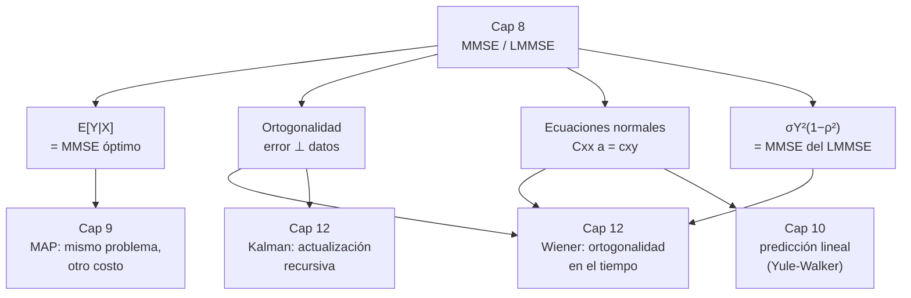

Complemento del capítulo 8 de [[PROCESAMIENTO DE SEÑALES]].

# Estimación — En Profundidad

El capítulo 8 del apunte principal presenta las tres herramientas del tema (MMSE, MMSE condicional, LMMSE) y cierra con la idea linda de la proyección ortogonal. Pero al ser un resumen, casi todas las demostraciones quedan derivadas "al libro", los ejemplos quedan planteados sin resolver, y no se toca nada de qué pasa cuando esto se aplica a datos reales. Este documento se mete en eso:

- **Las demostraciones.** Por qué $\hat y = E[Y]$, por qué la media condicional minimiza el error incluso promediado, la regla de ortogonalidad (que es la que explica *todo* lo demás), el LMMSE completo por dos caminos, y las ecuaciones normales.
- **Las cuentas.** Cinco ejemplos resueltos de punta a punta con las integrales escritas y los números verificados: MMSE desde una densidad conjunta, MMSE contra LMMSE comparados, el caso gaussiano, un sistema de dos mediciones a mano, y qué pasa cuando dos mediciones son casi la misma.
- **La práctica.** Cómo se arma el estimador cuando no conocés $\mu$, $\sigma$ y $\rho$ sino que los estimás de datos, por qué no se invierte la matriz a mano, el número de condición y la regularización, y cómo actualizar el estimador cuando llega un dato nuevo.

###### **Cómo leer esto**
No hace falta ir en orden. Según lo que estés buscando:

| Si querés… | Andá a |
|---|---|
| ver por qué $\hat y = E[Y]$ minimiza el error | Parte 1.1 |
| entender por qué $E[Y\mid X]$ sirve para cada $x$ **y** en promedio | Parte 1.2 |
| la regla de ortogonalidad, que organiza todo el capítulo | Parte 1.3 |
| la derivación completa del LMMSE (cálculo y geometría) | Parte 1.4 y 1.5 |
| las ecuaciones normales para varias mediciones, demostradas | Parte 1.6 |
| ver cuentas hechas con números | Parte 2 |
| entender por qué para gaussianas LMMSE = MMSE | Parte 2.3 |
| ver qué pasa con mediciones redundantes | Parte 2.5 |
| armar el estimador a partir de datos, no de la distribución | Parte 3 |
| conectar el capítulo con el 7, el 9, el 10 y el 12 | Parte 4 |
| practicar | Parte 5 |

---

# Parte 1 — Las demostraciones

## 1.1 El estimador MMSE sin datos: por qué $\hat y = E[Y]$

Queremos el número $\hat y$ que minimiza
$$J(\hat y) = E\big[(Y - \hat y)^2\big]$$
sin observar nada más que la distribución de $Y$.

###### **El camino elegante: completar el cuadrado**

Sumamos y restamos $\mu_Y$ adentro del cuadrado:
$$(Y - \hat y)^2 = \big[(Y - \mu_Y) + (\mu_Y - \hat y)\big]^2 = (Y - \mu_Y)^2 + 2(Y - \mu_Y)(\mu_Y - \hat y) + (\mu_Y - \hat y)^2$$
Tomamos esperanza término a término. El del medio se anula, porque $(\mu_Y - \hat y)$ es una constante y $E[Y - \mu_Y] = 0$:
$$J(\hat y) = \underbrace{E[(Y - \mu_Y)^2]}_{\sigma_Y^2} + 2(\mu_Y - \hat y)\underbrace{E[Y - \mu_Y]}_{0} + (\mu_Y - \hat y)^2 = \sigma_Y^2 + (\mu_Y - \hat y)^2$$

$$\boxed{\ J(\hat y) = \sigma_Y^2 + (\mu_Y - \hat y)^2\ }$$

Y acá está todo: $J$ es una **parábola en $\hat y$** con el vértice en $\hat y = \mu_Y$. El primer término no depende de $\hat y$ — es un piso que no podés bajar. El segundo es un cuadrado, que es $\geq 0$ y vale $0$ solo cuando $\hat y = \mu_Y$. Entonces:
$$\hat y_{\text{MMSE}} = \mu_Y = E[Y], \qquad \text{MMSE} = J(\mu_Y) = \sigma_Y^2$$

![[c8p-completar-cuadrado.svg]]

###### **El mismo resultado por cálculo**

Derivamos e igualamos a cero (se puede meter la derivada adentro de la esperanza porque el integrando es suave):
$$\frac{dJ}{d\hat y} = E\big[-2(Y - \hat y)\big] = -2\big(E[Y] - \hat y\big) = 0 \ \implies\ \hat y = E[Y]$$
Y es un mínimo, no un máximo, porque $\dfrac{d^2J}{d\hat y^2} = 2 > 0$. La segunda derivada positiva dice que $J$ es **convexa**, así que ese punto crítico es el mínimo global — no hay que preocuparse por otros.

>**Por qué el cuadrado da la media, y no otra cosa.** El $-2(Y-\hat y)$ que aparece al derivar es lo que hace que la condición sea "el error medio es cero", o sea $E[Y-\hat y]=0$. Si el costo fuera $|Y - \hat y|$ en vez de $(Y-\hat y)^2$, la derivada sería $-\operatorname{sign}(Y - \hat y)$, y la condición pasaría a ser "hay tanta probabilidad de $Y$ por encima de $\hat y$ como por debajo" — o sea $\hat y$ sería la **mediana**. La forma del costo elige qué resumen de la distribución te queda (ver Parte 4.1).

## 1.2 El caso condicional: por qué $\hat y(x) = E[Y \mid X = x]$, y la propiedad del doble promedio

Ahora observamos $X = x$ y queremos la función $g(x)$ que minimiza el error.

###### **Para cada $x$ fijo**

Con $X = x$ fijo, el problema es **idéntico al de 1.1**, pero usando la distribución **condicional** de $Y$ dado $X = x$ en vez de la marginal. Repetimos el completar-cuadrado, condicionando todo en $X = x$:
$$E\big[(Y - g(x))^2 \,\big|\, X = x\big] = \operatorname{Var}(Y \mid X = x) + \big(E[Y \mid X = x] - g(x)\big)^2$$
Mismo argumento que antes: el primer término es un piso, el segundo es un cuadrado que se anula cuando
$$g(x) = E[Y \mid X = x]$$
y ahí el error condicional vale $\operatorname{Var}(Y \mid X = x)$.

###### **Y ahora la parte que el apunte llama "no trivial"**

Lo anterior dice que $E[Y\mid X=x]$ es óptimo **para cada $x$ por separado**. Falta ver que también minimiza el error **promediado sobre todos los $x$**, que es
$$E_{X,Y}\big[(Y - g(X))^2\big]$$
Esto sale de la **ley de la esperanza iterada** (la "propiedad de la torre" del capítulo 7). Escribimos el error total como un promedio de errores condicionales:
$$E_{X,Y}\big[(Y - g(X))^2\big] = E_X\Big[\ \underbrace{E_{Y\mid X}\big[(Y - g(X))^2 \,\big|\, X\big]}_{h(X)}\ \Big]$$
El de adentro, $h(X)$, es exactamente la cantidad que minimizamos recién: para cada valor de $X$, se hace lo más chica posible eligiendo $g(x) = E[Y \mid X = x]$. Como estamos **promediando cosas no negativas**, y hacemos cada una lo más chica posible, el promedio también queda lo más chico posible. No hay ninguna forma de que "empeorar un $x$ para mejorar otro" ayude, porque los términos no interactúan.

$$\boxed{\ \hat Y_{\text{MMSE}} = E[Y \mid X], \qquad \text{MMSE} = E_X\big[\operatorname{Var}(Y \mid X)\big]\ }$$

>Ese $E_X[\operatorname{Var}(Y\mid X)]$ es el primer término de la **ley de la varianza total** del capítulo 7: $\operatorname{Var}(Y) = E[\operatorname{Var}(Y\mid X)] + \operatorname{Var}(E[Y\mid X])$. O sea: el MMSE es la varianza de $Y$ **menos** lo que la medición logró "explicar", que es $\operatorname{Var}(E[Y\mid X])$. Si $X$ no dice nada de $Y$, ese segundo término es $0$ y el MMSE es $\sigma_Y^2$ entero. Si $X$ determina $Y$, el MMSE es $0$.

## 1.3 La regla de ortogonalidad (la que explica todo el resto)

Hay una forma de caracterizar el estimador MMSE que no habla de derivadas ni de mínimos, y que es la que después hace funcionar el LMMSE, el filtro de Wiener y Kalman. Es esta:

> **El error del estimador MMSE es ortogonal a toda función de los datos.** Es decir, para cualquier función $q(\cdot)$:
> $$E\big[\big(Y - E[Y\mid X]\big)\, q(X)\big] = 0$$

**Demostración.** Llamemos $e = Y - E[Y\mid X]$ al error. Condicionamos en $X$ y sacamos $q(X)$ afuera (dado $X$, es constante):
$$E\big[e\, q(X)\big] = E_X\Big[\ q(X)\, \underbrace{E\big[\,Y - E[Y\mid X] \,\big|\, X\big]}_{=\,E[Y\mid X] - E[Y\mid X]\,=\,0}\ \Big] = E_X[\,q(X)\cdot 0\,] = 0 \qquad\blacksquare$$

Es corto, pero es profundo. Dice que **el error no tiene ninguna estructura que dependa de $X$ que se pueda seguir aprovechando** — si la tuviera, existiría un $q(X)$ correlacionado con el error, y podrías restárselo para mejorar. Que el error sea ortogonal a *todo* $q(X)$ es lo mismo que decir "ya exprimiste toda la información de $X$".

**Y acá está la clave del LMMSE.** El estimador lineal $\hat Y_\ell = aX + b$ no puede usar *cualquier* función de $X$: solo puede usar combinaciones de $1$ y $X$. Entonces la regla de ortogonalidad, aplicada a ese caso restringido, pide menos: solo que el error sea ortogonal a $1$ y a $X$. Eso da **dos ecuaciones** (una por cada "dirección" permitida), que son justo las que resuelven $a$ y $b$. El LMMSE es la regla de ortogonalidad proyectada sobre el subespacio de las funciones afines.

## 1.4 El LMMSE completo, por dos caminos

Queremos $a, b$ que minimicen $E\big[(Y - aX - b)^2\big]$.

###### **Camino 1 — cálculo**

Dos derivadas parciales igualadas a cero:
$$\frac{\partial}{\partial b}: \quad E\big[-2(Y - aX - b)\big] = 0 \ \implies\ \mu_Y - a\mu_X - b = 0 \ \implies\ b = \mu_Y - a\mu_X$$
$$\frac{\partial}{\partial a}: \quad E\big[-2X(Y - aX - b)\big] = 0 \ \implies\ E[XY] - a\,E[X^2] - b\,\mu_X = 0$$
Metemos $b = \mu_Y - a\mu_X$ en la segunda:
$$E[XY] - a\,E[X^2] - (\mu_Y - a\mu_X)\mu_X = 0$$
$$\big(E[XY] - \mu_X\mu_Y\big) - a\big(E[X^2] - \mu_X^2\big) = 0$$
$$\sigma_{XY} - a\,\sigma_X^2 = 0 \ \implies\ a = \frac{\sigma_{XY}}{\sigma_X^2} = \frac{\rho\,\sigma_X\sigma_Y}{\sigma_X^2} = \rho\,\frac{\sigma_Y}{\sigma_X}$$

$$\boxed{\ \hat Y_\ell = \mu_Y + \rho\,\frac{\sigma_Y}{\sigma_X}\,(X - \mu_X)\ }$$

>**Ojo con el apunte principal:** ahí la fórmula aparece con $(Y - \mu_X)$ al final, que es un error de tipeo — tiene que ser $(X - \mu_X)$, como sale acá. La lógica es "arranco de $\mu_Y$, y corrijo según cuánto se apartó **la medición** $X$ de su media".

###### **Camino 2 — ortogonalidad (más corto)**

Por 1.3, pedimos que el error $e = Y - aX - b$ sea ortogonal a $1$ y a $X$:
$$E[e\cdot 1] = 0 \ \implies\ \mu_Y = a\mu_X + b \quad\text{(insesgado)}$$
$$E[e\cdot X] = 0 \ \implies\ E[XY] = a\,E[X^2] + b\,\mu_X$$
Son las mismas dos ecuaciones de arriba, sin haber derivado nada. Restando $\mu_X$ veces la primera de la segunda se llega directo a $\sigma_{XY} = a\sigma_X^2$.

###### **El MMSE del LMMSE**

Con $\hat Y_\ell$ ya conocido, el error es $e = (Y - \mu_Y) - a(X - \mu_X)$. Como es de media cero y ortogonal a $X$ (y por lo tanto a $\hat Y_\ell$):
$$\text{MMSE} = E[e^2] = E[e\,(Y - \mu_Y)] = E\big[\big((Y-\mu_Y) - a(X-\mu_X)\big)(Y - \mu_Y)\big] = \sigma_Y^2 - a\,\sigma_{XY}$$
Metiendo $a = \rho\sigma_Y/\sigma_X$ y $\sigma_{XY} = \rho\sigma_X\sigma_Y$:
$$\text{MMSE} = \sigma_Y^2 - \rho\,\frac{\sigma_Y}{\sigma_X}\cdot\rho\,\sigma_X\sigma_Y = \sigma_Y^2 - \rho^2\sigma_Y^2 = \boxed{\ \sigma_Y^2\,(1 - \rho^2)\ }$$

## 1.5 La interpretación vectorial, completa

El capítulo 7 dejó montado el espacio: las variables aleatorias (centradas) son vectores, con
$$\langle \tilde X, \tilde Y\rangle = E[\tilde X \tilde Y] = \sigma_{XY}, \qquad \|\tilde X\|^2 = \sigma_X^2, \qquad \cos\theta = \frac{\sigma_{XY}}{\sigma_X\sigma_Y} = \rho$$
donde $\tilde X = X - \mu_X$, $\tilde Y = Y - \mu_Y$.

El LMMSE (una vez restadas las medias) es: **encontrar el múltiplo $a\tilde X$ que esté más cerca de $\tilde Y$**, o sea minimizar $\|\tilde Y - a\tilde X\|^2$. Ese es, palabra por palabra, el problema de **proyección ortogonal** de un vector sobre la recta generada por otro.

![[c8p-proyeccion.svg]]

La fórmula de proyección del álgebra lineal es:
$$\text{proy}_{\tilde X}(\tilde Y) = \frac{\langle \tilde Y, \tilde X\rangle}{\langle \tilde X, \tilde X\rangle}\,\tilde X = \frac{\sigma_{XY}}{\sigma_X^2}\,\tilde X$$
o sea $a = \sigma_{XY}/\sigma_X^2 = \rho\,\sigma_Y/\sigma_X$ — **la misma que salió por cálculo y por ortogonalidad**, ahora sin ninguna cuenta, solo aplicando la fórmula de proyección.

Y el MMSE sale por **Pitágoras**. El error $\tilde Y - a\tilde X$ es el cateto perpendicular; $\tilde Y$ es la hipotenusa. Entonces:
$$\|\tilde Y - a\tilde X\|^2 = \|\tilde Y\|^2 \sin^2\theta = \|\tilde Y\|^2(1 - \cos^2\theta) = \sigma_Y^2(1 - \rho^2)$$
El $\sigma_Y^2(1-\rho^2)$ no es una fórmula que haya que recordar: es el cuadrado del cateto que le falta a la proyección para llegar a $\tilde Y$. Cuando $\rho = \pm 1$ (vectores alineados), el error es cero. Cuando $\rho = 0$ (perpendiculares), la proyección es el vector nulo y el error es $\sigma_Y^2$ entero — el LMMSE no puede hacer nada.

## 1.6 Ecuaciones normales para varias mediciones

Ahora $\hat Y_\ell = a_0 + \sum_{j=1}^{L} a_j X_j$, con $L$ mediciones.

Por la regla de ortogonalidad, el error tiene que ser ortogonal a $1$ y a cada $X_i$:
$$E[e] = 0 \ \implies\ a_0 = \mu_Y - \sum_j a_j \mu_{X_j}$$
$$E\big[e\,(X_i - \mu_{X_i})\big] = 0, \quad i = 1, \dots, L$$
Desarrollando la segunda con $e = (Y - \mu_Y) - \sum_j a_j(X_j - \mu_{X_j})$:
$$E\big[(Y - \mu_Y)(X_i - \mu_{X_i})\big] = \sum_j a_j\, E\big[(X_j - \mu_{X_j})(X_i - \mu_{X_i})\big]$$
$$\sigma_{X_i Y} = \sum_{j=1}^{L} \sigma_{X_i X_j}\, a_j, \qquad i = 1, \dots, L$$
que en forma matricial es
$$\boxed{\ C_{XX}\,\mathbf a = \mathbf c_{XY} \quad\Longrightarrow\quad \mathbf a = C_{XX}^{-1}\,\mathbf c_{XY}\ }$$
con $C_{XX}$ la matriz de covarianza de las mediciones ($[C_{XX}]_{ij} = \sigma_{X_i X_j}$) y $\mathbf c_{XY}$ el vector de covarianzas cruzadas ($[\mathbf c_{XY}]_i = \sigma_{X_i Y}$).

El MMSE sale igual que en 1.4, usando que el error es ortogonal a todas las mediciones y por lo tanto a $\hat Y_\ell$:
$$\text{MMSE} = E[e^2] = E[e\,(Y - \mu_Y)] = \sigma_Y^2 - \sum_j a_j\,\sigma_{X_j Y} = \boxed{\ \sigma_Y^2 - \mathbf c_{XY}^{\top}\,C_{XX}^{-1}\,\mathbf c_{XY}\ }$$

>**Por qué $C_{XX}$ captura toda la geometría.** Si dos mediciones están muy correlacionadas entre sí, los elementos fuera de la diagonal de $C_{XX}$ son grandes, y al invertir la matriz el sistema "se da cuenta" de que las dos aportan lo mismo y reparte los pesos en consecuencia. En el extremo, si $X_2$ es una copia exacta de $X_1$, la matriz es singular y no tiene inversa — lo vemos en detalle en la Parte 2.5.

---

# Parte 2 — Ejemplos resueltos con números

## 2.1 MMSE desde una densidad conjunta, paso a paso

Sea $(X, Y)$ **uniforme** sobre la región con forma de carpa
$$0 \leq y \leq h(x), \qquad h(x) = \begin{cases} x & 0 \leq x \leq 1 \\ 2 - x & 1 \leq x \leq 2 \end{cases}$$
El área de esa región es $\int_0^1 x\,dx + \int_1^2 (2-x)\,dx = \tfrac12 + \tfrac12 = 1$, así que $f_{X,Y}(x,y) = 1$ adentro y $0$ afuera.

**Paso 1 — la marginal de $X$.** Integrando en $y$:
$$f_X(x) = \int_0^{h(x)} 1\,dy = h(x)$$
o sea la densidad triangular en $[0,2]$ que pica en $x = 1$.

**Paso 2 — la condicional.** $f_{Y\mid X}(y\mid x) = f_{X,Y}/f_X = 1/h(x)$ para $0 \leq y \leq h(x)$: **$Y$ dado $X = x$ es uniforme en $[0, h(x)]$**.

**Paso 3 — el estimador MMSE.** Es la media de esa uniforme:
$$\hat y_{\text{MMSE}}(x) = E[Y \mid X = x] = \frac{h(x)}{2} = \begin{cases} x/2 & 0 \leq x \leq 1 \\ 1 - x/2 & 1 \leq x \leq 2 \end{cases}$$

**Paso 4 — el MMSE.** Como $Y\mid X=x$ es uniforme en $[0, h(x)]$, su varianza es $h(x)^2/12$. Promediamos sobre $X$ (con $f_X(x) = h(x)$):
$$\text{MMSE} = E\big[\operatorname{Var}(Y\mid X)\big] = \int_0^1 \frac{x^2}{12}\,x\,dx + \int_1^2 \frac{(2-x)^2}{12}\,(2-x)\,dx = \frac{1}{12}\left(\frac14 + \frac14\right) = \boxed{\ \frac{1}{24} \approx 0{,}0417\ }$$

**Comparación.** Los momentos de esta densidad son (todo por integración directa):
$$\mu_X = 1, \quad \sigma_X^2 = \tfrac16, \quad \mu_Y = \tfrac13, \quad \sigma_Y^2 = \tfrac{1}{18}, \quad E[XY] = \tfrac13 \ \implies\ \sigma_{XY} = \tfrac13 - 1\cdot\tfrac13 = 0$$

**La covarianza da cero**, así que $\rho = 0$, y el LMMSE degenera en la constante $\hat Y_\ell = \mu_Y = \tfrac13$, con error $\sigma_Y^2(1 - 0) = \tfrac{1}{18} \approx 0{,}0556$.

> **$\rho = 0$ pero $Y$ depende fuertísimo de $X$.** La covarianza es cero por la **simetría** de la carpa (todo lo que $Y$ "sube" con $X$ en la mitad izquierda lo "baja" en la derecha, y se cancela). Pero mirando la condicional se ve que $Y$ está lejísimos de ser independiente de $X$: su rango es $[0, h(x)]$, que cambia con $x$. El MMSE, que puede ser no lineal, aprovecha esa dependencia y baja el error a $\tfrac{1}{24}$ — un $25\%$ menos que el LMMSE, que al ver $\rho = 0$ se rinde. Es el mismo fenómeno del contraejemplo $X$ uniforme, $Y = X^2$ del capítulo 7: **no correlacionadas no es independientes**.

## 2.2 MMSE contra LMMSE, comparados con números

Para ver una comparación donde el LMMSE **sí** haga algo (o sea $\rho \neq 0$), tomemos $(X, Y)$ uniforme sobre el **trapecio asimétrico**
$$0 \leq y \leq \min(x, 1), \qquad 0 \leq x \leq 2$$
El área es $\int_0^1 x\,dx + \int_1^2 1\,dx = \tfrac12 + 1 = \tfrac32$, así que $f_{X,Y} = \tfrac23$ adentro.

**El estimador MMSE.** $Y$ dado $X = x$ es uniforme en $[0, \min(x,1)]$, así que
$$\hat y_{\text{MMSE}}(x) = \begin{cases} x/2 & 0 \leq x \leq 1 \\ 1/2 & 1 \leq x \leq 2 \end{cases}$$
Una rampa que después se aplana — **con un codo en $x = 1$**. No es una recta.

**Los momentos** (por integración, con $f_{X,Y} = \tfrac23$):
$$\mu_X = \tfrac{11}{9}, \quad \sigma_X^2 = \tfrac{37}{162}, \quad \mu_Y = \tfrac49, \quad \sigma_Y^2 = \tfrac{13}{162}, \quad \sigma_{XY} = \tfrac{13}{324}$$
$$\rho^2 = \frac{\sigma_{XY}^2}{\sigma_X^2\,\sigma_Y^2} = \frac{13}{148} \ \implies\ \rho = \frac{\sqrt{481}}{74} \approx 0{,}296$$

**El estimador LMMSE.** Con $a = \sigma_{XY}/\sigma_X^2$ y $b = \mu_Y - a\mu_X$:
$$a = \frac{13/324}{37/162} = \frac{13}{74}, \qquad b = \frac49 - \frac{13}{74}\cdot\frac{11}{9} = \frac{17}{74}$$
$$\hat y_\ell(x) = \frac{13}{74}\,x + \frac{17}{74} \approx 0{,}176\,x + 0{,}230$$

![[c8p-mmse-vs-lmmse.svg]]

**Los errores.**
$$\text{MMSE} = E[\operatorname{Var}(Y\mid X)] = \int_0^1 \frac{x^2}{12}\cdot\frac23 x\,dx + \int_1^2 \frac{1}{12}\cdot\frac23\,dx = \frac{5}{72} \approx 0{,}0694$$
$$\text{error LMMSE} = \sigma_Y^2(1 - \rho^2) = \frac{13}{162}\left(1 - \frac{13}{148}\right) = \frac{65}{888} \approx 0{,}0732$$

El MMSE es **estrictamente menor** — verificado también integrando $(y - \hat y)^2$ sobre la conjunta con cada estimador (da $0{,}0694$ y $0{,}0732$, exactamente). El LMMSE paga una multa por estar obligado a ser una recta: no puede seguir el codo. La diferencia es chica acá ($\rho$ es chico), pero nunca es a favor del LMMSE.

## 2.3 El caso gaussiano: LMMSE = MMSE, exacto

Sea $(X, Y)$ conjuntamente gaussiana con $\mu_X = 1$, $\mu_Y = 2$, $\sigma_X = 2$, $\sigma_Y = 3$, $\rho = \tfrac12$.

La densidad condicional de $Y$ dado $X = x$, para una gaussiana bivariada, es **también gaussiana**, con
$$E[Y \mid X = x] = \mu_Y + \rho\,\frac{\sigma_Y}{\sigma_X}\,(x - \mu_X) = 2 + \frac12\cdot\frac32\,(x - 1) = \frac34\,x + \frac54$$
$$\operatorname{Var}(Y \mid X = x) = \sigma_Y^2\,(1 - \rho^2) = 9\cdot\frac34 = \frac{27}{4} = 6{,}75 \quad \text{(no depende de $x$)}$$

Mirá las dos cosas:

1. **$E[Y\mid X = x]$ ya es una recta** — la misma recta que da la fórmula del LMMSE de 1.4. Como el MMSE sin restricciones es $E[Y\mid X = x]$, y este resulta lineal, el LMMSE (que es lo mejor entre las rectas) **coincide exactamente con el MMSE**. No pierde nada.
2. **La varianza condicional es constante** e igual a $\sigma_Y^2(1-\rho^2)$, que es el MMSE del LMMSE de 1.4. Todo cierra.

![[c8p-gaussiano-condicional.svg]]

> **Por qué esto es tan importante.** Todo el capítulo 12 (Wiener, Kalman) usa estimadores **lineales**. Que sean lineales no es una limitación cuando los procesos son gaussianos: en ese caso lo lineal ya es lo óptimo, punto. Para procesos no gaussianos, el filtro de Wiener sigue siendo "lo mejor entre lo lineal", pero podría existir un estimador no lineal mejor. La gaussiana es la que hace que "lineal" y "óptimo" sean la misma cosa.

## 2.4 Dos mediciones: el sistema $2\times 2$ a mano

Queremos estimar $Y$ (con $\sigma_Y^2 = 4$) a partir de dos mediciones $X_1$, $X_2$ con
$$\sigma_1^2 = 2, \quad \sigma_2^2 = 3, \quad \rho_{12} = \tfrac12, \quad \rho_{Y1} = 0{,}6, \quad \rho_{Y2} = 0{,}4$$
(medias cero para simplificar, así $a_0 = 0$).

**Armamos las matrices.**
$$C_{XX} = \begin{pmatrix} \sigma_1^2 & \rho_{12}\sigma_1\sigma_2 \\ \rho_{12}\sigma_1\sigma_2 & \sigma_2^2 \end{pmatrix} = \begin{pmatrix} 2 & \tfrac{\sqrt6}{2} \\[2pt] \tfrac{\sqrt6}{2} & 3 \end{pmatrix}, \qquad \mathbf c_{XY} = \begin{pmatrix} \rho_{Y1}\sigma_Y\sigma_1 \\ \rho_{Y2}\sigma_Y\sigma_2 \end{pmatrix} = \begin{pmatrix} \tfrac{6\sqrt2}{5} \\[2pt] \tfrac{4\sqrt3}{5} \end{pmatrix}$$

**Invertimos** ($2\times2$: $\det C_{XX} = 2\cdot3 - \tfrac{6}{4} = \tfrac92$):
$$C_{XX}^{-1} = \frac{1}{9/2}\begin{pmatrix} 3 & -\tfrac{\sqrt6}{2} \\[2pt] -\tfrac{\sqrt6}{2} & 2 \end{pmatrix} = \frac{2}{9}\begin{pmatrix} 3 & -\tfrac{\sqrt6}{2} \\[2pt] -\tfrac{\sqrt6}{2} & 2 \end{pmatrix}$$

**Resolvemos** $\mathbf a = C_{XX}^{-1}\mathbf c_{XY}$:
$$\mathbf a = \begin{pmatrix} 8\sqrt2/15 \\[2pt] 4\sqrt3/45 \end{pmatrix} \approx \begin{pmatrix} 0{,}754 \\ 0{,}154 \end{pmatrix}$$

**El MMSE:**
$$\text{MMSE} = \sigma_Y^2 - \mathbf c_{XY}^{\top}C_{XX}^{-1}\mathbf c_{XY} = \frac{188}{75} \approx 2{,}507$$

**Chequeo de sensatez.** Usando **solo $X_1$**, el error sería $\sigma_Y^2(1 - \rho_{Y1}^2) = 4(1 - 0{,}36) = 2{,}56$. Usando **solo $X_2$**, $4(1 - 0{,}16) = 3{,}36$. Con las dos juntas: $2{,}507$ — menos que el mejor individual, como tiene que ser. La segunda medición, aunque más floja y parcialmente redundante con la primera, aporta un poquito.

## 2.5 Mediciones redundantes: mal condicionamiento

Seguimos con el mismo escenario de 2.4, pero ahora **variamos $\rho_{12}$** (la correlación entre las dos mediciones) para ver qué pasa cuando se parecen cada vez más.

###### **Primero: no toda terna de correlaciones es posible**

$\rho_{Y1} = 0{,}6$, $\rho_{Y2} = 0{,}4$ y $\rho_{12}$ no son tres números libres. La matriz de correlación de $(Y, X_1, X_2)$
$$R = \begin{pmatrix} 1 & 0{,}6 & 0{,}4 \\ 0{,}6 & 1 & \rho_{12} \\ 0{,}4 & \rho_{12} & 1 \end{pmatrix}$$
tiene que ser **semidefinida positiva** — es una matriz de covarianza, y ninguna covarianza de verdad puede tener autovalores negativos. Calculando el determinante:
$$\det R = -\rho_{12}^2 + \frac{12}{25}\rho_{12} + \frac{12}{25}$$
que se anula en $\rho_{12} = \dfrac{6}{25} \pm \dfrac{4\sqrt{21}}{25}$, o sea en $\rho_{12} \approx -0{,}493$ y $\rho_{12} \approx 0{,}973$. Fuera de ese intervalo, **$R$ deja de ser PSD**: esas correlaciones no las puede producir ninguna distribución conjunta real.

$$\boxed{\ \rho_{12}^{\max} \approx 0{,}973\ }$$

###### **Qué pasa al acercarse a ese tope**

Resolviendo el sistema $2\times2$ en función de $\rho_{12}$:
$$\mathbf a(\rho_{12}) = \begin{pmatrix} \dfrac{\sqrt2\,(2\rho_{12} - 3)}{5(\rho_{12}^2 - 1)} \\[8pt] \dfrac{2\sqrt3\,(3\rho_{12} - 2)}{15(\rho_{12}^2 - 1)} \end{pmatrix}, \qquad \text{MMSE}(\rho_{12}) = \frac{4\,(25\rho_{12}^2 - 12\rho_{12} - 12)}{25\,(\rho_{12}^2 - 1)}$$

| $\rho_{12}$ | $\det C_{XX}$ | $\kappa(C_{XX})$ | $a_1$ | $a_2$ | MMSE |
|---|---|---|---|---|---|
| $0$ | $6{,}00$ | $1{,}5$ | $0{,}849$ | $0{,}462$ | $1{,}920$ |
| $0{,}5$ | $4{,}50$ | $3{,}25$ | $0{,}754$ | $0{,}154$ | $2{,}507$ |
| $0{,}8$ | $2{,}16$ | $9{,}47$ | $1{,}100$ | $-0{,}257$ | $2{,}489$ |
| $0{,}9$ | $1{,}14$ | $19{,}9$ | $1{,}786$ | $-0{,}851$ | $2{,}147$ |
| $0{,}95$ | $0{,}585$ | $40{,}7$ | $3{,}191$ | $-2{,}013$ | $1{,}374$ |
| $0{,}97$ | $0{,}355$ | $68{,}5$ | $5{,}073$ | $-3{,}556$ | $0{,}318$ |
| $\to 0{,}973$ | $\to 0$ | $\to \infty$ | $\to +\infty$ | $\to -\infty$ | $\to 0$ |

![[c8p-mal-condicionamiento.svg]]

Lo que se ve:

1. **Los coeficientes individuales explotan**, con signos opuestos. A $\rho_{12} = 0{,}97$ ya tenés $a_1 \approx 5$ y $a_2 \approx -3{,}5$: el estimador arma $\hat Y \approx 5\,X_1 - 3{,}5\,X_2$, restando dos números casi iguales para quedarse con una diferencia diminuta. Cualquier ruidito en $X_1$ o $X_2$ se amplifica por $5$.
2. **El número de condición $\kappa(C_{XX})$ tiende a infinito.** Es el cociente entre el autovalor más grande y el más chico de $C_{XX}$, y mide cuánto amplifica errores la inversión. Con $\kappa = 68$, un error relativo del $1\%$ en los datos puede volverse un $68\%$ en $\mathbf a$.
3. **Pero el MMSE baja suave hasta cero.** Justo en $\rho_{12}^{\max}$, el determinante de $R$ es cero, lo que significa que hay una **relación lineal exacta** entre $Y$, $X_1$, $X_2$: $Y$ se puede recuperar **sin error** como combinación lineal de las dos mediciones. El MMSE llega a $0$ exactamente. Los $a_1, a_2$ quedan indeterminados (hay infinitas combinaciones que dan la misma predicción), pero la predicción en sí y el error están perfectamente definidos.

###### **El test de sanidad**

Si en un problema calculás $\text{MMSE} = \sigma_Y^2 - \mathbf c_{XY}^{\top}C_{XX}^{-1}\mathbf c_{XY}$ y te da **negativo**, no es que te equivocaste en la cuenta: es que las correlaciones que asumiste **no forman una matriz PSD**, o sea que ninguna distribución real las produce. Para $\rho_{12} = 0{,}99$ (más allá del tope), la fórmula escupe $\text{MMSE} \approx -5$, que es imposible. Un MMSE negativo es la señal de que el modelo probabilístico es inconsistente.

---

# Parte 3 — Lo que pasa cuando lo hacés de verdad

Todo el capítulo asume que conocés $\mu_X$, $\mu_Y$, $\sigma_X$, $\sigma_Y$, $\rho$ (o la matriz $C_{XX}$ y el vector $\mathbf c_{XY}$). En la práctica **nunca** los conocés: tenés datos.

## 3.1 De la teoría a los datos: el estimador "plug-in"

Con $n$ pares de datos $(x^{(1)}, y^{(1)}), \dots, (x^{(n)}, y^{(n)})$, reemplazás cada momento poblacional por su versión muestral:
$$\hat\mu_X = \frac1n\sum_k x^{(k)}, \qquad \hat\sigma_X^2 = \frac{1}{n-1}\sum_k (x^{(k)} - \hat\mu_X)^2, \qquad \hat\sigma_{XY} = \frac{1}{n-1}\sum_k (x^{(k)} - \hat\mu_X)(y^{(k)} - \hat\mu_Y)$$
y armás el estimador con esos valores:
$$\hat Y_\ell = \hat\mu_Y + \frac{\hat\sigma_{XY}}{\hat\sigma_X^2}\,(X - \hat\mu_X)$$

Esto se llama estimador **plug-in** (enchufás las estimaciones donde iban los parámetros). Y acá aparece la ironía: el capítulo 8 arranca aclarando que "la estimación de Probabilidad y Estadística" (aproximar parámetros poblacionales desde una muestra) es *otra cosa* que la estimación de este curso. Pero en cuanto querés **usar** el LMMSE con datos reales, tenés que hacer justo eso — estadística — para conseguir los momentos. Las dos "estimaciones" terminan siendo dos capas del mismo problema. (La división por $n-1$ y la ley de los grandes números que garantiza que esto converja están en la Parte 3.2 y 3.3 del complemento del capítulo 7.)

## 3.2 Resolver el sistema sin invertir la matriz

Para $L$ mediciones tenés $C_{XX}\,\mathbf a = \mathbf c_{XY}$. La tentación es escribir $\mathbf a = C_{XX}^{-1}\mathbf c_{XY}$ y calcular la inversa. **No se hace así**, por dos razones: calcular la inversa completa es más caro y numéricamente peor que resolver el sistema directamente.

Como $C_{XX}$ es **simétrica y semidefinida positiva** (es una matriz de covarianza), el método estándar es la **descomposición de Cholesky**: se escribe $C_{XX} = LL^{\top}$ con $L$ triangular inferior, y después se resuelve en dos pasos fáciles (sustitución hacia adelante y hacia atrás):
$$L\,\mathbf z = \mathbf c_{XY} \quad\text{(hacia adelante)}, \qquad L^{\top}\mathbf a = \mathbf z \quad\text{(hacia atrás)}$$
Es la mitad de operaciones que una factorización general, y aprovecha la simetría y la positividad. Es exactamente lo que hace `numpy.linalg.solve` o `scipy.linalg.cho_solve` por dentro cuando le pasás una matriz de covarianza.

## 3.3 El número de condición y la regularización

De la Parte 2.5: cuando las mediciones son casi redundantes, $C_{XX}$ queda casi singular, $\kappa(C_{XX})$ se dispara, y $\mathbf a$ se vuelve inestable. La solución práctica es **regularizar**: sumarle a $C_{XX}$ un pelín en la diagonal antes de resolver,
$$(C_{XX} + \varepsilon I)\,\mathbf a = \mathbf c_{XY}$$
con $\varepsilon$ chico y positivo. Eso levanta el autovalor más chico, baja el número de condición, y estabiliza $\mathbf a$ a cambio de un sesgo controlado. En el mundo de mínimos cuadrados esto se llama **regularización de Tikhonov** o *ridge*; en filtrado adaptativo, **diagonal loading**.

> **Y no es un truco arbitrario.** En el filtro de Wiener y en Kalman, $C_{XX}$ es la covarianza de la **medición**, que siempre incluye un término de **ruido** $\sigma_v^2 I$. Ese ruido de medición hace *exactamente* el papel del $\varepsilon I$: garantiza que $C_{XX}$ nunca sea singular, aunque la señal subyacente sea perfectamente predecible. El ruido, que parece un estorbo, es lo que mantiene el problema bien planteado.

## 3.4 Actualizar cuando llega una medición nueva

Si ya resolviste el sistema con $L$ mediciones y llega la número $L+1$, **no hace falta rehacer todo**. Existen fórmulas de actualización que toman el estimador viejo, el dato nuevo, y producen el estimador nuevo con una cuenta de orden $L$ en vez de $L^3$. La idea es:
$$\hat Y_{\text{nuevo}} = \hat Y_{\text{viejo}} + K\,\big(X_{L+1} - \hat X_{L+1\mid \text{viejo}}\big)$$
o sea: **la estimación vieja, más una corrección proporcional a la sorpresa** (la diferencia entre lo que medimos y lo que el estimador viejo predecía para esa medición). El factor $K$ es la "ganancia".

Esto es exactamente la forma del **filtro de Kalman** (capítulo 12), y de los **mínimos cuadrados recursivos** (RLS) del filtrado adaptativo. El capítulo 8 es la versión de una sola pasada; Kalman es la versión que corre en el tiempo, actualizándose muestra a muestra.

## 3.5 Receta práctica

1. **¿Necesitás MMSE o LMMSE?** Si conocés la conjunta y podés calcular $E[Y\mid X]$, y $(X,Y)$ **no** es gaussiana, el MMSE puede valer bastante la pena (Parte 2.2). Si solo tenés momentos de segundo orden, o si es gaussiana, el LMMSE es lo que hay y no perdés nada.
2. **Restá las medias primero.** Todo el álgebra se simplifica trabajando con variables centradas; el $a_0$ se recupera al final con $a_0 = \mu_Y - \sum a_j\mu_{X_j}$.
3. **No inviertas la matriz.** Resolvé $C_{XX}\mathbf a = \mathbf c_{XY}$ con Cholesky (`solve`, no `inv`).
4. **Mirá el número de condición.** Si $\kappa(C_{XX})$ es grande (digamos $> 10^3$), tenés mediciones casi redundantes: regularizá con $\varepsilon I$ o sacá alguna medición.
5. **Chequeá el MMSE.** Si $\sigma_Y^2 - \mathbf c_{XY}^{\top}C_{XX}^{-1}\mathbf c_{XY}$ te da negativo, tus momentos son inconsistentes (matriz no PSD).
6. **Con datos:** estimá los momentos con las fórmulas muestrales (dividiendo por $n-1$), y tené presente que con $n$ chico esas estimaciones son ruidosas y arrastran ruido al estimador final.

---

# Parte 4 — Intuición y conexiones

## 4.1 Por qué el error cuadrático (y qué pasa con otras funciones de costo)

$\hat y = E[Y]$ **no es "la mejor estimación" en abstracto** — es la mejor **bajo costo cuadrático**. Cambiá el costo y cambia el punto que sale:

| función de costo | estimador óptimo | qué es de la distribución |
|---|---|---|
| $(\hat y - Y)^2$ | $E[Y]$ | la **media** |
| $\lvert \hat y - Y\rvert$ | mediana de $Y$ | el **valor central** (50/50) |
| $\mathbb 1[\hat y \neq Y]$ (costo 0–1) | moda de $Y$ | el **pico** de la densidad |

![[c8p-costos.svg]]

La derivación de la mediana sale igual que la de 1.1 pero con la derivada de $|\cdot|$: la condición de óptimo es $P(Y < \hat y) = P(Y > \hat y)$, que define la mediana. La de la moda (costo 0–1) es el **MAP** — *maximum a posteriori* — que es la regla central del **capítulo 9**. O sea: el MMSE de este capítulo y el MAP del que viene son **el mismo problema con distinto costo**. El capítulo 9 lo dice al revés, presentando la estimación como un caso de decisión de riesgo mínimo con una función de costo que mide "distancia" entre hipótesis.

## 4.2 MMSE, LMMSE y el rol de la gaussiana

Resumiendo lo de 2.3 como principio:

- **En general:** $\text{MMSE} \leq \text{error del LMMSE}$. El LMMSE es lo mejor *entre lo lineal*; puede haber un estimador no lineal que gane.
- **Si $(X, Y)$ es conjuntamente gaussiana:** $E[Y\mid X]$ ya es lineal, así que **LMMSE = MMSE**. Lo lineal es óptimo sin asteriscos.

Por eso los capítulos 12 y 13 pueden trabajar solo con estimadores y filtros lineales sin disculparse: cuando el ruido es gaussiano (que es la hipótesis de trabajo), no se están perdiendo nada. Cuando no lo es, se conforman con "óptimo entre lo lineal", que es lo mejor que se puede pedir usando solo momentos de segundo orden.

## 4.3 El estimador como variable aleatoria, revisitado

El apunte marca la diferencia entre $E[Y\mid X = 3]$ (un número) y $E[Y\mid X = x]$ pensado como función de $x$ todavía sin evaluar. Vale la pena ser preciso:

- $\hat y(x) = E[Y\mid X = x]$ es una **función** ordinaria de $x$. Evaluada en un $x$ concreto, da un número.
- $\hat Y = \hat y(X) = E[Y\mid X]$ es esa misma función **compuesta con la variable aleatoria $X$**, así que es **una variable aleatoria**. Tiene su propia distribución, su media ($E[\hat Y] = \mu_Y$, es insesgado), su varianza ($\operatorname{Var}(\hat Y) = \operatorname{Var}(E[Y\mid X])$, que es la parte de $\sigma_Y^2$ que la medición "explica").

Esta distinción no es pedante: es lo que permite escribir $E_X\big[\operatorname{Var}(Y\mid X)\big]$ en 1.2 (promediar sobre $X$ el error condicional) y la ley de la varianza total. Si $\hat Y$ no fuera una variable aleatoria, no podrías tomarle esperanza ni varianza.

## 4.4 De la variable aislada al proceso: el puente a los capítulos 10 y 12

Las ecuaciones normales de 1.6 son **literalmente** las del filtro de Wiener FIR del capítulo 12 y las de la predicción lineal del capítulo 10. La única diferencia es qué son las mediciones:

| capítulo 8 | capítulo 10 / 12 |
|---|---|
| $X_1, \dots, X_L$ mediciones cualesquiera | $X_j = x[n - j]$: muestras pasadas de un proceso |
| $\sigma_{X_i X_j}$ | $C_{xx}[i - j]$: autocovarianza del proceso |
| $\sigma_{X_i Y}$ | $C_{xy}[\cdot]$: covarianza cruzada con lo que se estima |
| $C_{XX}\,\mathbf a = \mathbf c_{XY}$ | ecuaciones de Yule-Walker / Wiener-Hopf |

Cuando el proceso es WSS, la matriz $C_{XX}$ tiene estructura de **Toeplitz** (constante en las diagonales), porque $\sigma_{X_i X_j}$ solo depende de $i - j$. Esa estructura extra permite resolver el sistema mucho más rápido (algoritmo de Levinson-Durbin), y es lo que hace que el filtro de Wiener sea práctico. Pero conceptualmente **es el mismo LMMSE de este capítulo**, con las mediciones siendo el pasado de una señal.

## 4.5 Hacia dónde va todo esto

- **$E[Y\mid X]$ como estimador óptimo** reaparece en el capítulo 9 como el MAP, con costo 0–1 en vez de cuadrático.
- **La regla de ortogonalidad** es la herramienta con la que se deriva el filtro de Wiener (el error tiene que ser ortogonal a todas las muestras usadas).
- **Las ecuaciones normales** son las de Wiener-Hopf y las de Yule-Walker, con las mediciones siendo muestras de un proceso.
- **La forma recursiva de 3.4** es el filtro de Kalman.

## 4.6 Para llevar

**Definiciones y fórmulas**

| | fórmula |
|---|---|
| MMSE sin datos | $\hat y = E[Y]$, error $= \sigma_Y^2$ |
| MMSE con datos | $\hat Y = E[Y\mid X]$, error $= E[\operatorname{Var}(Y\mid X)]$ |
| LMMSE (1 medición) | $\hat Y_\ell = \mu_Y + \rho\tfrac{\sigma_Y}{\sigma_X}(X - \mu_X)$, error $= \sigma_Y^2(1 - \rho^2)$ |
| LMMSE ($L$ mediciones) | $\mathbf a = C_{XX}^{-1}\mathbf c_{XY}$, error $= \sigma_Y^2 - \mathbf c_{XY}^{\top}C_{XX}^{-1}\mathbf c_{XY}$ |

**Hechos que se usan todo el tiempo**

| hecho | dónde está |
|---|---|
| El error MMSE es ortogonal a **toda** función de $X$ | 1.3 |
| El LMMSE es esa misma ortogonalidad, pero solo contra $1$ y $X$ | 1.3, 1.4 |
| El LMMSE es la proyección ortogonal, y su error sale por Pitágoras | 1.5 |
| MMSE $\leq$ error del LMMSE, siempre | 2.2 |
| Para $(X,Y)$ gaussiana: LMMSE $=$ MMSE exacto | 2.3 |
| Mediciones redundantes $\Rightarrow$ $C_{XX}$ mal condicionada $\Rightarrow$ $\mathbf a$ inestable | 2.5 |
| MMSE $< 0$ $\Rightarrow$ los momentos no forman una matriz PSD | 2.5 |
| Con costo absoluto sale la mediana; con costo 0–1, la moda (= MAP) | 4.1 |

**Los tres estimadores, en una línea**

1. **MMSE sin datos** — el mejor número a ciegas: la media.
2. **MMSE con datos** — la mejor función de $X$: la media condicional. Puede ser no lineal.
3. **LMMSE** — la mejor recta (o hiperplano) en $X$. Solo necesita momentos de segundo orden. Óptimo sin más si todo es gaussiano.

---

# Parte 5 — Ejercicios de práctica

Originales, del mismo tipo conceptual que los del apunte pero con planteos distintos. Cada uno tiene su resolución al lado, colapsada — intentá primero.

### Ejercicio 1 — MMSE a ciegas y con una pista inútil

$Y$ tiene media $\mu_Y = 4$ y varianza $\sigma_Y^2 = 9$. $X$ es una variable independiente de $Y$.

**a)** ¿Cuál es el estimador MMSE de $Y$ sin observar nada, y su error?
**b)** ¿Cuál es el estimador MMSE de $Y$ dado que se observa $X = x$, y su error?
**c)** ¿Y el LMMSE de $Y$ en términos de $X$?

> [!success]- Solución
> **a)** Por 1.1, $\hat y = E[Y] = 4$, con error $\sigma_Y^2 = 9$.
>
> **b)** Como $X \perp Y$, la condicional de $Y$ dado $X = x$ es la misma marginal de $Y$: $f_{Y\mid X}(y\mid x) = f_Y(y)$. Entonces $E[Y \mid X = x] = E[Y] = 4$ para todo $x$, y $\operatorname{Var}(Y\mid X = x) = \sigma_Y^2 = 9$. El error promediado también es $9$.
>
> **c)** $\rho_{XY} = 0$ (independientes $\Rightarrow$ covarianza cero, por 1.5). El LMMSE es $\hat Y_\ell = \mu_Y + 0 = 4$, con error $\sigma_Y^2(1 - 0) = 9$.
>
> Los tres coinciden: **una medición independiente de lo que querés estimar no sirve para nada**, y los tres estimadores se refugian en la media. Es el caso $\rho = 0$ **con** independencia — a diferencia del ejercicio de la carpa (Parte 2.1), donde $\rho = 0$ pero $Y$ sí dependía de $X$ y el MMSE sí mejoraba.

### Ejercicio 2 — MMSE desde una densidad triangular

$(X, Y)$ es uniforme sobre el triángulo $\{(x, y) : 0 \leq x \leq 1,\ 0 \leq y \leq x\}$.

**a)** Hallá $f_X(x)$ y $f_{Y\mid X}(y \mid x)$.
**b)** Hallá el estimador MMSE $E[Y \mid X = x]$ y el MMSE.
**c)** Compará con el LMMSE (vas a necesitar $\mu_X, \mu_Y, \sigma_X^2, \sigma_{XY}$).

> [!success]- Solución
> El área del triángulo es $\tfrac12$, así que $f_{X,Y}(x,y) = 2$ adentro.
>
> **a)** $f_X(x) = \int_0^x 2\,dy = 2x$ para $0 \leq x \leq 1$. Y $f_{Y\mid X}(y\mid x) = \dfrac{2}{2x} = \dfrac1x$ para $0 \leq y \leq x$: **$Y$ dado $X = x$ es uniforme en $[0, x]$**.
>
> **b)** $E[Y\mid X = x] = \dfrac{x}{2}$ — **ya es lineal**. El MMSE es la varianza de la uniforme en $[0,x]$, promediada:
> $$\text{MMSE} = \int_0^1 \frac{x^2}{12}\cdot 2x\,dx = \frac{1}{6}\int_0^1 x^3\,dx = \frac{1}{24} \approx 0{,}0417$$
>
> **c)** Los momentos:
> $$\mu_X = \int_0^1 x\cdot 2x\,dx = \frac23, \qquad \mu_Y = \int_0^1 \frac{x}{2}\cdot 2x\,dx = \frac13$$
> $$E[X^2] = \int_0^1 x^2\cdot 2x\,dx = \frac12 \ \implies\ \sigma_X^2 = \frac12 - \frac49 = \frac{1}{18}$$
> $$E[XY] = \int_0^1 x\cdot\frac{x}{2}\cdot 2x\,dx = \int_0^1 x^3\,dx = \frac14 \ \implies\ \sigma_{XY} = \frac14 - \frac23\cdot\frac13 = \frac{1}{36}$$
> Entonces $a = \dfrac{\sigma_{XY}}{\sigma_X^2} = \dfrac{1/36}{1/18} = \dfrac12$, y $b = \mu_Y - a\mu_X = \dfrac13 - \dfrac12\cdot\dfrac23 = 0$. O sea $\hat Y_\ell = \dfrac{X}{2}$.
>
> **El LMMSE coincide exacto con el MMSE**, porque acá $E[Y\mid X = x] = x/2$ ya era una recta. No hace falta que $(X,Y)$ sea gaussiana para que esto pase — basta con que la regresión sea lineal, cosa que ocurre seguido con densidades uniformes sobre regiones triangulares.

### Ejercicio 3 — El LMMSE por la geometría

$X$ e $Y$ tienen $\sigma_X = 2$, $\sigma_Y = 5$, $\rho_{XY} = 0{,}8$, con medias $\mu_X = 1$, $\mu_Y = 3$.

**a)** Escribí el estimador LMMSE de $Y$ dado $X$.
**b)** ¿Qué fracción de $\sigma_Y^2$ queda como error?
**c)** Interpretá $\rho = 0{,}8$ como un ángulo entre los vectores centrados. ¿Cuánto vale ese ángulo?

> [!success]- Solución
> **a)** $a = \rho\,\dfrac{\sigma_Y}{\sigma_X} = 0{,}8\cdot\dfrac{5}{2} = 2$, y $b = \mu_Y - a\mu_X = 3 - 2\cdot 1 = 1$. Entonces
> $$\hat Y_\ell = 2X + 1$$
>
> **b)** El error es $\sigma_Y^2(1 - \rho^2) = 25\,(1 - 0{,}64) = 25\cdot 0{,}36 = 9$. Como fracción: $\dfrac{9}{25} = 0{,}36$. La medición "explicó" el $64\%$ de la varianza de $Y$; queda el $36\%$.
>
> **c)** $\theta = \arccos(\rho) = \arccos(0{,}8) \approx 36{,}9°$. El error residual, por Pitágoras, es $\|\tilde Y\|\sin\theta = 5\cdot 0{,}6 = 3$, y su cuadrado es $9$ — coincide con (b). El $\sin\theta = 0{,}6$ es literalmente $\sqrt{1 - \rho^2}$.

### Ejercicio 4 — Dos mediciones no correlacionadas entre sí

Querés estimar $Y$ ($\mu_Y = 0$, $\sigma_Y^2 = 10$) con dos mediciones **no correlacionadas entre sí** ($\rho_{12} = 0$), de media cero, con $\sigma_1^2 = 4$, $\sigma_2^2 = 1$, $\sigma_{Y1} = 4$, $\sigma_{Y2} = 2$.

**a)** Armá y resolvé las ecuaciones normales.
**b)** Calculá el MMSE.
**c)** ¿Cuánto habría dado usando solo $X_1$? ¿Solo $X_2$? Comentá.

> [!success]- Solución
> **a)** Con $\rho_{12} = 0$, la matriz $C_{XX}$ es **diagonal**:
> $$C_{XX} = \begin{pmatrix} 4 & 0 \\ 0 & 1 \end{pmatrix}, \qquad \mathbf c_{XY} = \begin{pmatrix} 4 \\ 2 \end{pmatrix}$$
> $$\mathbf a = C_{XX}^{-1}\mathbf c_{XY} = \begin{pmatrix} 4/4 \\ 2/1 \end{pmatrix} = \begin{pmatrix} 1 \\ 2 \end{pmatrix}$$
> Con la matriz diagonal cada peso sale por separado: $a_i = \sigma_{Y X_i}/\sigma_{X_i}^2$. **Las mediciones no correlacionadas no compiten** — cada una aporta su parte sin pisarse.
>
> **b)** $\text{MMSE} = \sigma_Y^2 - \mathbf c_{XY}^{\top}C_{XX}^{-1}\mathbf c_{XY} = 10 - (4\cdot 1 + 2\cdot 2) = 10 - 8 = 2$.
>
> **c)** Solo $X_1$: $\rho_{Y1}^2 = \dfrac{\sigma_{Y1}^2}{\sigma_Y^2\sigma_1^2} = \dfrac{16}{40} = 0{,}4$, error $= 10\,(1 - 0{,}4) = 6$. Solo $X_2$: $\rho_{Y2}^2 = \dfrac{4}{10} = 0{,}4$, error $= 6$. Con las dos juntas: $2$. Como no están correlacionadas entre sí, **las reducciones de varianza se suman**: cada una explica $4$ unidades, total $8$, y queda $2$. Si estuvieran correlacionadas, se solaparían y el total sería menor a $8$.

### Ejercicio 5 — El caso gaussiano invertido

$(X, Y)$ es conjuntamente gaussiana. Te dicen que el estimador MMSE de $Y$ dado $X$ es $\hat Y_{\text{MMSE}}(X) = 3X - 1$, y que $\sigma_X^2 = 2$, $\sigma_Y^2 = 20$.

**a)** ¿Cuánto vale $\rho_{XY}$?
**b)** ¿Cuál es el MMSE?
**c)** Sin más datos, ¿podés dar $\mu_X$ y $\mu_Y$?

> [!success]- Solución
> Para gaussiana bivariada, $E[Y\mid X = x] = \mu_Y + \rho\dfrac{\sigma_Y}{\sigma_X}(x - \mu_X)$, que es una recta con **pendiente** $\rho\,\sigma_Y/\sigma_X$.
>
> **a)** La pendiente dada es $3$:
> $$\rho\,\frac{\sigma_Y}{\sigma_X} = 3 \ \implies\ \rho = 3\cdot\frac{\sigma_X}{\sigma_Y} = 3\cdot\frac{\sqrt2}{\sqrt{20}} = 3\cdot\frac{1}{\sqrt{10}} = \frac{3}{\sqrt{10}} \approx 0{,}949$$
> (Es $< 1$, así que es un $\rho$ válido — si hubiera dado $> 1$, el problema sería inconsistente.)
>
> **b)** Para gaussiana, MMSE $= \sigma_Y^2(1 - \rho^2) = 20\left(1 - \dfrac{9}{10}\right) = 20\cdot\dfrac{1}{10} = 2$.
>
> **c)** No con los datos dados. La recta $3X - 1$ dice que $\mu_Y - 3\mu_X = -1$, una sola ecuación con dos incógnitas. Cualquier par $(\mu_X, \mu_Y)$ que cumpla $\mu_Y = 3\mu_X - 1$ es compatible.

### Ejercicio 6 — Mediciones redundantes al límite

Estimás $Y$ ($\sigma_Y^2 = 1$, media cero) con dos mediciones idénticas en distribución: $\sigma_1^2 = \sigma_2^2 = 1$, $\rho_{Y1} = \rho_{Y2} = 0{,}6$, y $\rho_{12}$ variable.

**a)** Escribí $C_{XX}$ y $\mathbf c_{XY}$ en función de $\rho_{12}$.
**b)** Por simetría, ¿qué relación hay entre $a_1$ y $a_2$? Resolvé para el peso común.
**c)** ¿Qué pasa con ese peso cuando $\rho_{12} \to 1$? ¿Y con el MMSE?

> [!success]- Solución
> **a)**
> $$C_{XX} = \begin{pmatrix} 1 & \rho_{12} \\ \rho_{12} & 1 \end{pmatrix}, \qquad \mathbf c_{XY} = \begin{pmatrix} 0{,}6 \\ 0{,}6 \end{pmatrix}$$
>
> **b)** $X_1$ y $X_2$ entran de forma **totalmente simétrica** (misma varianza, misma correlación con $Y$), así que $a_1 = a_2 = a$. La primera ecuación normal es
> $$1\cdot a + \rho_{12}\cdot a = 0{,}6 \ \implies\ a\,(1 + \rho_{12}) = 0{,}6 \ \implies\ a = \frac{0{,}6}{1 + \rho_{12}}$$
>
> **c)** Cuando $\rho_{12} \to 1$: $a \to \dfrac{0{,}6}{2} = 0{,}3$. **No explota** — porque acá, al ser todo simétrico, los pesos no tienen por qué divergir; el estimador simplemente reparte por igual. La predicción tiende a $0{,}3\,(X_1 + X_2)$, que como $X_1 \approx X_2$ es $\approx 0{,}6\,X_1$: el mismo peso que le darías a **una sola** medición ($\sigma_{Y1}/\sigma_1^2 = 0{,}6$). El MMSE:
> $$\text{MMSE} = 1 - \mathbf c_{XY}^{\top}C_{XX}^{-1}\mathbf c_{XY} = 1 - \frac{2\cdot 0{,}6^2}{1 + \rho_{12}} \xrightarrow[\rho_{12}\to 1]{} 1 - \frac{0{,}72}{2} = 1 - 0{,}36 = 0{,}64$$
> que es exactamente $\sigma_Y^2(1 - \rho_{Y1}^2)$: **la segunda medición, siendo una copia de la primera, no aporta nada**. La diferencia con la Parte 2.5 es que allá $\rho_{Y1} \neq \rho_{Y2}$ rompía la simetría y forzaba a los pesos a divergir con signos opuestos; acá la simetría los mantiene sanos, pero el resultado de fondo es el mismo: una medición redundante no reduce el error.

### Ejercicio 7 — Ortogonalidad como herramienta de cálculo

$Y$, $X$ son de media cero. Sabés que $E[X^2] = 4$, $E[XY] = 6$, $E[Y^2] = 16$. Definí $Z = Y - \alpha X$.

**a)** Hallá el $\alpha$ que hace que $Z$ sea ortogonal a $X$.
**b)** Para ese $\alpha$, ¿cuánto vale $E[Z^2]$?
**c)** Relacioná lo anterior con el LMMSE de $Y$ dado $X$.

> [!success]- Solución
> **a)** Ortogonal a $X$ significa $E[ZX] = 0$:
> $$E[(Y - \alpha X)X] = E[XY] - \alpha E[X^2] = 6 - 4\alpha = 0 \ \implies\ \alpha = \frac32$$
>
> **b)** Con $\alpha = \tfrac32$, y usando que $E[ZX] = 0 \Rightarrow E[Z\cdot\alpha X] = 0$:
> $$E[Z^2] = E[Z(Y - \alpha X)] = E[ZY] - \alpha\underbrace{E[ZX]}_{0} = E[(Y - \alpha X)Y] = E[Y^2] - \alpha E[XY] = 16 - \frac32\cdot 6 = 7$$
>
> **c)** Como $X$ e $Y$ son de media cero, el LMMSE de $Y$ dado $X$ es directamente $\hat Y_\ell = aX$ con $a = \sigma_{XY}/\sigma_X^2 = E[XY]/E[X^2] = 6/4 = \tfrac32 = \alpha$. Y el error del LMMSE es $E[(Y - \hat Y_\ell)^2] = E[Z^2] = 7$. En otras palabras: **"restar a $Y$ su proyección sobre $X$" y "hacer el error ortogonal a $X$" son la misma operación** — que es exactamente lo que dice la regla de ortogonalidad de 1.3. Chequeo por la fórmula: $\rho^2 = \dfrac{E[XY]^2}{E[X^2]E[Y^2]} = \dfrac{36}{64}$, y $\sigma_Y^2(1 - \rho^2) = 16\left(1 - \dfrac{36}{64}\right) = 16\cdot\dfrac{28}{64} = 7$. ✓
