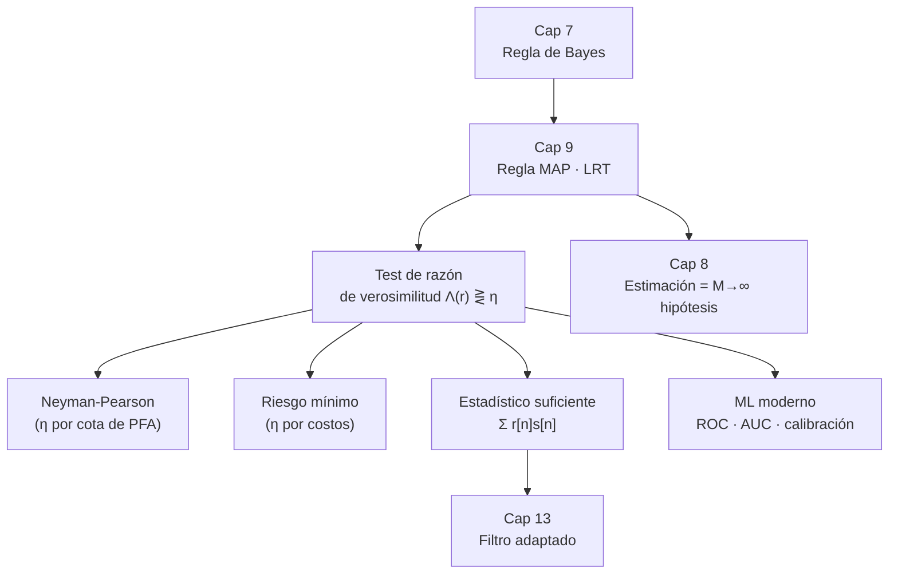

Complemento del capítulo 9 de [[PROCESAMIENTO DE SEÑALES]].

# Pruebas De Hipótesis — En Profundidad

El capítulo 9 del apunte principal cuenta bien **qué** es la regla MAP y cómo se llega al test de razón de verosimilitud. Este documento se mete en las tres cosas que ahí quedaron enunciadas sin desarrollar:

- **Las demostraciones.** Todo lo que en el resumen aparece como "se puede demostrar que" — que la regla MAP es óptima, el lema de Neyman-Pearson, la pendiente de la ROC — acá está hecho paso a paso.
- **Las cuentas.** Ejemplos resueltos de punta a punta, con los umbrales calculados y los números verificados por simulación.
- **La práctica.** Qué pasa cuando estimás una ROC, un AUC o un $P_e$ con datos de verdad. Esto no está en el libro, y es donde uno se engaña solo.

###### **Cómo leer esto**
No hace falta ir en orden. Según lo que estés buscando:

| Si querés… | Andá a |
|---|---|
| entender por qué la regla MAP es óptima (y no solo "razonable") | Parte 1.1 |
| ver qué pasa en las fronteras entre regiones de decisión | Parte 1.2 |
| ver la demostración completa del lema de Neyman-Pearson | Parte 1.3 |
| entender la geometría de la ROC (pendiente, punto de Bayes) | Parte 1.4 |
| ver de dónde sale el umbral de riesgo mínimo | Parte 1.5 |
| ver cuentas hechas con números | Parte 2 |
| estimar una ROC / un AUC sin equivocarte | Parte 3 |
| saber cuántas simulaciones hacen falta | Parte 3.3 |
| entender por qué un test bueno puede fallar feo | Parte 3.5 |
| conectar el capítulo con el 7, el 8 y el 13 | Parte 4 |
| practicar | Parte 5 |

---

# Parte 1 — Las demostraciones

## 1.1 La regla MAP minimiza la probabilidad de error (no solo la condicional)

El apunte dice que para minimizar la probabilidad de error hay que quedarse con la hipótesis de mayor probabilidad a posteriori. Eso tiene dos partes, y el resumen solo hace la primera.

###### **Parte fácil: minimizar el error CONDICIONADO a la medición**

Ya medimos $R=r$. Tenemos que decidir. Solo hay dos opciones:

- Si decidimos $\text{`}H_0\text{'}$, nos equivocamos exactamente cuando $H_0$ no era cierta. La probabilidad de eso, sabiendo que $R=r$, es $P(H_1|R=r)=1-P(H_0|R=r)$.
- Si decidimos $\text{`}H_1\text{'}$, nos equivocamos con probabilidad $P(H_0|R=r)=1-P(H_1|R=r)$.

O sea que la probabilidad de error condicional, para la mejor de las dos decisiones, es
$$P(\text{error}\,|\,R=r)=\min\big\{\,1-P(H_0|R=r)\ ,\ 1-P(H_1|R=r)\,\big\}$$
y ese mínimo se alcanza eligiendo la hipótesis con **mayor** probabilidad a posteriori. Hasta acá, lo del apunte.

###### **Parte que falta: ¿y la probabilidad de error TOTAL?**

Lo que de verdad nos importa no es equivocarnos poco para *un* $r$ en particular, sino equivocarnos poco **en promedio**, sobre todas las mediciones que podríamos llegar a ver. Esa es la probabilidad de error total:
$$P_e=\int_{-\infty}^{\infty}P(\text{error}\,|\,R=r)\ f_R(r)\ dr$$

Acá está el argumento, y es más sutil de lo que parece. Tomá **cualquier** otra regla de decisión — llamémosla $\delta'$ — distinta de la MAP. Para cada $r$, esa regla $\delta'$ toma alguna decisión, y su probabilidad de error condicional en ese punto, $P_{\delta'}(\text{error}|R=r)$, es una de las dos opciones ($1-P(H_0|r)$ o $1-P(H_1|r)$). Pero la regla MAP, por construcción, toma la que da el **mínimo** de las dos. Entonces, punto por punto:
$$P_{\text{MAP}}(\text{error}\,|\,R=r)\ \leq\ P_{\delta'}(\text{error}\,|\,R=r) \qquad \text{para todo } r$$

Ahora multiplicamos los dos lados por $f_R(r)$, que es **no negativo** (es una densidad), así que la desigualdad se conserva:
$$P_{\text{MAP}}(\text{error}\,|\,R=r)\ f_R(r)\ \leq\ P_{\delta'}(\text{error}\,|\,R=r)\ f_R(r) \qquad \text{para todo } r$$

Y ahora integramos los dos lados. Integrar conserva las desigualdades entre funciones:
$$\underbrace{\int P_{\text{MAP}}(\text{error}|r)\,f_R(r)\,dr}_{P_e \text{ de la regla MAP}}\ \leq\ \underbrace{\int P_{\delta'}(\text{error}|r)\,f_R(r)\,dr}_{P_e \text{ de la regla } \delta'}$$

O sea: **la regla MAP tiene menor o igual $P_e$ total que cualquier otra regla.** ∎

> **La clave del argumento es que $f_R(r)\geq0$.** Eso es lo que garantiza que "minimizar punto a punto" se traduce en "minimizar el promedio". Si las mediciones improbables pesaran negativo en el promedio (cosa que no pasa, pero conceptualmente), minimizar el error para ellas podría *empeorar* el total. Como pesan cero o positivo, no hay conflicto: la mejor decisión local es también la mejor global.

>**Y notá una cosa fina.** En los $r$ donde $f_R(r)=0$, la decisión no importa: aportan $0$ a la integral, decidas lo que decidas. Por eso la regla MAP no es *única* — cualquier regla que coincida con ella salvo en un conjunto de probabilidad cero es igual de óptima. Esto vuelve a aparecer en 1.2.

## 1.2 El test de razón de verosimilitud, y qué pasa en las fronteras

El apunte hace el álgebra de pasar de "comparar posteriores" a "comparar $\Lambda(r)$ con $\eta$". Repasémosla rápido y después metámonos en dos cosas que quedan afuera: la **extensión a $M$ hipótesis** y las **fronteras**.

###### **El álgebra, otra vez, con cuidado**

Partimos de la regla MAP:
$$P(H_1|R=r)\ \underset{H_0}{\overset{H_1}{\gtrless}}\ P(H_0|R=r)$$
Bayes: $P(H_i|R=r)=\dfrac{p_i\,f_{R|H}(r|H_i)}{f_R(r)}$. El denominador $f_R(r)$ es el mismo de los dos lados y es **positivo** (asumimos $f_R(r)>0$ en el $r$ que medimos — si fuera cero, no habríamos medido eso). Multiplicamos los dos lados por $f_R(r)>0$, sin dar vuelta la desigualdad:
$$p_1\,f_{R|H}(r|H_1)\ \underset{H_0}{\overset{H_1}{\gtrless}}\ p_0\,f_{R|H}(r|H_0)$$
Y ahora, **si** $f_{R|H}(r|H_0)>0$, dividimos los dos lados por esa cantidad positiva:
$$\Lambda(r)=\frac{f_{R|H}(r|H_1)}{f_{R|H}(r|H_0)}\ \underset{H_0}{\overset{H_1}{\gtrless}}\ \frac{p_0}{p_1}=\eta$$

>**¿Y si $f_{R|H}(r|H_0)=0$?** Entonces no podemos dividir, pero tampoco hace falta. Si la densidad bajo $H_0$ es cero en ese $r$ pero la de $H_1$ no, la comparación $p_1 f_{R|H}(r|H_1) > p_0\cdot 0$ es obviamente cierta: decidimos $\text{`}H_1\text{'}$. Tiene todo el sentido — ese valor de $r$ es imposible bajo $H_0$, así que si lo vemos, tuvo que ser $H_1$. La razón de verosimilitud ahí "vale infinito", y el test lo maneja sin problema.

###### **La extensión a $M$ hipótesis**

Con $M>2$ hipótesis no hay una sola razón de verosimilitud, pero la idea es idéntica. La regla MAP dice: elegí el $i$ que maximice $P(H_i|R=r)$. Por Bayes, y cancelando $f_R(r)$ que es común a todos:
$$\hat H=\arg\max_{i}\ p_i\,f_{R|H}(r|H_i)$$
La demostración de que esto minimiza $P_e$ es **exactamente** la de 1.1: la probabilidad de error condicional es $1-\max_i P(H_i|r)$, elegir el máximo la minimiza punto a punto, y como $f_R(r)\geq0$, también minimiza el promedio.

Cada par de hipótesis $(i,j)$ genera una frontera donde $p_i f_{R|H}(r|H_i)=p_j f_{R|H}(r|H_j)$. Esas fronteras parten el espacio de mediciones en $M$ regiones $D_0,\dots,D_{M-1}$.

###### **Las fronteras**

En una frontera, $p_i f_{R|H}(r|H_i)=p_j f_{R|H}(r|H_j)$ exactamente: las dos hipótesis son *empate*. ¿Qué se decide ahí?

**No importa.** Y hay dos razones, una por nivel:

1. **Condicional:** en el empate, la probabilidad de error condicional es la misma decidas $\text{`}H_i\text{'}$ o $\text{`}H_j\text{'}$. Las dos opciones son igual de buenas.
2. **Total:** para una medición continua, el conjunto de $r$ que caen *exactamente* en la frontera tiene **probabilidad cero**. Aporta $0$ a la integral del $P_e$. Podés asignarlo a cualquiera de los dos lados y el $P_e$ total no cambia.

Por eso el test se escribe con $\gtrless$ y no con $\geq$ / $>$ por separado: la elección en el empate es libre. La regla MAP no es un objeto único, es una **clase** de reglas que coinciden salvo en las fronteras.

> Esto que parece un tecnicismo es lo que hace que un detector real funcione: nunca vas a medir un valor que caiga *exactamente* en el umbral, así que el detector puede tener una regla arbitraria ahí (por ejemplo, "en duda, decidí $H_0$") sin perder optimalidad.

## 1.3 El lema de Neyman-Pearson, la demostración completa

El apunte dice que cuando fijás una cota para $P_{FA}$ y maximizás $P_D$, la solución "sigue siendo un test de razón de verosimilitud". Eso es el **lema de Neyman-Pearson**, y es el resultado central de toda la detección estadística. Vale la pena verlo entero.

###### **El planteo**

Queremos elegir una región de decisión $D_1$ (los $r$ donde declaramos $\text{`}H_1\text{'}$) que:

- tenga $P_{FA}=\displaystyle\int_{D_1}f_{R|H}(r|H_0)\,dr=\alpha$ (una cota fija que nos dan);
- y entre todas las que cumplen eso, maximice $P_D=\displaystyle\int_{D_1}f_{R|H}(r|H_1)\,dr$.

**Afirmación:** la $D_1$ óptima es
$$D_1=\{\,r:\ \Lambda(r)\geq\eta\,\}$$
donde $\eta$ se elige para que dé $P_{FA}=\alpha$ exacto.

###### **La intuición: es un problema de presupuesto**

Antes de la cuenta, la idea. Pensá $P_{FA}$ como un **presupuesto** que gastás y $P_D$ como la **ganancia**. Cada valorcito de $r$ que metés en $D_1$ te cuesta $f_{R|H}(r|H_0)\,dr$ de presupuesto y te rinde $f_{R|H}(r|H_1)\,dr$ de ganancia. El **retorno por unidad de costo** de ese $r$ es justamente
$$\frac{f_{R|H}(r|H_1)}{f_{R|H}(r|H_0)}=\Lambda(r)$$

Si tenés un presupuesto fijo y querés maximizar la ganancia, lo que hacés es obvio: comprás **primero lo de mayor retorno por unidad de costo**, y seguís bajando hasta agotar el presupuesto. Eso es exactamente "quedate con los $r$ de $\Lambda(r)$ más alto primero", que es lo mismo que "$\Lambda(r)\geq\eta$" para el $\eta$ que gasta justo todo el presupuesto $\alpha$.

Es el mismo argumento con el que llenás una mochila con los objetos de mayor valor-por-kilo primero.

###### **La demostración rigurosa (el argumento del intercambio)**

Sea $D_1=\{r:\Lambda(r)\geq\eta\}$ con $P_{FA}(D_1)=\alpha$. Sea $D_1'$ **cualquier** otra región con $P_{FA}(D_1')=\alpha$. Vamos a mostrar que $P_D(D_1)\geq P_D(D_1')$.

Escribimos la diferencia de detecciones separando lo que cada región tiene y la otra no:
$$P_D(D_1)-P_D(D_1')=\int_{D_1\setminus D_1'}f_{R|H}(r|H_1)\,dr\ -\ \int_{D_1'\setminus D_1}f_{R|H}(r|H_1)\,dr$$
(lo que $D_1$ y $D_1'$ comparten se cancela).

Ahora usamos la definición de $D_1$ en cada pedazo:

- En $D_1\setminus D_1'$ estamos **dentro** de $D_1$, así que ahí $\Lambda(r)\geq\eta$, o sea $f_{R|H}(r|H_1)\geq\eta\,f_{R|H}(r|H_0)$. Entonces:
$$\int_{D_1\setminus D_1'}f_{R|H}(r|H_1)\,dr\ \geq\ \eta\int_{D_1\setminus D_1'}f_{R|H}(r|H_0)\,dr$$
- En $D_1'\setminus D_1$ estamos **fuera** de $D_1$, así que ahí $\Lambda(r)<\eta$, o sea $f_{R|H}(r|H_1)<\eta\,f_{R|H}(r|H_0)$. Entonces:
$$\int_{D_1'\setminus D_1}f_{R|H}(r|H_1)\,dr\ <\ \eta\int_{D_1'\setminus D_1}f_{R|H}(r|H_0)\,dr$$

Restando la segunda de la primera:
$$P_D(D_1)-P_D(D_1')\ \geq\ \eta\left[\int_{D_1\setminus D_1'}f_{R|H}(r|H_0)\,dr-\int_{D_1'\setminus D_1}f_{R|H}(r|H_0)\,dr\right]$$
Pero el corchete es exactamente $P_{FA}(D_1)-P_{FA}(D_1')=\alpha-\alpha=0$. Entonces
$$P_D(D_1)-P_D(D_1')\ \geq\ \eta\cdot 0=0$$
$$\boxed{\ P_D(D_1)\ \geq\ P_D(D_1')\ }$$
∎

![[c9p-neyman-pearson-lema.svg]]

La figura muestra el intercambio en versión chiquita: cualquier $D_1'\neq D_1$ tiene que agarrar alguna franja con $\Lambda<\eta$ (donde gana poco $P_D$ por cada tanto de $P_{FA}$), y para no pasarse del presupuesto, resignar una franja con $\Lambda\geq\eta$ (donde perdía mucho $P_D$). El saldo siempre le juega en contra.

>**Lo notable del resultado:** no importa cómo sean las densidades — gaussianas, exponenciales, lo que sea. Mientras puedas ordenar los $r$ por $\Lambda(r)$, la región óptima es un "conjunto de nivel" de $\Lambda$. Todo el problema de detección se reduce a **comparar un número, $\Lambda(r)$, con un umbral**.

>**El detalle de la existencia de $\eta$.** El argumento asume que hay un $\eta$ que da $P_{FA}=\alpha$ *exacto*. Para distribuciones continuas eso casi siempre pasa: a medida que bajás $\eta$, $P_{FA}$ crece de forma continua de $0$ a $1$, así que en algún momento pega justo $\alpha$. Si $\Lambda(r)$ tiene un "escalón" (típico en distribuciones discretas), puede que $P_{FA}$ salte por encima de $\alpha$ sin tocarlo. Ahí se usa una **regla de decisión aleatorizada** en el umbral: cuando $\Lambda(r)=\eta$, tirás una moneda sesgada y decidís $\text{`}H_1\text{'}$ con una probabilidad ajustada para que $P_{FA}$ dé $\alpha$ clavado.

## 1.4 La pendiente de la ROC es el umbral (y el punto de Bayes)

Este resultado no está en el apunte y es de los más elegantes del tema. Une la regla MAP, el riesgo mínimo, Neyman-Pearson y la ROC en una sola figura.

###### **La afirmación**

Recorré la ROC bajando $\eta$ desde $\infty$ (arranca en el origen, $P_{FA}=P_D=0$) hasta $0$ (termina en $P_{FA}=P_D=1$). En cada punto de la curva, la **pendiente** vale exactamente el umbral $\eta$ que estás usando ahí:
$$\boxed{\ \frac{dP_D}{dP_{FA}}\bigg|_{\text{punto de la ROC}}=\eta\ }$$

###### **Por qué**

Parametrizemos la región por el umbral: $D_1(\eta)=\{r:\Lambda(r)\geq\eta\}$. Bajar $\eta$ un poquito, a $\eta-d\eta$, agrega a $D_1$ una cáscara fina: los $r$ donde $\Lambda(r)$ estaba justo entre $\eta-d\eta$ y $\eta$. Llamemos $\partial D$ a esa cáscara.

El incremento de $P_{FA}$ y el de $P_D$ al agregar $\partial D$ son:
$$dP_{FA}=\int_{\partial D}f_{R|H}(r|H_0)\,dr, \qquad dP_D=\int_{\partial D}f_{R|H}(r|H_1)\,dr$$
Pero en toda la cáscara $\partial D$, por construcción, $\Lambda(r)\approx\eta$, o sea $f_{R|H}(r|H_1)\approx\eta\,f_{R|H}(r|H_0)$. Entonces:
$$dP_D=\int_{\partial D}f_{R|H}(r|H_1)\,dr\approx\eta\int_{\partial D}f_{R|H}(r|H_0)\,dr=\eta\,dP_{FA}$$
$$\Longrightarrow\quad \frac{dP_D}{dP_{FA}}=\eta$$
∎

**Chequeo numérico** para el caso gaussiano ($H_0:N(0,1)$, $H_1:N(2,1)$, así $\Lambda(\tau)=e^{2\tau-2}$):

| umbral $\tau$ | $dP_D/dP_{FA}$ (pendiente) | $\Lambda(\tau)$ |
|---|---|---|
| $0$ | $0{,}135$ | $0{,}135$ |
| $0{,}5$ | $0{,}368$ | $0{,}368$ |
| $1{,}0$ | $1{,}000$ | $1{,}000$ |
| $1{,}5$ | $2{,}718$ | $2{,}718$ |

Clavado en todos lados.

###### **La consecuencia: dónde está el punto de Bayes**

Ahora unimos esto con la regla MAP. Minimizar $P_e=p_0 P_{FA}+p_1 P_M=p_0 P_{FA}+p_1(1-P_D)$ es lo mismo que **maximizar** $p_1 P_D-p_0 P_{FA}$ (el resto son constantes).

Pensá en las rectas $p_1 P_D-p_0 P_{FA}=c$ en el plano $(P_{FA},P_D)$. Todas tienen pendiente $p_0/p_1$. Cuanto más grande $c$, más arriba está la recta. Minimizar $P_e$ = encontrar la recta de esa familia **más alta que todavía toca la ROC**. Y esa recta toca la ROC en un solo punto: donde es **tangente**.

![[c9p-roc-pendiente.svg]]

En el punto de tangencia, la pendiente de la ROC iguala la pendiente de la recta:
$$\frac{dP_D}{dP_{FA}}=\frac{p_0}{p_1}$$
Pero acabamos de probar que $dP_D/dP_{FA}=\eta$. Entonces, en el punto de Bayes,
$$\eta=\frac{p_0}{p_1}$$
que es **exactamente el umbral de la regla MAP**. Todo cierra: la regla MAP, mirada en el plano de la ROC, es "operá en el punto donde la tangente tiene pendiente $p_0/p_1$".

>**Y de yapa, la ROC óptima es cóncava.** Al recorrerla bajando $\eta$, la pendiente ($=\eta$) va *decreciendo*. Una curva cuya pendiente decrece monótonamente es cóncava. Por eso toda ROC de un test de razón de verosimilitud tiene esa panza hacia arriba y a la izquierda: es una propiedad matemática, no un dibujo lindo.

## 1.5 La regla de riesgo mínimo, derivación completa

El apunte tira la fórmula del umbral $\eta=\dfrac{P(H_0)(c_{10}-c_{00})}{P(H_1)(c_{01}-c_{11})}$ sin la cuenta. Hagámosla.

###### **El planteo general ($M$ hipótesis)**

$c_{ij}$ = costo de decidir $\text{`}H_i\text{'}$ cuando la verdad era $H_j$. El costo esperado de decidir $\text{`}H_i\text{'}$, sabiendo que medimos $R=r$, es
$$E[\text{costo de }\text{`}H_i\text{'}\,|\,R=r]=\sum_{j}c_{ij}\,P(H_j|R=r)$$
La regla de riesgo mínimo: elegí el $i$ que minimice esa suma. Igual que en 1.1, minimizar el costo condicional para cada $r$ minimiza el riesgo total $\int E[\text{costo}|r]\,f_R(r)\,dr$, porque $f_R(r)\geq0$.

###### **El caso binario, paso a paso**

Con dos hipótesis, comparamos el costo esperado de $\text{`}H_1\text{'}$ contra el de $\text{`}H_0\text{'}$. Decidimos $\text{`}H_1\text{'}$ cuando su costo esperado es **menor**:
$$c_{11}P(H_1|r)+c_{10}P(H_0|r)\ \underset{\text{si no, }\text{`}H_0\text{'}}{\overset{\text{`}H_1\text{'}}{<}}\ c_{01}P(H_1|r)+c_{00}P(H_0|r)$$

Pasamos todo lo de $H_1$ a un lado y lo de $H_0$ al otro:
$$c_{11}P(H_1|r)-c_{01}P(H_1|r)\ <\ c_{00}P(H_0|r)-c_{10}P(H_0|r)$$
$$\big(c_{11}-c_{01}\big)P(H_1|r)\ <\ \big(c_{00}-c_{10}\big)P(H_0|r)$$

Multiplicamos los dos lados por $-1$ (**y damos vuelta la desigualdad**):
$$\big(c_{01}-c_{11}\big)P(H_1|r)\ >\ \big(c_{10}-c_{00}\big)P(H_0|r)$$

Acá aparece un supuesto que casi siempre está implícito: **equivocarse cuesta más que acertar**, es decir $c_{01}>c_{11}$ y $c_{10}>c_{00}$. Con eso, los dos factores $(c_{01}-c_{11})$ y $(c_{10}-c_{00})$ son **positivos**. Dividimos por $(c_{01}-c_{11})>0$ y por $P(H_0|r)>0$, sin dar vuelta nada:
$$\frac{P(H_1|r)}{P(H_0|r)}\ >\ \frac{c_{10}-c_{00}}{c_{01}-c_{11}}$$

Y ahora Bayes en el lado izquierdo: $\dfrac{P(H_1|r)}{P(H_0|r)}=\dfrac{p_1\,f_{R|H}(r|H_1)}{p_0\,f_{R|H}(r|H_0)}=\dfrac{p_1}{p_0}\Lambda(r)$. Despejando $\Lambda(r)$:
$$\Lambda(r)\ \underset{H_0}{\overset{H_1}{\gtrless}}\ \frac{p_0}{p_1}\cdot\frac{c_{10}-c_{00}}{c_{01}-c_{11}}=\eta$$
$$\boxed{\ \eta=\frac{p_0\,(c_{10}-c_{00})}{p_1\,(c_{01}-c_{11})}\ }$$
∎

###### **Los dos casos que hay que reconocer**

- **Costos $0$–$1$** ($c_{ii}=0$, $c_{ij}=1$): $\eta=\dfrac{p_0(1-0)}{p_1(1-0)}=\dfrac{p_0}{p_1}$. Recuperás la regla MAP. El riesgo mínimo **contiene** a la MAP como caso particular.
- **Costos asimétricos:** si $c_{01}$ (costo de un *miss*) es mucho más grande que $c_{10}$ (costo de una *falsa alarma*), entonces $\eta$ se hace **chico**, y como $\Lambda$ suele crecer con $r$, el umbral se corre para **declarar $\text{`}H_1\text{'}$ más seguido**. Tiene sentido: si perder $H_1$ sale carísimo, más vale pecar de precavido. Los números concretos están en la Parte 2.3.

---

# Parte 2 — Ejemplos resueltos con números

## 2.1 MAP con gaussianas de distinta varianza (el caso que el apunte no cubre)

El ejercicio del apunte principal siempre usa dos gaussianas de **la misma varianza**. Ahí el test da un solo umbral y listo. Pero eso es la excepción, no la regla. Veamos qué pasa cuando las varianzas difieren.

**El problema:** $H_0:\ R\sim N(0,1)$, $H_1:\ R\sim N(3,4)$ (o sea $\sigma_1=2$), con $p_0=p_1$, así que $\eta=1$.

###### **La cuenta**

La regla es $\Lambda(r)\gtrless 1$, o equivalentemente $\ln\Lambda(r)\gtrless 0$. Escribimos $\ln\Lambda$:
$$\ln\Lambda(r)=\ln\frac{\sigma_0}{\sigma_1}-\frac{(r-\mu_1)^2}{2\sigma_1^2}+\frac{(r-\mu_0)^2}{2\sigma_0^2}=\ln\tfrac12-\frac{(r-3)^2}{8}+\frac{r^2}{2}$$

Decidimos $\text{`}H_1\text{'}$ cuando esto es $\geq0$. Multiplicamos todo por $8$:
$$-8\ln2-(r-3)^2+4r^2\ \geq\ 0$$
$$-8\ln2-(r^2-6r+9)+4r^2\ \geq\ 0$$
$$3r^2+6r-(9+8\ln2)\ \geq\ 0$$

Es una **cuadrática en $r$** — no una lineal. Y como el coeficiente de $r^2$ es positivo ($+3$), la parábola abre hacia arriba: se cumple $\geq0$ **afuera** de sus dos raíces. Con $8\ln2\approx5{,}545$:
$$3r^2+6r-14{,}545\geq0\quad\Longrightarrow\quad r\leq -3{,}42\ \ \text{ó}\ \ r\geq 1{,}42$$

![[c9p-map-varianzas-distintas.svg]]

**La región de decisión $D_1$ tiene DOS pedazos**, no uno: se decide $\text{`}H_1\text{'}$ en las dos colas y $\text{`}H_0\text{'}$ en el intervalo del medio.

###### **Por qué**

$H_1$ tiene más varianza. Las colas de una gaussiana con más varianza **caen más lento**. Así que, no importa dónde estén las medias, si te vas lo suficientemente lejos hacia cualquier lado, en algún momento $f_{R|H}(r|H_1)$ termina superando a $f_{R|H}(r|H_0)$ — simplemente porque $f_0$ ya se murió y $f_1$ todavía no. En un valor extremo, "más disperso" gana.

El coeficiente de $r^2$ de la cuadrática es $\frac{1}{2\sigma_0^2}-\frac{1}{2\sigma_1^2}$. Su **signo** decide toda la geometría:

| relación de varianzas | signo de $r^2$ | forma de $D_1$ |
|---|---|---|
| $\sigma_1>\sigma_0$ ($H_1$ más disperso) | $+$ | dos colas — $H_1$ en los extremos |
| $\sigma_1<\sigma_0$ ($H_1$ más concentrado) | $-$ | un intervalo acotado — $H_1$ en el centro |
| $\sigma_1=\sigma_0$ | $0$ (la cuadrática degenera en lineal) | un solo umbral — el caso del apunte |

###### **Chequeo por simulación**

Con $4\times10^6$ muestras bajo cada hipótesis y la regla de dos umbrales:
$$P_{FA}=0{,}078 \qquad P_M=0{,}214 \qquad P_e=0{,}146$$

>**Honestidad sobre el umbral de la izquierda.** Para *estos* números, la cola $r\leq-3{,}42$ tiene probabilidad ínfima bajo las dos hipótesis. Si te olvidaras del umbral izquierdo y usaras solo $r\geq 1{,}42$, el $P_e$ te daría $0{,}1464$ en vez de $0{,}1462$ — dos milésimas peor. El umbral de la izquierda está **matemáticamente**, pero acá casi no cambia nada. Se vuelve importante cuando la diferencia de varianzas es más grande o las medias están más cerca (mirá el ejercicio 1 de la Parte 5: ahí el intervalo del medio se lleva un cacho real de probabilidad).

## 2.2 Neyman-Pearson explícito: diseño con $P_{FA}$ objetivo

**El problema:** el ruido bajo $H_0$ es exponencial de tasa $\lambda_0=1$; bajo $H_1$, exponencial de tasa $\lambda_1=\tfrac14$ (media más grande, cola más pesada). Densidades: $f_i(r)=\lambda_i e^{-\lambda_i r}$ para $r\geq0$. Queremos un test con $P_{FA}=0{,}05$ y el mayor $P_D$ posible.

###### **La razón de verosimilitud**

$$\Lambda(r)=\frac{\lambda_1 e^{-\lambda_1 r}}{\lambda_0 e^{-\lambda_0 r}}=\frac{\lambda_1}{\lambda_0}\,e^{(\lambda_0-\lambda_1)r}$$
Como $\lambda_0>\lambda_1$, el exponente crece con $r$: **$\Lambda(r)$ es creciente**. Entonces "$\Lambda(r)\geq\eta$" es lo mismo que "$r\geq r_0$" para algún $r_0$. El test se reduce a un umbral sobre $r$ directamente.

###### **Fijar el umbral por la cota de $P_{FA}$**

Neyman-Pearson dice: elegí $r_0$ para que $P_{FA}$ dé justo la cota. Y $P_{FA}$ para un umbral sobre una exponencial sale de una:
$$P_{FA}=P(r\geq r_0\,|\,H_0)=e^{-\lambda_0 r_0}\ \overset{!}{=}\ 0{,}05$$
$$\Longrightarrow\quad r_0=-\frac{\ln 0{,}05}{\lambda_0}=\frac{2{,}996}{1}\approx 3{,}00$$

###### **El $P_D$ que se consigue**

$$P_D=P(r\geq r_0\,|\,H_1)=e^{-\lambda_1 r_0}=e^{-\lambda_1\,(-\ln\alpha/\lambda_0)}=\alpha^{\lambda_1/\lambda_0}$$
$$P_D=0{,}05^{\,1/4}=\sqrt[4]{0{,}05}\approx 0{,}473$$

Fijate el resultado lindo: **la ROC entera de este problema es $P_D=P_{FA}^{\ \lambda_1/\lambda_0}$**. Toda la familia de tests, en una fórmula.

###### **Comparación con la regla MAP**

Si en cambio usáramos MAP con priors iguales ($\eta=1$): el umbral sería $r_0^{\text{MAP}}=\dfrac{\ln(\lambda_0/\lambda_1)}{\lambda_0-\lambda_1}=\dfrac{\ln 4}{0{,}75}\approx 1{,}85$, que da $P_{FA}=e^{-1{,}85}\approx 0{,}158$ y $P_D=e^{-0{,}46}\approx 0{,}630$.

| criterio | $r_0$ | $P_{FA}$ | $P_D$ |
|---|---|---|---|
| Neyman-Pearson ($P_{FA}\leq 0{,}05$) | $3{,}00$ | $0{,}050$ | $0{,}473$ |
| MAP (priors iguales) | $1{,}85$ | $0{,}158$ | $0{,}630$ |

Ninguno es "mejor" en abstracto: NP compra menos falsas alarmas a costa de menos detección. Cuál querés depende de qué te cueste más equivocarte — que es justo lo que formaliza el riesgo mínimo.

*(Verificado por Monte Carlo: $4\times10^6$ muestras dan $P_{FA}=0{,}0498$ y $P_D=0{,}4729$, contra los $0{,}05$ y $0{,}473$ teóricos.)*

## 2.3 Riesgo mínimo con costos asimétricos, con números

**El problema:** $H_0:\ R\sim N(0,1)$, $H_1:\ R\sim N(2,1)$. Priors $p_0=0{,}6$, $p_1=0{,}4$. Costos: acertar no cuesta nada ($c_{00}=c_{11}=0$); una falsa alarma cuesta $c_{10}=1$; un *miss* cuesta $c_{01}=5$ (perder un $H_1$ es cinco veces más grave que una falsa alarma).

###### **El umbral**

$$\eta=\frac{p_0\,(c_{10}-c_{00})}{p_1\,(c_{01}-c_{11})}=\frac{0{,}6\cdot 1}{0{,}4\cdot 5}=\frac{0{,}6}{2}=0{,}3$$
Para gaussianas con $d=\mu_1-\mu_0=2$, $\ln\Lambda(r)=2r-2$. La regla $\ln\Lambda(r)\gtrless\ln\eta$:
$$2r-2\ \gtrless\ \ln 0{,}3=-1{,}204 \quad\Longrightarrow\quad r\ \underset{H_0}{\overset{H_1}{\gtrless}}\ 0{,}398$$

Comparalo con la regla **MAP** (mismos priors, $\eta=p_0/p_1=1{,}5$): $2r-2\gtrless\ln 1{,}5=0{,}405$, o sea $r\gtrless 1{,}203$.

![[c9p-riesgo-costos.svg]]

El umbral se corrió de $1{,}20$ a $0{,}40$: en toda esa franja, la regla de riesgo mínimo **ya declara $\text{`}H_1\text{'}$** donde la MAP todavía decía $\text{`}H_0\text{'}$. Está dispuesta a comerse más falsas alarmas con tal de no perder ningún $H_1$, que es lo caro.

## 2.4 Por qué minimizar el riesgo no es minimizar el error

Este es el punto que más cuesta digerir, así que lo separo. Tomemos las dos reglas de 2.3 y midamos, por simulación ($4\times10^6$ muestras), qué logra cada una:

| regla | umbral | $P_{FA}$ | $P_M$ | $P_e=p_0P_{FA}+p_1P_M$ | riesgo $=p_0 c_{10}P_{FA}+p_1 c_{01}P_M$ |
|---|---|---|---|---|---|
| **riesgo mínimo** | $0{,}40$ | $0{,}345$ | $0{,}054$ | $0{,}229$ | $\mathbf{0{,}316}$ |
| **MAP** | $1{,}20$ | $0{,}115$ | $0{,}212$ | $\mathbf{0{,}154}$ | $0{,}494$ |

Leelo con cuidado:

- La regla **MAP gana en $P_e$** ($0{,}154$ contra $0{,}229$). Obvio: la MAP *es* la que minimiza $P_e$, lo demostramos en 1.1.
- La regla de **riesgo mínimo gana en riesgo** ($0{,}316$ contra $0{,}494$). También obvio: es la que minimiza el riesgo.

**No hay contradicción, hay dos objetivos distintos.** La MAP trata todos los errores por igual. La de riesgo mínimo sabe que un *miss* cuesta $5\times$, así que sacrifica $P_e$ global (aceptando muchas más falsas alarmas, $P_{FA}$ salta de $0{,}12$ a $0{,}35$) para bajar los *misses* de $0{,}21$ a $0{,}05$. En una aplicación donde perder un $H_1$ es catastrófico (detectar un tumor, un misil, una falla estructural), es exactamente lo que querés.

> Moraleja: "minimizar la probabilidad de error" es la respuesta correcta **solo si todos los errores cuestan lo mismo**. En cuanto no es así, la pregunta correcta es "minimizar el costo esperado", y la respuesta cambia el umbral.

---

# Parte 3 — Lo que pasa cuando lo hacés de verdad

Todo lo anterior asume que conocés $f_{R|H}(r|H_0)$ y $f_{R|H}(r|H_1)$ exactas. En la práctica no las tenés: tenés un montón de casos etiquetados (esto era $H_0$, esto era $H_1$) y un "score" que les asignó algún sistema. Esta parte es sobre eso, y no está en el libro.

## 3.1 Cómo se estima una curva ROC con datos

No hace falta conocer las densidades. Con una lista de casos, cada uno con su **score** $s$ (más alto = más "parece $H_1$") y su **etiqueta verdadera** ($H_0$ o $H_1$), la receta es:

1. Ordená todos los casos por score, de mayor a menor.
2. Barré un umbral $\gamma$ desde $+\infty$ hacia abajo. Para cada valor de $\gamma$:
   - $\widehat{P_{FA}}(\gamma)=\dfrac{\#\{\text{casos } H_0 \text{ con } s\geq\gamma\}}{\#\{\text{casos } H_0\}}$
   - $\widehat{P_D}(\gamma)=\dfrac{\#\{\text{casos } H_1 \text{ con } s\geq\gamma\}}{\#\{\text{casos } H_1\}}$
3. Graficá $\widehat{P_D}$ contra $\widehat{P_{FA}}$.

En la práctica solo hace falta evaluar $\gamma$ en cada valor de score que aparece: entre dos scores consecutivos nada cambia. La curva sale **escalonada**: cada caso $H_1$ que "pasás" al bajar el umbral es un escalón hacia arriba, cada caso $H_0$ un escalón hacia la derecha.

>**El detalle:** con $n_0$ casos $H_0$ y $n_1$ casos $H_1$, la ROC empírica tiene a lo sumo $n_0$ escalones horizontales y $n_1$ verticales. Si tenés pocos casos de una clase, la curva es un dibujo grueso de la real, con saltos enormes. Cuántos casos hacen falta es lo de 3.3.

## 3.2 AUC: qué mide en realidad

El **AUC** (*area under the curve*) es el área bajo la ROC. Un solo número entre $0{,}5$ (test inútil, la diagonal) y $1$ (test perfecto).

Pero tiene una interpretación probabilística exacta, y es la que hay que recordar:
$$\boxed{\ \text{AUC}=P\big(\text{score de un caso } H_1 \text{ al azar}\ >\ \text{score de un caso } H_0 \text{ al azar}\big)\ }$$

O sea: agarrás un positivo cualquiera y un negativo cualquiera; el AUC es la probabilidad de que el sistema le haya puesto más score al positivo. Es una medida de **poder de ordenamiento**, no de acierto. (Formalmente, es el estadístico $U$ de Mann-Whitney normalizado.)

![[c9p-auc.svg]]

**Chequeo numérico.** Para dos gaussianas separadas por $d=2$ (en unidades de $\sigma$), la teoría da $\text{AUC}=\Phi(d/\sqrt2)=\Phi(1{,}414)=0{,}921$. Simulando $2\times10^6$ pares y contando cuántas veces $s_{H_1}>s_{H_0}$: **$0{,}921$**. Y calculando el área bajo la ROC teórica por trapecios: **$0{,}921$**. Los tres coinciden.

>**Por qué el AUC es cómodo y por qué engaña.** Cómodo: no depende de dónde pongas el umbral, resume todo el test en un número, y es fácil de estimar. Engaña: dos tests con el mismo AUC pueden ser utilísimos o inservibles según *dónde* en la curva pensás operar. Un AUC de $0{,}95$ con toda la ganancia en la zona de $P_{FA}$ alta no te sirve si tu aplicación exige $P_{FA}<0{,}01$. El AUC promedia sobre todos los puntos de operación, incluso los que nunca vas a usar.

## 3.3 Cuántas simulaciones para confiar en un $P_e$

Estimás $P_e$, $P_{FA}$ o $P_D$ contando: hacés $N$ pruebas y contás cuántas salen mal. Eso es una proporción binomial, y su error estándar es
$$\text{SE}=\sqrt{\frac{p\,(1-p)}{N}}$$
donde $p$ es la probabilidad verdadera. De ahí, el $N$ que necesitás para una precisión dada:
$$N\ \geq\ \frac{p\,(1-p)}{\text{SE}^2}$$

| querés estimar | con SE de | $N$ mínimo |
|---|---|---|
| $P_e\approx 0{,}05$ | $0{,}005$ (10% relativo) | $\approx 1\,900$ |
| $P_e\approx 0{,}05$ | $0{,}001$ (2% relativo) | $\approx 47\,500$ |
| $P_e\approx 0{,}01$ | $0{,}001$ | $\approx 9\,900$ |
| $P_e\approx 0{,}5$ | $0{,}01$ | $\approx 2\,500$ |

>**La trampa de los eventos raros.** Si el $P_e$ verdadero es $10^{-4}$ y hacés $N=1000$ simulaciones, lo más probable es que **no veas ningún error** y estimes $\widehat{P_e}=0$. No es que el detector sea perfecto: es que no simulaste suficiente. Regla gruesa: para estimar una probabilidad $p$ con sentido, necesitás ver del orden de $\geq 10$ eventos, o sea $N\gtrsim 10/p$. Para $p=10^{-4}$ eso son $10^5$ pruebas como piso.

*Es el mismo fenómeno que en el capítulo 11 con la coherencia estimada con pocos segmentos: un estimador con poca data no es que dé "cero" o "uno" porque el valor real sea ese, sino porque no tiene con qué.*

## 3.4 El punto de operación cuando no conocés los costos

Neyman-Pearson necesita que alguien te dé la cota de $P_{FA}$. Riesgo mínimo necesita la matriz de costos. ¿Y si no tenés ninguna de las dos? Hay dos criterios "sin parámetros" que se usan mucho:

- **Tasa de error igual (EER):** el punto de la ROC donde $P_{FA}=P_M$ (o sea $P_{FA}=1-P_D$). Un solo número, "el detector se equivoca lo mismo para los dos lados". Común en biometría.
- **Índice de Youden:** el punto que maximiza $J=P_D-P_{FA}$. Geométricamente, el punto de la ROC **más lejos de la diagonal** (medido en vertical).

Y acá se conecta con 1.4: maximizar $J=P_D-P_{FA}$ es buscar el punto donde una recta de pendiente $1$ es tangente a la ROC. Por el resultado de 1.4, ese punto usa umbral $\eta=1$ — que es la regla MAP con **priors iguales**. O sea: el índice de Youden es, sin decirlo, "asumí que las dos hipótesis son igual de probables y que los errores cuestan lo mismo".

## 3.5 Prevalencia baja, valor predictivo bajo — con la cuenta hecha

El apunte principal tiene un callout que dice "un test muy sensible y específico puede tener un valor predictivo positivo bajo si la prevalencia es baja". Hagamos la cuenta.

**Datos:** un test con sensibilidad $P_D=0{,}99$ y especificidad $1-P_{FA}=0{,}99$ (o sea $P_{FA}=0{,}01$). Se aplica a una población donde la condición tiene prevalencia $P(H_1)=0{,}001$ (una persona en mil).

**Pregunta:** si el test da positivo, ¿cuál es la probabilidad de que la persona realmente tenga la condición? Eso es el **valor predictivo positivo**, $P(H_1\,|\,\text{`}H_1\text{'})$. Bayes:
$$P(H_1\,|\,\text{`}H_1\text{'})=\frac{P(\text{`}H_1\text{'}\,|\,H_1)\,P(H_1)}{P(\text{`}H_1\text{'}\,|\,H_1)\,P(H_1)+P(\text{`}H_1\text{'}\,|\,H_0)\,P(H_0)}$$
$$=\frac{0{,}99\cdot 0{,}001}{0{,}99\cdot 0{,}001+0{,}01\cdot 0{,}999}=\frac{0{,}00099}{0{,}00099+0{,}00999}=\frac{0{,}00099}{0{,}01098}\approx 0{,}090$$

**Nueve por ciento.** Un test que se equivoca solo el 1% de las veces, aplicado a un problema raro, da positivos que son falsos **el 91% de las veces**.

![[c9p-ppv-prevalencia.svg]]

###### **Por qué**

En mil personas, hay **una** enferma (que el test detecta) y **999 sanas**, de las cuales el 1% — casi **diez** — dan falso positivo. Total: 11 positivos, de los cuales solo 1 es real. Los falsos positivos vienen de una base enorme; los verdaderos, de una minúscula. La prevalencia manda.

| sens. | espec. | prevalencia | VPP |
|---|---|---|---|
| $0{,}99$ | $0{,}99$ | $0{,}001$ | $9{,}0\%$ |
| $0{,}99$ | $0{,}99$ | $0{,}01$ | $50{,}0\%$ |
| $0{,}95$ | $0{,}90$ | $0{,}05$ | $33{,}3\%$ |

> Esto es lo que hay detrás de que no se hagan tests masivos de enfermedades raras en población general, y de por qué un resultado positivo casi siempre se re-testea. No es que el test sea malo — es que $P(\text{`}H_1\text{'}|H_0)$ chiquito multiplicado por $P(H_0)$ gigante sigue siendo más que $P(\text{`}H_1\text{'}|H_1)$ grande multiplicado por $P(H_1)$ minúsculo.

## 3.6 Cuando el score no es la razón de verosimilitud: calibración

Toda la teoría de la Parte 1 asume que decidís comparando $\Lambda(r)$ con un umbral. Pero un clasificador real (una regresión logística, una red) te da un "score" $s(r)$ que **no** es $\Lambda(r)$ — es alguna otra función, entrenada para separar las clases.

Hay dos propiedades distintas que un score puede tener o no:

- **Discriminación (poder de ordenamiento):** ¿los casos $H_1$ tienden a tener score más alto que los $H_0$? Esto es lo que mide el AUC.
- **Calibración:** ¿el score, leído como probabilidad, es la probabilidad verdadera? Es decir, ¿de los casos con $s(r)=0{,}7$, el 70% son realmente $H_1$?

Son **independientes**. Un score puede discriminar perfecto y estar pésimamente calibrado, o al revés.

###### **Qué se conserva y qué no**

**La ROC y el AUC solo dependen de la discriminación.** Si aplicás cualquier transformación **monótona creciente** al score ($s\mapsto g(s)$ con $g$ creciente), el orden de los casos no cambia, así que la ROC y el AUC son **idénticos**. Un umbral sobre $s$ y el umbral correspondiente sobre $g(s)$ definen la misma región.

**Pero la regla MAP con umbral fijo SÍ depende de la calibración.** Si tu clasificador escupe una "probabilidad" y vos decidís $\text{`}H_1\text{'}$ cuando pasa de $0{,}5$ (el default de todo el mundo), estás asumiendo que ese $0{,}5$ corresponde a $\Lambda(r)=p_0/p_1$. Si el score no está calibrado, tu $0{,}5$ cae en cualquier lado de la curva y tu decisión no es óptima ni para minimizar $P_e$ ni para minimizar riesgo — aunque el AUC sea excelente.

> En criollo: **un AUC alto te dice que el clasificador ordena bien, no que su umbral de $0{,}5$ sea el lugar donde tenés que cortar.** Para eso hace falta calibrar (ajustar el score para que sea una probabilidad de verdad) o, más simple, elegir el umbral a mano mirando la ROC y tu criterio (Neyman-Pearson, riesgo, Youden).

## 3.7 Receta práctica

Un checklist para no engañarte:

1. **Separá "ordena bien" de "corta bien".** El AUC te dice lo primero. El punto de operación (el umbral) es una decisión aparte, que depende de tus costos o de tu cota de $P_{FA}$.
2. **Elegí el umbral con un criterio explícito**, no con el default. Neyman-Pearson si tenés una cota de falsas alarmas; riesgo mínimo si tenés costos; Youden/EER si no tenés nada.
3. **Reportá el intervalo de confianza de $P_{FA}$, $P_D$ y $P_e$.** Con $n$ casos de una clase, el SE de esas proporciones es $\sqrt{p(1-p)/n}$. Si $n$ es chico, la ROC es un garabato.
4. **Para eventos raros, necesitás ver del orden de $10$ eventos** para estimar su probabilidad. $N\gtrsim 10/p$.
5. **Mirá la prevalencia antes de interpretar un positivo.** Sensibilidad y especificidad no te dicen $P(H_1|\text{`}H_1\text{'})$; para eso necesitás $P(H_1)$ y Bayes.
6. **Si vas a usar un umbral de probabilidad fijo (tipo $0{,}5$), calibrá el score primero.** Un AUC alto no garantiza que ese umbral sea el correcto.
7. **La ROC empírica es escalonada y optimista.** Si la estimás con los mismos datos con que ajustaste el detector, va a dar mejor de lo que es. Usá datos separados.
8. **Verificá los dos extremos de tu ROC.** Tiene que arrancar en $(0,0)$ y terminar en $(1,1)$. Si no, hay un bug en cómo barrés el umbral.

---

# Parte 4 — Intuición y conexiones

## 4.1 Detección y estimación son el mismo problema

El capítulo 8 (estimación) y el 9 (detección) parecen dos temas. Son **el mismo problema en dos límites**.

- **Detección:** elegís entre $M$ hipótesis discretas $H_0,\dots,H_{M-1}$. Cada una "vive" en un punto: $H_i$ dice "el parámetro vale $\theta_i$". La regla MAP elige el $\theta_i$ de mayor probabilidad a posteriori.
- **Estimación:** el parámetro $\theta$ es **continuo**, puede valer cualquier número. Ya no elegís entre opciones: devolvés un valor.

![[c9p-estimacion-continuo.svg]]

Ahora pensá en detección con las hipótesis cada vez más juntas: $M=3$, $M=9$, $M=100$, $M\to\infty$. En el límite, "elegir entre hipótesis discretas" se convierte en "estimar un parámetro continuo". Y las reglas se corresponden:

| detección ($M$ discreto) | estimación ($\theta$ continuo) |
|---|---|
| MAP: el $\theta_i$ de mayor posterior | MAP: el $\theta$ que maximiza $f_{\theta|R}(\theta|r)$ |
| — | MMSE: la media de $f_{\theta|R}(\theta|r)$ (capítulo 8) |
| costo $0$–$1$ (todos los errores igual) | costo cuadrático $(\theta-\hat\theta)^2$ |

El costo $0$–$1$ de detección, cuando el parámetro es continuo, no tiene sentido (nunca vas a acertar el valor *exacto*). Se reemplaza por un costo que mide **qué tan lejos** estás — típicamente el cuadrado del error. Y con ese costo, la regla de riesgo mínimo (que en detección da la MAP) da el **estimador MMSE del capítulo 8**: la media condicional.

> Detección = "¿cuál de estas pocas?". Estimación = "¿cuánto?". Misma maquinaria (probabilidad a posteriori, minimizar un costo esperado), distinto costo, distinto tipo de respuesta.

## 4.2 Por qué "usar bien los datos" importa más que "tener más datos"

Hay un ejemplo clásico (está en el capítulo 13 del apunte principal): dos mediciones independientes de lo mismo. Con la regla MAP sobre las **dos**, el $P_e$ baja respecto de usar una sola. Pero si en vez de eso **promediás** las dos mediciones y decidís sobre el promedio, te puede dar **igual que con una sola** — o peor.

La lección: más mediciones ayudan **solo si las combinás con la regla óptima** (que para mediciones independientes bajo gaussiana termina siendo una suma pesada, no un promedio a secas). Tirar data a un procesamiento subóptimo no compra nada.

Esto conecta con lo de la Parte 3.6: un clasificador con AUC alto ordena bien, pero si cortás en el lugar equivocado, desperdiciás información. El poder de un test está en **cómo procesás**, no solo en **cuánto medís**.

## 4.3 Del test simple al filtro adaptado (hacia el capítulo 13)

En este capítulo, $R$ es **una** variable aleatoria y $\Lambda(r)$ es una función de un número. En el capítulo 13, la medición es un **vector** $\mathbf r=(r[0],\dots,r[L-1])$ — una señal entera — y hay que decidir si adentro hay una señal conocida $s[n]$ o solo ruido.

El puente es directo. La razón de verosimilitud del vector, con ruido gaussiano i.i.d., es
$$\Lambda(\mathbf r)=\frac{f(\mathbf r|H_1)}{f(\mathbf r|H_0)}=\exp\!\left(\frac{1}{\sigma^2}\sum_n r[n]\,s[n]-\frac{1}{2\sigma^2}\sum_n s^2[n]\right)$$
Todo lo que depende de la medición está en **un solo número**: $\sum_n r[n]\,s[n]$. Ese número es un **estadístico suficiente** — resume todo lo que el vector tiene para decir sobre la decisión. Comparar $\Lambda(\mathbf r)$ con $\eta$ es lo mismo que comparar $\sum_n r[n]\,s[n]$ con un umbral.

Y $\sum_n r[n]\,s[n]$ es exactamente lo que calcula un **filtro adaptado** ($h[n]=s[-n]$) muestreado en el instante justo. O sea: el matched filter del capítulo 13 no es un truco de procesamiento de señales, es **el test de razón de verosimilitud de este capítulo**, aplicado a un vector, reescrito como una convolución.

## 4.4 Hacia dónde va todo esto

Concretamente:

- **La regla de Bayes del capítulo 7** es literalmente el motor de la regla MAP: sin ella no podés pasar de "comparar posteriores" a "comparar densidades escaladas por priors".
- **El test de razón de verosimilitud** es un único objeto — $\Lambda(r)\gtrless\eta$ — y los tres criterios (MAP, Neyman-Pearson, riesgo mínimo) son el mismo test con distinto $\eta$.
- **El estadístico suficiente** $\sum r[n]s[n]$ es lo que conecta este capítulo con el filtro adaptado del capítulo 13.
- **La estimación del capítulo 8** es este mismo problema con infinitas hipótesis y un costo que mide distancia.
- **La ROC, el AUC y la calibración** son la cara práctica de todo esto en el machine learning de hoy: cada clasificador binario que evaluás con una curva ROC está parado sobre la teoría de este capítulo.

## 4.5 Para llevar

**Definiciones**

| | |
|---|---|
| Razón de verosimilitud | $\Lambda(r)=\dfrac{f_{R|H}(r|H_1)}{f_{R|H}(r|H_0)}$ |
| Test | $\Lambda(r)\underset{H_0}{\overset{H_1}{\gtrless}}\eta$ |
| $P_{FA}$ | $P(\text{`}H_1\text{'}|H_0)=\int_{D_1}f_{R|H}(r|H_0)\,dr$ |
| $P_D$ | $P(\text{`}H_1\text{'}|H_1)=\int_{D_1}f_{R|H}(r|H_1)\,dr$ |
| $P_M$ | $P(\text{`}H_0\text{'}|H_1)=1-P_D$ |
| $P_e$ | $p_0P_{FA}+p_1P_M$ |

**El umbral $\eta$, según el criterio**

| criterio | $\eta$ |
|---|---|
| MAP (mínimo $P_e$) | $p_0/p_1$ |
| Riesgo mínimo | $\dfrac{p_0(c_{10}-c_{00})}{p_1(c_{01}-c_{11})}$ |
| Neyman-Pearson | el que da $P_{FA}=\alpha$ |
| Youden / EER | $\approx 1$ (equivale a priors y costos iguales) |

**Los hechos que se usan todo el tiempo**

| hecho | dónde está |
|---|---|
| La regla MAP minimiza $P_e$ total (no solo el condicional) | 1.1 |
| En las fronteras entre regiones, la decisión es libre | 1.2 |
| Neyman-Pearson $\Rightarrow$ test de umbral sobre $\Lambda(r)$ | 1.3 |
| Pendiente de la ROC en un punto $=$ el umbral $\eta$ de ahí | 1.4 |
| La ROC óptima es cóncava | 1.4 |
| Varianzas distintas $\Rightarrow$ región de decisión con dos pedazos | 2.1 |
| Minimizar riesgo $\neq$ minimizar $P_e$ si los costos difieren | 2.4 |
| $\text{AUC}=P(\text{score}_{H_1}>\text{score}_{H_0})$ | 3.2 |
| VPP depende de la prevalencia, no solo de sens./espec. | 3.5 |

**Números para experimentos**

| cantidad | valor |
|---|---|
| SE de $\widehat{P_e}$ con $N$ pruebas | $\sqrt{p(1-p)/N}$ |
| $N$ para estimar $p$ con sentido | $\gtrsim 10/p$ |
| AUC gaussiano, separación $d$ (en $\sigma$) | $\Phi(d/\sqrt2)$ |
| ROC exponencial ($\lambda_0,\lambda_1$) | $P_D=P_{FA}^{\ \lambda_1/\lambda_0}$ |

---

# Parte 5 — Ejercicios de práctica

Estos no son del libro. Son originales, del mismo tipo conceptual que los del capítulo. Cada uno tiene su resolución al lado, colapsada — intentá primero.

### Ejercicio 1 — Región de decisión con dos pedazos, ahora sí visible

$H_0:\ R\sim N(0,4)$ (o sea $\sigma_0=2$), $H_1:\ R\sim N(1,1)$. Priors iguales.

**a)** Escribí $\ln\Lambda(r)$ y armá la inecuación cuadrática de la regla MAP.
**b)** Resolvé: ¿cómo es la región donde se decide $\text{`}H_1\text{'}$?
**c)** ¿Por qué la geometría es la opuesta a la del ejemplo 2.1?

> [!success]- Solución
> **a)** Con $\mu_0=0,\sigma_0=2,\mu_1=1,\sigma_1=1$ y $\eta=1$:
> $$\ln\Lambda(r)=\ln\frac{\sigma_0}{\sigma_1}-\frac{(r-1)^2}{2}+\frac{r^2}{8}=\ln 2-\frac{(r-1)^2}{2}+\frac{r^2}{8}$$
> Decidimos $\text{`}H_1\text{'}$ cuando esto es $\geq0$. Multiplico por $8$:
> $$8\ln 2-4(r-1)^2+r^2\geq0$$
> $$8\ln 2-4r^2+8r-4+r^2\geq0$$
> $$-3r^2+8r+(8\ln 2-4)\geq0 \quad\Longleftrightarrow\quad 3r^2-8r-(8\ln 2-4)\leq0$$
>
> **b)** Ahora el coeficiente de $r^2$ (mirado en la forma "$\leq0$") es $+3$: la parábola abre hacia arriba y la condición $\leq0$ se cumple **entre** las raíces. Con $8\ln 2-4\approx 1{,}545$:
> $$3r^2-8r-1{,}545\leq0 \quad\Longrightarrow\quad r\in[-0{,}18,\ 2{,}85]$$
> Se decide $\text{`}H_1\text{'}$ en un **intervalo acotado** $[-0{,}18,\ 2{,}85]$, y $\text{`}H_0\text{'}$ en las dos colas.
>
> *(Verificado por simulación: $P_{FA}=0{,}458$, $P_M=0{,}151$, $P_e=0{,}305$ — estas distribuciones se pisan mucho, por eso el $P_e$ es alto. Pero fijate que acá el intervalo del medio se lleva un cacho enorme de probabilidad: la estructura de "dos regiones" no es un tecnicismo como en 2.1, es todo el asunto.)*
>
> **c)** En 2.1, $H_1$ tenía **más** varianza, así que ganaba en las colas → $D_1$ = dos colas. Acá $H_0$ tiene más varianza ($\sigma_0=2$ contra $\sigma_1=1$), así que **$H_0$** gana en las colas y $H_1$ se queda con el centro. El que tiene la cola más pesada siempre termina dominando lejos del origen.

### Ejercicio 2 — Cuatro hipótesis discretas

Un sensor reporta un valor $R\in\{1,2,3\}$. Hay cuatro estados posibles del sistema, $H_0,H_1,H_2,H_3$, equiprobables. Las PMF condicionales $P(R=k\,|\,H_i)$ son:

| | $R=1$ | $R=2$ | $R=3$ |
|---|---|---|---|
| $H_0$ | $0{,}6$ | $0{,}3$ | $0{,}1$ |
| $H_1$ | $0{,}3$ | $0{,}4$ | $0{,}3$ |
| $H_2$ | $0{,}1$ | $0{,}3$ | $0{,}6$ |
| $H_3$ | $0{,}25$ | $0{,}5$ | $0{,}25$ |

**a)** Para cada valor observado $R=k$, ¿qué hipótesis declara la regla MAP?
**b)** ¿Hay alguna hipótesis que **nunca** se declara? ¿Qué significa eso?

> [!success]- Solución
> **a)** Como los priors son iguales, MAP = elegir el $H_i$ que maximice $P(R=k|H_i)$ (la columna).
>
> - $R=1$: la columna es $(0{,}6,\ 0{,}3,\ 0{,}1,\ 0{,}25)$. Máximo: $H_0$. → **decide $H_0$**
> - $R=2$: $(0{,}3,\ 0{,}4,\ 0{,}3,\ 0{,}5)$. Máximo: $H_3$. → **decide $H_3$**
> - $R=3$: $(0{,}1,\ 0{,}3,\ 0{,}6,\ 0{,}25)$. Máximo: $H_2$. → **decide $H_2$**
>
> **b)** **$H_1$ nunca se declara.** Su fila $(0{,}3,\ 0{,}4,\ 0{,}3)$ nunca es la más alta de su columna: para $R=1$ le gana $H_0$, para $R=2$ le gana $H_3$, para $R=3$ le gana $H_2$.
>
> Significa que $H_1$ está "tapada": no hay ningún valor de $R$ que la haga la explicación más probable. Su densidad es una especie de promedio de las otras, sin un pico propio. Si $H_1$ ocurre, el detector **siempre** se va a equivocar — pero eso no rompe nada, porque la regla MAP no promete acertar $H_1$, promete minimizar el error total. Sacrificar por completo una hipótesis "sin personalidad" para acertar mejor las otras tres puede ser lo óptimo.
>
> *(Si los priors no fueran iguales y $P(H_1)$ fuera muy grande, la cosa podría cambiar: habría que comparar $p_i P(R=k|H_i)$, y el prior grande de $H_1$ podría levantarla lo suficiente para que gane en alguna columna.)*

### Ejercicio 3 — Neyman-Pearson con densidades de Laplace

$H_0:\ f_0(r)=\dfrac{1}{2}e^{-|r|}$ (Laplace, escala $b_0=1$). $H_1:\ f_1(r)=\dfrac{1}{4}e^{-|r|/2}$ (Laplace, escala $b_1=2$). Querés $P_{FA}=0{,}10$.

**a)** Hallá $\Lambda(r)$ y mostrá que el test se reduce a un umbral sobre $|r|$.
**b)** Determiná el umbral $\gamma$ y el $P_D$ resultante.
**c)** ¿Por qué el test mira $|r|$ y no $r$?

> [!success]- Solución
> **a)** $$\Lambda(r)=\frac{f_1(r)}{f_0(r)}=\frac{\tfrac14 e^{-|r|/2}}{\tfrac12 e^{-|r|}}=\frac{1}{2}\,e^{|r|(1-\tfrac12)}=\frac{1}{2}\,e^{|r|/2}$$
> $\Lambda$ crece con $|r|$ (no con $r$). Entonces "$\Lambda(r)\geq\eta$" es lo mismo que "$|r|\geq\gamma$" para algún $\gamma$.
>
> **b)** $P_{FA}=P(|r|\geq\gamma\,|\,H_0)$. Para la Laplace con $b_0=1$: $P(|r|\geq\gamma)=e^{-\gamma/b_0}=e^{-\gamma}$. Imponemos $e^{-\gamma}=0{,}10$:
> $$\gamma=-\ln 0{,}10=\ln 10\approx 2{,}303$$
> El $P_D$:
> $$P_D=P(|r|\geq\gamma\,|\,H_1)=e^{-\gamma/b_1}=e^{-\gamma/2}=e^{-1{,}151}\approx 0{,}316$$
>
> *(Verificado por simulación: $P_{FA}=0{,}100$, $P_D=0{,}316$.)*
>
> **c)** Porque las dos densidades están **centradas en cero** y solo difieren en cuánto se abren. La única información útil de la medición es "qué tan lejos del cero cayó", no "para qué lado". $H_1$ (más ancha) es más probable en los valores extremos, $H_0$ (más angosta) en los cercanos al cero. Es el mismo fenómeno que en el ejercicio 1, pero con Laplace: la de cola más pesada gana lejos.

### Ejercicio 4 — Matriz de costos $3\times3$

Tres hipótesis equiprobables. La matriz de costos $c_{ij}$ (decidir $i$, verdad $j$) es:

| $c_{ij}$ | verdad $H_0$ | verdad $H_1$ | verdad $H_2$ |
|---|---|---|---|
| decido $H_0$ | $0$ | $1$ | $1$ |
| decido $H_1$ | $1$ | $0$ | $1$ |
| decido $H_2$ | $4$ | $4$ | $0$ |

**a)** Escribí el costo esperado de cada decisión, condicionado a $R=r$.
**b)** ¿Bajo qué condición sobre los posteriores $P(H_j|r)$ se decide $\text{`}H_2\text{'}$?
**c)** Interpretá: ¿qué modela esta matriz?

> [!success]- Solución
> **a)** Con $P_j\equiv P(H_j|R=r)$:
> $$E[\text{costo de }\text{`}H_0\text{'}]=0\cdot P_0+1\cdot P_1+1\cdot P_2=P_1+P_2=1-P_0$$
> $$E[\text{costo de }\text{`}H_1\text{'}]=1\cdot P_0+0\cdot P_1+1\cdot P_2=P_0+P_2=1-P_1$$
> $$E[\text{costo de }\text{`}H_2\text{'}]=4\cdot P_0+4\cdot P_1+0\cdot P_2=4(P_0+P_1)=4(1-P_2)$$
>
> **b)** Se decide $\text{`}H_2\text{'}$ cuando su costo esperado es el menor de los tres. Comparando con $\text{`}H_0\text{'}$:
> $$4(1-P_2)\ <\ 1-P_0 \quad\Longrightarrow\quad 4-4P_2<1-P_0 \quad\Longrightarrow\quad 4P_2\ >\ 3+P_0$$
> Análogamente contra $\text{`}H_1\text{'}$: $4P_2>3+P_1$.
>
> Como $P_0\geq0$, la primera condición ya exige $4P_2>3$, o sea $P_2>0{,}75$. Y como $P_2>0{,}75$ obliga a $P_0<0{,}25$, el peor caso pide $4P_2>3+0{,}25$, o sea $P_2>0{,}81$. En resumen: solo se declara $\text{`}H_2\text{'}$ si su posterior anda **por encima de $\sim0{,}8$** — muy dominante.
>
> **c)** Las filas $H_0$ y $H_1$ son "baratas" y simétricas: confundirlas entre sí, o con $H_2$, cuesta $1$. Pero **declarar $\text{`}H_2\text{'}$ por error cuesta $4$**. Modela una situación donde $H_2$ es una alarma seria (evacuá el edificio, abortá la misión): las consecuencias de gritarla en falso son graves, así que el detector solo la declara cuando está casi seguro. Es la versión de tres hipótesis de "elevar el umbral" que vimos en 2.3.

### Ejercicio 5 — Punto de operación en una ROC dada

Un detector tiene ROC $P_D=P_{FA}^{\,1/3}$ (es el caso exponencial de 2.2 con $\lambda_1/\lambda_0=1/3$).

**a)** Si $p_0=0{,}8$ y $p_1=0{,}2$, ¿en qué punto de la ROC hay que operar para minimizar $P_e$? Usá el resultado de 1.4.
**b)** ¿Cuánto valen $P_{FA}$, $P_D$ y $P_e$ en ese punto?

> [!success]- Solución
> **a)** Por 1.4, el punto de mínimo $P_e$ es donde la pendiente de la ROC vale $\eta=p_0/p_1=0{,}8/0{,}2=4$.
>
> La ROC es $P_D=P_{FA}^{1/3}$. Su pendiente:
> $$\frac{dP_D}{dP_{FA}}=\frac{1}{3}\,P_{FA}^{-2/3}$$
> Igualamos a $4$:
> $$\frac{1}{3}\,P_{FA}^{-2/3}=4 \quad\Longrightarrow\quad P_{FA}^{-2/3}=12 \quad\Longrightarrow\quad P_{FA}=12^{-3/2}=\frac{1}{12\sqrt{12}}\approx 0{,}0241$$
>
> **b)** $$P_{FA}\approx 0{,}0241 \qquad P_D=P_{FA}^{1/3}=(0{,}0241)^{1/3}\approx 0{,}289$$
> $$P_e=p_0 P_{FA}+p_1(1-P_D)=0{,}8\cdot 0{,}0241+0{,}2\cdot 0{,}711\approx 0{,}019+0{,}142\approx 0{,}161$$
>
> *Comprobación de que es un mínimo y no un máximo: la ROC es cóncava (pendiente decreciente), así que el único punto donde la pendiente vale $4$ es efectivamente el que minimiza $P_e$. En los extremos, $P_e\to p_1=0{,}2$ (en $(0,0)$, siempre decidís $H_0$) y $P_e\to p_0=0{,}8$ (en $(1,1)$, siempre $H_1$). El $0{,}161$ es mejor que los dos.*

### Ejercicio 6 — Cuándo la ROC es la diagonal

**a)** Mostrá que si $f_{R|H}(r|H_0)=f_{R|H}(r|H_1)$ para todo $r$ (las dos hipótesis son indistinguibles), entonces $P_D=P_{FA}$ para **cualquier** regla de decisión, o sea la ROC es la diagonal.
**b)** ¿Qué vale $\Lambda(r)$ en ese caso? ¿Y el $P_e$ de la regla MAP con priors $p_0,p_1$?
**c)** Este es el caso "opuesto" a la coherencia $=1$ del ejercicio 7 del complemento del capítulo 11. ¿En qué sentido?

> [!success]- Solución
> **a)** Para cualquier región $D_1$:
> $$P_{FA}=\int_{D_1}f_{R|H}(r|H_0)\,dr, \qquad P_D=\int_{D_1}f_{R|H}(r|H_1)\,dr$$
> Si los integrandos son la misma función, las integrales sobre la misma región son iguales: $P_D=P_{FA}$. Esto vale para **toda** $D_1$, así que todos los puntos alcanzables están sobre la recta $P_D=P_{FA}$: la ROC **es** la diagonal.
>
> **b)** $\Lambda(r)=\dfrac{f_{R|H}(r|H_1)}{f_{R|H}(r|H_0)}=1$ para todo $r$. La razón de verosimilitud es **constante e igual a $1$**: la medición no aporta *nada* para decidir.
>
> El test $\Lambda(r)\gtrless\eta$ se vuelve "$1\gtrless\eta$", que no depende de $r$: decidís siempre lo mismo. Con $\eta=p_0/p_1$: si $p_1>p_0$, siempre $\text{`}H_1\text{'}$, y $P_e=p_0$. Si $p_0>p_1$, siempre $\text{`}H_0\text{'}$, y $P_e=p_1$. En general:
> $$P_e=\min(p_0,\ p_1)$$
> Que es exactamente lo que sacás **sin medir nada**, solo con los priors. La medición fue inútil, como corresponde.
>
> **c)** Son los dos extremos de "cuánta información tiene la medición":
>
> | | capítulo 11, ej. 7 | capítulo 9, este |
> |---|---|---|
> | cantidad clave | coherencia $\gamma_{yx}$ | razón de verosimilitud $\Lambda(r)$ |
> | caso extremo | $|\gamma_{yx}|=1$ | $\Lambda(r)\equiv 1$ |
> | qué significa | $y$ es **exactamente** una función LTI de $x$ | la medición **no distingue** $H_0$ de $H_1$ |
> | resultado | el filtro de Wiener reconstruye $y$ con MMSE $=0$ | el detector no supera a "adiviná con el prior", $P_e=\min(p_0,p_1)$ |
> | información en la medición | **máxima** (todo $y$ está en $x$) | **nula** (la medición no ayuda) |
>
> En los dos casos, un objeto (la coherencia, la razón de verosimilitud) mide cuánto sirve una medición para inferir otra cosa. $\gamma=1$ es "sirve todo"; $\Lambda\equiv1$ es "no sirve nada".

### Ejercicio 7 — Presupuesto de una simulación

Querés estimar por Monte Carlo el $P_e$ de un detector, y esperás que ande alrededor de $P_e\approx 0{,}02$. Necesitás el estimado con un error relativo del $10\%$ (es decir, $\text{SE}=0{,}002$).

**a)** ¿Cuántas simulaciones $N$ necesitás?
**b)** Si el detector fuera mejor de lo esperado y el $P_e$ real fuera $10^{-5}$, ¿qué pasa si corrés ese mismo $N$?
**c)** ¿Cuál es el $N$ mínimo razonable para un $P_e$ de $10^{-5}$?

> [!success]- Solución
> **a)** $$N\geq\frac{p(1-p)}{\text{SE}^2}=\frac{0{,}02\cdot 0{,}98}{(0{,}002)^2}=\frac{0{,}0196}{0{,}000004}=4\,900$$
> Con unas $5000$ simulaciones ya tenés un estimado de $P_e\approx 0{,}02$ con la precisión pedida.
>
> **b)** Con $N=4900$ y $P_e$ real $=10^{-5}$, el número esperado de errores es $4900\cdot 10^{-5}\approx 0{,}05$. **Lo más probable es que no veas ningún error** y estimes $\widehat{P_e}=0$. No aprendiste nada: no sabés si el $P_e$ es $10^{-5}$, $10^{-7}$ o exactamente cero. La simulación quedó corta.
>
> **c)** Para estimar $p=10^{-5}$ con sentido necesitás ver del orden de $\geq10$ errores:
> $$N\gtrsim\frac{10}{p}=\frac{10}{10^{-5}}=10^{6}$$
> Y si querés precisión decente (digamos $\text{SE}$ del $30\%$ relativo, $0{,}3\times10^{-5}$):
> $$N\geq\frac{p(1-p)}{\text{SE}^2}\approx\frac{10^{-5}}{(3\times10^{-6})^2}\approx 1{,}1\times10^{6}$$
> O sea, del orden de un millón de simulaciones como piso. Estimar probabilidades chicas es **caro**: el costo crece como $1/p$.
