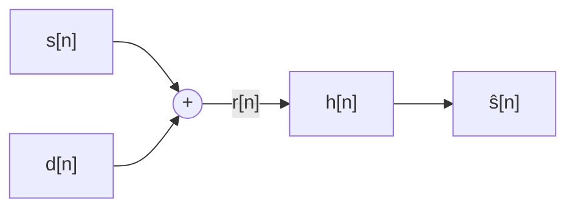
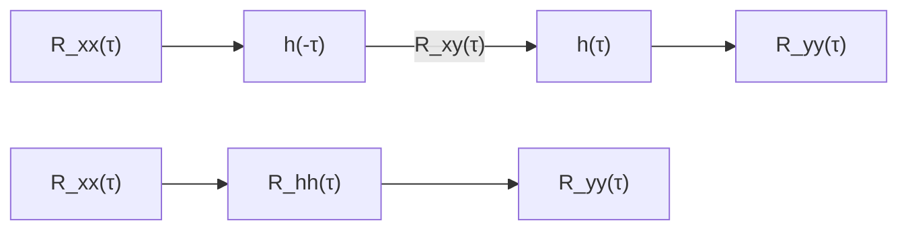
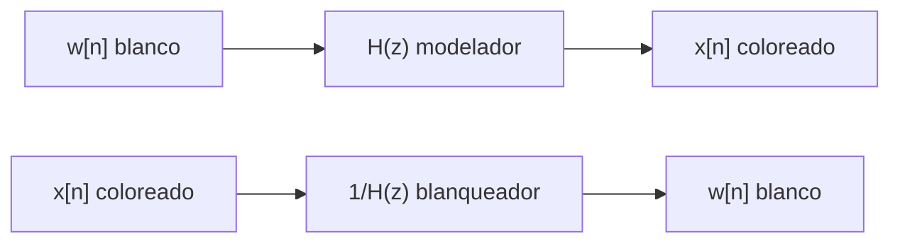
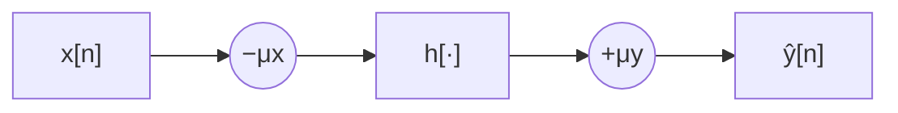
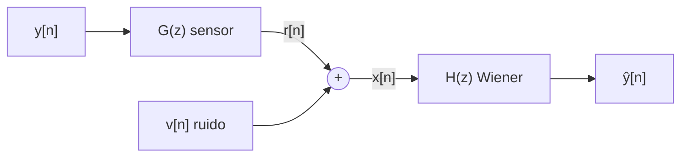
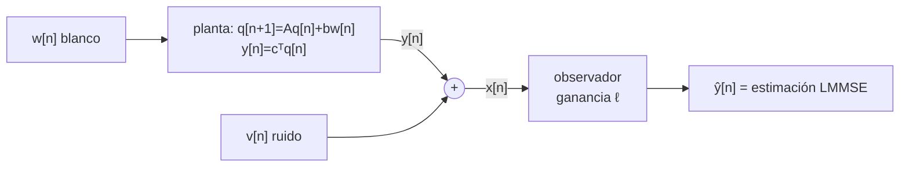
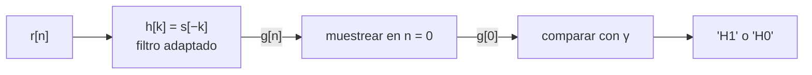
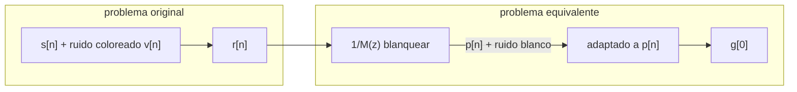

# Modelos probabilísticos
En materias anteriores (como por ejemplo señales y sistemas) estudiamos señales de manera determinística, es decir que teníamos una idea general de las señales que nos íbamos a encontrar, por ejemplo: Una combinación lineal de senos y cosenos, un impulso unitario, un escalón unitario o una rampa unitaria inclusive.
Para esta materia la cosa cambia, vamos a estudiar señales basadas en modelos probabilísticos.

> [!info] Complemento en profundidad
> Este capítulo tiene un documento aparte que desarrolla lo que acá queda enunciado sin demostrar (Bayes generalizado, la desigualdad de Chebyshev, $|\rho|\le1$, la ley de la varianza total), lo trabaja con números, y agrega la parte de estimar a partir de datos: **[[PROCESAMIENTO DE SEÑALES - Cap 7 en profundidad]]**.

###### **El Modelo Probabilístico Básico** 
Este modelo se concentra en tres definiciones principales:
- El espacio de muestreo $\psi$  
- El evento algebraico
- La medida de probabilidad 
Para un desarrollo mas profundo sobre estos tres conceptos, indagar en el apunte de PyE: Variables aleatorias.

###### **Probabilidad Condicional**
Definimos probabilidad condicional de manera tal que es la probabilidad de que ocurra un evento A dado que ha ocurrido el evento B y se denota $P(A|B)$.
La idea principal es entender que sabiendo que ha ocurrido el evento B, podemos deducir que el espacio muestral se ve reducido por tanto la probabilidad condicional resulta:
$$P(A|B) = \frac{P(A,B)}{P(B)}\ \ Si\ P(B)>0$$
###### **Regla De Bayes**
El teorema de Bayes, es un principio basado en la independencia y la probabilidad condicional de manera tal que permite calcular la probabilidad de un evento A dado que a ocurrido un evento B. Esto es:

$$P(A|B) = \frac{P(B|A)\ P(A)}{P(B)}$$
>Demostración en pagina 311 de Oppenheim: Signas, System & Interferente

Esta ecuación, tiene un rol principal en el desarrollo de métodos de detección, clasificación y estimación de señales. 

Esta regla puede generalizarse para casos generales, es decir una probabilidad condicional para un conjunto de eventos, resulta:
$$P(B_l|A) = \frac{P(A|B_l)P(B_l)}{\sum_j P(A|B_j)P(B_j)}$$
>El denominador es la **ley de probabilidad total**. La deducción completa (partiendo un evento según la partición y sumando los pedazos) está en [[PROCESAMIENTO DE SEÑALES - Cap 7 en profundidad]] (Parte 1.1).

###### **Variables aleatorias** 
Una definición burda de variables aleatorias (ya que esto se vio de manera mas profunda en PyE) es decir que una VA es una función que mapea cada resultado probabilístico en un espacio muestral $\psi$. La denotamos con la letra $X$ que no debe confundirse con $x$ (un numero real perteneciente a el espacio muestral $\psi$). 
A veces es conveniente considerar la variable aleatoria como "discreta" de manera tal que hay resultados probabilísticos posibles finitos que podrían ser categorizados o enumerados, para este caso decimos $L_0,L_1....L_n$.

##### **Distribuciones De Probabilidad** 
###### **Distribución De Probabilidad Acumulativa**
Podemos dividir esta definición en tres casos particulares:
- VA continuas.
- VA discretas.
- VA mixtas.
Sin embargo la definición resulta igual en todos los casos pero con matices según el tipo de variable.

Para una VA, la CDF se define como:
$$F_X(x)=P(X \leq x)$$
Entendiendo a: $X \leq x$ como un evento del dominio, tal que sea la probabilidad de que mi VA sea menor a un numero $x$. 

Una regla de calculo muy utilizada es: 
$$P(a<X \leq b) = F_X(b)-F_X(a)$$
Para el caso de una VA continua, la distribución tiene la siguiente forma grafica:

![[Captura de pantalla 2026-08-10 124426.png]]

Para el caso de una VA discreta, la forma es parecida a unas escaleras:

![[Captura de pantalla 2026-08-10 124844.png]]

El caso mas particular (y mas comúnmente visto en el procesamiento de señales) es para variables aleatorias mixtas, es decir, una curva suave en la que en un punto determinado $x_0$ tiene un salto discreto (el cual se puede determinar matemáticamente como un impulso de Dirac: $k\ \delta (x_0)$

![[Pasted image 20260810125208.png]]

###### **Función De Densidad De Probabilidad**
Podemos definir a una función de densidad de probabilidad como la derivada de una función de una distribución de probabilidad acumulada o acumulativa, es decir:

$$f_X(x)=\frac{d}{dx}F_X(x)$$
Cabe aclarar, que la función de densidad es una función netamente positiva, esto es, gracias a que la función acumulativa es siempre creciente.

Además, podemos escribir que:
$$P(a<X \leq b) = \int^b_a f_X(x)\ dx$$
###### **Función De Masa De Probabilidad**
La función de masa de probabilidad es una función de distribución para variables aleatorias discretas que asigna un valor de probabilidad (comprendido entre 0 y 1) a cada valor discreto la probabilidad de que $X$ tome ese valor. Formalmente:

$$P(X = x_j) = p_x(x_j)$$

###### **Variables Aleatorias Distribuidas Conjuntamente**
Algunos modelos, contienen múltiples (o compuestas) variables aleatorias que describen probabilidades conjuntas. 
Veremos como trabajar con dos variables aleatorias a la vez, esto es muy utilizado en modelos de señales. Un ejemplo común es una señal transmitida y la señal recibida pero con ruido. 

Definimos entonces:
- **Función de distribución acumulativa conjunta**
$$F_{X,Y}(x,y) = P(X \leq x ; Y \leq y)$$
- **Función de densidad de probabilidad conjunta**
$$f_{X,Y}(x,y) = \frac{\partial^2}{\partial_x\  \partial_y} F_{X,Y}(x,y)$$

Notar que esta distribución se encuentra en un espacio vectorial en $R^2$, por tanto la probabilidad conjunta de estas variables aleatorias conjuntas es una integral doble sobre una región en dos dimensiones.

$$P((X,Y)∈R)\int \int_R ​f_{X,Y}​(x,y)\ dx\ dy$$

![[Pasted image 20260810214902.png]]


###### **Estimación: Media Y Varianza**
La estimación es el proceso mediante el cual intentamos calcular los verdaderos parámetros de una población entera (como la media $\mu$ o la varianza $\sigma^2$) utilizando únicamente la información que nos da una pequeña muestra ($n$).

**Esperanza**
Para estimar el valor de la media (o en distintas notaciones primer momento o esperanza), la definimos de la siguiente forma: 

$$E(x) = \int^{\infty}_{- \infty} x\ f_X(x)\ dx$$
Una propiedad importante para recordar de la varianza es:
- Linealidad: $E(X+Y) = E(X) + E(Y)$

**Varianza**
Para estimar la varianza, podemos tomar el siguiente desarrollo: 

Partimos de la definición de Varianza
$$\sigma^2_X=E[(X- \mu_X)^2]$$
tomando el cuadrado del binomio:
$$E[(X- \mu_X)^2]=E[(X^2-2\mu_X X + \mu_X^2)]$$
Por propiedad de linealidad, se tiene:
$$E[(X- \mu_X)^2]=E(X^2) - E(2\mu_X X) + E(\mu_X^2)$$
$$E[(X- \mu_X)^2]=E(X^2) - 2\mu_X\ E(X) + E(\mu_X^2)$$Luego tenemos en cuenta lo siguiente: 
- La esperanza de una constante, sin ninguna variable aleatoria, es la misma constante. Es decir:
$$E(\mu_X^2) = \mu_X^2$$
por tanto, resulta:
$$\sigma_X^2 = E(X^2) - \mu_X^2$$
Es importante entender porque estimamos la media y la varianza, ya que en matemática muchas veces es mas complicado trabajar con distribuciones completas. Como la distribución normal y la distribución uniforme la media y la varianza definen toda la función de densidad.

###### **Desigualdad de Chebyshev**
La desigualdad de Chebyshev establece que, para cualquier variable aleatoria con varianza finita, la probabilidad de que sus valores se alejen más de $k$ desviaciones estándar de la media es como máximo $\frac{1}{k^2}$.
$$P(\frac{|X-\mu_X|}{\sigma_X} \geq \alpha) \leq \frac{1}{\alpha^2}$$
>La demostración, en dos pasos (Markov primero, Chebyshev después), está en [[PROCESAMIENTO DE SEÑALES - Cap 7 en profundidad]] (Parte 1.3). Ahí también se ve por qué esta desigualdad —floja como es— es la que permite demostrar la ley de los grandes números.
###### **Esperanza Condicionada E Iterada**
Definimos la esperanza condicional de la variable aleatoria $X$ dado que que la variable aleatoria $Y$ toma el valor de $y$, matemáticamente:
$$E(X|Y = y) = \int_{- \infty}^{\infty} x\  f_{X|Y}\ (x|y)\ dx = g(y)$$
El concepto principal acá es entender que podemos pensar a $E(X|Y)$ como una variable aleatoria, la cual la describimos con la función $g(y)$.

OJO
La notación es fundamental $E(X|Y)$ es una variable aleatoria donde para cada valor de y, resulta: 
$$g(y) = E(X|Y = y)$$
Luego, este valor es un promedio ponderado de todos los posibles valores de $X$.

Vamos a usar este concepto para poder demostrar la propiedad de la torre.

Demostración:
Partimos de la esperanza de X calculada con la densidad marginal:

$$E[X]=\int_{- \infty}^\infty x f_X(x) dx=\int_{- \infty}^\infty x\int_{- \infty}^\infty f_{X,Y}(x,y) dy\ \ dx$$
Ahora factorizamos la conjunta usando la regla de la densidad condicional 

$$f_{X,Y}(x,y)=f_{X∣Y}(x|y) f_Y(y)$$

$$E[X] = \int _ {-\infty}^{\infty} \int _ {-\infty}^{\infty} x\ f_{X|Y}(x|y) f_Y (y)\ dy\ dx$$

Reordenando el orden de integración (Fubini) y sacando $f_Y(y)$ afuera de la integral en $x$ (no depende de x):

$$E[X] = \int _ {-\infty}^{\infty} F_Y(y)\ \ \ ( \int _ {-\infty}^{\infty} x\ f_{X|Y}(x|y)\ dx\ )\ \ \ dy = \int _ {-\infty}^{\infty} f_Y(y)g(y)\ dy$$

Y esa última integral es exactamente $E[g(Y)]=E[E(X|Y)]$ , por definición de esperanza de una función de Y. Queda demostrado.

La interpretación intuitiva es la siguiente:
- Primero tomamos el promedio de $X$ dentro de cada grupo definido por un valor de $Y$, es decir, calculamos $g(y) = E(X|Y = y)$ para cada valor de y posible.
- Luego, promediamos estos promedios parciales pensado cada uno por: que tan probable es el valor de $Y$ ($f_Y(y)$).

>Ejemplo: Supongamos que queremos la altura promedio de una población, y sabemos que hay un 40% de hombres (altura promedio 175cm) y 60% de mujeres (altura promedio 162cm), entonces:
>$$E[Altura] = 0.4 *175+0.6*162=167.2\ cm$$
>Eso **es** $E[X]=E[E[X∣Y]]$, con $Y = género$. Primero promediamos condicional al grupo, después promediamos sobre los grupos.

>La hermana de la torre para segundos momentos es la **ley de la varianza total**: $\mathrm{Var}(X) = E[\mathrm{Var}(X|Y)] + \mathrm{Var}(E[X|Y])$. Está demostrada, y desarrollada con este mismo ejemplo de la altura, en [[PROCESAMIENTO DE SEÑALES - Cap 7 en profundidad]] (Parte 1.6). Es el puente directo con el error del estimador MMSE del capítulo 8.

###### **Correlación Y Covarianza Para Variables Aleatorias Bivariadas**
Consideremos dos variables aleatorias $X$ e $Y$, donde cada una tiene su distribución de probabilidad dedicada y para poder estudiar cada una debemos proyectar la distribución bivariada sobre el eje $x$ (correspondiente a la variable aleatoria $X$) y sobre el eje $y$ (Correspondiente a $Y$), matemáticamente:

$$f_X(x) = \int_{-\infty}^{\infty} f_{X,Y}(x,y)\ dy \ \ \ \ \ f_Y(y) = \int_{-\infty}^{\infty} f_{X,Y}(x,y)\ dx$$
En otras palabras, podemos decir que la distribución de $X$ la podemos obtener integrando la distribución conjunta de todos los valores posibles respecto de $Y$.

La idea central es pensar una distribución bivariada como un espacio vectorial en el que los "vectores de la base" son la distribución de cada variable aleatoria, donde además, podemos resumir esta distribución (en el caso de la normal o gaussiana y de la uniforme) en términos de la media y la varianza.

**Centro de masa**
El centro de masa de una distribución bivariada se define como:
$$(x;y) = (E(X) ; E(Y))$$

Dado que ya conocemos la definición de centro de masa, podemos definir entonces, el calculo de la esperanza y la varianza en distribuciones bivariadas de la forma: $Z= \alpha X + \beta Y$.

**Esperanza Bivariada**
$$E[Z] = \alpha E[X]+ \beta E[Y]$$
**Varianza Bivariada**
$$\sigma_Z^2 = E[(Z-E[Z])^2]\ \ \ \ \implies \ \ \ \ \sigma_Z^2 = \alpha^2 \sigma_X^2 + \beta^2 \sigma_Y^2 + 2 \alpha \beta \sigma_{X,Y}$$
Con: 
- $\sigma^2_X$ como la varianza de la coordenada $x$
- $\sigma^2_Y$ como la varianza de la coordenada $y$
- $\sigma_{X,Y}$ como la covarianza entre $X$ e $Y$

**Covarianza**
Definimos también, la covarianza de dos variables aleatorias.
$$\sigma_{X,Y} = E[XY]-E[X]E[Y]$$
Notar que la expresión $E[XY]$ es una expresión desconocida, el libro la llama correlación o doble momento cruzado.

###### **Correlación**
La correlación es básicamente la esperanza del producto de dos variables aleatorias (OJO "La esperanza del producto" no "El producto de esperanzas". No es lo mismo)
Suele denotarse de la forma: $r_{X,Y} = E[XY]$.

El calculo se fundamenta como el promedio ponderado del producto $xy$ sobre todos los pares posibles, es decir:
$$E[XY] = \int_{- \infty} ^\infty \int_{- \infty} ^\infty x\ y\ f_{X,Y}(x,y) \ dx\ dy$$
>El caso discreto es análogo pero con sumatorias

Es importante tener en cuenta que se necesita la probabilidad conjunta, no basta con las marginales (Las distribuciones de cada VA por separado), generalmente la probabilidad conjunta resulta de la expresión $Z= \alpha X + \beta Y$.

**IMPORTANTE**
**Cuando nuestras dos variables son independientes entre si, la correlación se reduce al producto de las esperanzas, por tanto podemos afirmar que la covarianza es nula o viceversa.**

>Ojo con el "viceversa": la ida (independientes $\Rightarrow$ covarianza nula) siempre vale y está demostrada en [[PROCESAMIENTO DE SEÑALES - Cap 7 en profundidad]] (Parte 1.5). La vuelta **no**: covarianza nula no implica independencia, salvo que las variables sean conjuntamente gaussianas. El contraejemplo clásico ($X$ uniforme, $Y=X^2$) está resuelto con números en la Parte 2.3 del complemento.
 
###### **Coeficiente de correlación**
Este coeficiente, es básicamente una forma normalizada de la covarianza.
$$\rho_{X,Y}= \frac{\sigma_{X,Y}}{\sigma_X \sigma_Y}$$
###### **Interpretación en espacios vectoriales de las propiedades de la correlación**
Esta sección dice explícitamente que hay un sentido matemático preciso en el que las variables aleatorias son vectores en un espacio (de dimensión infinita), siempre que solo nos importen sus propiedades de primer y segundo momento.

SI tomamos $X$ e $Y$ y las representamos como vectores abstractos en algún espacio vectorial llegamos a una definición principal.
$$||X||^2 = E[X^2] \ \ \ ; \ \ \ ||Y|| = E[Y^2]$$
Esto representa que el largo al cuadrado de cada vector es el segundo momento de la variable aleatoria correspondiente. Esto está inspirado directamente en el espacio Euclídeo, donde el largo al cuadrado de un vector es el producto interno del vector consigo mismo.

Si profundizamos en el producto interno, terminamos deduciendo que: 
$$\langle X,Y \rangle:=E[XY]=r_{X,Y}​$$
Pero para que esto tenga sentido, la correlación debe cumplir tres propiedades fundamentales (las cuales se encuentran verificadas en la sección 7.8 del libro Oppenheim), tomando estas conclusiones, asumimos que la correlación cumple con las siguientes propiedades:

- Simetría: $\langle X,Y\rangle = \langle Y,X\rangle$ 
- Linealidad: $\langle X,a_1 Y_1 + a_2 Y_2\rangle = a_1 \langle X,Y_1\rangle + a_2 \langle X,Y_2\rangle$ 
- Positividad: $\langle X,X\rangle = E[X^2] > 0$ 

Como cumple las tres, $E[XY]$ es un producto interno legítimo, ósea no es una analogía forzada, es matemáticamente un producto interno real. Y esto es consistente, además, con por qué llamamos "ortogonales" a $X$ e $Y$ cuando $E[XY]=0$: es literalmente la condición de ortogonalidad de cualquier producto interno.

Si en lugar de tomar las variables aleatorias en bruto como espacio vectorial, las tomamos centradas, es decir:
$$\bar{X} = X - \mu_X \ \ \ y \ \ \ \bar{Y} = Y-\mu_Y$$
Entonces, el espacio euclídeo resulta:
$$||\bar{X}||^2 = E[(X - \mu_X)^2] = \sigma_X^2$$
$$||\bar{Y}||^2 = E[(Y - \mu_Y)^2] = \sigma_Y^2$$

Luego, el producto interno resulta:
$$\langle \bar{X}, \bar{Y}\rangle = E[(X-\mu_X)(Y-\mu_Y)] = \sigma_{X,Y}$$
es exactamente la covarianza.

Si recordamos una propiedad de los espacios euclídeos, el producto interno de dos vectores es: $||a||*||b||*cos(\theta)$, luego aplicando exactamente la misma fórmula a los vectores centrados:
$$\sigma_{X,Y} = \sigma_X \ \sigma_Y \ cos(\theta)$$
despejando tita:
$$\theta = cos^{-1}(\frac{\sigma_{X,Y}}{\sigma_X\ \sigma_Y}) = cos^{-1}(\rho_{X,Y}) \ \ \implies \rho_{X,Y} = cos(\theta)$$
Y ahí está el resultado central de toda la sección: el coeficiente de correlación es, literalmente, el coseno del ángulo entre los vectores que representan las variables centradas.

>Que ese coseno esté entre $-1$ y $1$ —o sea, que $|\rho_{X,Y}|\le1$— es la **desigualdad de Cauchy-Schwarz**, y sale de un truco de una parábola que nunca se hace negativa. La demostración, con la interpretación geométrica y un ejemplo con números, está en [[PROCESAMIENTO DE SEÑALES - Cap 7 en profundidad]] (Parte 1.4). Es el mismo truco que reaparece en el capítulo 11 (densidad espectral cruzada) y en el 13 (filtro adaptado).

## Ejercicios Propuestos 

> [!tip] Solucionario
> Las resoluciones paso a paso de estos ejercicios —con verificación numérica y los gráficos que piden los enunciados— están en **[[PROCESAMIENTO DE SEÑALES - Cap 7 solucionario]]**.

1. Dos números $x$ e $y$ son seleccionados de manera aleatoria e independiente entre el intervalo $[0;1]$. Definimos los eventos $A, B, C\ y\ D$ de la siguiente manera. 
   ![[Pasted image 20260810105718.png]]
   
   a) Determine en los siguientes casos si los eventos son independientes 
   - $A$ y $D$
   - $C$ y $D$
   - $A$ y $B$
   
   b) Verifique si los eventos $B$, $C$ y $D$ son mutuamente independientes.

2. La variable aleatoria V esta distribuida de manera uniforme en un intervalo $[a;b]$.
   a) Determine el valor de la media $\mu_V$, el momento cuadrado $E[V^2]$, la varianza $\sigma_V^2$.
   b) Sea una segunda variable aleatoria $W$ distribuida de la misma manera e independiente de V, hallar la media y la varianza de la variable aleatoria:
   $$Y = V+W$$
   y determine la covarianza y el coeficiente de correlación entre $Y$ y $V$. 

3. Supongamos que $X=2+V$ e $Y=2-V$, cuando $V$ es una variable aleatoria que se distribuye de manera normal con media $\mu =0$ y varianza $\sigma^2 =4$.
   a) Determine la correlación entre $X$ e $Y$.
   b) Son $X$ e $Y$ ortogonales?
   c) Cual es la covarianza?
   d) Cual es el coeficiente de correlación?
   e) Están no correlacionadas?

4. Supongamos $X=Z+V;$ $Y = \beta Z+W$ donde las variables aleatorias $Z,V$ y $W$ tienen sus respectivas medias: $\mu_V; \mu_W; \mu_Z$, varianzas $\sigma^2_V; \sigma^2_W; \sigma^2_Z$ y son mutuamente no correlacionadas (tienen covarianza nula), además el valor $\beta$ es un factor de escala.
  
   a) Determine el valor de covarianza $\sigma_{XY}$ y el coeficiente de correlación $\rho_{XY}= \frac{\sigma_XY}{(\sigma_X \sigma_Y)}$ en términos de las cantidades especificadas anteriormente.
   b) Asumiendo que $\sigma^2_V = \sigma^2_W = \sigma^2_Z$ de una respuesta sobre el coeficiente de correlación respecto del punto a).

5. Las variables aleatorias $X$ e $Y$ tienen: 
   $$E(X)=1\ \  ;\ E(Y)=2\ \ ; \ E(X^2)=9\ \ ; \ E(XY)=-4\ \ ; \ E(Y^2)=7$$
   a) Calcule la covarianza $\sigma_{ZW}$ de las variables aleatorias: 
   $$Z=2X-Y+5, \ \ \ W=X+ \frac{1}{2}Y-1$$
   b) Si $X$ e $Y$ se distribuyen con una distribución Gaussiana bivariada, cual es la densidad conjunta de $Z$ y $W$? (Aprovecha el hecho de que las combinaciones afines de variables aleatorias Gaussianas bivariadas son una Gaussiana bivariada.

6. Un sistema de comunicación transmite señales etiquetadas 1, 2 y 3. La probabilidad de que se envíe el símbolo $j$ y se reciba el símbolo $k$ está listada en la siguiente tabla para cada par $(j,k)$ de símbolo enviado y recibido. Por ejemplo, la probabilidad de que se envíe un 3 y se reciba un 2 es 0.21.

|             | $k$ Recibido | 1    | 2    | 3    |
| ----------- | ------------ | ---- | ---- | ---- |
| $j$ enviado | -            | -    | -    | -    |
| 1           | -            | 0.05 | 0.13 | 0.12 |
| 2           | -            | 0.10 | 0.08 | 0.07 |
| 3           | -            | 0.09 | 0.21 | 0.15 |

   Calcule la probabilidad de que se haya enviado el símbolo $k$ dado que se recibió el símbolo $k$, para $k=1,2,3$. Además, calcule la probabilidad de error de transmisión de este sistema. Un error de transmisión se define como la recepción de cualquier símbolo distinto del transmitido.
# Estimación

> [!info] Complemento en profundidad
> Este capítulo tiene un documento aparte que desarrolla lo que acá queda enunciado sin demostrar (por qué $\hat y=E[Y]$, la propiedad del doble promedio, la regla de ortogonalidad, el LMMSE por cálculo y por geometría, las ecuaciones normales), lo trabaja con cinco ejemplos numéricos resueltos, y agrega la parte de armar el estimador a partir de datos: **[[PROCESAMIENTO DE SEÑALES - Cap 8 en profundidad]]**.

Lo primero que hay que aclarar antes de entrar en materia es que no debemos confundir la estimación en probabilidad y estadística que en probabilidad sin mas, en probabilidad y estadística buscamos aproximarnos a los parámetros poblacionales a partir de parámetros muestrales, para este curso (Probabilidad sin mas) vamos a entender a la estimación de la siguiente forma:

La pregunta principal a responder es: 
_Dada una variable aleatoria $Y$ la cual tengo sus parámetros poblacionales y su distribución 
¿Cómo puedo predecir el valor que va a tomar $Y$ según un criterio en particular?_ 
El libro, plantea un criterio principal:
Minimizar el error cuadrático medio (MMSE por sus siglas en ingles) $E[(Y- \hat{y})^2]$ con algunos matices.
###### **Error Cuadrático Medio (MMSE)***
Primero, supongamos que $Y$ es una variable aleatoria cuyo valor debe estimarse solo a partir del conocimiento de su función de densidad de probabilidad. Luego, la discusión se ampliará a la estimación cuando se disponga de una medición u observación de otra variable aleatoria $X$, junto con la función de densidad de probabilidad conjunta de $X$ y $Y$.
Basándose únicamente en el conocimiento de la función de densidad de probabilidad (PDF) de $Y$, es deseable obtener una estimación de $Y$, denotada como $\hat{y}$, que minimice el error cuadrático medio entre el resultado real del experimento y la estimación y

Como se trata de encontrar el valor mínimo de esta expresión, derivamos respecto de $\hat{y}$ e igualamos a cero, la demostración precisa se encuentra en el apartado 8.1 del libro.

>El camino más limpio no es derivar: es **completar el cuadrado**, que da $E[(Y-\hat y)^2] = \sigma_Y^2 + (\mu_Y - \hat y)^2$ de una. Está en [[PROCESAMIENTO DE SEÑALES - Cap 8 en profundidad]] (Parte 1.1), junto con el argumento de convexidad que confirma que es un mínimo.

El desarrollo llega a la conclusión de que el valor de $\hat{y}$ que hace el MMSE mínimo es:
$$\hat{y}= E[Y]$$
luego se deduce que:
$$MMSE=min(E[(Y-\hat{y})^2]) = \sigma_Y^2$$
Para el caso en el que se dispongan de medidas u observaciones de otra variable aleatoria el desarrollo se implementa con la densidad condicional y es análogo. La demostración se encuentra en el apartado 8.1 del libro.

Se llegan a los siguientes resultados: 
$$\hat{y} = E[Y|X=x]$$
luego
$$MMSE= \sigma_{Y|X=x}^2$$
Ósea, el error cuadrático medio con observaciones adicionales es la varianza condicionada.

###### **Estimador**
Una vez que entendemos estimación, podemos notar que una estimación (en el caso que tenemos una observación adicional $X$) resulta ser un numero cuando $x$ ya fue observado.

Pero en el caso en el que no tengamos este valor observado, la estimación pasa a ser una variable aleatoria. El libro introduce la notación y da el ejemplo de una función evaluada en un punto contra una función evaluada en un punto pero sin saber cual. 

En criollo, no es lo mismo decir: $f(3)$ _"la función f valuada en 3"_  a decir $f(\cdot)$ "_la función $f$ valuada en un punto_"
No es lo mismo.

Para el caso de la estimación, usando esta analogía es útil pensar que $E[Y|X=3]$ no es lo mismo que $E[Y|X=x]$ sin saber aun que valor toma $x$ y por tanto lo pensamos como una variable aleatoria que denotamos $\hat{Y}$.

El apartado también demuestra algo que no es trivial: el estimador $\hat{Y}= E[Y|X=x]$, que minimiza el error para cada valor particular $x$ por separado, también minimiza el error cuadrático medio promediado sobre todos los valores posibles de $X$. Ósea:
$$E_{Y,X}[(Y-\hat{y}(X))^2] = E_X(EY|X[(Y-\hat{y}(X))^2|X])$$
>La demostración de ese "no trivial" es corta y sale de la esperanza iterada: como estás promediando errores condicionales no negativos y minimizás cada uno por separado, el promedio también queda mínimo. Escrita paso a paso en [[PROCESAMIENTO DE SEÑALES - Cap 8 en profundidad]] (Parte 1.2). Ahí también está la **regla de ortogonalidad** (el error es ortogonal a *toda* función de $X$), que es la que explica por qué el LMMSE funciona como funciona.
###### **Error Cuadrático Medio Lineal (LMMSE)**
En general, la esperanza condicional $E(Y|X)$ requerida para el estimador MMSE es difícil de determinar porque la densidad condicional $f_{Y|X}(y|x)$ no se determina fácilmente. Un compromiso útil y ampliamente utilizado es restringir el estimador a ser una función lineal fija (o más específicamente, afín, es decir, lineal más una constante) de las variables aleatorias medidas, y elegir la relación lineal de manera que se minimice el error cuadrático medio total promediado sobre los valores que $Y$ y $X$ pueden tomar conjuntamente. 
El estimador resultante se llama estimador lineal de mínimo error cuadrático medio (LMMSE). 

Primero se presenta el caso más simple. Supongamos que se construye un estimador para la variable aleatoria $Y$ en términos de otra variable aleatoria $X$, restringiendo el estimador a la forma:
$$\hat {y}_\ell = \hat {y}_\ell\ (X) = aX+b$$
donde $a$ y $b$$ se deben determinar para minimizar el error cuadrático medio.
$$E_{Y,X}[(Y-\hat{Y}_\ell)^2] = E_{Y,X}[(Y-(aX+b))^2]$$
Resolviendo a y b, se obtiene:
$$\hat{Y}_ \ell = \mu_Y + \rho_{Y,X}\ \frac{\sigma_Y}{\sigma_X}\ (X-\mu_X)$$
luego:
$$LMMSE= \sigma^2_Y\ (1-\rho^2_{Y,X})$$
La demostración completa se encuentra en la sección 8.3 del libro.

>Está resuelta por **tres caminos** en [[PROCESAMIENTO DE SEÑALES - Cap 8 en profundidad]] (Partes 1.4 y 1.5): por cálculo (dos derivadas parciales), por ortogonalidad (dos condiciones, sin derivar), y por geometría pura (la fórmula de proyección más Pitágoras, de donde el $\sigma_Y^2(1-\rho^2)$ sale sin ninguna cuenta). También muestra que para $(X,Y)$ **conjuntamente gaussianas** el LMMSE coincide exacto con el MMSE, que es lo que habilita a los capítulos 12 y 13 a usar solo estimadores lineales.

**La interpretación vectorial**
Acá es donde la sección conecta directo con la interpretación vectorial que vimos al cerrar el capítulo anterior. El problema de encontrar $a \widetilde{X}$ que minimice $||\widetilde{Y} - a \widetilde{X}||^2$ es literalmente el problema de proyección ortogonal de un vector sobre otro en álgebra lineal.

![[Pasted image 20260814125405.png]]

Geométricamente: de todos los múltiplos posibles $a \widetilde{X}$ (todos los puntos a lo largo de la dirección de $\widetilde{X}$, el más cercano $\widetilde{Y}$ es la proyección ortogonal, el punto donde el segmento que une $\widetilde{Y}$ con $a \widetilde{X}$ forma 90° con la dirección de $\widetilde{X}$. Es el mismo argumento geométrico de "la distancia más corta de un punto a una recta es la perpendicular", trasladado al espacio de variables aleatorias.

###### **Múltiples medidas**
Ahora, extendemos el estimador LMMSE al caso en que la estimación de una variable aleatoria Y se basa en las observaciones de múltiples variables aleatorias, digamos $X1,...,XL,$ reunidas en el vector $X$. Entonces, el estimador afín puede escribirse en la forma:
$$\hat{Y}_\ell = a_o+ \sum^L_{j=1}\ a_j\ X_j$$
El desarrollo correspondiente se encuentra en la sección 8.3.1 del libro (y demostrado por ortogonalidad, más corto, en [[PROCESAMIENTO DE SEÑALES - Cap 8 en profundidad]] Parte 1.6). Su conclusión es un sistema lineal de L ecuaciones con L incógnitas:
$$\sum_{j=1}^L \ \sigma_{X_i , X_j}\ a_j = \sigma_{X_i,Y}\ \ \ \ con: \ i=1,...,L$$
Escrito en forma matricial:
$$
\begin{equation}
	\begin{bmatrix}
	\sigma_{X_1X_1} & \sigma_{X_1X_2} & \cdot \cdot \cdot & \sigma_{X_1X_L} \\
	\sigma_{X_2X_1} & \sigma_{X_2X_2} & \cdot \cdot \cdot & \sigma_{X_2X_L} \\
	\cdot & \cdot & \cdot \cdot \cdot & \cdot \\
	\cdot & \cdot & \cdot \cdot \cdot & \cdot \\
	\sigma_{X_LX_1} & \sigma_{X_LX_2} & \cdot \cdot \cdot & \sigma_{X_LX_L} \\
	\end{bmatrix}
	\cdot
	\begin{bmatrix}
	a_1 \\
	a_2 \\ 
	\cdot \\ 
	\cdot \\
	a_L
	\end{bmatrix}
	=
	\begin{bmatrix}
	\sigma_{X_1Y} \\
	\sigma_{X_2Y} \\
	\cdot \\
	\cdot \\
	\sigma_{X_LY} \\
	\end{bmatrix}
\end{equation}
$$
Compactamente: 
$$C_{XX} \ a = c_{XY}$$

donde $C_{XX}$ es la matriz de covarianza de las mediciones y $c_{XY}$ es el vector de covarianzas entre cada medición y la variable a estimar. 

Este sistema se llama las ecuaciones normales, y su solución es:
$$a = C_{XX}^{-1} \ c_{XY}$$
Llegando finalmente a la expresión de LLMSE generalizada:
$$LMMSE= \sigma_Y^2\ -\ c_{YX}\ C_{XX}^{-1}\ c_{XY}$$

Este sistema es exactamente lo que vamos a resolver (bajo otro nombre) en cualquier problema de filtrado de Wiener discreto, arrays de antenas, o ecualización de canales, la matriz de covarianza de las mediciones captura toda la "geometría" del problema: si dos mediciones están muy correlacionadas entre sí (redundantes), la matriz refleja eso y el sistema ajusta automáticamente cuánto peso $a_j$​ darle a cada una para no "duplicar" información.

>Qué pasa *exactamente* con mediciones redundantes (la matriz se vuelve casi singular, los pesos individuales explotan con signos opuestos, pero el error se mantiene sano), más el hecho de que un MMSE negativo delata correlaciones imposibles, está resuelto con números en [[PROCESAMIENTO DE SEÑALES - Cap 8 en profundidad]] (Parte 2.5). La parte de cómo resolver este sistema en la práctica (Cholesky, número de condición, regularización) está en la Parte 3.

## Ejercicios Propuestos

> [!tip] Solucionario
> Las resoluciones paso a paso de estos ejercicios —con verificación numérica y los gráficos que piden los enunciados— están en **[[PROCESAMIENTO DE SEÑALES - Cap 8 solucionario]]**.

1. Para cada uno de los siguientes puntos, indique si la afirmación dada es verdadera o falsa. Para una afirmación verdadera, dé una explicación breve pero convincente; para una falsa, dé un contraejemplo o una explicación convincente.

   a) Si $\hat Y$ es el estimador LMMSE de $Y$ en términos de otra variable aleatoria $X$, entonces el MMSE correspondiente $E[(Y-\hat Y)^2]$ puede expresarse como
   $$E[(Y-\hat Y)^2] = E[Y^2] - E[Y\hat Y].$$
   b) Supongamos que $X$ e $Y$ son variables aleatorias con media $0$ y la misma varianza $\sigma^2$, y supongamos que se sabe que $E[Y|X=x] = \frac{1}{3}x$ para todos los valores $x$ que puede tomar la variable aleatoria $X$. El coeficiente de correlación entre $X$ e $Y$ debe ser entonces $\frac13$.

2. Para cada uno de los siguientes puntos, indique si la afirmación dada es verdadera o falsa. Para una afirmación verdadera, dé una explicación breve pero convincente; para una falsa, dé un contraejemplo o una explicación convincente.

   a) Supongamos que el estimador LMMSE $\hat Y$ de la variable aleatoria $Y$ en términos de $X$ es simplemente la media de $Y$, es decir, $\hat Y = \mu_Y$. Entonces $X$ e $Y$ deben ser independientes.
   b) Supongamos que la variable aleatoria $X$ está distribuida de manera uniforme en el intervalo $[-1,1]$, y sea $Y=X^2$ (de modo que $Y$ queda completamente determinada por $X$). El estimador LMMSE $\hat Y$ de $Y$ en términos de $X$ es $0$.
   c) Supongamos que $X_1$ y $X_2$ son variables aleatorias no correlacionadas. Entonces el estimador LMMSE de $Y$ en términos de $X_1$ y $X_2$ está dado por $\hat Y = \hat Y_1 + \hat Y_2$, donde $\hat Y_1$ es el estimador LMMSE de $Y$ en términos de solo $X_1$, y de manera similar $\hat Y_2$ es el estimador LMMSE de $Y$ en términos de solo $X_2$.

3. $X$ e $Y$ son dos variables aleatorias con PDFs desconocidas. $X$ tiene media nula. El estimador MMSE $\hat Y$ de $Y$ dado $X$ es $\hat Y = 5$. A partir de la información dada, especifique si $X$ e $Y$ son definitivamente estadísticamente independientes, definitivamente no independientes, o si no puede determinarse con la información dada. Explique.

4. Considere el par de variables aleatorias Gaussianas bivariadas $X$ e $Y$, donde $\mu_X=0$. El estimador MMSE para $Y$ en términos de $X$ es $\hat Y_{MMSE}(X)=2$.

   a) ¿Cuál es $E[Y]$?
   b) Especifique si $X$ e $Y$ están correlacionadas, no correlacionadas, o si no hay información suficiente para determinarlo. Explique.
   c) Especifique si $X$ e $Y$ son independientes, dependientes, o si no hay información suficiente para determinarlo. Explique.
   d) ¿Cuál es el estimador MMSE de $X$ en términos de $Y$, $\hat X_{MMSE}(Y)$?

5. Supongamos que $X$ e $Y$ son variables aleatorias de media nula y varianza unitaria. Si el estimador LMMSE $\hat y(X)$ de $Y$ en términos de $X$ está dado por
   $$\hat y(X) = \frac34 X,$$
   ¿cuál es su error cuadrático medio? Además, supongamos que la variable aleatoria $Q$ se define como $Q=Y+3$; ¿cuál es el estimador LMMSE $\hat q(X)$ de $Q$ en términos de $X$, y cuál es su error cuadrático medio? Finalmente, ¿cuál es el estimador LMMSE $\hat x(Y)$ de $X$ en términos de $Y$, y cuál es su error cuadrático medio?

6. Las variables aleatorias $X$ e $Y$ están distribuidas de manera uniforme en la región sombreada mostrada en la figura.

   ![[Pasted image 20260814133929.png|311]]

   a) Determine y grafique el estimador MMSE $\hat Y_{MMSE}(X)$ de $Y$ dado $X$.
   b) Determine y grafique el estimador MMSE $\hat X_{MMSE}(Y)$ de $X$ dado $Y$.

7. Supongamos que dos variables aleatorias $X$ e $Y$ tienen una PDF conjunta $f_{X,Y}(x,y)$ que es constante en la región sombreada mostrada en la figura, y nula en el resto:

   ![[Pasted image 20260814133944.png|211]]

   a) Realice gráficos completamente etiquetados de las densidades $f_X(x)$ y $f_{Y|X}(y|\tfrac13)$.
   b) ¿Son $X$ e $Y$ estadísticamente independientes? Explique.
   c) Determine y realice un gráfico completamente etiquetado (en función de $x$) de $\hat y_{MMSE}(X)$, el estimador MMSE de $Y$ basado en observar $X$.
   d) Para evaluar qué tan bien se desempeñará en promedio el estimador del punto c), determine el error cuadrático medio $e^2$ y el sesgo $b$ asociados al estimador:
   $$e^2 = E\left[\left(\hat y_{MMSE}(X)-Y\right)^2\right], \quad \text{y} \quad b = E[\hat y_{MMSE}(X)-Y],$$
   donde la esperanza se toma sobre $X$ e $Y$ conjuntamente.
   e) Determine $\hat y_{LMMSE}(X)$, el estimador MMSE lineal de $Y$, y su MMSE asociado.

8. Dos variables aleatorias $X$ e $Y$ tienen una PDF conjunta $f_{X,Y}(x,y)$ que es igual a una constante $K$ en la región sombreada mostrada en la figura, y es igual a cero en el resto.

![[Pasted image 20260814134002.png|267]]

   a) i) Encuentre $K$.
      ii) Realice un gráfico etiquetado de la PDF marginal $f_Y(y)$.
      iii) Realice un gráfico etiquetado de la PDF condicional $f_{Y|X}(y|\tfrac14)$.
   b) Encuentre la estimación MMSE de $Y$ dado que se observó $X=x$, es decir, la media condicional $E(Y|X=x)$, donde $x$ puede ser cualquier valor entre $0$ y $2$.
   c) Encuentre la estimación LMMSE de $Y$ dado que se observó $X=x$, donde $x$ puede ser cualquier valor entre $0$ y $2$. Note que $E(XY)=\tfrac34$ para la función de densidad de probabilidad conjunta mostrada en la figura.

9. Supongamos que $X$ e $Y$ son variables aleatorias con PDF conjunta $f_{X,Y}(x,y)$ que es constante en el área sombreada mostrada en la figura, y nula en el resto.

   ![[Pasted image 20260814134021.png|303]]

   a) Encuentre el estimador LMMSE de $Y$ a partir de medir $X$.
   b) Para $x$ en el rango de $-2$ a $2$, realice un gráfico completamente etiquetado del estimador MMSE de $Y$. ¿Cómo se compara el estimador correspondiente con el del punto a)?

10. Considere una señal sinusoidal de la forma
    $$X(t) = A\cos(\omega_0 t + \Theta)$$
    donde $\omega_0$ se asume conocido, mientras que $A$ y $\Theta$ son variables aleatorias estadísticamente independientes, con la PDF de $\Theta$ uniforme en el intervalo $[0,2\pi]$. Supongamos que se desea construir un estimador LMMSE para $X(t_2)$ a partir de las mediciones $X(t_0)$ y $X(t_1)$, es decir, un estimador de la forma
    $$\hat X(t_2) = a_0 X(t_0) + a_1 X(t_1) + b$$
    que minimiza el error cuadrático medio
    $$E\left[\left(X(t_2)-\hat X(t_2)\right)^2\right].$$

    a) Determine el valor óptimo de $b$.
    b) Plantee en detalle las ecuaciones específicas que necesitaría resolver para obtener los valores óptimos de $a_0$ y $a_1$, y utilícelas para calcular $a_0$ y $a_1$. Verifique que sus respuestas tomen valores razonables para los siguientes dos casos: i) $t_2=t_1$; ii) $t_2=t_0$. Para manejar estos cálculos de forma prolija, puede ser útil recordar que la inversa de una matriz $2\times2$ de la forma
    $$\begin{pmatrix} p & q \\ r & s\end{pmatrix}$$
    es
    $$\frac{1}{ps-qr}\begin{pmatrix} s & -q \\ -r & p\end{pmatrix},$$
    afirmación que puede verificar directamente multiplicando ambas matrices entre sí.
    c) Muestre que el MMSE asociado a este estimador lineal es cero.

11. Considere un sistema de comunicación digital en el cual un flujo de bits (1s y 0s) independientes e idénticamente distribuidos (i.i.d.) $s[n]$ es transmitido a través de un canal defectuoso y sin memoria, con 1s y 0s equiprobables. La probabilidad de que un 1 sea recibido como un 0 es $1/8$ y la probabilidad de que un 0 sea recibido como un 1 es $1/4$. Este tipo de canal se conoce como canal binario sin memoria y se representa en la figura.

    ![[Pasted image 20260814134042.png|316]]

    a) Para cualquier índice de tiempo $n$, determine la PMF conjunta $P(r,s)$ y la PMF marginal $P(r)$.
    b) Para obtener una estimación $\hat s[n]$ de $s[n]$ a partir de $r[n]$, la señal recibida puede procesarse a través de un sistema sin memoria, posiblemente no lineal, $F$. El sistema sin memoria $F$ (ver figura) debe diseñarse para minimizar el error cuadrático medio definido como:
    $$\epsilon = E\left[(s[n]-\hat s[n])^2\right].$$
    Determine el sistema $F$.
    c) Con el sistema obtenido en b), determine el valor $\hat s[n]$ que minimiza
    $$E\left[(s[n]-\hat s[n])^2 \mid r[n]=r\right].$$
    ![[Pasted image 20260814134144.png|258]]
    Además, determine la probabilidad de que, en un índice de tiempo arbitrario $n_0$, la estimación $\hat s[n_0]$ y el valor verdadero $s[n_0]$ sean iguales.

12. Considere un sistema de comunicación en el cual la variable aleatoria $Y$ es transmitida a través de un canal con una ganancia aleatoria $W$, de modo que la variable recibida es $X=WY$. Asuma que $Y$ y $W$ son independientes, y que ambas están distribuidas de manera uniforme en el rango $[1,2]$.

    a) Suponga que usted está en el receptor y quiere estimar el valor transmitido $Y$ a partir de una medición del valor recibido $X$, utilizando el estimador LMMSE $\hat Y = d_1 X + d_2$. Determine cuáles deben ser $d_1$ y $d_2$, y calcule el MMSE asociado.
    b) Suponga en cambio que usted está en el transmisor y quiere estimar cuál será el valor recibido $X$ a partir de una medición del valor transmitido $Y$. Encuentre el estimador MMSE (sin restricciones) $\hat X(Y)$.


# Pruebas De Hipótesis

> [!info] Complemento en profundidad
> Este capítulo tiene un documento aparte que desarrolla lo que acá queda enunciado sin demostrar (que la regla MAP es óptima y no solo "razonable", el lema de Neyman-Pearson, la pendiente de la ROC, el umbral de riesgo mínimo), lo trabaja con números (MAP con varianzas distintas, diseño Neyman-Pearson, costos asimétricos), y agrega la parte de evaluar con datos (ROC empírica, AUC, cuántas simulaciones hacen falta, prevalencia y valor predictivo): **[[PROCESAMIENTO DE SEÑALES - Cap 9 en profundidad]]**.

El tema de las pruebas de hipótesis surge en muchos contextos en el procesamiento de señales y las comunicaciones, así como en medicina, estadísticas y otros ámbitos en los que se debe elegir entre múltiples explicaciones o hipótesis basándose en datos limitados y ruidosos. Las pruebas de hipótesis ofrecen un marco para seleccionar entre M posibles explicaciones para los datos disponibles de manera alguna manera principiada u óptima.
##### **MODULACIÓN BINARIA DE AMPLITUD DE PULSO EN RUIDO**
Arranquemos con un ejemplo de ingeniería concreto: un sistema de modulación de amplitud de pulsos (PAM). El modelo, reducido a su esencia:
$$R=A+V$$

Donde $A$ es la amplitud transmitida y $V$ es ruido del canal.

En señalización binaria, $A$ solo puede tomar dos valores posibles ($a_0$ o $a_1$), así que estimar $A$ se reduce a decidir, a partir de la medición $r$, cuál de las dos amplitudes fue transmitida. Esto define dos hipótesis:
- $H_0$: se transmitió $a_0$, por lo tanto $R = a_0+V$
- $H_1$: se transmitió $a_1$, por lo tanto $R = a_1+V$

La tarea es decidir entre $H_0$ y $H_1$ a partir de la medición $R=r$. Este problema (decidir entre hipótesis con datos ruidosos) es el que busca estudiar.

##### **PRUEBA DE HIPÓTESIS CON PROBABILIDAD DE ERROR MÍNIMA**
Partimos conociendo las probabilidades a priori de cada hipótesis, estas son las probabilidades que se le asignan a cada hipótesis antes de tener una medición $R=r$:
$$P(H_0)=p_0 \ \ \ ; \ \ \ P(H_1)=p_1$$
y, para el caso de una medición continua, las densidades condicionales $f_{R|H}(r|H_0)$ y $f_{R|H}(r|H_1)$, que describen cómo se distribuye la medición bajo cada hipótesis.

**Regla MAP (Máximum A Posteriori)**
Para minimizar la probabilidad de error condicionada a la medición $R=r$, hay que decidir a favor de la hipótesis con mayor probabilidad a posteriori (es decir despues de que se tomo la medicion):
$$P(H_1|R=r)\underset{H_0}{\overset{H_1}{\gtrless}}P(H_0|R=r)$$
La notación $\underset{H_0}{\overset{H_1}{\gtrless}}$  indica que elegimos $H_1$ si el primer termino es mayor al segundo o $H2$ en caso contrario.
Usando la regla de Bayes para reescribir las probabilidades a posteriori en términos de las densidades condicionales y las probabilidades a priori (y cancelando $f_R(r)$, que es común a ambos lados), la comparación se reduce a:
$$p_1\ f_{R|H}(r|H_1)\underset{H_0}{\overset{H_1}{\gtrless}}p_0\ f_{R|H}(r|H_0)$$
Es decir: las densidades condicionales de cada hipótesis se "escalan" por su probabilidad a priori, y uno decide a favor de la hipótesis cuya curva escalada sea mayor en el punto $r$ medido.

Esta regla induce una partición del espacio de mediciones en regiones de decisión: 
- $D_1$ (los valores de $r$ para los que se decide $H_1$)
- $D_0$ (el resto). 
El razonamiento se extiende de forma directa a más de dos hipótesis, y a mediciones de más de una variable aleatoria a la vez.

![[c9-regiones-decision.svg]]

>Ojo con la notación: $P(H_0)$ y $P(H_1)$ son las probabilidades *a priori* (antes de medir nada), mientras que $P(H_0|R=r)$ y $P(H_1|R=r)$ son las probabilidades *a posteriori* (después de la medición). La regla MAP maximiza esta última.

>La demostración de que esta regla efectivamente minimiza la probabilidad de error **total** (no solo la condicional para cada $r$) es corta y sale de que $f_R(r)\ge0$: minimizar punto a punto minimiza el promedio. Está en [[PROCESAMIENTO DE SEÑALES - Cap 9 en profundidad]] (Parte 1.1), junto con la extensión a $M$ hipótesis y qué se decide en las fronteras entre regiones (Parte 1.2).

##### **PRUEBA DE HIPÓTESIS BINARIA**
Acá se detalla el caso de dos hipótesis, introduciendo conceptos que se usan mucho en la práctica (radar, tests médicos, detección digital).

**Falsa alarma, miss y detección** (Errores tipo 1 y tipo 2)
Dada una regla de decisión, hay cuatro combinaciones posibles entre la hipótesis verdadera y la decisión tomada. Dos de ellas son errores, y se les da nombre propio:
- $P_{FA} = P(\text{`}H_1\text{'}|H_0)$: **probabilidad de falsa alarma** (decidir $H_1$ cuando en realidad es $H_0$)
- $P_M = P(\text{`}H_0\text{'}|H_1)$: **probabilidad de miss** (decidir $H_0$ cuando en realidad es $H_1$)
- $P_D = P(\text{`}H_1\text{'}|H_1) = 1-P_M$: **probabilidad de detección**

Con esto, la probabilidad de error total resulta:
$$P_e = p_0 P_{FA} + p_1 P_M$$
Esta terminología viene del contexto de radar ($H_1$ = target presente), pero se traduce directamente al ámbito médico:
- $P_D$ = sensibilidad del test
- $P_{FA}$ = probabilidad de falso positivo (y $1-P_{FA}$ = especificidad)
- $P_M$ = probabilidad de falso negativo
- $P(H_1)$ = prevalencia de la condición
- $P(H_1|\text{`}H_1\text{'})$ = valor predictivo positivo

>Un test puede ser muy sensible y específico, pero si la prevalencia de la condición es baja, el valor predictivo positivo puede ser sorprendentemente bajo (vale la pena explorarlo con Bayes). La cuenta hecha —un test con sensibilidad y especificidad del $99\%$, aplicado a una condición de prevalencia $0{,}1\%$, da positivos que son falsos el $91\%$ de las veces— está en [[PROCESAMIENTO DE SEÑALES - Cap 9 en profundidad]] (Parte 3.5), con el gráfico de VPP contra prevalencia.

**Test de razón de verosimilitud (Likelihood Ratio Test)**
Reacomodando la regla MAP, se llega a una forma equivalente y muy usada:
$$\Lambda(r) = \frac{f_{R|H}(r|H_1)}{f_{R|H}(r|H_0)}\underset{H_0}{\overset{H_1}{\gtrless}}\eta$$
donde: 
- $\Lambda(r)$ es la razón de verosimilitud 
- $\eta$ es el umbral de decisión (que para la regla MAP vale $\eta = p_0/p_1$). 
Lo interesante es que otros criterios de decisión (no solo minimizar $P_e$) también terminan llevando a un test de umbral sobre $\Lambda(r)$, cambiando únicamente el valor de $\eta$.

**Criterio de Neyman-Pearson**
Cuando no se conocen las probabilidades a priori $p_0, p_1$ (algo común en la práctica), una alternativa es fijar una cota tolerable para $P_{FA}$ y, sujeto a esa restricción, maximizar $P_D$. Se puede demostrar que la solución óptima sigue siendo un test de razón de verosimilitud, con el umbral $\eta$ elegido para que $P_{FA}$ alcance justo la cota especificada (no depende de $p_0, p_1$).

>La demostración completa de ese "se puede demostrar" —el **lema de Neyman-Pearson**, con el argumento del intercambio de franjas y la intuición de "problema de presupuesto"— está en [[PROCESAMIENTO DE SEÑALES - Cap 9 en profundidad]] (Parte 1.3), y un diseño concreto con $P_{FA}$ objetivo resuelto con números en la Parte 2.2.

**Curva ROC (Receiver Operating Characteristic)**
Es el gráfico de $P_D$ en función de $P_{FA}$ a medida que se varía el umbral $\eta$ entre $0$ e $\infty$. Sirve para visualizar el compromiso entre ambas probabilidades y para comparar el desempeño de distintos tests: cuanto más se acerca la curva a la esquina superior izquierda (arriba a la izquierda), mejor es el test.

![[c9-roc.svg]]

Los dos extremos de la curva son fáciles de ubicar: con $\eta\to\infty$ nunca declaramos $H_1$, así que $P_{FA}=P_D=0$ (esquina inferior izquierda); con $\eta\to0$ siempre declaramos $H_1$, así que $P_{FA}=P_D=1$ (esquina superior derecha). La diagonal corresponde a decidir al azar, y toda curva por encima de ella representa un detector que aporta algo.

>Hay un resultado geométrico lindo que no está en el libro: **la pendiente de la ROC en cada punto es exactamente el umbral $\eta$ que se usa ahí**. De eso sale que la ROC óptima es cóncava, y que el punto de mínimo $P_e$ es donde la pendiente vale $p_0/p_1$ — o sea, la regla MAP mirada en el plano de la ROC. Demostrado en [[PROCESAMIENTO DE SEÑALES - Cap 9 en profundidad]] (Parte 1.4). La parte de estimar una ROC y un AUC con datos reales, y las trampas que trae, está en la Parte 3.

##### **DECISIONES DE RIESGO MÍNIMO**
Es una generalización de la regla MAP que incluye la minimización de $P_e$ como caso particular. Se asigna un costo $c_{ij}$ a cada combinación de hipótesis verdadera $H_j$ y decisión $\text{`}H_i\text{'}$, y se busca minimizar el costo esperado (o "riesgo") condicionado a la medición:
$$E[\text{Costo de }\text{`}H_i\text{'}|R=r] = \sum_{j} c_{ij}\ P(H_j|R=r)$$
Si $c_{ii}=0$ y $c_{ij}=1$ para $i\neq j$ (todos los errores penalizados por igual), este costo esperado se reduce exactamente a la probabilidad de error condicional, y la regla de riesgo mínimo coincide con la regla MAP. En el caso binario, esta regla también se puede escribir como un test de razón de verosimilitud, con un umbral
$$\eta = \frac{P(H_0)(c_{10}-c_{00})}{P(H_1)(c_{01}-c_{11})}$$
que depende de los costos además de las probabilidades a priori.

>La derivación de esa fórmula del umbral, paso por paso (incluido el supuesto implícito de que equivocarse cuesta más que acertar), está en [[PROCESAMIENTO DE SEÑALES - Cap 9 en profundidad]] (Parte 1.5). Y un ejemplo con números que muestra por qué **minimizar el riesgo no es lo mismo que minimizar $P_e$** cuando los costos difieren está en la Parte 2.3.

## Ejercicios Propuestos

> [!tip] Solucionario
> Las resoluciones paso a paso de estos ejercicios —con verificación numérica y los gráficos que piden los enunciados— están en **[[PROCESAMIENTO DE SEÑALES - Cap 9 solucionario]]**.

1. Una estudiante está rindiendo un examen y es igualmente probable que no haya estudiado (hipótesis $H_0$) o que sí haya estudiado (hipótesis $H_1$).

   El examen consta de dos problemas, $a$ y $b$. Si la estudiante responde correctamente el problema $a$ (respectivamente $b$) diremos que ocurrió el evento $A$ (respectivamente $B$), y en caso contrario diremos que ocurrió el evento $\bar A$ (respectivamente $\bar B$). Asuma que el desempeño de la estudiante en el problema $a$ es independiente del desempeño en el problema $b$, tanto si no estudió como si estudió.

   Suponga que $P(A|H_1)=0.8$, $P(B|H_1)=0.6$, $P(A|H_0)=0.5$ y $P(B|H_0)=0.2$.

   a) Para cada resultado posible del examen (cada combinación posible de $A$ o $\bar A$ con $B$ o $\bar B$), encuentre la decisión de mínima probabilidad de error.
   b) Para la regla de decisión obtenida en a), encuentre la probabilidad condicional de declarar que la estudiante no estudió ($\text{`}H_0\text{'}$), dado que en realidad sí estudió ($H_1$).

2. Al elegir con mínima probabilidad de error entre la hipótesis $H_0$ de que una medición dada $x$ proviene de una distribución normal (Gaussiana) con media $0$ y varianza $4$, y la hipótesis $H_1$ de que esta medición proviene de una distribución normal con media $1$ y varianza $4$, sabemos que el test óptimo declara $H_1$ si $x$ supera cierto umbral $\gamma$. Determine $\gamma$ en cada uno de los siguientes casos: i) la probabilidad condicional de falsa alarma es $P_{FA}=0.5$; y ii) la probabilidad condicional de miss es $P_M=0.5$.

3. Considere un problema de prueba de hipótesis binaria en el que se observa una variable aleatoria $X$ con las siguientes PDFs condicionales (ver figura):
   $$f_{X|H}(x|H_0) = \frac{1}{\pi(x^2+1)} \quad \text{y} \quad f_{X|H}(x|H_1) = \frac{2}{\pi(x^2+4)}.$$
   Suponga que las hipótesis $H_0$ y $H_1$ tienen probabilidades a priori $P(H_0)=0.4$ y $P(H_1)=0.6$, respectivamente. Se busca diseñar una regla de decisión para declarar $H_0$ o $H_1$, y analizar su desempeño.

   ![[ej-p9-3.png]]

   a) Encuentre la regla de decisión de mínima probabilidad de error, es decir, la que minimiza $P(H_0,\text{`}H_1\text{'}) + P(H_1,\text{`}H_0\text{'})$. Simplifique su respuesta tanto como sea posible.
   b) Indique, sombreando las regiones apropiadas de los gráficos de las densidades condicionales, cómo calcularía: i) la probabilidad condicional de falsa alarma, $P_{FA}$; y ii) la probabilidad condicional de miss, $P_M$.

4. Se observa una variable aleatoria $R$ y se sabe que con probabilidad $p_0=\frac13$ su PDF es $f_0(r)$, y con probabilidad $p_1=(1-p_0)=\frac23$ su PDF es $f_1(r)$, especificadas como:
   $$f_0(r) = \begin{cases} \frac12, & -1\leq r\leq 1 \\ 0, & \text{en otro caso} \end{cases} \qquad f_1(r) = \frac12 e^{-|r|}.$$

   Observamos el valor de $R$ y, a partir de esto, decidimos si $f_0(r)$ es la PDF subyacente o si lo es $f_1(r)$.

   ```mermaid
   flowchart LR
       R["R"] --> D["caja de<br/>decisión"]
       D --> S["decidir f₀<br/>o<br/>decidir f₁"]
   ```

   Para los puntos a) y b) solamente, asuma que la caja de decisión está especificada de la siguiente manera:
   $$\text{si } |r|>\gamma \text{ decida } f_0(r), \qquad \text{si } |r|\leq \gamma \text{ decida } f_1(r).$$

   a) Para $\gamma=\frac12$, determine la probabilidad de error. Muestre claramente su razonamiento.
   b) Realice un gráfico cuidadosamente etiquetado de la ROC para esta caja de decisión, a medida que $\gamma$ varía de $0$ a $+\infty$. Muestre claramente su razonamiento.
   c) Determine el diseño de la caja de decisión que minimiza la probabilidad de error. Muestre claramente su razonamiento.
   d) Para esta parte del problema, $p_0$ y $p_1$ ya no están restringidos a los valores $\frac13,\frac23$, pero $p_0$ no puede ser ni $0$ ni $1$. ¿Para qué valor(es) de $p_0$, $0<p_0<1$, la regla de decisión que minimiza la probabilidad de error decide siempre la misma hipótesis, sin importar el valor de $R$ observado? Explique.

5. Considere el siguiente problema de prueba de hipótesis. Bajo las dos hipótesis $H_0$ y $H_1$, la observación $Y$ es
   $$H_0: Y=s_0+N, \qquad H_1: Y=s_1+N.$$
   Acá $s_0$ y $s_1$ son constantes conocidas, y $N$ es una variable aleatoria con la PDF $f_N(\alpha)$ mostrada en la figura.

   ![[ej-p9-5.png]]

   Como recordatorio, a continuación las definiciones asociadas a la regla de decisión:
   i) $P_0$ y $P_1$ son las probabilidades a priori de $H_0$ y $H_1$ respectivamente;
   ii) $P_{FA}$ es $P(\text{`}H_1\text{'}|H_0)$;
   iii) $P_M$ es $P(\text{`}H_0\text{'}|H_1)$;
   iv) $P_D$ es $P(\text{`}H_1\text{'}|H_1)$; y
   v) $P(\text{error}) = P(H_0,\text{`}H_1\text{'}) + P(H_1,\text{`}H_0\text{'})$, es decir, la probabilidad de que la hipótesis declarada sea distinta de la verdadera.

   a) ¿$P_{FA}$ y $P_D$ deben sumar $1$ para toda regla de decisión? Justifique brevemente su respuesta.
   b) Suponga $P_0=\frac14$ y que para una regla de decisión particular se tiene $P_{FA}=\frac14$ y $P_D=\frac34$. Determine la probabilidad $P(\text{`}H_1\text{'})$ de que el detector decida $H_1$.
   c) Asuma los siguientes valores: $P_0=\frac14$, $s_0=0$, $s_1=1$. Determine el (los) rango(s) de valores de la observación $y$ para los cuales decidiría $\text{`}H_1\text{'}$ de manera que se minimice la probabilidad de error.
   d) Asuma los siguientes valores: $s_0=-\frac12$, $s_1=\frac12$. La regla de decisión es
   $$y \underset{H_0}{\overset{H_1}{\gtrless}} \gamma.$$
   Dibuje la ROC representando $P_D$ en función de $P_{FA}$ a medida que $\gamma$ varía de $-\infty$ a $+\infty$.

6. Cualquier día en particular, los trenes subterráneos que llegan a una estación arriban según uno de tres horarios igualmente probables: $H_1$, $H_2$ y $H_3$. Cuando el horario $H_i$ está en efecto ($i=1,2,3$), el tiempo entre arribos de primer orden $Y$, es decir, el tiempo entre un par de arribos consecutivos seleccionado al azar, está distribuido de manera uniforme en el intervalo $[0,i]$.

   Supongamos que realizamos una única observación, es decir, medimos el tiempo entre arribos de un par de trenes consecutivos seleccionado al azar; sea este tiempo medido $Y=y$. Queremos decidir qué horario está en efecto.

   a) Determine la regla de decisión de mínima probabilidad de error basada en esta observación.
   b) Encuentre la probabilidad de error para la regla de decisión obtenida en a).

7. Considere un problema de prueba de hipótesis binaria en el cual un receptor observa una variable aleatoria $R$. A partir de esta observación, el receptor decide cuál de dos hipótesis —denotadas $H_0$ y $H_1$— declarar como verdadera. El receptor puede ajustarse para operar en cualquier punto de la curva ROC, que para este receptor está dada por $P_D=\sqrt{P_{FA}}$, donde $P_D=P(\text{`}H_1\text{'}|H_1)$ y $P_{FA}=P(\text{`}H_1\text{'}|H_0)$. (Como recordatorio, la probabilidad de error $P_e$ del receptor se define como la probabilidad de declarar $\text{`}H_0\text{'}$ y que $H_1$ sea verdadera, o declarar $\text{`}H_1\text{'}$ y que $H_0$ sea verdadera.)

   a) Para esta parte, suponga que la probabilidad a priori de que la hipótesis $H_0$ sea verdadera es $P(H_0)=\frac34$ y que el receptor está ajustado para operar en el punto $P_D=\frac12$ de la curva ROC. Determine $P_{FA}$ y la probabilidad de error $P_e$ en ese punto de operación.
   b) Para la probabilidad a priori de $H_0$ dada en a) (es decir, $P(H_0)=\frac34$), existe un punto de operación en la curva ROC que minimiza la probabilidad de error total $P_e$. Determine $P_D$ si el receptor opera en ese punto.
   c) Ahora sea $P(H_0)=\frac14$. Determine $P_D$ y $P_{FA}$ en la curva ROC y el $P_e$ correspondiente de manera que $P_e$ sea mínimo.

8. Considere un sistema de comunicación digital en el cual un flujo de bits (1s y 0s) independientes e idénticamente distribuidos (i.i.d.) $s[n]$ es transmitido a través de un canal defectuoso y sin memoria. $P_0$ denota la probabilidad de que se envíe un $0$ y $P_1$ denota la probabilidad de que se envíe un $1$, con $P_1=1-P_0$. La probabilidad de que un $1$ sea recibido como un $0$ es $\frac14$ y la probabilidad de que un $0$ sea recibido como un $1$ es $\frac14$. Luego procesamos la señal recibida $r[n]$ a través de un sistema sin memoria, posiblemente no lineal, $H$, para obtener una estimación $\hat s[n]$ de $s[n]$ a partir de $r[n]$. El sistema completo se representa en la figura.

   ![[ej-p9-8a.png]]

   a) Determine el sistema $H$ en términos de $P_0$ de modo que se minimice la probabilidad de error $P_e$, donde $P_e$ se define como la probabilidad de que $\hat s[n]$ sea distinto de $s[n]$ en un índice de tiempo dado $n$.
   b) En esta parte, asuma que el sistema $H$ ya fue diseñado y que, según el fabricante, tiene $P_M=\frac{1}{10}$ y una ROC especificada por
   $$\text{ROC}: \ \ P_D = (P_{FA})^{1/10}$$
   donde
   $$P_D = \text{Prob(declarar que se envió un 1} \mid \text{se envió un 1)};$$
   $$P_{FA} = \text{Prob(declarar que se envió un 1} \mid \text{se envió un 0)};$$
   $$P_M = \text{Prob(declarar que se envió un 0} \mid \text{se envió un 1)}.$$
   El sistema completo de la figura puede representarse entonces como un nuevo canal binario sin memoria, como se muestra a continuación. Determine las nuevas probabilidades $P_a$, $P_b$, $P_c$ y $P_d$.

   ![[ej-p9-8b.png]]

# Procesos Aleatorios

> [!info] Complemento en profundidad
> Este capítulo tiene un documento aparte que desarrolla lo que acá queda enunciado sin demostrar (SSS $\Rightarrow$ WSS y por qué no al revés, la cota $|C_{xx}(\tau)|\le C_{xx}(0)$ desde cero, el criterio de ergodicidad con la cuenta $\varepsilon$), lo trabaja con números (la onda telegráfica derivada entera, predicción y filtrado con valores concretos), y agrega la parte de estimar a partir de datos (el tamaño de muestra efectivo, sesgado vs insesgado, cómo simular un proceso): **[[PROCESAMIENTO DE SEÑALES - Cap 10 en profundidad]]**.

Hasta acá todo lo aleatorio que vimos fueron números: una variable aleatoria $X$ que toma un valor, dos variables $X$ e $Y$ que toman un par de valores. Pero en procesamiento de señales lo que nos llega no es un número: es **una señal entera**. El ruido de un canal, la salida de un sensor, una grabación de audio. Y no sabemos de antemano qué señal va a ser.

Ese es el salto de este capítulo: pasar de variables aleatorias a **procesos aleatorios** (también llamados señales aleatorias o procesos estocásticos). Y una vez que los tengamos, vamos a poder preguntarnos lo que realmente nos interesa como ingenieros: *¿qué le hace un sistema LTI a una señal aleatoria?*

##### **QUÉ ES UN PROCESO ALEATORIO**
La definición es una extensión directa de lo que ya sabemos:

> Una variable aleatoria asigna a cada resultado del experimento un número.
> Un proceso aleatorio asigna a cada resultado del experimento una señal completa.

Cada una de esas señales posibles se llama realización del proceso, y al conjunto de todas las realizaciones posibles se lo llama el ensemble (el "elenco" de señales). Notación: $X(t)$ para tiempo continuo, $X[n]$ para tiempo discreto.

>**Ejemplo (el depósito de osciladores)**
>Imaginemos un galpón con $N$ osciladores armónicos, cada uno con su amplitud, frecuencia y fase. El experimento aleatorio es: *elegir un oscilador al azar*. Una vez que lo elegiste, la señal que sale es perfectamente determinística: $A\sin(\Phi t + \Theta)$. Lo aleatorio no es la señal en sí, es **cuál** de todas te tocó.
>$$X(t) = A\ \sin(\Phi t + \Theta)$$
>donde $A$, $\Phi$ y $\Theta$ son variables aleatorias.

Acá está la parte que conviene fijar bien, porque es la que después usamos todo el tiempo. Un proceso aleatorio se puede mirar de dos maneras distintas:

![[c10-ensemble.svg]]

- **Si congelas el tiempo** en un instante $t_1$ y miras "hacia abajo" todo el ensemble, lo que tenes es una **variable aleatoria**: $X(t_1)$. Todo lo del capítulo 7 aplica tal cual.
- **Si congelás el resultado** (ya elegiste el oscilador) y mirás "hacia la derecha", lo que tenés es una **señal determinística** común y corriente.

Y si congelás varios instantes a la vez, $t_1 < t_2 < \dots < t_\ell$, lo que tenés es un conjunto de variables aleatorias **distribuidas conjuntamente**. Por eso una forma útil de pensarlo es:

>Un proceso aleatorio es una familia de variables aleatorias conjuntamente distribuidas, indexada por el tiempo.

Una caracterización *completa* del proceso requeriría conocer la densidad conjunta
$$f_{X(t_1),\ X(t_2),\ \dots,\ X(t_\ell)}(x_1,x_2,\dots,x_\ell)$$
para todo $\ell$ y toda elección de instantes. Eso es, en general, imposible de manejar en la práctica. La buena noticia es que casi nunca hace falta: como veremos, con los momentos de primer y segundo orden alcanza para casi todo lo que queremos hacer.

>**Ejemplo (proceso i.i.d.)**
>Si en cada instante $n$ el valor $X[n]$ se elige de forma independiente de todos los demás y con la misma densidad $f_X(x)$, el proceso se llama **i.i.d.** (independiente e idénticamente distribuido). Acá sí la densidad conjunta es fácil, porque se factoriza:
>$$f_{X[n_1],\dots,X[n_\ell]}(x_1,\dots,x_\ell) = f_X(x_1)\ f_X(x_2)\cdots f_X(x_\ell)$$
>Es el modelo típico del ruido de canal, y es trivial de generar en una simulación.

**¿Observar un pedazo alcanza para conocer el resto?**
Depende del proceso, y la respuesta cambia mucho el problema.

- En el ejemplo de los osciladores, **sí**: con ver un cachito de la señal ya sabés qué amplitud, frecuencia y fase tiene, y podés reconstruir todo lo demás.
- En cambio, si el proceso es una tirada de moneda repetida (una secuencia i.i.d. de unos y ceros), **no**: por más que hayas visto las primeras diez tiradas, la undécima sigue siendo un misterio.

> [!question]- Actividad — Ejercicio 10.3 (para fijar la idea de ensemble)
> Un proceso aleatorio $W(t)$ puede tomar cuatro funciones del tiempo como resultados posibles, mostradas en la figura. Las probabilidades de los cuatro resultados $w_1(t)$, $w_2(t)$, $w_3(t)$ y $w_4(t)$ son
> $$P\{w_1(t)\}=\tfrac13,\quad P\{w_2(t)\}=\tfrac14,\quad P\{w_3(t)\}=\tfrac14,\quad P\{w_4(t)\}=\tfrac16$$
>
> ![[ej-p10-3.png]]
>
> Dado que $W(t_1)=6$ y $W(t_2)=4$, encuentre la estimación de mínimo error cuadrático medio (MMSE) para $W(t_3)$.
>
> *Pista: fijate en la figura cuáles realizaciones son compatibles con las dos mediciones. Las que no lo son quedan descartadas, y hay que renormalizar las probabilidades de las que quedan.*

##### **MOMENTOS DE PRIMER Y SEGUNDO ORDEN**
Como caracterizar el proceso entero es inviable, nos quedamos con los momentos. Son la extensión natural de la media y la covarianza del capítulo 7, pero ahora **en función del tiempo**.

**Función media (primer momento)**
$$\mu_X(t) = E[X(t)]$$
Ojo: es una *función del tiempo*, no un número. Para cada $t$, tomás la variable aleatoria $X(t)$ y calculás su esperanza.

**Autocorrelación (segundo momento)**
$$R_{XX}(t_1,t_2) = E[X(t_1)\ X(t_2)]$$
**Autocovarianza**
$$C_{XX}(t_1,t_2) = E\big[(X(t_1)-\mu_X(t_1))(X(t_2)-\mu_X(t_2))\big] = R_{XX}(t_1,t_2) - \mu_X(t_1)\mu_X(t_2)$$

El prefijo *auto* indica que las dos muestras vienen del **mismo** proceso. Notar que la relación entre $R$ y $C$ es exactamente la misma que entre correlación y covarianza del capítulo 7 — porque literalmente es lo mismo, aplicado a las variables $X(t_1)$ y $X(t_2)$.

**Momentos cruzados**
Si tenemos dos procesos $x(\cdot)$ e $y(\cdot)$ (por ejemplo, la señal transmitida y la recibida), definimos igual:
$$R_{XY}(t_1,t_2)=E[X(t_1)Y(t_2)] \ \ \ ; \ \ \ C_{XY}(t_1,t_2)=R_{XY}(t_1,t_2)-\mu_X(t_1)\mu_Y(t_2)$$
Si $C_{XY}(t_1,t_2)=0$ para todo par de instantes, decimos que los procesos están **no correlacionados**. (De nuevo la trampa de siempre: "no correlacionados" significa **covarianza** nula, no correlación nula.)

**¿Por qué alcanza con estos momentos?**
Dos razones, y conviene tenerlas presentes porque justifican todo el resto del libro:

1. Si el proceso es **gaussiano** (o sea, sus muestras son siempre conjuntamente gaussianas), los momentos de primer y segundo orden lo determinan **por completo**. No falta nada.
2. Cuando procesamos con sistemas **LTI**, los momentos de primer y segundo orden de la salida se calculan directamente a partir de los de la entrada. No necesitamos las densidades. Esto lo vemos al final del capítulo, y es el resultado central.

##### **ESTACIONARIEDAD**
En general, la estadística de un proceso cambia con el tiempo. Pero muchísimas señales de interés tienen una propiedad cómoda: sus características **no dependen de en qué momento las mires**, solo de las diferencias de tiempo. Eso es la estacionariedad, y viene en dos sabores.

###### **Estacionariedad en sentido estricto (SSS)**
Es la versión fuerte: **todas** las densidades conjuntas son invariantes ante un desplazamiento temporal.
$$f_{X(t_1),\dots,X(t_\ell)}(x_1,\dots,x_\ell) = f_{X(t_1+\alpha),\dots,X(t_\ell+\alpha)}(x_1,\dots,x_\ell)$$
para cualquier corrimiento $\alpha$. En criollo: la estadística depende solo de las posiciones **relativas** de las muestras, no de las absolutas. Todo proceso i.i.d. es SSS.

###### **Estacionariedad en sentido amplio (WSS)**
Es la versión débil, y es la que vamos a usar en el 95% de los casos. Solo pide dos cosas:

1. La media es **constante**: $\mu_X(t) = \mu_X$ (Independiente del tiempo)
2. La autocorrelación depende **solo de la diferencia** $t_1-t_2$

Cuando esto pasa, escribimos con un solo argumento:
$$R_{XX}(t_1,t_2) = R_{XX}(t_1-t_2) = R_{XX}(\tau)$$
A esa variable $\tau = t_1-t_2$ se la llama **lag** (retardo o desfasaje).

![[c10-estacionariedad.svg]]

Las relaciones entre los dos conceptos:
- **SSS $\Rightarrow$ WSS**, siempre. (Si toda la densidad es invariante, en particular lo son los momentos.)
- **WSS $\nRightarrow$ SSS**, en general.
- **Para procesos gaussianos, WSS $\Leftrightarrow$ SSS**, porque en ese caso los momentos de primer y segundo orden determinan todas las densidades conjuntas.

>Las tres afirmaciones están demostradas paso a paso en [[PROCESAMIENTO DE SEÑALES - Cap 10 en profundidad]] (Parte 1.1), con un contraejemplo explícito de un proceso que es WSS pero no SSS (misma media y autocorrelación, distinta forma de la distribución).

>**Ejemplo (el oscilador, ahora en serio)**
>Tomemos $X(t)=A\cos(\omega_0 t + \Theta)$ con $\omega_0$ fija y conocida, $A$ y $\Theta$ independientes.
>
>**Caso 1: la fase también es fija**, $\Theta=\theta_0$. Entonces $\mu_X(t) = \mu_A\cos(\omega_0t+\theta_0)$, que **varía con el tiempo**. No es WSS.
>
>**Caso 2: la fase es uniforme en $[-\pi,\pi]$.** Acá la cosa cambia. La media:
>$$\mu_X(t) = \mu_A \int_{-\pi}^{\pi} \frac{1}{2\pi}\cos(\omega_0 t+\theta)\ d\theta = 0$$
>porque integrar un coseno sobre un período completo da cero, sin importar cuánto valga $t$. La autocorrelación:
>$$R_{XX}(t_1,t_2)=E[A^2]\ E[\cos(\omega_0t_1+\Theta)\cos(\omega_0t_2+\Theta)]$$
>Usando la identidad $\cos\alpha\cos\beta = \tfrac12[\cos(\alpha-\beta)+\cos(\alpha+\beta)]$:
>$$= \frac{E[A^2]}{2}\int_{-\pi}^{\pi}\frac{1}{2\pi}\big[\cos(\omega_0(t_2-t_1)) + \cos(\omega_0(t_2+t_1)+2\theta)\big]d\theta$$
>El primer término no depende de $\theta$, así que sale de la integral tal cual. El segundo es otra vez un coseno integrado sobre un período completo, o sea **cero**. Queda:
>$$R_{XX}(t_1,t_2)=\frac{E[A^2]}{2}\cos(\omega_0(t_2-t_1))$$
>que depende **solo de la diferencia**. Es WSS.
>
>La moraleja es linda: la fase aleatoria uniforme es lo que "borra" el origen de tiempos y vuelve estacionario al proceso.

###### **Propiedades de $R_{xx}$ y $C_{xx}$ en procesos WSS**
Dos propiedades que salen casi gratis y se usan constantemente.

**1. Simetría par**
$$R_{xx}(\tau)=R_{xx}(-\tau) \ \ \ ; \ \ \ C_{xx}(\tau)=C_{xx}(-\tau)$$
Y para las versiones cruzadas, intercambiar los procesos equivale a reflejar en $\tau$:
$$R_{xy}(\tau)=R_{yx}(-\tau)$$

**2. El máximo está en el origen**
Esta sale directo del capítulo 7. El coeficiente de correlación entre $x(t)$ y $x(t+\tau)$ es $C_{xx}(\tau)/C_{xx}(0)$, y ya sabemos que todo coeficiente de correlación vive entre $-1$ y $1$:
$$-1 \leq \frac{C_{xx}(\tau)}{C_{xx}(0)} \leq 1 \ \ \implies \ \ |C_{xx}(\tau)| \leq C_{xx}(0)$$
O sea: **la autocovarianza nunca supera su valor en el origen**. Tiene sentido — nada está más correlacionado con la señal que la señal consigo misma.

>Esta cota se puede demostrar **desde cero**, sin invocar el capítulo 7, con el truco de la parábola $g(\lambda)=E[(\tilde x(t)-\lambda\,\tilde x(t+\tau))^2]\ge0$. Está en [[PROCESAMIENTO DE SEÑALES - Cap 10 en profundidad]] (Parte 1.2) — es el mismo truco que aparece en el cap 7 ($|\rho|\le1$) y en el cap 11 (densidad espectral cruzada).

>En el capítulo 11 vamos a ver que estas propiedades no son casualidad: son consecuencia de que la transformada de Fourier de $R_{xx}(\tau)$ es real y no negativa, porque representa cómo se distribuye la potencia en frecuencia.

>**Ejemplo (onda telegráfica aleatoria)**
>Una señal que salta entre $+1$ y $-1$ en instantes de Poisson con tasa $\lambda$. Se puede demostrar que $\mu_x(t)=0$ y que
>$$R_{xx}(\tau)=e^{-2\lambda|\tau|}$$
>o sea, exponencialmente correlacionada y **WSS**. Es un buen modelo simplificado de una onda cuadrada aleatoria o de una llave que conmuta.
>
>La derivación completa de ese $e^{-2\lambda|\tau|}$ (con la suma de la Poisson sobre cambios pares e impares, y la verificación numérica) está en [[PROCESAMIENTO DE SEÑALES - Cap 10 en profundidad]] (Parte 2.1).

![[c10-telegrafica.svg]]

##### **ERGODICIDAD**
Acá hay un problema práctico serio. Todas las definiciones anteriores son **promedios de ensemble**: para calcular $E[X(t)]$ habría que tener muchísimas realizaciones del proceso y promediarlas verticalmente. Pero en el laboratorio vos tenés **una sola grabación**. Una realización, y nada más.

La pregunta natural entonces es: *¿puedo estimar la estadística del ensemble promediando a lo largo del tiempo mi única realización?*

Cuando la respuesta es sí, el proceso se llama **ergódico**.

- **Ergódico en media**: el promedio temporal converge a la media del ensemble.
$$E[x(t)] = \lim_{T\to\infty}\frac{1}{2T}\int_{-T}^{T}x(t)\ dt$$
- **Ergódico en correlación** (o de segundo orden): además vale
$$E[x(t)x(t-\tau)] = \lim_{T\to\infty}\frac{1}{2T}\int_{-T}^{T}x(t)x(t-\tau)\ dt$$

>**Contraejemplo (el ensemble de baterías)**
>Tomá $N$ baterías con distintos voltajes, elegís una al azar y medís su voltaje en el tiempo. Cada realización es una **constante**. El proceso es SSS (la estadística no cambia nunca). Pero promediar en el tiempo una realización te da... el voltaje de *esa* batería, no el promedio de todas. **No es ergódico.**
>
>Esto muestra que estacionariedad y ergodicidad son cosas distintas: la primera dice que la estadística no cambia con el tiempo, la segunda que una sola realización es representativa de todo el ensemble.

Un criterio útil que sí es fácil de chequear: **un proceso WSS con varianza finita cuya autocovarianza tiende a cero cuando el lag crece es ergódico en media**. Intuitivamente, si muestras muy separadas se descorrelacionan, entonces un registro largo contiene "muchas realizaciones independientes disfrazadas de una sola", y el promedio temporal funciona.

>La cuenta que respalda este criterio —cómo se llega a $\mathrm{Var}[\bar y(T)]=\frac{1}{2T}\int(1-\tfrac{|\tau|}{2T})C_{xx}(\tau)\,d\tau$ y por qué eso tiende a cero— está en [[PROCESAMIENTO DE SEÑALES - Cap 10 en profundidad]] (Parte 1.4). De ahí sale también, en la Parte 3.1, el **tamaño de muestra efectivo**: con un proceso correlacionado, "1000 muestras valen como 250 independientes".

En la práctica, la ergodicidad se suele **asumir** salvo que haya evidencia en contra.

##### **ESTIMACIÓN LINEAL DE PROCESOS**
Antes de meternos con el filtrado, vale la pena ver que el capítulo 8 se aplica acá casi sin cambios. Dos casos típicos.

###### **Predicción lineal**
Conozco $x[n_0]$ y quiero predecir el valor $m$ muestras en el futuro, $x[n_0+m]$. Me restrinjo a una forma afín:
$$\hat x[n_0+m] = a\ x[n_0] + b$$
y elijo $a$ y $b$ para minimizar $E\{(x[n_0+m]-\hat x[n_0+m])^2\}$.

Esto **es exactamente el problema LMMSE del capítulo 8**, con $Y \to x[n_0+m]$ y $X \to x[n_0]$. Así que la solución ya la tenemos: el error debe ser ortogonal al dato y el estimador insesgado. Aplicando lo del capítulo 8 y usando que el proceso es WSS ($C_{xx}[n_0+m,n_0]=C_{xx}[m]$):
$$\boxed{\ \hat x[n_0+m] = \mu_x + \frac{C_{xx}[m]}{C_{xx}[0]}\ (x[n_0]-\mu_x)\ }$$
Fijate lo razonable que es: el peso que le doy a la medición es $C_{xx}[m]/C_{xx}[0]$, que es justamente el coeficiente de correlación entre el presente y el futuro. Si están muy correlacionados, le hago caso a la medición; si no, me quedo con la media $\mu_x$.

###### **Filtrado FIR lineal**
Ahora el caso que nos interesa de verdad: tengo una señal $s[n]$ contaminada con ruido aditivo $d[n]$,
$$r[n]=s[n]+d[n]$$
y quiero recuperar $s[n]$ filtrando $r[n]$ con un FIR causal de largo $L$:
$$\hat s[n]=\sum_{k=0}^{L-1}h[k]\ r[n-k]$$



Otra vez aplicamos la **condición de ortogonalidad**: el error $s[n]-\hat s[n]$ tiene que ser ortogonal a todos los datos disponibles, o sea a $r[n-m]$ para $m=0,\dots,L-1$:
$$E\Big\{\Big(s[n]-\sum_k h[k]r[n-k]\Big)r[n-m]\Big\}=0$$
Distribuyendo y tomando esperanzas queda:
$$\sum_{k=0}^{L-1}h[k]\ R_{rr}[m-k]=R_{sr}[m], \ \ \ m=0,1,\dots,L-1$$
Estas son **las ecuaciones normales** del capítulo 8, especializadas al filtrado FIR. Son $L$ ecuaciones con $L$ incógnitas $h[k]$.

Y si además el ruido está no correlacionado con la señal, se simplifican lindo:
$$R_{sr}[m]=R_{ss}[m] \ \ \ ; \ \ \ R_{rr}[m]=R_{ss}[m]+R_{dd}[m]$$
o sea que todo se escribe en términos de las autocorrelaciones de la señal y del ruido. Este es el germen del **filtro de Wiener**, que desarrollamos en el capítulo 12.

##### **FILTRADO LTI DE PROCESOS WSS**
Llegamos al resultado central del capítulo. La pregunta: si meto un proceso WSS $x(t)$ a la entrada de un sistema LTI con respuesta al impulso $h(t)$, ¿Qué sale?
$$y(t)=\int_{-\infty}^{\infty}h(v)\ x(t-v)\ dv$$

Lo que se puede demostrar es que **la salida también es WSS**, y que además $x(\cdot)$ e $y(\cdot)$ son *conjuntamente* WSS. Veamos los tres resultados.

**1. La media**
$$E[y(t)]=E\Big[\int h(v)x(t-v)dv\Big]=\int h(v)\ E[x(t-v)]\ dv = \mu_x\int_{-\infty}^{\infty}h(v)\ dv$$
y como $\int h(v)dv = H(j0)$ (la ganancia en continua),
$$\boxed{\ \mu_y = H(j0)\ \mu_x\ }$$
En criollo: **la media pasa por el sistema como si fuera una señal constante**. Lo cual tiene todo el sentido del mundo.

**2. La correlación cruzada entrada-salida**
$$E[y(t+\tau)x(t)]=\int h(v)\ \underbrace{E[x(t+\tau-v)x(t)]}_{R_{xx}(\tau-v)}\ dv$$
$$\boxed{\ R_{yx}(\tau)=h(\tau) * R_{xx}(\tau)\ }$$
Este resultado es notable: la relación entre las correlaciones es **determinística**. Es la misma convolución de siempre, pero con $R_{xx}$ haciendo de señal de entrada.

**3. La autocorrelación de la salida**
Repitiendo el argumento una vez más:
$$R_{yy}(\tau)=h(\tau)*R_{xy}(\tau) \ \ \ \implies \ \ \ \boxed{\ R_{yy}(\tau)=R_{hh}(\tau)*R_{xx}(\tau)\ }$$
donde $R_{hh}(\tau)$ es la **autocorrelación determinística** de la respuesta al impulso (la del capítulo 1, no una autocorrelación probabilística):
$$R_{hh}(\tau)=h(-\tau)*h(\tau)=\int_{-\infty}^{\infty}h(t+\tau)h(t)\ dt$$

Todo esto se puede leer como una cadena de dos bloques:



**Y ahora, en frecuencia.** Acá es donde esto se vuelve realmente cómodo. Llamando $S_{xx}(j\omega)$ a la transformada de Fourier de $R_{xx}(\tau)$, las convoluciones se vuelven productos:
$$S_{yx}(j\omega)=H(j\omega)\ S_{xx}(j\omega) \ \ \ ; \ \ \ \boxed{\ S_{yy}(j\omega)=|H(j\omega)|^2\ S_{xx}(j\omega)\ }$$
En tiempo discreto vale exactamente lo mismo:
$$\mu_y = H(e^{j0})\mu_x \ \ ; \ \ R_{yy}[m]=R_{hh}[m]*R_{xx}[m] \ \ ; \ \ S_{yy}(e^{j\Omega})=|H(e^{j\Omega})|^2 S_{xx}(e^{j\Omega})$$

Esa expresión $S_{yy}=|H|^2S_{xx}$ debería sonarte muchísimo: es exactamente cómo se transforma la **densidad espectral de energía** de una señal determinística al pasar por un filtro. Esa analogía no es casual, y es el tema del próximo capítulo: por eso a $S_{xx}$ se la llama **densidad espectral de potencia (PSD)**.

>**Aplicación linda: identificar un sistema.**
>Mirá la relación $R_{yx}[m]=h[m]*R_{xx}[m]$. Si logro meter a la entrada un proceso con $R_{xx}[m]=\delta[m]$ (por ejemplo, un proceso i.i.d.), entonces $R_{yx}[m]=h[m]$ directamente. O sea: **midiendo la correlación cruzada entre entrada y salida obtengo la respuesta al impulso del sistema**, sin necesidad de meterle un impulso de verdad. Esto se usa muchísimo en la práctica.

> [!question]- Actividad — Ejercicio 10.16 (verdadero o falso sobre filtrado LTI)
> Para cada afirmación, indique si es verdadera o falsa. Si es verdadera, dé una explicación breve pero convincente; si es falsa, dé un contraejemplo o una explicación convincente.
>
> **a)** Considere un sistema LTI de tiempo continuo cuya respuesta al impulso es $\delta(t-17)$. Si la entrada es un proceso WSS $x(t)$ con autocorrelación $R_{xx}(\tau)$, entonces el proceso de salida WSS $y(t)$ tiene autocorrelación $R_{yy}(\tau)=R_{xx}(\tau)$.
>
> **b)** Suponga que la entrada WSS $x(t)$ a un sistema LTI estable tiene autocorrelación $R_{xx}(\tau)=e^{-|\tau|}$. Es posible que el proceso de salida WSS $y(t)$ tenga autocorrelación $R_{yy}(\tau)=e^{-3|\tau|}$.
>
> **c)** Suponga que $x(t)$ es un proceso WSS con autocorrelación $R_{xx}(\tau)$, y sea $y(t)=\frac{dx(t)}{dt}$. Entonces $R_{yx}(\tau)=\frac{dR_{xx}(\tau)}{d\tau}$.
>
> *Pista para (b): usá $S_{yy}=|H|^2S_{xx}$ y fijate qué tendría que valer $|H(j\omega)|^2$. ¿Es admisible?*

## Ejercicios Propuestos

> [!tip] Solucionario
> Las resoluciones paso a paso de estos ejercicios —con verificación numérica y los gráficos que piden los enunciados— están en **[[PROCESAMIENTO DE SEÑALES - Cap 10 solucionario]]**.

1. Para la onda telegráfica aleatoria, evalúe (como función de $T$ para $T>0$) la probabilidad condicional de que $X(t_0+T)=+1$, dado que $X(t_0)=+1$. ¿Para qué rango de $T>0$ esta probabilidad condicional es mayor que la probabilidad condicional de que $X(t_0+T)=-1$? Si, para un $T>0$ dado, usted predijera que $X(t_0+T)=+1$ dado que $X(t_0)=+1$, ¿cuál sería la probabilidad de que su predicción sea incorrecta? ¿Cómo varía esta probabilidad con $T$, y le parece razonable?

2. Como se muestra en la figura, un proceso aleatorio particular $X(t)$ está representado por un espacio muestral con tres funciones del tiempo posibles como resultados. Las probabilidades de los tres resultados $x_1(t)$, $x_2(t)$ y $x_3(t)$ son
   $$P\{x_1(t)\}=\tfrac13, \quad P\{x_2(t)\}=\tfrac14, \quad P\{x_3(t)\}=\tfrac{5}{12}$$

   ![[ej-p10-2.png]]

   a) Determine la PMF de la variable aleatoria $X(t_1)$.
   b) Determine la PMF conjunta $p_{X(t_1),X(t_2)}(x_1,x_2)$ de las dos variables aleatorias $X(t_1)$ y $X(t_2)$.
   c) Determine la autocorrelación $R_{XX}(t_1,t_2)=E[x(t_1)x(t_2)]$.

3. Un proceso aleatorio $W(t)$ puede tomar cuatro funciones del tiempo distintas como resultados, mostradas en la figura. Las probabilidades de los cuatro resultados $w_1(t)$, $w_2(t)$, $w_3(t)$ y $w_4(t)$ son
   $$P\{w_1(t)\}=\tfrac13,\quad P\{w_2(t)\}=\tfrac14,\quad P\{w_3(t)\}=\tfrac14,\quad P\{w_4(t)\}=\tfrac16$$

   ![[ej-p10-3.png]]

   Dado que $W(t_1)=6$ y $W(t_2)=4$, encuentre la estimación de mínimo error cuadrático medio (MMSE) para $W(t_3)$.

4. Si $x(t)$ e $y(t)$ son dos procesos aleatorios WSS de media nula con $R_{xy}(\tau)=0$ para todo $\tau$, ¿es siempre cierto que
   $$E\{x^2(t+\tau)\ y^2(t)\}=R_{xx}(0)\ R_{yy}(0)\ ?$$
   Explique.

5. ¿Un proceso aleatorio SSS $x(t)$ es necesariamente ergódico en media? Explique.

6. Sea $\{\Theta_k\}$ un conjunto de variables aleatorias i.i.d., distribuidas uniformemente en el intervalo $[0,2\pi]$. Sea el proceso $x[n]$ formado por
   $$x[2n]=\cos\Theta_n, \qquad x[2n+1]=\sin\Theta_n$$
   de modo que, por ejemplo, $x[-2]=\cos\Theta_{-1}$, $x[-1]=\sin\Theta_{-1}$, $x[0]=\cos\Theta_0$, $x[1]=\sin\Theta_0$, $x[2]=\cos\Theta_1$, $x[3]=\sin\Theta_1$, y así siguiendo.

   a) ¿Es el proceso $x[n]$ WSS? Explique.
   b) ¿Es el proceso $x[n]$ i.i.d.? Explique.

7. a) Si $x[n]$ es un proceso aleatorio WSS de tiempo discreto con autocorrelación $R_{xx}[m]$, entonces vale una de estas dos igualdades:
   $$E\{(x[n]-x[k])^2\}=2(R_{xx}[n]-R_{xx}[k])$$
   o bien
   $$E\{(x[n]-x[k])^2\}=2(R_{xx}[0]-R_{xx}[n-k])$$
   Elija la igualdad correcta y explique.

   b) Verdadero o falso: si $x(t)$ es un proceso WSS de media nula con autocovarianza $C_{xx}(\tau)=e^{-|\tau|}$, e $y(t)=V+x(t)$, donde $V$ es una variable aleatoria de media nula no correlacionada con el proceso $x(\cdot)$, entonces para casi toda realización $y(t)$
   $$\lim_{T\to\infty}\frac{1}{2T}\int_{-T}^{T}y(t)\ dt = 0$$

8. a) Considere un proceso aleatorio $X(t)$ definido por $X(t)=A\cos(\omega_0 t)$, donde $\omega_0$ es una constante.
   i) Suponga que $A$ es una variable aleatoria distribuida uniformemente en $[0,1]$. Determine la autocorrelación $R_{XX}(t_1,t_2)$ y la autocovarianza $C_{XX}(t_1,t_2)$ de $X(t)$.
   ii) Repita el punto i) para el caso en que $A$ es una variable aleatoria Gaussiana con media $\mu_A=0.5$ y varianza $\sigma_A^2=\frac{1}{12}$.
   iii) ¿Es $X(t)$ WSS?

   b) Ahora sea $X(t)=A\cos(\omega_0 t+\Theta_0)+B\cos(\omega_1 t+\Theta_1)$, donde $\omega_0\neq\omega_1$ son constantes, y $A$, $B$, $\Theta_0$ y $\Theta_1$ son variables aleatorias mutuamente independientes, con $\Theta_0$ y $\Theta_1$ uniformes en el intervalo $0\leq\theta<2\pi$. ¿Cuáles son los momentos de primer y segundo orden del proceso $X(t)$? Es decir, halle $E[X(t)]$ y $E[X(t_1)X(t_2)]$. ¿Es el proceso WSS?

9. Considere un proceso aleatorio de tiempo continuo $x(t)$ definido de la siguiente manera:
   $$x(t)=\cos(\Omega t+\Theta), \qquad -\infty<t<\infty$$
   donde $\Omega$ y $\Theta$ son variables aleatorias estadísticamente independientes, con $\Omega$ tomando valores uniformemente distribuidos en el intervalo $[-\omega_o,\omega_o]$ y $\Theta$ tomando valores uniformemente distribuidos en el intervalo $[0,2\pi]$.

   Puede resultar útil la identidad trigonométrica:
   $$\cos(A)\cos(B)=\frac{\cos(A+B)+\cos(A-B)}{2}$$

   a) Determine los siguientes estadísticos de ensemble del proceso aleatorio $x(t)$:
   i) la función media $\mu_x(t)\triangleq E[x(t)]$, y
   ii) la función de correlación $R_{xx}(t_1,t_2)\triangleq E[x(t_1)x(t_2)]$.
   b) ¿Es el proceso WSS? ¿Es ergódico en media?
   c) Determine, en términos de $\Omega$ y $\Theta$, los siguientes promedios temporales de una única realización del proceso (por simplicidad notacional usamos $x(t)$ para denotar esa realización particular):
   $$\overline{x(t)}\triangleq\lim_{T\to\infty}\frac{1}{T}\int_{-T/2}^{T/2}x(t)\ dt$$
   $$\overline{x(t+\tau_o)x(t)}\triangleq\lim_{T\to\infty}\frac{1}{T}\int_{-T/2}^{T/2}x(t+\tau_o)x(t)\ dt$$
   donde $\tau_o$ es una constante positiva.
   d) ¿Se puede usar un registro muy largo de una única realización, con el promediado temporal adecuado, para calcular al menos aproximadamente $R_{xx}(t_1,t_2)$?

10. Considere el proceso aleatorio
    $$X(t)=\cos(\Omega t+\Theta)$$
    donde $\Omega$ y $\Theta$ son variables aleatorias independientes, con $\Omega$ uniforme en $[-B_0,B_0]$ y $\Theta$ uniforme en $[-\pi,\pi]$.

    a) Determine $E[X(t)]$, el valor esperado de $X(t)$.
    b) Determine la autocorrelación $R_{XX}(t_1,t_2)=E[X(t_1)X(t_2)]$.
    c) ¿Es el proceso $X(t)$ WSS? Explique claramente por qué sí o por qué no.

11. a) Suponga que $x(t)$ es un proceso aleatorio WSS con media $\mu_x$ y autocovarianza $C_{xx}(\tau)=\sigma^2 e^{-|\tau|}$. ¿Qué característica de esta caracterización garantiza que el proceso $x(t)$ es ergódico en media, es decir, que el promedio temporal iguala a la media del ensemble para casi toda realización?
    $$\lim_{T\to\infty}\frac{1}{2T}\int_{-T}^{T}x(t)\ dt=\mu_x$$

    b) Si ahora $y(t)=x(t)+Z$, donde $Z$ es una variable aleatoria de media nula con varianza $\sigma_Z^2$, no correlacionada con el proceso $x(t)$, determine la media $\mu_y$ y la autocovarianza $C_{yy}(\tau)$ del proceso $y(t)$. Determine además cuánto valdría el promedio temporal
    $$\lim_{T\to\infty}\frac{1}{2T}\int_{-T}^{T}y(t)\ dt$$
    para una realización genérica del proceso $y(t)$. Usando este resultado o de otra manera, determine si el proceso $y(t)$ es ergódico en media.

12. Un proceso WSS de tiempo discreto y media nula $e[n]$ tiene autocorrelación
    $$R_{ee}[m]=\frac{\sin(\pi m/3)}{m}$$
    para $m\neq0$, y $R_{ee}[0]=\pi/3$. El proceso $x[n]$ se define por la relación
    $$x[n]=(-1)^n\ e[n]$$
    para todo $n$. Muestre que $x[n]$ es WSS y grafique su PSD $S_{xx}(e^{j\Omega})$ en la región $|\Omega|\leq\pi$. ¿Es $x[\cdot]$ además conjuntamente WSS con $e[\cdot]$?

13. Suponga que $x[n]$ es una secuencia aleatoria WSS de media nula con autocorrelación $R_{xx}[m]=\delta[m]$, y que es la entrada de un sistema LTI con respuesta al impulso
    $$h[n]=\begin{cases}1 & n=0,1,2\\ 0 & \text{en otro caso}\end{cases}$$
    La salida del sistema es $y[n]$. Determine $R_{yy}[m]$ y $R_{xy}[m]$, definidas como:
    $$R_{yy}[m]\triangleq E(y[n+m]y[n]) \qquad R_{xy}[m]\triangleq E(x[n+m]y[n])$$

14. Suponga que el proceso aleatorio de tiempo discreto $w[n]$ es WSS con media $\mu$, y con autocovarianza $C_{ww}[m]=\sigma^2\delta[m]$. Sea $w[n]$ aplicado a la entrada de un sistema LTI estable con respuesta al impulso $h[n]=\alpha^n u[n]$, donde $u[n]$ es el escalón unitario. Denote por $y[n]$ el proceso aleatorio a la salida de este sistema.

    Ahora suponga que generamos otro proceso aleatorio $x[n]$ a partir de $w[n]$ según la ecuación $x[n]=b[n]w[n]$, donde $b[n]$ es un proceso de Bernoulli cuyo valor en cualquier instante es $1$ con probabilidad $p$, y $0$ en caso contrario. Se puede pensar a $x[n]$ como una versión corrompida de $w[n]$, en la que muestras aleatorias de $w[n]$ se ponen en cero. Asuma que el proceso $b[\cdot]$ es independiente de $w[\cdot]$. Escriba expresiones para:

    a) la autocorrelación $R_{ww}[m]$ del proceso $w[n]$;
    b) la media $\mu_y$ y la autocovarianza $C_{yy}[m]$ del proceso $y[n]$;
    c) la covarianza cruzada $C_{yw}[m]$ de los procesos $y[\cdot]$ y $w[\cdot]$;
    d) la media $\mu_x$ y la autocovarianza $C_{xx}[m]$ del proceso $x[n]$;
    e) la covarianza cruzada $C_{xw}[m]$ de los procesos $x[\cdot]$ y $w[\cdot]$; y
    f) la covarianza cruzada $C_{yx}[m]$ de los procesos $y[\cdot]$ y $x[\cdot]$.

15. Como se muestra en la figura, $p(t)$ es la salida de un sistema LTI estable con respuesta al impulso $h(\cdot)$ y entrada WSS $x(\cdot)$, de modo que
    $$p(t)=\int_{-\infty}^{\infty}h(\alpha)\ x(t-\alpha)\ d\alpha$$
    Suponga que $y(t)=p(t)+e(t)$ para algún proceso WSS de media nula $e(\cdot)$ no correlacionado con $x(\cdot)$. Sean $R_{ee}(\tau)$ y $R_{xx}(\tau)$ las autocorrelaciones de $e(\cdot)$ y $x(\cdot)$ respectivamente.

    ![[ej-p10-15.png]]

    a) Exprese $R_{px}(\tau)$ en términos de una combinación apropiada de $h(\cdot)$ y $R_{xx}(\cdot)$.
    b) Determine $R_{xe}(\tau)$ y explique por qué $R_{pe}(\tau)=0$.
    c) Escriba $R_{ye}(\tau)$, $R_{yp}(\tau)$, $R_{yx}(\tau)$ y $R_{yy}(\tau)$ en términos de combinaciones apropiadas de $h(\cdot)$, $R_{ee}(\cdot)$ y $R_{xx}(\cdot)$.

16. Para cada uno de los siguientes puntos, indique si la afirmación dada es verdadera o falsa. Para una afirmación verdadera, dé una explicación breve pero convincente; para una falsa, dé un contraejemplo o una explicación convincente.

    a) Considere un sistema LTI de tiempo continuo cuya respuesta al impulso es $\delta(t-17)$. Si la entrada a este sistema es un proceso WSS $x(t)$ con autocorrelación $R_{xx}(\tau)$, entonces el correspondiente proceso de salida WSS $y(t)$ tiene autocorrelación $R_{yy}(\tau)=R_{xx}(\tau)$.
    b) Suponga que la entrada WSS $x(t)$ a un sistema LTI estable de tiempo continuo tiene autocorrelación $R_{xx}(\tau)=e^{-|\tau|}$. Es posible que el correspondiente proceso de salida WSS $y(t)$ tenga autocorrelación $R_{yy}(\tau)=e^{-3|\tau|}$.
    c) Suponga que $x(t)$ es un proceso aleatorio WSS de tiempo continuo con autocorrelación $R_{xx}(\tau)$, y sea $y(t)$ definido como
    $$y(t)=\frac{dx(t)}{dt}$$
    Entonces
    $$R_{yx}(\tau)=\frac{dR_{xx}(\tau)}{d\tau}$$

17. Para el sistema de la figura, $x(t)$ es WSS con PSD $S_{xx}(j\omega)=N_0$. Determine el valor esperado de $r(t)$, $E\{r(t)\}$, en términos de $N_0$, $t_0$ y $h(t)$.

    ![[ej-p10-17.png]]

18. Considere un sistema LTI estable con respuesta al impulso $h(t)$, tal que si se aplica a su entrada una señal WSS $x(t)$ con autocorrelación $R_{xx}(\tau)=e^{-|\tau|}$, la salida resultante $y(t)$ tiene autocorrelación $R_{yy}(\tau)=e^{-|\tau|}$. ¿Puede escribirse siempre $y(t)$ en la forma $y(t)=\alpha\ x(t-t_0)$ para ciertas constantes $\alpha$, $t_0$? Explique.

# Densidad Espectral De Potencia

> [!info] Complemento en profundidad
> Este capítulo tiene un documento aparte que desarrolla lo que acá queda enunciado: **[[PROCESAMIENTO DE SEÑALES - Cap 11 en profundidad]]**.
> Ahí están las demostraciones paso a paso (no negatividad, Bochner, EWK completo, la desigualdad cruzada), los ejemplos resueltos con números, toda la parte práctica de estimación espectral con FFT (leakage, ventanas, zero-padding, Welch) y ejercicios propios con solución.

Todo lo que hicimos en el capítulo 10 fue en el dominio del tiempo. Pero nosotros venimos de Señales y Sistemas, donde la herramienta más potente para entender qué hace un filtro es mirar el **espectro**. Y si queremos diseñar un filtro que separe una señal de audio del ruido de fondo, necesitamos saber en qué frecuencias vive cada uno.

El problema es que aplicar Fourier a un proceso aleatorio no es tan directo, y vale la pena entender por qué antes de ver la solución.

##### **EL PROBLEMA: ¿POR QUÉ NO ALCANZA CON TRANSFORMAR?**
Pensemos en una realización cualquiera de un proceso WSS. Tiene tres características incómodas:

1. **Se extiende sobre todo el eje temporal.** No empieza ni termina.
2. **Tiene potencia instantánea no nula en todo momento**, así que su **energía total es infinita**.
3. **Es aleatoria**: cada realización tiene una transformada distinta.

Los puntos 1 y 2 significan que su transformada de Fourier no existe como función bien portada (a lo sumo existe como función generalizada, llena de impulsos). El punto 3 es todavía peor: aunque existiera, sería la transformada de *esa* realización, no del proceso.

La salida a los tres problemas de un saque es elegante:

> En vez de mirar la energía de una realización, miramos cómo se distribuye en frecuencia la **potencia esperada** del proceso.

"Potencia" resuelve el problema de la energía infinita (la potencia es energía por unidad de tiempo, y es finita). "Esperada" resuelve el problema de la aleatoriedad (promediamos sobre el ensemble). Y como el proceso es WSS, esa cantidad es la misma en todo instante.

##### **DENSIDAD ESPECTRAL DE POTENCIA (PSD)**
Si $x(t)$ es un proceso WSS, a $x^2(t)$ se lo llama **potencia instantánea** (pensá en $x(t)$ como el voltaje sobre una resistencia de $1\,\Omega$). Su valor esperado es, por definición de autocorrelación:
$$E[x^2(t)] = R_{xx}(0)$$
Y por la relación de Parseval / la fórmula de inversión de Fourier:
$$E[x^2(t)]=R_{xx}(0)=\frac{1}{2\pi}\int_{-\infty}^{\infty}S_{xx}(j\omega)\ d\omega$$
donde $S_{xx}(j\omega)$ es la **transformada de Fourier de la autocorrelación**:
$$\boxed{\ S_{xx}(j\omega)=\mathcal{F}\{R_{xx}(\tau)\}\ }$$

Esa integral ya sugiere la interpretación: la potencia esperada total es la integral de $S_{xx}$ sobre todas las frecuencias. Pero para justificar de verdad el nombre **densidad**, el libro usa un argumento muy lindo.

**El argumento del filtro pasabanda ideal**
Metamos $x(t)$ en un filtro pasabanda ideal, con ganancia 1 dentro de la banda y 0 afuera. La salida $y(t)$ contiene únicamente las componentes de $x(t)$ en esa banda. Usando el resultado del capítulo 10:
$$S_{yy}(j\omega)=|H(j\omega)|^2 S_{xx}(j\omega)$$
Entonces la potencia esperada de la salida es
$$E[y^2(t)]=R_{yy}(0)=\frac{1}{2\pi}\int_{-\infty}^{\infty}S_{yy}(j\omega)d\omega = \frac{1}{2\pi}\int_{\text{banda}}S_{xx}(j\omega)\ d\omega$$

![[c11-psd-pasabanda.svg]]

O sea: **el área de $S_{xx}$ sobre cualquier banda es exactamente la potencia esperada que el proceso tiene en esa banda**, sin importar qué tan angosta sea ni dónde esté. Eso es precisamente lo que uno espera de una "densidad". De ahí el nombre.

###### **Propiedades de la PSD**
Del argumento anterior sale una consecuencia importante. Como $E[y^2(t)]\geq0$ siempre (es una potencia), y esto vale para bandas arbitrariamente angostas alrededor de cualquier $\omega$:
$$\boxed{\ S_{xx}(j\omega)\geq 0 \ \ \text{para todo } \omega\ }$$
Sumando que $R_{xx}(\tau)$ es real y par, obtenemos que la PSD siempre es:
- **real**
- **par** en $\omega$
- **no negativa**

**El recíproco también vale**, y esto es muy útil: si una función es real, par, no negativa y de integral finita, entonces es la PSD de *algún* proceso WSS, y su transformada inversa es una autocorrelación válida. Este resultado se conoce como **teorema de Bochner** (**Herglotz** en el caso discreto).

>**Esto sirve para descartar candidatos.** Por ejemplo, ¿puede la función rectangular
>$$F(\tau)=K>0 \text{ para } |\tau|<\tau_o, \ \ 0 \text{ si no}$$
>ser una autocorrelación? **No.** Su transformada es una sinc, que se hace negativa en ciertos rangos de $\omega$. Imposible.
>
>En cambio la función **triangular**
>$$F(\tau)=1-\frac{|\tau|}{\tau_o} \text{ para } |\tau|<\tau_o$$
>**sí** puede: su transformada es una sinc **al cuadrado**, o sea real, par y no negativa.

> [!question]- Actividad — Ejercicio 11.2 (¿qué puede ser una autocorrelación?)
> **a)** La figura muestra tres candidatas (etiquetadas [A], [B] y [C]) para la función de autocorrelación $R_{xx}(\tau)$ de un proceso aleatorio WSS de tiempo continuo $x(t)$. Para cada candidata, indique si es una autocorrelación posible para un proceso WSS. Justifique brevemente.
>
> ![[ej-p11-2.png]]
>
> **b)** Para cada una de las siguientes funciones $R[m]$, indique si puede ser la autocorrelación de un proceso WSS de tiempo discreto, donde $m$ es el lag. Si no puede, explique por qué. Si puede, explique en detalle cómo obtendría tal proceso filtrando adecuadamente un proceso de Bernoulli que toma los valores $+1$ o $-1$ con igual probabilidad en cada instante.
> - i) $R[m]=1$ para $m=0$; $0.7$ para $|m|=1$; y $0$ en el resto.
> - ii) $R[m]=2$ para $m=0$; $-1$ para $|m|=1$; y $0$ en el resto.
>
> *Pista: el criterio es siempre el mismo — transformá y fijate si el resultado es no negativo en toda frecuencia.*

###### **Densidad espectral de fluctuaciones (FSD)**
La autocovarianza $C_{xx}(\tau)$ es la autocorrelación del proceso **centrado** $x(t)-\mu_x$. Así que su transformada
$$D_{xx}(j\omega)=\mathcal{F}\{C_{xx}(\tau)\}$$
también es una densidad espectral de potencia, pero de las **fluctuaciones** alrededor de la media. Se la llama **FSD**, y cumple las mismas propiedades ($D_{xx}(j\omega)\geq0$, etc.).

La diferencia entre las dos es la media: como $R_{xx}(\tau)=C_{xx}(\tau)+\mu_x^2$, y la transformada de una constante es un impulso,
$$S_{xx}(j\omega)=D_{xx}(j\omega)+2\pi\mu_x^2\ \delta(\omega)$$
o sea, **la PSD es la FSD más un impulso en el origen que carga la potencia de la media**. Cuando en la práctica uno quiere estimar el espectro y no le interesa la componente de continua, lo que hace es restar la media primero — y termina estimando la FSD.

>**Ejemplo (proceso exponencialmente correlacionado)**
>Tomemos $R_{xx}(\tau)=e^{-\alpha|\tau|}$ con $\alpha>0$ (es el de la onda telegráfica, con $\alpha=2\lambda$). Su transformada es
>$$S_{xx}(j\omega)=\frac{2\alpha}{\alpha^2+\omega^2}$$

![[c11-psd-exponencial.svg]]

Este ejemplo tiene un **espectro continuo**: hay potencia en todas las bandas. Contrastalo con el caso de una sinusoide de fase aleatoria, donde $R_{xx}(\tau)=\frac{E[A^2]}{2}\cos(\omega_0\tau)$ y por lo tanto
$$S_{xx}(j\omega)=\frac{\pi E[A^2]}{2}\big[\delta(\omega-\omega_0)+\delta(\omega+\omega_0)\big]$$
un **espectro de líneas**: toda la potencia concentrada en $\pm\omega_0$. Tiene todo el sentido: la señal *es* una sinusoide de esa frecuencia.

##### **PROCESOS BLANCOS Y COLOREADOS**
Este es probablemente el concepto más usado de todo el capítulo.

> Un proceso WSS de media nula cuyos valores están **no correlacionados en el tiempo** ($C_{xx}[m]=K\delta[m]$) tiene un espectro **plano**: $D_{xx}(e^{j\Omega})=K$ para toda frecuencia. Se lo llama **proceso blanco** de intensidad $K$.

El nombre viene de la analogía con la luz blanca, que es una mezcla de todos los colores en igual intensidad. Un proceso que no es blanco se llama **coloreado**.

![[c11-blanco-vs-coloreado.svg]]

**Y el recíproco también vale**: si un proceso WSS tiene espectro plano, entonces necesariamente tiene media nula y está no correlacionado en el tiempo. La demostración es corta y vale la pena porque muestra cómo se usa la no negatividad. Si $S_{xx}(e^{j\Omega})=K$, entonces $R_{xx}[m]=K\delta[m]$, así que
$$C_{xx}[m]=R_{xx}[m]-\mu_x^2=K\delta[m]-\mu_x^2 \ \ \implies \ \ D_{xx}(e^{j\Omega})=K-2\pi\mu_x^2\delta(\Omega)$$
Como la FSD tiene que ser **no negativa en toda frecuencia**, incluyendo $\Omega=0$, ese impulso negativo no puede estar. Por lo tanto $\mu_x=0$.

>**Cuidado con el blanco en tiempo continuo.** En CT, un espectro plano $S_{xx}(j\omega)=K$ para todo $\omega$ implica
>$$E[x^2(t)]=\frac{1}{2\pi}\int_{-\infty}^{\infty}K\ d\omega=\infty$$
>o sea, **potencia infinita**. El ruido blanco de tiempo continuo es una **idealización irrealizable**, igual que el impulso de Dirac — y se usa por las mismas razones: es cómodo y da los resultados correctos cuando se lo interpreta bien. En tiempo discreto, en cambio, el ruido blanco es perfectamente realizable.
>
>Un proceso físico real cuya PSD es esencialmente plana hasta frecuencias altísimas es el **ruido térmico de Johnson-Nyquist** de una resistencia $R$ a temperatura $T$:
>$$S_{xx}(j\omega)=2kTR$$

##### **DENSIDAD ESPECTRAL CRUZADA**
Para dos procesos conjuntamente WSS, la transformada de la correlación cruzada $R_{yx}(\tau)$ se llama **densidad espectral cruzada** $S_{yx}(j\omega)$ (y análogamente $D_{yx}$ para las covarianzas). A diferencia de las auto-densidades, esta puede ser **compleja**.

De ella sale una desigualdad importante:
$$\boxed{\ |D_{yx}(j\omega)|^2 \leq D_{xx}(j\omega)\ D_{yy}(j\omega)\ }$$

Fijate en lo que dice, porque es **exactamente la misma desigualdad del capítulo 7**:
$$\sigma_{XY}^2 \leq \sigma_X^2\ \sigma_Y^2$$
solo que ahora vale **en cada frecuencia por separado**. Y esa observación no es una coincidencia bonita: es la idea que organiza todo el capítulo 12.

> Al pasar al dominio de la frecuencia, el análisis de dos procesos conjuntamente WSS se vuelve, **en cada frecuencia**, tan simple como el análisis de dos variables aleatorias.

##### **EL TEOREMA DE EINSTEIN-WIENER-KHINCHIN**
Hasta acá definimos la PSD como la transformada de la autocorrelación, y mostramos que describe la distribución de la potencia **instantánea** esperada. Pero hay otro camino, más cercano a lo que uno realmente hace en el laboratorio, y resulta que llega al mismo lugar.

**La idea.** Una realización no tiene transformada decente, pero si la **recortamos a una ventana finita** $(-T,T)$, lo que queda es una señal de energía finita, que sí tiene transformada $X_T(j\omega)$. A la cantidad
$$\frac{1}{2T}|X_T(j\omega)|^2$$
se la llama **periodograma**: es la densidad espectral de energía dividida por la duración, o sea la distribución en frecuencia de la **potencia promediada en el tiempo** de esa realización.

Si ahora tomamos esperanza (para dejar de depender de la realización particular) y hacemos $T\to\infty$, se llega al resultado:
$$\boxed{\ S_{xx}(j\omega)=\lim_{T\to\infty}\frac{1}{2T}E\big[|X_T(j\omega)|^2\big]\ }$$

Esto es el **teorema de Einstein-Wiener-Khinchin**, y lo que dice es que las dos definiciones coinciden. Ver la demostración completa, paso por paso, en [[PROCESAMIENTO DE SEÑALES - Cap 11 en profundidad]] (Parte 1.3) — el paso intermedio, donde aparece un pulso triangular multiplicando a $R_{xx}$, es el que explica todos los problemas prácticos de la estimación espectral.

| Camino | Qué mide |
|---|---|
| Transformada de $R_{xx}(\tau)$ | distribución de la potencia **instantánea** esperada |
| Límite del periodograma esperado | distribución de la potencia **promediada en el tiempo** esperada |

###### **Estimación espectral en la práctica**
El teorema no es solo teórico: es la receta del método más usado para estimar una PSD a partir de datos.

**El problema.** Un solo periodograma es un estimador pésimo: tiene una varianza enorme que **no baja** aunque agrandes la ventana. Si mirás un periodograma crudo, vas a ver picos por todos lados que no significan nada.

**La solución (promediado de periodogramas).** Partir el registro en $M$ ventanas, calcular el periodograma de cada una y promediarlos. La varianza del estimador cae como $1/M$.

![[c11-periodograma.svg]]

Hay dos parámetros y hacen cosas distintas, conviene no confundirlos:

- **$M$ (cantidad de ventanas)** controla la **varianza**: más ventanas, estimación más suave.
- **$T$ (largo de cada ventana)** controla la **resolución en frecuencia**. Se puede mostrar que el periodograma esperado es la PSD verdadera *convolucionada* con una sinc al cuadrado cuyo lóbulo principal mide $\pm\pi/T$:
$$\frac{1}{2T}E[|X_T(j\omega)|^2]=\frac{1}{2\pi}\ S_{xx}(j\omega)*\left[2T\ \text{sinc}^2\right]$$
O sea, el periodograma esperado es una versión **borroneada** de la PSD verdadera. Dos picos separados por menos de $\pi/T$ no se van a poder distinguir.

Y acá está el compromiso: con un registro de largo fijo, más ventanas ($M$ grande) significa ventanas más cortas ($T$ chico), o sea menos varianza pero peor resolución. Para mejorar de verdad hace falta más datos. En la práctica se usan ventanas **suavizadas** (no rectangulares) y **solapadas**, lo que se conoce como el **método de Welch**.

>Todo lo que hace falta para estimar un espectro de verdad — qué calcula realmente la FFT, de dónde sale el leakage, por qué el zero-padding **no** mejora la resolución, cómo elegir la ventana, Welch en detalle y una receta paso a paso — está en la Parte 3 de [[PROCESAMIENTO DE SEÑALES - Cap 11 en profundidad]].

##### **APLICACIONES**
###### **Revelar componentes cíclicas**
Un pico marcado en la PSD delata un comportamiento cíclico. El ejemplo del libro es precioso: tomando un ECG, calculando la frecuencia cardíaca instantánea y estimando su PSD, aparece un pico nítido en $0.166$ Hz — que es exactamente la **frecuencia respiratoria** del sujeto. O sea, el espectro revela que la respiración modula el ritmo cardíaco, algo que mirando la señal cruda no se ve.

###### **Filtros modeladores**
Generar ruido blanco es fácil (un proceso de Bernoulli $\pm1$ y listo). ¿Pero cómo genero un proceso **coloreado** con una PSD que yo especifique?

Respuesta: lo paso por un filtro. Si $w[n]$ es blanco de intensidad unitaria y lo meto en un filtro $H(e^{j\Omega})$, la salida tiene
$$D_{xx}(e^{j\Omega})=|H(e^{j\Omega})|^2$$
Así que necesito un $H$ tal que $|H|^2$ sea la FSD deseada. Ese $H$ es un **factor espectral** de $D_{xx}$ — una especie de "raíz cuadrada" generalizada. El filtro se llama **modelador** o **conformador** (*shaping filter*), porque le da forma al espectro plano del blanco.

###### **Filtros blanqueadores**
El problema inverso, y es el que más vamos a usar en los capítulos 12 y 13: tengo un proceso **coloreado** y quiero convertirlo en **blanco**. Muchos problemas de estimación y detección son fáciles cuando el ruido es blanco, así que la estrategia es blanquear primero y aplicar el resultado conocido después.

De $S_{ww}(e^{j\Omega})=|H(e^{j\Omega})|^2 S_{xx}(e^{j\Omega})$ con salida blanca de varianza $\sigma_w^2$:
$$|H(e^{j\Omega})|^2=\frac{\sigma_w^2}{S_{xx}(e^{j\Omega})}$$



Los dos filtros son, salvo un factor de escala, **uno el inverso del otro**. Si la PSD compleja $S_{xx}(z)$ es racional, se obtiene $H(z)$ factorizando $H(z)H(z^{-1})$ como vimos en Señales y Sistemas.

>**Ojo con la ambigüedad.** El factor espectral **no es único**: multiplicar $H(z)$ por cualquier sistema pasa-todo $A(z)$ (con $|A(e^{j\Omega})|=1$) da otro filtro válido, porque no cambia $|H|^2$. Esta libertad se usa para elegir el factor con las propiedades que uno quiera — y en el capítulo 12 vamos a necesitar específicamente el de **fase mínima**.
>
>La factorización hecha con números, con el diagrama de polos y ceros, los dos factores construidos explícitamente y el blanqueador verificado sobre datos simulados, está en la Parte 2 de [[PROCESAMIENTO DE SEÑALES - Cap 11 en profundidad]].

###### **Muestreo de procesos limitados en banda**
Si la PSD de $x_c(t)$ es nula fuera de $|\omega|<\pi/T$, entonces el proceso muestreado $x[n]=x_c(nT)$ es WSS con $R_{xx}[m]=R_{x_cx_c}(mT)$, y la señal reconstruida por interpolación sinc cumple
$$E\{[x_c(t)-y_c(t)]^2\}=0$$
O sea: **el teorema del muestreo vale también para procesos aleatorios**, entendido en el sentido de error cuadrático medio nulo (no punto a punto, sino "con potencia de error cero").

> [!question]- Actividad — Ejercicio 11.17 (diseñar un filtro blanqueador)
> Considere un proceso aleatorio WSS $x[n]$ cuya PSD compleja es
> $$S_{xx}(z)=\frac{\left(1-\tfrac13 z\right)\left(1-\tfrac13 z^{-1}\right)}{\left(1-\tfrac12 z\right)\left(1-\tfrac12 z^{-1}\right)}$$
> Encuentre un filtro blanqueador $H_w(z)$ para el proceso $x[n]$, eligiéndolo estable y causal, y con inversa estable y causal. ¿Su respuesta es única salvo un factor de escala constante? Si lo es, explique por qué. Si no, construya un segundo filtro blanqueador.
>
> *Pista: acordate de que necesitás $|H_w|^2=\sigma_w^2/S_{xx}$, y que la ambigüedad del pasa-todo es justamente lo que hay que discutir en la última parte.*

## Ejercicios Propuestos

> [!tip] Solucionario
> Las resoluciones paso a paso de estos ejercicios —con verificación numérica y los gráficos que piden los enunciados— están en **[[PROCESAMIENTO DE SEÑALES - Cap 11 solucionario]]**.

1. a) Suponga que $x(\cdot)$ e $y(\cdot)$ son procesos aleatorios independientes, y cada uno es WSS. Muestre que $z(t)=x(t)y(t)$ también es WSS, y escriba su PSD en términos de las PSD $S_{xx}(j\omega)$ y $S_{yy}(j\omega)$.
   b) Suponga que $x(t)$ es un proceso WSS e $y(t)=x(t-1)$. ¿Es $C_{yx}(1)\geq C_{yx}(\tau)$ para todo $\tau$? Exprese $S_{yx}(j\omega)$ en términos de $S_{xx}(j\omega)$.

2. a) La figura muestra tres candidatas (etiquetadas [A], [B] y [C]) para la función de autocorrelación $R_{xx}(\tau)$ de un proceso aleatorio WSS de tiempo continuo $x(t)$. Para cada candidata, indique si es una función de autocorrelación posible para un proceso aleatorio WSS $x(t)$. Justifique brevemente sus respuestas.

   ![[ej-p11-2.png]]

   b) Para cada una de las siguientes funciones $R[m]$, indique si puede ser la función de autocorrelación de un proceso aleatorio WSS de tiempo discreto, donde $m$ denota el lag. Si no puede serlo, explique por qué. Si puede, explique en detalle cómo obtendría tal proceso filtrando adecuadamente un proceso de Bernoulli que toma en cada instante los valores $+1$ o $-1$ con igual probabilidad.
   i) $R[m]=1$ para $m=0$; $0.7$ para $|m|=1$; y $0$ en el resto.
   ii) $R[m]=2$ para $m=0$; $-1$ para $|m|=1$; y $0$ en el resto.

3. La figura P11.3-1 muestra un sistema de muestreo cuya entrada $x_c(t)$ es un proceso aleatorio WSS de media nula con la PSD mostrada en la figura P11.3-2. Asuma que el bloque continuo-a-discreto (C/D) es un muestreador ideal cuya salida es $x_d[n]=x_c(nT)$.

   ![[ej-p11-3.png]]

   a) Determine $E[x_c^2(t)]$, el valor cuadrático medio del proceso de entrada $x_c(t)$.
   b) Muestre que $R_{x_dx_d}[m]=R_{x_cx_c}(\tau)\big|_{\tau=mT}$. Indique si hay restricciones sobre el valor de $T$ para que esto sea cierto y, en tal caso, cuáles son.
   c) i) Determine y grafique $S_{x_dx_d}(e^{j\Omega})$ para $\frac1T=40$ kHz.
   ii) Determine y grafique $S_{x_dx_d}(e^{j\Omega})$ para $\frac1T=15$ kHz.

4. Se nos da un sistema LTI de tiempo discreto cuya respuesta en frecuencia $H(e^{j\Omega})$ sobre el intervalo $[-\pi,\pi]$ vale $1$ para $\pi/4<|\Omega|\leq\pi$, y $0$ para $|\Omega|\leq\pi/4$; en otras palabras, este sistema funciona como un filtro pasa-altos ideal. La entrada al sistema es un proceso de ruido blanco $w[n]$ con $E\{w^2[n]\}=10$. Si $v[n]$ denota la salida del sistema, ¿cuánto vale $E\{v^2[n]\}$?

5. Para cada uno de los siguientes puntos, indique si la afirmación es verdadera o falsa, y dé una explicación breve.

   a) Considere un sistema LTI de tiempo discreto cuya respuesta en frecuencia es $H(e^{j\Omega})=2$ para $|\Omega|<\frac\pi2$, y $0$ en el resto del intervalo $[-\pi,\pi]$. Si el sistema es excitado por una señal de entrada i.i.d. $x[n]$ que toma los valores $\pm1$ con igual probabilidad, entonces la salida $y[n]$ del sistema tiene varianza unitaria, es decir $\sigma_{y[n]}^2=1$.
   b) Si la función de autocorrelación de un proceso aleatorio WSS $x[n]$ está dada por
   $$R_{xx}[m]=\delta[m]-0.3\big(\delta[m-1]+\delta[m+1]\big)$$
   entonces la distribución en frecuencia de la potencia instantánea esperada del proceso está más concentrada en bajas frecuencias que en altas.

6. Suponga que los procesos aleatorios WSS $g[\cdot]$ y $v[\cdot]$ son de media nula y están no correlacionados. Sea $x[n]=g[n]+v[n]$. Se nos dice que la PSD compleja de esta suma es
   $$S_{xx}(z)=\frac{\left(1-\tfrac13 z\right)\left(1-\tfrac13 z^{-1}\right)}{\left(1-\tfrac12 z\right)\left(1-\tfrac12 z^{-1}\right)}$$
   y que la autocorrelación de $v[n]$ es $R_{vv}[m]=\tfrac23\delta[m]$. Determine $S_{gg}(z)$ y $S_{gx}(z)$.

7. Suponga que $w[n]$ es un proceso aleatorio WSS de media nula, con $C_{ww}[m]=\sigma^2\delta[m]$. Si $w[n]$ es la entrada de un sistema causal cuya salida $y[n]$ satisface
   $$y[n]=w[n]+w[n-1]+w[n-2]$$
   determine la respuesta al impulso $h[\cdot]$ del sistema, y también las funciones de covarianza $C_{yw}[m]$ y $C_{yy}[m]$ en términos de $\sigma^2$. Luego calcule y grafique la PSD $S_{yy}(e^{j\Omega})$ de la salida, para $|\Omega|\leq\pi$ y tomando $\sigma^2=1$.

8. Suponga que $x(\cdot)$ e $y(\cdot)$ son dos procesos aleatorios reales conjuntamente WSS. La autocorrelación de $x(t)$ es $R_{xx}(\tau)=e^{-|\tau|}$. Indique si es posible especificar una elección de $y(t)$ tal que la densidad espectral cruzada $S_{xy}(j\omega)$ sea la mostrada en la figura. Note que la amplitud en $\omega=1$ es $j=\sqrt{-1}$. Si su respuesta es no, explique por qué. Si es sí, explique cómo especificaría o construiría $y(t)$.

   ![[ej-p11-8.png]]

9. La figura representa un sistema LTI estable con entrada $x[n]$ y salida $y[n]$, que son procesos aleatorios reales conjuntamente WSS con PSD $S_{xx}(e^{j\Omega})$ y $S_{yy}(e^{j\Omega})$ y densidad espectral cruzada $S_{xy}(e^{j\Omega})$.

   ![[ej-p11-9.png]]

   Para cada una de las afirmaciones siguientes, indique si es verdadera o falsa. Muestre claramente su razonamiento.
   a) En cualquier valor de $\Omega$ para el cual $S_{yy}(e^{j\Omega})$ no es cero, $S_{xy}(e^{j\Omega})$ necesariamente no es cero.
   b) En cualquier valor de $\Omega$ para el cual $S_{xy}(e^{j\Omega})$ no es cero, $S_{xx}(e^{j\Omega})$ necesariamente no es cero.
   c) En cualquier valor de $\Omega$ para el cual $S_{yy}(e^{j\Omega})$ es cero, $S_{xy}(e^{j\Omega})$ es necesariamente cero.
   d) La parte real de la densidad espectral cruzada $S_{xy}(e^{j\Omega})$ debe ser siempre no negativa.

10. Suponga que $q_1(t)$ se obtiene de $x_1(\cdot)$ filtrando a través de un sistema estable con respuesta en frecuencia $\frac{1-j\omega}{1+j\omega}$, y que $q_2(t)$ se obtiene de $x_2(\cdot)$ filtrando a través de otro sistema estable con la misma respuesta en frecuencia $\frac{1-j\omega}{1+j\omega}$. Exprese la densidad espectral cruzada $S_{q_1q_2}(j\omega)$ en términos de $S_{x_1x_2}(j\omega)$. Asuma que $x_1(\cdot)$ y $x_2(\cdot)$ son conjuntamente WSS.

11. Sea $x(t)$ un proceso WSS real de media nula con autocorrelación $R_{xx}(\tau)$; la transformada de Fourier de esta autocorrelación es la PSD $S_{xx}(j\omega)$. Suponga que $x(t)$ es procesado por un par de sistemas LTI estables como se muestra en la figura. Se sabe que las respuestas al impulso son reales.

    ![[ej-p11-11.png]]

    a) Halle $R_{y_1y_2}(\tau)$ y $S_{y_1y_2}(j\omega)$ en términos de $R_{xx}(\tau)$, $h_1(t)$, $h_2(t)$, $S_{xx}(j\omega)$, $H_1(j\omega)$ y $H_2(j\omega)$.
    b) Muestre que si $H_1(j\omega)$ y $H_2(j\omega)$ ocupan bandas de frecuencia disjuntas, entonces $y_1(\cdot)$ e $y_2(\cdot)$ están no correlacionados. ¿Están además garantizadamente independientes estadísticamente?

12. Suponga que la salida $y[n]$ y la entrada $w[n]$ de un sistema LTI causal de tiempo discreto están relacionadas por
    $$y[n]=\lambda\ y[n-1]+w[n]$$
    para todo instante $n$.

    a) ¿Cuál es la respuesta al impulso $h[n]$ de este sistema, y qué condición sobre $\lambda$ asegura que el sistema sea BIBO estable?

    Asuma para el resto del problema que se cumple la condición de estabilidad del punto a). Además, suponga que la entrada $w[n]$ es en realidad un proceso WSS cuya PSD $S_{ww}(e^{j\Omega})$ es constante e igual a algún valor $M>0$ para toda frecuencia $\Omega$.

    b) ¿Cuál es el valor medio $\mu_w$ de la entrada $w[n]$? ¿Y cuál es la autocovarianza $C_{ww}[m]$ de $w[n]$?

    Todas las respuestas restantes deben expresarse en términos de $\lambda$ y $M$.

    c) Determine la PSD $S_{yy}(e^{j\Omega})$ de la salida. Asumiendo $\lambda>0$, determine en qué frecuencias del rango $|\Omega|\leq\pi$ esta PSD toma sus valores máximo y mínimo, y halle esos valores.
    d) Por el método que prefiera, determine $C_{yy}[0]$ y $C_{yy}[1]$, donde $C_{yy}[m]$ denota la autocovarianza de la salida.
    e) Determine el estimador LMMSE
    $$\hat y[4]=c\ y[3]+d$$
    de $y[4]$ en términos de $y[3]$, es decir, halle las constantes $c$ y $d$ que minimizan el error cuadrático medio $E[(y[4]-\hat y[4])^2]$. Determine además el error cuadrático medio asociado.
    f) Determine el estimador LMMSE $\hat y[3]$ de $y[3]$ en términos de $y[4]$, y el error cuadrático medio asociado.
    g) Determine el estimador LMMSE de $y[4]$ en términos de todos los valores pasados $y[k]$, $k\leq3$, y determine el error cuadrático medio asociado. *(Pista: usá lo que sabés de la relación entre $y[n]$ y $w[n]$ para conjeturar una forma para este estimador, y después verificá que se cumplan las condiciones de ortogonalidad requeridas.)*

13. Queremos producir un proceso estocástico WSS $y[n]$ con una función de autocorrelación $R_{yy}[m]$ especificada. El enfoque es aplicar un filtro LTI a un proceso aleatorio blanco $x[n]$ como se indica en la figura.

    ![[ej-p11-13.png]]

    El proceso $x[n]$ tiene media nula y función de autocorrelación
    $$R_{xx}[m]=\delta[m]=\begin{cases}1 & m=0\\ 0 & m\neq0\end{cases}$$
    Elegiremos la función de transferencia $H(z)$ del filtro de modo que $R_{yy}[m]=0.5^{|m|}$, con PSD correspondiente
    $$S_{yy}(e^{j\Omega})=\frac{1}{\left(1-\tfrac12 e^{-j\Omega}\right)\left(1-\tfrac12 e^{j\Omega}\right)}=\frac{3}{5-4\cos\Omega}$$

    a) Elija la afirmación correcta y explique su razonamiento. Para obtener el $y[n]$ deseado, $H(z)$ debe representar un sistema:
    i) estable y de fase mínima;
    ii) estable, pero que no necesita ser de fase mínima;
    iii) que no necesita ser ni estable ni de fase mínima.
    b) Elija la afirmación correcta y explique su razonamiento. De lo dado, podemos decir que $x[n]$ y $x[n+k]$, $k\neq0$, son:
    i) definitivamente independientes;
    ii) definitivamente no independientes;
    iii) pueden ser independientes.
    c) Elija la afirmación correcta y explique su razonamiento. De lo dado, podemos decir que $y[n]$ e $y[n+k]$, $k\neq0$, son:
    i) definitivamente independientes;
    ii) definitivamente no independientes;
    iii) pueden ser independientes.
    d) Determine una elección de $H(z)$ (incluyendo su región de convergencia) que produzca un proceso $y[n]$ con la $R_{yy}[m]$ deseada.

14. La entrada a un sistema estable y causal de primer orden particular, con función de transferencia $H(z)$, es un proceso de ruido blanco de intensidad unitaria $w[n]$, es decir, un proceso con PSD $S_{ww}(e^{j\Omega})=1$. La salida correspondiente $y[n]$ es un proceso WSS con PSD
    $$S_{yy}(e^{j\Omega})=16\ \frac{(1-3z^{-1})(1-3z)}{(1-4z^{-1})(1-4z)}\Bigg|_{z=e^{j\Omega}}$$

    a) Grafique esta PSD como función de $\Omega$ para $|\Omega|\leq\pi$.
    b) Suponga que sabemos que el sistema tiene una inversa estable y causal, también de primer orden. Halle una elección de $H(z)$ consistente con esta información.

15. Una PSD medida para un proceso aleatorio de tiempo continuo se modela como
    $$S(j\omega)=\frac{\omega^2+1}{\omega^2+100}$$
    Queremos representar el proceso como la salida de un filtro LTI con función de transferencia $H(s)$ excitado por un proceso de ruido blanco $w(t)$, donde $S_{ww}(j\omega)=1$.

    a) Asuma que $H(s)$ es de fase mínima. Determine una elección para $H(s)$.
    b) Asuma que $H(s)$ solo está restringido a ser causal y estable, en lugar de fase mínima. Suponga que además se sabe que $h(t)$ decae asintóticamente como $e^{-t}$ cuando $t\to\infty$, es decir, que para $t\to\infty$ $h(t)$ es aproximadamente proporcional a $e^{-t}$. Determine una elección para $H(s)$.

16. Considere el sistema LTI mostrado en la figura P11.16-1. Acá $x[n]$ es un proceso i.i.d. con media $\mu_x=1$ y varianza $\sigma_x^2=\frac14$. La respuesta al impulso $h[n]$ del sistema se da en la figura P11.16-2.

    ![[ej-p11-16.png]]

    El proceso $y[n]$ a la salida tiene media nula y varianza $\sigma_y^2=\frac32$. El espectro cruzado $S_{yx}(e^{j\Omega})$ entre la entrada y la salida del sistema es una función real de $\Omega$.

    a) Determine los valores de $a$, $b$ y $c$ consistentes con la información dada.
    b) Determine y grafique el espectro $S_{yy}(e^{j\Omega})$ del proceso $y[n]$ para $\Omega\in[-\pi,\pi]$. ¿Qué tipo de filtro es $h[n]$ (pasa-bajos, pasa-altos, pasa-banda, elimina-banda, pasa-todo)?
    c) Si es posible, halle la respuesta al impulso $g[n]$ de un sistema LTI causal y estable cuya salida $w[\cdot]$ sea un proceso blanco cuando su entrada es el proceso $y[\cdot]$. Si no es posible, explique por qué.

17. Considere un proceso aleatorio WSS $x[n]$ cuya PSD compleja es
    $$S_{xx}(z)=\frac{\left(1-\tfrac13 z\right)\left(1-\tfrac13 z^{-1}\right)}{\left(1-\tfrac12 z\right)\left(1-\tfrac12 z^{-1}\right)}$$
    Encuentre un filtro blanqueador $H_w(z)$ para el proceso $x[n]$, eligiéndolo estable y causal, y con inversa estable y causal. ¿Es su respuesta única salvo un factor de escala constante? Si lo es, explique por qué. Si no, construya un segundo filtro blanqueador.

# Estimación De Señales

> [!info] Complemento en profundidad
> Este capítulo tiene un documento aparte que desarrolla lo que acá queda en cajita con dos líneas de glosa (las ecuaciones normales desde la ortogonalidad, por qué el filtro no causal se despeja transformando y el causal no, la derivación completa del Wiener causal por innovaciones, de dónde sale la ecuación de factorización de Kalman con el factor de escala que el resumen se come), lo trabaja con un sistema resuelto entero en las tres versiones y una tabla de MMSE, y agrega la parte de estimar a partir de datos (Levinson-Durbin, el puente a los filtros adaptativos): **[[PROCESAMIENTO DE SEÑALES - Cap 12 en profundidad]]**.

Ya tenemos todas las piezas. El capítulo 8 nos dio el estimador LMMSE para **variables aleatorias**. Los capítulos 10 y 11 nos dieron el lenguaje para hablar de **procesos** en tiempo y en frecuencia. Este capítulo junta las dos cosas y responde la pregunta que motiva media carrera:

> Tengo una señal contaminada. ¿Cuál es el mejor filtro lineal para recuperarla?

La respuesta se llama **filtro de Wiener**, por Norbert Wiener, que resolvió la versión difícil (la causal) a principios de los 40. Vamos a verlo en tres versiones de dificultad creciente, y al final la extensión de Kalman.

Todo el capítulo va en **tiempo discreto**, que es donde se ve más limpio.

##### **REPASO: LMMSE PARA VARIABLES ALEATORIAS**
Arranquemos recordando el resultado del capítulo 8, porque es literalmente el mismo problema. Queríamos estimar una variable $Y$ a partir de $L$ mediciones $X_1,\dots,X_L$, con un estimador afín:
$$\hat Y = \mu_Y + \sum_{i=1}^{L}a_i(X_i-\mu_{X_i}) = \mu_Y + \mathbf{a}^T(\mathbf X - \boldsymbol\mu_X)$$
Los coeficientes salían de las **ecuaciones normales**
$$C_{XX}\ \mathbf a = c_{XY} \ \ \implies \ \ \mathbf a = C_{XX}^{-1}c_{XY}$$
y el error resultante era
$$\text{MMSE}=\sigma_Y^2 - c_{XY}^T C_{XX}^{-1}c_{XY} = \sigma_Y^2\left(1-\rho_{XY}^2\right)$$

Guardate esta forma, porque las tres versiones del filtro de Wiener son esta misma expresión disfrazada.

##### **FILTRO DE WIENER FIR**
Ahora las mediciones son muestras de un proceso. Queremos estimar $y[n]$ a partir de las $L$ muestras más recientes de $x[\cdot]$:
$$\hat y[n]=\mu_y+\sum_{j=0}^{L-1}h[j]\ \big(x[n-j]-\mu_x\big)$$

**El detalle clave:** como $x$ e $y$ son **conjuntamente WSS**, solo importan las posiciones relativas. Así que **el mismo conjunto de coeficientes $h[j]$ sirve para todo $n$**. Eso es lo que convierte un problema de estimación en un **filtro** LTI.



Las ecuaciones normales quedan escritas con las funciones de covarianza: el elemento $i,j$ de la matriz es $C_{xx}[i-j]$, y el elemento $i$ del vector es $C_{xy}[1-i]$.

>De dónde salen exactamente estas ecuaciones (derivar el MSE, la condición de ortogonalidad, y de ahí la forma Toeplitz), más por qué esa estructura importa —Levinson-Durbin, coeficientes de reflexión— está en [[PROCESAMIENTO DE SEÑALES - Cap 12 en profundidad]] (Partes 1.1 y 3.2).

>**Ejemplo (predicción FIR y las ecuaciones de Yule-Walker)**
>Si queremos predecir $x[n+1]$ a partir de $x[n],\dots,x[n-L+1]$, las ecuaciones normales toman la forma
>$$\begin{bmatrix} C_{xx}[0] & C_{xx}[1] & \cdots & C_{xx}[L-1] \\ C_{xx}[1] & C_{xx}[0] & \cdots & C_{xx}[L-2] \\ \vdots & \vdots & \ddots & \vdots \\ C_{xx}[L-1] & C_{xx}[L-2] & \cdots & C_{xx}[0]\end{bmatrix}\begin{bmatrix}h[0]\\ h[1]\\ \vdots \\ h[L-1]\end{bmatrix}=\begin{bmatrix}C_{xx}[1]\\ C_{xx}[2]\\ \vdots \\ C_{xx}[L]\end{bmatrix}$$
>Estas se conocen como **ecuaciones de Yule-Walker**, y aparecen en todos lados (modelado autorregresivo, codificación de voz, etc.).

Dos casos particulares que dan una intuición muy valiosa:

**Caso 1: proceso exponencialmente correlacionado.** Si $C_{xx}[m]=C_0\alpha^{|m|}$, la solución es
$$h[0]=\alpha, \ \ h[j]=0 \text{ para } j\geq1 \ \ \implies \ \ \hat x[n+1]=\alpha\ x[n]$$
O sea: **solo importa la última muestra**. Todas las anteriores se ignoran, aunque estén correlacionadas con el futuro. Conocer $x[n]$ ya contiene todo lo relevante.

**Caso 2: proceso "bandeado" (correlación solo a un paso).** Si $C_{xx}[m]=C_0(\rho\delta[m-1]+\delta[m]+\rho\delta[m+1])$, la cosa se da vuelta: los coeficientes $h[1]$ y $h[2]$ salen **no nulos**, o sea que $x[n-1]$ y $x[n-2]$ **sí se usan** para predecir $x[n+1]$... ¡aunque estén completamente **no correlacionadas** con $x[n+1]$!

>**¿Por qué pasa esto?** Porque $x[n-1]$ y $x[n-2]$ no aportan información sobre $x[n+1]$ *directamente*, pero sí ayudan a "limpiar" lo que $x[n]$ está diciendo. Es el mismo fenómeno que en regresión múltiple: una variable puede ser útil como control aunque no correlacione con el objetivo. Es un lindo recordatorio de que **no correlacionado no significa inútil** en un problema multivariado.

##### **FILTRO DE WIENER NO RESTRINGIDO**
Ahora saquemos la restricción de largo finito y usemos **todo** el registro, pasado y futuro:
$$\hat y[n]=\mu_y+\sum_{j=-\infty}^{\infty}h[j]\ (x[n-j]-\mu_x)$$

Ya no podemos escribir una matriz finita, así que hay que ir por otro lado. Volvemos a la **condición de ortogonalidad**: el error tiene que ser ortogonal a **todas** las mediciones.
$$E\big\{e[n]\ (x[n-m]-\mu_x)\big\}=0 \ \ \text{ para todo } m$$
Esto se puede reescribir como $C_{\hat yx}[m]=C_{yx}[m]$ para todo $m$. Y como $\hat y$ se obtiene filtrando $x$, sabemos del capítulo 10 que $C_{\hat yx}[m]=h[m]*C_{xx}[m]$. Entonces:
$$h[m]*C_{xx}[m]=C_{yx}[m] \ \ \text{ para todo } m$$

Y acá viene lo lindo: como la igualdad vale en **todo** el eje, podemos transformar los dos lados. La convolución se vuelve producto y despejamos directo:
$$\boxed{\ H(e^{j\Omega})=\frac{D_{yx}(e^{j\Omega})}{D_{xx}(e^{j\Omega})}\ }$$

>Por qué "vale en todo el eje" es lo que habilita a transformar (y por qué en el caso causal, donde vale solo para $m\ge0$, eso se rompe), más la derivación de $D_{ee}=D_{yy}(1-|\gamma_{yx}|^2)$ que acá se enuncia sin hacer, está en [[PROCESAMIENTO DE SEÑALES - Cap 12 en profundidad]] (Parte 1.2).

![[c12-tres-wiener.svg]]

**Mirá el paralelo con el capítulo 8.** El estimador LMMSE de una variable era $\mathbf a = C_{XX}^{-1}c_{XY}$. Acá es $H = D_{xx}^{-1}D_{yx}$. Es **la misma fórmula**, con $D_{xx}$ haciendo de matriz de covarianza y $D_{yx}$ de vector de covarianzas cruzadas.

> La razón profunda: al pasar a frecuencia, el filtro actúa **de forma desacoplada en cada $\Omega$**. Lo que hace en una frecuencia no afecta a las demás. Así que el problema de estimar un proceso a partir de otro se reduce, frecuencia por frecuencia, a estimar una variable a partir de otra. Todo el capítulo 11 estaba construyendo esta idea.

###### **El error y la función de coherencia**
Siguiendo el mismo paralelo, el error en frecuencia queda
$$D_{ee}(e^{j\Omega})=D_{yy}(e^{j\Omega})\Big(1-|\gamma_{yx}(e^{j\Omega})|^2\Big)$$
donde
$$\gamma_{yx}(e^{j\Omega})=\frac{D_{yx}(e^{j\Omega})}{\sqrt{D_{yy}(e^{j\Omega})D_{xx}(e^{j\Omega})}}$$
es la **función de coherencia**: el coeficiente de correlación, pero en función de la frecuencia. Y el MMSE total es
$$\text{MMSE}=\frac{1}{2\pi}\int_{-\pi}^{\pi}D_{yy}(e^{j\Omega})\Big(1-|\gamma_{yx}(e^{j\Omega})|^2\Big)\ d\Omega$$

Compará con $\sigma_Y^2(1-\rho^2)$ del capítulo 8. Es lo mismo, integrado sobre todas las frecuencias. **Donde la coherencia se acerca a 1, la estimación es buena en esa banda; donde se acerca a 0, el filtro no puede hacer nada.**

>**Ejemplo canónico: señal en ruido aditivo**
>Sea $x[n]=2y[n]+v[n]$, con el ruido $v$ no correlacionado con la señal $y$. Entonces
>$$D_{xx}=4D_{yy}+D_{vv} \ \ \ ; \ \ \ D_{yx}=2D_{yy}$$
>y el filtro de Wiener resulta
>$$H(e^{j\Omega})=\frac{2\ D_{yy}(e^{j\Omega})}{4\ D_{yy}(e^{j\Omega})+D_{vv}(e^{j\Omega})}$$
>Fijate cómo se comporta en los extremos:
>- Donde **la señal domina** ($D_{yy}\gg D_{vv}$): $H\to\frac12$, o sea deshace la escala y deja pasar.
>- Donde **el ruido domina** ($D_{vv}\gg D_{yy}$): $H\to0$, o sea corta.
>
>El filtro **reparte ganancia según el SNR de cada banda**. Eso es todo lo que hace, y es notablemente sensato.

![[c12-respuesta-wiener.svg]]

Y así se ve en acción sobre una realización:

![[c12-wiener-filtrado.svg]]

>Notá que la estimación tiene **menos amplitud** que la señal original. No es un error: el estimador LMMSE siempre "tira hacia la media", porque cuando duda prefiere no arriesgar. Cuanta más información tiene, menos tira.

>**Ejemplo: deconvolución (deblurring)**
>Ahora la señal pasa por un sistema $G(z)$ que la "borronea", y encima se le suma ruido: $x[n]=g[n]*y[n]+v[n]$. El filtro de Wiener queda
>$$H(e^{j\Omega})=\frac{G(e^{-j\Omega})D_{yy}}{G(e^{j\Omega})G(e^{-j\Omega})D_{yy}+D_{vv}} = \frac{1}{G(e^{j\Omega})}\cdot\frac{D_{rr}}{D_{rr}+D_{vv}}$$
>La segunda forma es muy instructiva: es **primero limpiar el ruido, después invertir el borroneo**.
>
>¿Por qué no invertir y listo, $H=1/G$? Porque el filtro inverso tiene ganancia enorme justo donde $|G|$ es chico — que es donde la señal casi no llegó y solo queda ruido. El inverso amplificaría el ruido brutalmente. Wiener resuelve eso solo.



> [!question]- Actividad — Ejercicio 12.5 (Wiener con pérdida aleatoria de muestras)
> Asuma que $y[n]$ es WSS de media nula, con correlación $R_{yy}[m]$ y PSD $S_{yy}(e^{j\Omega})$. Suponga que el proceso $w[\cdot]$ es independiente de $y[n]$, y en cualquier instante toma el valor $1$ con probabilidad $p$ o el valor $0$ con probabilidad $1-p$; asuma además que los valores de $w[\cdot]$ en instantes distintos son independientes. Así, la señal $x[n]=y[n]w[n]$ se obtiene poniendo en cero componentes aleatorias de $y[n]$.
>
> ![[ej-p12-5.png]]
>
> **a)** Halle la media $\mu_w$ del proceso WSS $w[n]$, y muestre que su correlación es de la forma $R_{ww}[m]=\alpha\delta[m]+\beta$, donde $\alpha$ y $\beta$ son constantes que debe determinar. Halle también $S_{ww}(e^{j\Omega})$.
> **b)** Calcule $R_{yx}[m]$ y $R_{xx}[m]$.
> **c)** Especifique la respuesta en frecuencia $H(e^{j\Omega})$ del filtro LTI estable que toma $x[n]$ y produce la estimación $\hat y[n]$ minimizando $E[(y[n]-\hat y[n])^2]$. ¿A qué esperaría que se reduzca su expresión cuando $p=1$? ¿Se reduce efectivamente a eso?
> **d)** Halle una expresión para el error cuadrático medio resultante. ¿A qué esperaría que se reduzca cuando i) $p=0$ y ii) $p=1$?

##### **FILTRO DE WIENER CAUSAL**
Acá está el problema difícil, el que resolvió Wiener. Si el filtro tiene que ser **causal** ($h[j]=0$ para $j<0$), entonces solo podemos exigir ortogonalidad respecto de las mediciones que **tenemos**, o sea el presente y el pasado:
$$h[m]*C_{xx}[m]=C_{yx}[m] \ \ \text{ solo para } m\geq0$$

**Y ese "solo para $m\geq0$" arruina todo.** Como la igualdad ya no vale en todo el eje, **no podemos transformar los dos lados**. La solución anterior deja de servir.

###### **El caso fácil: mediciones blancas**
Hay un caso donde no hay drama. Si $x[n]$ es **blanco**, con $C_{xx}[m]=\sigma_x^2\delta[m]$, entonces $h[m]*C_{xx}[m]=\sigma_x^2\ h[m]$, y los valores en $m<0$ simplemente no participan. Queda
$$h[m]=\frac{1}{\sigma_x^2}C_{yx}[m] \ \ \text{para } m\geq0, \ \ \ h[m]=0 \text{ para } m<0$$
o sea: **calculás la solución no causal y le cortás la parte no causal**. Listo.

###### **La estrategia general: blanquear primero**
Y de ahí sale la idea que resuelve el caso general:

> Si el problema es fácil cuando las mediciones son blancas, **blanqueemos las mediciones**, resolvamos, y después deshagamos el blanqueo.

Pero hay una condición: el blanqueo tiene que ser **causal y causalmente invertible**, para no perder ni agregar información sobre lo que es pasado y lo que es futuro. Eso exige un factor espectral muy particular.

**Factorización espectral de fase mínima.** Escribimos
$$D_{xx}(z)=F(z)\ F(z^{-1})$$
donde $F(z)$ tiene **todos sus polos y ceros dentro del círculo unidad** — es decir, $F(z)$ es de **fase mínima**: estable, causal, y con inversa estable y causal. (Este es exactamente el concepto de Señales y Sistemas, y ahora se ve para qué servía.)

>La existencia de este factor está garantizada bajo la condición de **Paley-Wiener**: que $|\log D_{xx}(e^{j\Omega})|$ tenga integral finita. En criollo, que la PSD no se anule idénticamente en ningún intervalo. Tiene sentido: si el espectro es cero en una banda, no hay forma de invertir ahí.

Con esa factorización, y usando la notación $[\,\cdot\,]_+$ para "quedarse solo con la parte causal", el resultado es:
$$\boxed{\ H(z)=\frac{1}{F(z)}\left[\frac{D_{yx}(z)}{F(z^{-1})}\right]_+\ }$$

Leído de derecha a izquierda, esto dice exactamente lo que anticipamos:
1. $1/F(z^{-1})$ — blanquear (la parte anticausal).
2. $[\ \cdot\ ]_+$ — resolver el problema fácil, quedándose con la parte causal.
3. $1/F(z)$ — deshacer el blanqueo.

>La derivación completa de esta fórmula por el método de las innovaciones (equivalencia de información entre $x$ y $\varepsilon$, proyección sobre el proceso blanco, y el rearmado), y por qué **filtrar no es lo mismo que predecir**, está en [[PROCESAMIENTO DE SEÑALES - Cap 12 en profundidad]] (Parte 1.3). El "precio de la causalidad" de más abajo se demuestra por Parseval en la Parte 1.4.

###### **El precio de la causalidad**
Renunciar al futuro cuesta, y se puede cuantificar exactamente. El MMSE del filtro causal supera al del no causal en
$$\Delta\text{MMSE}=\frac{1}{2\pi}\int_{-\pi}^{\pi}\left|\left[\frac{D_{yx}(e^{j\Omega})}{F(e^{-j\Omega})}\right]_-\right|^2 d\Omega$$
donde $[\ \cdot\ ]_-$ es la parte **estrictamente anticausal**. O sea: **lo que perdés es exactamente lo que tiraste a la basura al quedarte solo con la parte causal**. Muy razonable.

###### **La interpretación por innovaciones**
Hay una forma más intuitiva de ver por qué el filtro modelador de fase mínima es la pieza clave, al menos para el problema de **predicción**.

Supongamos que $x[n]$ se genera pasando ruido blanco $w[n]$ de varianza unitaria por un filtro de fase mínima
$$F(z)=f_0+f_1z^{-1}+f_2z^{-2}+\cdots$$
Entonces
$$x[n]=\sum_{j=-\infty}^{n}f_{n-j}\ w[j] \ \ \ ; \ \ \ x[n+1]=\underbrace{f_0\ w[n+1]}_{\text{lo nuevo}}+\underbrace{\sum_{j=-\infty}^{n}f_{n-j+1}w[j]}_{\text{lo que ya sé}}$$

Como $F(z)$ es **causalmente invertible**, conocer $x[k]$ para $k\leq n$ es **equivalente** a conocer $w[j]$ para $j\leq n$. Entonces el segundo término lo conozco entero. Y el primero, $f_0w[n+1]$, es la **innovación**: la parte genuinamente nueva, que por ser blanca está no correlacionada con todo lo que sé, y por lo tanto es **imposible de predecir**.

La mejor estimación es entonces tirar el término impredecible:
$$\hat x[n+1]=\sum_{j=-\infty}^{n}f_{n-j+1}\ w[j]$$
y el error es simplemente la varianza de lo que tiramos:
$$\boxed{\ \text{MMSE}=f_0^2=\big[F(\infty)\big]^2\ }$$

Reagrupando (generar $w$ desde $x$ con $1/F(z)$, después aplicar el filtro $[zF(z)]_+$) se llega a
$$H(z)=\frac{1}{F(z)}\big[z\ F(z)\big]_+$$
que es el caso particular de la fórmula general para $y[n]=x[n+1]$. **El filtro modelador de fase mínima es lo que separa la señal en "lo que ya sabía" y "lo genuinamente nuevo".**

> [!question]- Actividad — Ejercicio 12.16 (predicción causal, de punta a punta)
> Suponga que el proceso WSS de media nula $x[n]$ se obtiene aplicando un proceso blanco WSS de media nula $w[n]$ con PSD $S_{ww}(e^{j\Omega})=\sigma^2$ a la entrada de un filtro estable y causal con función de sistema $M(z)=1-3z^{-1}$.
>
> **a)** Si $S_{xx}(e^{j\Omega})$ denota la PSD de $x[n]$, halle $S_{xx}(z)$. Halle también la autocovarianza $C_{xx}[m]$, la varianza de $x[n+1]$, y el coeficiente de correlación $\rho$ entre $x[n]$ y $x[n+1]$.
> **b)** Especifique el estimador LMMSE de $x[n+1]$ basado en una medición de $x[n]$, y calcule el error cuadrático medio asociado. ¿Es menor que la varianza de $x[n+1]$ que calculó en a)?
> **c)** Halle la función de sistema $F(z)$ de un filtro estable y causal cuya inversa $1/F(z)$ también sea estable y causal, tal que $S_{xx}(z)=F(z)F(z^{-1})$.
> **d)** Halle la función de sistema del filtro de Wiener causal que genera una estimación de $x[n+1]$ basada en el presente y todos los $x[k]$ pasados, $k\leq n$ (o sea, el predictor de un paso). ¿Espera que el error cuadrático medio sea menor, igual o mayor que el de b)? Determínelo para confirmar.
>
> *Ojo con c): $M(z)=1-3z^{-1}$ tiene un cero en $z=3$, **fuera** del círculo unidad. No es de fase mínima. Hay que corregirlo con un pasa-todo.*

##### **OBSERVADORES ÓPTIMOS Y FILTRO DE KALMAN**
Cerramos con la conexión entre Wiener y Kalman, que es donde esto se vuelve verdaderamente práctico.

###### **El planteo en espacio de estados**
Supongamos que la señal que queremos estimar es la salida de un sistema LTI en espacio de estados, excitado por ruido blanco, y que la medimos con ruido aditivo:
$$q[n+1]=A\ q[n]+b\ w[n]$$
$$y[n]=c^T q[n]$$
$$x[n]=y[n]+v[n]$$
donde $w$ y $v$ son blancos, no correlacionados entre sí, de intensidades $\sigma_w^2$ y $\sigma_v^2$. La función de transferencia de $w$ a $y$ es
$$G(z)=c^T(zI-A)^{-1}b=\frac{\beta(z)}{a(z)}$$
con $a(z)=\det(zI-A)$ el polinomio característico (mónico, de grado $L$) y $\beta(z)$ de grado menor.

###### **El filtro de Wiener causal para este caso**
Aplicando la maquinaria de la sección anterior, con $r=\sigma_w^2/\sigma_v^2$, la PSD de la medición es
$$D_{xx}(z)=\sigma_v^2\ \frac{\alpha(z)\alpha(z^{-1})}{a(z)a(z^{-1})}$$
donde $\alpha(z)$ es el polinomio mónico de grado $L$ **con todas sus raíces dentro del círculo unidad** que satisface la **ecuación de factorización espectral**:
$$\boxed{\ \alpha(z)\alpha(z^{-1})=r\ \beta(z)\beta(z^{-1})+a(z)a(z^{-1})\ }$$

Sustituyendo en la fórmula del Wiener causal y simplificando (el detalle está en la sección 12.5.1 del libro), se llega a un resultado sorprendentemente simple:
$$\boxed{\ H(z)=1-\frac{a(z)}{\alpha(z)}=\frac{\alpha(z)-a(z)}{\alpha(z)}\ }$$

O sea: **todo el filtro queda determinado por la factorización espectral**. Resolvés para $\alpha(z)$ y ya tenés el filtro.

>Dos cosas que este resumen tapa y que el complemento aclara: la ecuación $\alpha(z)\alpha(z^{-1})=r\beta\beta^*+aa^*$, tal cual con $\alpha$ mónico, **no cierra** — lleva un factor de escala $\sigma_\varepsilon^2/\sigma_v^2$; y esta $H(z)=\frac{\alpha(z)-a(z)}{\alpha(z)}$ describe el **predictor de un paso** ($h[0]=0$), no el filtro que usa $x[n]$. Las dos cosas, con la derivación y un ejemplo con números, en [[PROCESAMIENTO DE SEÑALES - Cap 12 en profundidad]] (Partes 1.5 y 2.4).

###### **El mismo filtro, implementado como observador**
Acá viene lo elegante. Del capítulo 6 (control) sabemos que un **observador** para este sistema tiene la forma
$$\hat q[n+1]=A\ \hat q[n]-\ell\ \big(x[n]-\hat y[n]\big)=(A+\ell c^T)\hat q[n]-\ell\ x[n]$$
$$\hat y[n]=c^T\hat q[n]$$
donde $\ell$ es el **vector de ganancia del observador**.

El polinomio característico del observador es el de $A+\ell c^T$, y por el resultado de diseño de observadores del capítulo 6, **si el sistema es observable podemos elegir $\ell$ para que ese polinomio sea el que queramos**. En particular, podemos hacer que sea $\alpha(z)$.

Y cuando lo hacemos, el observador resulta tener **exactamente** la función de transferencia $H(z)=\frac{\alpha(z)-a(z)}{\alpha(z)}$ del filtro de Wiener causal.



>**El resultado, en una frase:** si la señal que querés estimar fue generada por un sistema en espacio de estados excitado con ruido blanco, entonces **el filtro de Wiener causal se implementa como un observador de ese sistema**, con la ganancia elegida para que el polinomio característico del observador sea el factor espectral $\alpha(z)$.

Además — y esto no lo demostramos, pero es cierto — el observador no solo entrega la estimación óptima de la **salida** $y[n]$: las componentes de $\hat q[n]$ son también las estimaciones LMMSE causales de los **estados** $q_i[n]$.

###### **Y esto es un filtro de Kalman**
Lo que acabamos de construir **es** la forma más simple de filtro de Kalman. La diferencia es el camino:

| | Punto de partida | Cómo se llega |
|---|---|---|
| **Nosotros (vía Wiener)** | La PSD de la medición | Factorización espectral → $\alpha(z)$ → ganancia $\ell$ |
| **Kalman (el camino usual)** | El modelo de estados | Se busca el estimador LMMSE del estado y *aparece* la forma de observador |

El filtro de Kalman general es mucho más ambicioso: admite sistemas **variantes en el tiempo**, incluso **inestables**, sin requerir estacionariedad, y con múltiples entradas y salidas. En ese caso el paso de factorización espectral se reemplaza por la resolución de una **ecuación de Riccati**, que propaga la matriz de covarianza del error de estimación paso a paso.

##### **ESTIMACIÓN DE SEÑALES EN TIEMPO CONTINUO**
Todo lo anterior tiene su paralelo en CT, con las mismas ideas y demostraciones análogas. Los tres resultados principales:

**No causal:**
$$H(j\omega)=\frac{D_{yx}(j\omega)}{D_{xx}(j\omega)}, \ \ \ \ \text{MMSE}=\frac{1}{2\pi}\int_{-\infty}^{\infty}\left(D_{yy}(j\omega)-\frac{D_{yx}(j\omega)D_{xy}(j\omega)}{D_{xx}(j\omega)}\right)d\omega$$

**Causal:**
$$H(j\omega)=\frac{1}{F(j\omega)}\left[\frac{D_{yx}(j\omega)}{F(-j\omega)}\right]_+$$

**Predicción a $T>0$ en el futuro:**
$$H(s)=\frac{1}{F(s)}\big[e^{sT}F(s)\big]_+$$

>La única diferencia conceptual es que en CT el ruido blanco es una idealización con potencia infinita, mientras que en DT es perfectamente concreto. Por eso el libro (y este apunte) desarrollan todo en DT.

## Ejercicios Propuestos

> [!tip] Solucionario
> Las resoluciones paso a paso de estos ejercicios —con verificación numérica y los gráficos que piden los enunciados— están en **[[PROCESAMIENTO DE SEÑALES - Cap 12 solucionario]]**.

1. Una cierta señal WSS de media nula $y(t)$ con autocorrelación $R_{yy}(\tau)$ y PSD correspondiente $S_{yy}(j\omega)$ se transmite a través de un canal que tiene una ganancia fija pero aleatoria $G$, cuya media y varianza son $\mu_G$ y $\sigma_G^2$ respectivamente. Debido al ruido en el receptor, la señal recibida $x(t)$ toma la forma
   $$x(t)=G\ y(t)+w(t)$$
   donde $w(t)$ es un proceso de ruido WSS de media nula con autocorrelación $R_{ww}(\tau)$ y PSD $S_{ww}(j\omega)$. El proceso transmitido $y(\cdot)$ y el proceso de ruido $w(\cdot)$ están no correlacionados entre sí, es decir $R_{yw}(\tau)=0$, y son independientes de $G$.

   a) Determine lo siguiente en términos de las cantidades dadas:
   i) $E[G^2]$;
   ii) el valor medio de $x(t)$;
   iii) la autocorrelación $R_{xx}(\tau)$ del proceso $x(t)$; y
   iv) la correlación cruzada $R_{yx}(\tau)$ entre $x(\cdot)$ e $y(\cdot)$.
   b) Calcule la respuesta en frecuencia $H(j\omega)$ de un filtro de Wiener LTI estable y posiblemente no causal que toma como entrada la señal recibida $x(\cdot)$ y produce como salida la estimación LMMSE $\hat y(t)$ de la señal transmitida $y(t)$, es decir, halle el filtro que minimiza $E[\{y(t)-\hat y(t)\}^2]$.
   i) ¿A qué se reduce $H(j\omega)$ en aquellas frecuencias $\omega$, si las hay, donde la PSD del ruido $S_{ww}(j\omega)$ es cero pero la PSD del proceso transmitido $S_{yy}(j\omega)$ no lo es? ¿Es la respuesta que esperaba? Explique.
   ii) ¿A qué se reduce $H(j\omega)$ en aquellas frecuencias donde la PSD del proceso transmitido es cero pero la del ruido no? ¿Es la respuesta que esperaba? Explique.

2. Una cierta señal WSS de tiempo continuo y media nula $y(t)$ con autocorrelación $R_{yy}(\tau)$ y PSD $S_{yy}(j\omega)$ se transmite a través de un canal. Las características del canal y del receptor son tales que la señal recibida $x(t)$ es de la forma
   $$x(t)=b\ y(t)+v(t)$$
   La cantidad $v(t)$ representa el ruido del receptor, y es un proceso WSS de media nula con autocorrelación $R_{vv}(\tau)$ y PSD $S_{vv}(j\omega)$, no correlacionado con $y(\cdot)$. La cantidad $b$ es una variable aleatoria independiente de $y(\cdot)$ y $v(\cdot)$, que toma el valor $1$ o $0$ para todo tiempo; se puede pensar como un indicador de si el canal funciona ($b=1$) o no ($b=0$). La probabilidad de que $b=1$ es $p$.

   a) Calcule $S_{yx}(j\omega)$ y $S_{xx}(j\omega)$, y luego halle la respuesta en frecuencia $H(j\omega)$ de un filtro de Wiener LTI estable y posiblemente no causal que toma como entrada la señal recibida $x(\cdot)$ y produce como salida la estimación LMMSE $\hat y(t)$. Verifique que su filtro se especializa a lo que espera cuando $p=1$ y cuando $p=0$.
   b) Halle una expresión para la PSD $S_{ee}(j\omega)$ del error $e(t)=y(t)-\hat y(t)$ asociado al filtro óptimo del punto a). Verifique de nuevo que se reduce a lo esperado cuando $p=1$ y $p=0$.

3. En su nuevo trabajo como investigador en el Instituto Oceanográfico, usted tiene acceso a mediciones registradas de un proceso aleatorio $x(t)$. Lo que en realidad le interesa, sin embargo, es el proceso WSS de media nula $y(t)$, relacionado con $x(t)$ por
   $$x(t)=y(t)+w(t)$$
   donde $w(\cdot)$ es un proceso de ruido WSS de media nula no correlacionado con $y(\cdot)$. Usted quiere diseñar un filtro LTI (posiblemente no causal) con respuesta al impulso $h(t)$ que filtre $x(t)$ y produzca la estimación LMMSE de $y(t)$. Sin embargo, no tiene mediciones de $y(t)$ ni de $w(t)$ para calcular directamente la información de correlación necesaria. Lo que sí tiene son registros extensos de mediciones tomadas por su predecesor, con un sensor viejo, de las señales filtradas
   $$v(t)=g(t)*w(t) \qquad\text{y}\qquad m(t)=g(t)*y(t)+w(t)$$
   donde $g(t)$ es la respuesta al impulso del sensor viejo, desconocida para usted. Con esos registros puede calcular buenas aproximaciones de $R_{vv}(\tau)$ y $R_{mm}(\tau)$. La pregunta es si esas funciones de correlación alcanzan para diseñar el filtro de Wiener.

   a) Exprese las PSD $S_{vv}(j\omega)$ y $S_{mm}(j\omega)$ en términos de $S_{yy}(j\omega)$, $S_{ww}(j\omega)$ y la respuesta en frecuencia $G(j\omega)$ del sensor viejo.
   b) Exprese la respuesta en frecuencia $H(j\omega)$ del filtro de Wiener deseado en términos únicamente de $S_{vv}(j\omega)$ y $S_{mm}(j\omega)$.
   c) Sea $S_{ee}(j\omega)$ la PSD de la señal de error $e(t)=y(t)-\hat y(t)$. Exprese el cociente $S_{ee}(j\omega)/S_{yy}(j\omega)$ en términos únicamente de $H(j\omega)$ y/o las PSD $S_{vv}(j\omega)$ y $S_{mm}(j\omega)$. Este cociente da una idea de la calidad del filtro de Wiener en cada frecuencia, porque compara la potencia espectral del error después de estimar con la de antes de estimar.

4. El proceso aleatorio $r[n]$ es blanco, de media nula y varianza unitaria. El proceso $y[n]$ se obtiene filtrando $r[n]$ con un filtro de respuesta en frecuencia $G(e^{j\Omega})$, como se muestra en la figura P12.4-1. Asuma que todas las señales y respuestas al impulso son reales.

   ![[ej-p12-4a.png]]
   ![[ej-p12-4b.png]]

   a) ¿Cuál es la PSD de $y[n]$, $S_{yy}(e^{j\Omega})$, expresada en términos de $G(e^{j\Omega})$?

   El proceso $x[n]$ se obtiene multiplicando el proceso $r[n]$ por un proceso $w[n]$ (figura P12.4-2). El proceso $w[\cdot]$ es independiente de $r[n]$ y toma el valor $1$ con probabilidad $p$ y $0$ con probabilidad $(1-p)$, de manera independiente para cada $n$.

   b) Calcule la media y la autocovarianza de $x[n]$. ¿Es $x[n]$ un proceso blanco?
   c) Diseñe el filtro LTI $H_1(e^{j\Omega})$ de la figura P12.4-3, con entrada $x[n]$, de modo que el proceso de salida $q[n]$ tenga la misma PSD que $y[n]$ (su resultado del punto a).
   d) Diseñe el filtro LTI $H_2(e^{j\Omega})$ de la figura P12.4-4, para el cual la entrada $x[n]$ produzca una salida $\hat y[n]$ que en cada instante sea la estimación LMMSE de $y[n]$.
   e) Para su respuesta del punto d), calcule el error cuadrático medio resultante. ¿Cuánto vale cuando $p=0$ y cuando $p=1$? Comente esos resultados: ¿le parecen razonables?

5. Asuma que $y[n]$ en la figura es WSS de media nula, con función de correlación $R_{yy}[m]$ y PSD $S_{yy}(e^{j\Omega})$. Suponga que el proceso $w[\cdot]$ es independiente del proceso $y[n]$, y en cualquier instante toma el valor $1$ con probabilidad $p$ o el valor $0$ con probabilidad $1-p$; asuma además que los valores de $w[\cdot]$ en instantes distintos son independientes. Así, la señal $x[n]=y[n]w[n]$ se obtiene poniendo en cero componentes aleatorias de $y[n]$.

   ![[ej-p12-5.png]]

   a) Halle la media $\mu_w$ del proceso WSS $w[n]$, y muestre que su función de correlación es de la forma $R_{ww}[m]=\alpha\delta[m]+\beta$, donde $\alpha$ y $\beta$ son constantes que debe determinar y $\delta[m]$ es la muestra unitaria. Halle también una expresión para la PSD $S_{ww}(e^{j\Omega})$.
   b) Calcule $R_{yx}[m]$ y $R_{xx}[m]$.
   c) Especifique la respuesta en frecuencia $H(e^{j\Omega})$ de un filtro LTI estable que tome $x[n]$ como entrada y produzca una estimación $\hat y[n]$ de $y[n]$ a su salida, con $H(e^{j\Omega})$ elegido de modo que el error cuadrático medio $E[(y[n]-\hat y[n])^2]$ sea mínimo. Su respuesta puede especificarse en términos de las PSD de $y[n]$ y $w[n]$. ¿A qué esperaría que se reduzca su expresión cuando $p=1$? ¿Se reduce efectivamente a eso?
   d) Halle una expresión para el error cuadrático medio que resulta de aplicar el filtro del punto c). Su respuesta puede darse en términos de integrales que involucren las PSD de $y[n]$ y $w[n]$. ¿A qué esperaría que se reduzca cuando i) $p=0$ y ii) $p=1$? ¿Se reduce efectivamente a eso?

6. La figura es el diagrama en bloques de un sistema de memoria de tiempo discreto defectuoso, en el que los valores de las muestras se ponen en cero de manera aleatoria ("se pierden") al ser recuperados, junto con un filtro de estimación posterior usado para estimar el valor correcto de la señal guardada.

   ![[ej-p12-6.png]]

   Se sabe que:
   i) $s[n]$ es la señal correcta guardada en memoria; es un proceso WSS de media nula con autocorrelación y PSD
   $$R_{ss}[n]=\frac{16}{15}\left(\tfrac14\right)^{|n|}, \qquad S_{ss}(e^{j\Omega})=\frac{16}{|4-e^{-j\Omega}|^2} \ \ \text{para } |\Omega|\leq\pi$$
   ii) $p[n]$ es una secuencia aleatoria de ceros y unos que modela las pérdidas de memoria, con las propiedades: $p[\cdot]$ y $s[\cdot]$ son estadísticamente independientes; $p[\cdot]$ es i.i.d.; y $\text{Prob}(p[n]=1)=\tfrac34$, $\text{Prob}(p[n]=0)=\tfrac14$.
   iii) $g[n]=s[n]p[n]$ es la señal corrompida que se recupera de la memoria; siempre puede escribirse como $g[n]=k\ s[n]+r[n]$, donde $k$ es una constante y $r[n]=s[n](p[n]-k)$.
   iv) $H(e^{j\Omega})$ es la respuesta en frecuencia de un filtro LTI (no necesariamente causal) usado para estimar $s[n]$ a partir de $g[\cdot]$.

   a) Determine la constante $k$ para la cual el proceso $r[n]$ tiene media nula y está no correlacionado con el proceso $s[n]$.
   b) Determine $R_{rr}[n]$, la autocorrelación de $r[n]$, cuando $r[n]$ tiene media nula y está no correlacionado con $s[n]$.
   c) Determine la respuesta en frecuencia $H(e^{j\Omega})$ que minimiza el error cuadrático medio de estimación $E[(s[n]-\hat s[n])^2]$.

7. a) La respuesta en frecuencia de un sistema LTI de tiempo discreto particular es
   $$H(e^{j\Omega})=\frac{e^{j2\Omega}}{1-\tfrac12 e^{-j\Omega}}$$
   Determine su respuesta al impulso $h[n]$. Si lo hace correctamente, encontrará que el sistema no es ni causal ni anticausal. Determine además $\sum_{k=-\infty}^{\infty}h[k]$ y $\int_0^{\pi}|H(e^{j\Omega})|^2 d\Omega$. Recuerde que $\sum_{i=0}^{\infty}r^i=\frac{1}{1-r}$ para $|r|<1$.

   b) Si $x[n]$ denota un proceso WSS con media $\mu_x$ y autocovarianza $C_{xx}[m]=\sigma_x^2\delta[m]$, ¿cuál es la estimación LMMSE de $x[n+2]$ en términos de $x[n]$? Es decir, halle $\gamma$ y $\phi$ en $\hat x[n+2]=\gamma\ x[n]+\phi$ tales que $E\{(x[n+2]-\hat x[n+2])^2\}$ sea mínimo. Halle también el MMSE asociado.
   c) Si el proceso $x[n]$ de b) se aplica a la entrada del sistema de a), ¿cuál es la PSD $S_{yy}(e^{j\Omega})$ del proceso de salida $y[n]$? Evalúe además $E\{y[n]\}$, $E\{y^2[n]\}$ y $\lim_{N\to\infty}\frac{1}{2N+1}\sum_{k=-N}^{N}y[k]$.
   d) Para esta parte, asuma $\mu_x=0$ por simplicidad. Con todas las cantidades como antes, suponga que lo que puede medir es $q[n]=y[n]+v[n]$ para todo $n$, donde $v[n]$ es ruido blanco de media nula e intensidad $\sigma_v^2$, no correlacionado con el proceso $x[k]$. Calcule la respuesta en frecuencia $W(e^{j\Omega})$ del filtro de Wiener no causal que toma $q[n]$ como entrada en el instante $n$ y produce la estimación LMMSE $\hat x[n+2]$ como salida en ese instante. Verifique explícitamente que su respuesta se reduce a lo esperado en el caso $\sigma_v^2=0$.

8. La señal de mensaje $y[n]$ de la figura debe encriptarse y transmitirse por un canal ruidoso, luego desencriptarse y filtrarse en el receptor. Modelamos $y[n]$ como un proceso WSS de media nula con autocorrelación $R_{yy}[m]$ y PSD $S_{yy}(e^{j\Omega})$. La señal $p[n]$ se usa tanto para encriptar en el transmisor como para desencriptar en el receptor, y es un proceso i.i.d. que toma los valores $+1$ o $-1$ con igual probabilidad en cada instante; es independiente del proceso $y[\cdot]$. Notar que $p^2[n]=1$ para todo $n$. La señal transmitida $q[n]$ es el producto $p[n]y[n]$.

   ![[ej-p12-8.png]]

   a) Determine las medias $\mu_p$ y $\mu_q$ de los procesos $p[n]$ y $q[n]$, sus autocorrelaciones $R_{pp}[m]$ y $R_{qq}[m]$ (en términos de $R_{yy}[\cdot]$), y la correlación cruzada $R_{yq}[m]$ entre la señal de mensaje y la transmitida. ¿Le serviría de algo a un intruso que interceptara el proceso transmitido $q[\cdot]$ un estimador lineal (posiblemente no causal) de $y[n]$ basado en mediciones de $q[\cdot]$? Explique.

   El canal suma un ruido $v[n]$ a la señal transmitida, de modo que la señal recibida es $q[n]+v[n]=p[n]y[n]+v[n]$. Asuma que $v[n]$ es WSS blanco de media nula, con $R_{vv}[m]=\sigma_v^2\delta[m]$; no correlacionado con $y[\cdot]$, y ambos procesos independientes de $p[\cdot]$. El receptor conoce la señal de encriptación específica $p[n]$. Si no hubiera ruido de canal, desencriptar sería simplemente multiplicar por $p[n]$, porque $p[n]q[n]=p^2[n]y[n]=y[n]$. Con ruido, igual desencriptamos así, pero le agregamos una etapa de filtrado. La señal a filtrar es entonces
   $$x[n]=p[n]\big(p[n]y[n]+v[n]\big)=y[n]+p[n]v[n]$$

   b) Determine $\mu_x$, $R_{xx}[m]$ y $R_{yx}[m]$.
   c) Suponga que el filtro del receptor es un filtro de Wiener no causal (estable), construido para producir la estimación LMMSE $\hat y[n]$ de $y[n]$. Determine su respuesta en frecuencia $H(e^{j\Omega})$, y verifique explícitamente que es lo que esperaría en los dos casos límite $\sigma_v^2=0$ y $\sigma_v^2\to\infty$. Escriba además una expresión, en términos de $S_{yy}(e^{j\Omega})$ y $\sigma_v^2$, para el error cuadrático medio obtenido con este filtro, y verifique también los dos casos límite.

9. Considere un proceso WSS de media nula $y[n]$ con $E\{y^2[n]\}=\sigma^2$. Suponga que los valores de la señal en instantes adyacentes tienen coeficiente de correlación $\rho$, pero que valores separados por más de un instante están no correlacionados. Ya sabemos construir un predictor LMMSE de un paso usando solo el valor presente, es decir, tomando $\hat y[n+1]=a\ y[n]$ con $a$ elegido óptimamente. También es fácil ver que predecir a partir de una única medición estrictamente en el pasado no sirve: si $\hat y[n+1]=b\ y[n-k]$ con $k>0$, la elección óptima es $b=0$.

   Suponga ahora que construimos un predictor LMMSE de un paso usando el valor presente y el más reciente pasado, es decir, $\hat y[n+1]=c\ y[n]+d\ y[n-1]$. Uno podría pensar, por lo dicho en el párrafo anterior, que resultaría $c=a$ y $d=0$. **¡Y estaría equivocado!** Explique intuitivamente por qué el $d$ óptimo puede terminar siendo no nulo, luego halle las mejores elecciones de $c$ y $d$, y determine el error cuadrático medio asociado.

10. Considere el sistema descrito por el diagrama en bloques de la figura P12.10-1, y el filtro de la figura P12.10-2.

    ![[ej-p12-10a.png]]
    ![[ej-p12-10b.png]]

11. Considere un sistema estable y causal de tiempo discreto con entrada $w[n]$ y salida $y[n]$ relacionadas por
    $$y[n]=-\sum_{k=1}^{N}a_k\ y[n-k]+w[n]$$
    Se dice que la salida está gobernada por un **modelo autorregresivo de orden $N$**, porque depende de sus propios valores pasados además de la entrada presente. Suponga que $w[n]$ es un proceso blanco de media nula con varianza $\sigma_w^2$, pero por lo demás desconocido, y asuma que los $a_k$ son conocidos. Determine el estimador LMMSE $\hat y[n]$ de la salida $y[n]$ en términos de mediciones de todos los valores pasados de $y[\cdot]$. Halle también el MMSE asociado. Asegúrese de explicar dónde y cómo usó la estabilidad y causalidad del sistema en su razonamiento. *(Pista: estudie la ecuación de arriba y proponga una conjetura razonable para $\hat y[n]$, luego verifique que satisface las condiciones de ortogonalidad.)*

12. La entrada a un filtro LTI estable particular con respuesta en frecuencia
    $$H(e^{j\Omega})=\frac{1}{1-\tfrac12 e^{-j\Omega}}$$
    es un proceso WSS blanco de tiempo discreto $w[n]$ cuya PSD es $S_{ww}(e^{j\Omega})=9$ para todo $\Omega$. Denote la salida del sistema en el instante $n$ por $y[n]$.

    a) Halle una ecuación en diferencias de primer orden que relacione entrada y salida, y determine explícitamente la respuesta al impulso $h[n]$ del sistema. Como verificación, calcule $h[n]$ y compárelo con lo que debería esperar para el $H(e^{j\Omega})$ dado. ¿Es el sistema causal?
    b) Determine la media $E\{y[n]\}=\mu_y$ y la autocorrelación $E\{y[n+m]y[n]\}=R_{yy}[m]$ del proceso de salida WSS $y[\cdot]$. Su respuesta para la autocorrelación debe quedar escrita explícitamente, no como una integral o suma. Si lo hizo bien, debería encontrar que la varianza de $y[n]$ es $12$; verifíquelo explícitamente.
    c) Especifique completamente el predictor causal LMMSE de un paso para el proceso $y[\cdot]$, es decir, el estimador LMMSE $\hat y[n+1]$ de $y[n+1]$ usando todos los valores $y[k]$ para $k\leq n$. Una forma es usar la ecuación entrada-salida de a) para conjeturar la forma del predictor y verificarlo con la condición de ortogonalidad; otra es diseñar el filtro de Wiener causal correspondiente. Use cualquiera de los dos enfoques mostrando los pasos principales, y luego el otro para verificar. Finalmente determine el MMSE asociado. ¿Podría la respuesta correcta para el MMSE ser mayor que $12$?

    Puede resultarle útil la identidad de series geométricas: $1+\lambda+\cdots+\lambda^{m-1}=\frac{1-\lambda^m}{1-\lambda}$.

13. Sea $y[n]$ un proceso WSS con autocorrelación
    $$R_{yy}[m]=9\ \delta[m]-\eta\big(\delta[m-1]+\delta[m+1]\big)$$
    donde $\eta>0$.

    a) ¿Cuál es el valor máximo que puede tomar $\eta$? Explique su razonamiento. Si $\eta$ crece hacia su valor máximo, ¿la potencia de la señal se desplaza a frecuencias más bajas o más altas?
    b) Determine lo siguiente (en términos de $\eta$ si hace falta):
    i) $E\{y[n]\}$ y $E\{y^2[n]\}$;
    ii) el coeficiente de correlación $\rho$ entre $y[4]$ e $y[5]$.
    c) Suponga que nos darán la medición $y[4]$ y queremos hallar el estimador LMMSE de $y[5]$ en términos de $y[4]$. Halle el estimador y determine el MMSE asociado.
    d) Suponga $x[n]=y[n]+w[n]$, donde $w[n]$ es un proceso blanco no correlacionado con $y[\cdot]$ y con PSD $S_{ww}(e^{j\Omega})=9\eta^2$. Determine la PSD $S_{xx}(e^{j\Omega})$ y muestre que puede escribirse en la forma
    $$S_{xx}(e^{j\Omega})=K(1-\lambda e^{-j\Omega})(1-\lambda e^{j\Omega})$$
    para ciertos $K$ y $\lambda$ que debe determinar, expresados en términos de $\eta$ si hace falta. Determine también la densidad espectral cruzada $S_{yx}(e^{j\Omega})$ en términos de $\eta$.
    e) Determine la respuesta en frecuencia $H(e^{j\Omega})$ del filtro de Wiener no causal que produce la estimación LMMSE $\hat y[n]$ de $y[n]$ a partir de mediciones de todo el proceso $x[\cdot]$.
    f) Determine la respuesta en frecuencia $G(e^{j\Omega})$ del filtro de Wiener causal que en el instante $n$ usa mediciones de $x[k]$ para todo $k\leq n$ y produce una predicción LMMSE de la medición siguiente, es decir, una estimación $\hat x[n+1]$ de $x[n+1]$. Determine también el error cuadrático medio asociado.

14. Suponga que $y[n]$ es un proceso WSS de media nula con PSD $S_{yy}(e^{j\Omega})=5+4\cos\Omega$ y la autocorrelación mostrada en la figura P12.14-1.

    ![[ej-p12-14a.png]]
    ![[ej-p12-14b.png]]

    a) Grafique el diagrama de polos y ceros correspondiente a $S_{yy}(z)$. Asegúrese de graficar todos los polos y ceros.
    b) Suponga que $y[n]$ se genera mediante el sistema de la figura P12.14-2, donde $w[n]$ es un proceso blanco WSS con PSD unitaria, $S_{ww}(e^{j\Omega})=1$. Determine una posible respuesta al impulso $g[\cdot]$.

    Queremos ahora un filtro LTI causal óptimo con respuesta al impulso $h[\cdot]$ para obtener una predicción de un paso de $y[n]$, como se muestra en la figura P12.14-3, con $h[\cdot]$ elegido para minimizar $E[(y[n+1]-\hat y[n+1])^2]$.

    c) Si se restringe $h[n]$ a tener longitud dos como en la figura P12.14-4, determine $h[n]$, es decir, halle $a$ y $b$.
    d) Restringiendo $h[n]$ a ser causal pero de longitud posiblemente infinita, determine $h[n]$, la respuesta al impulso del filtro de Wiener causal.

15. El sistema de la figura P12.15-1 consiste en una planta causal dentro de un lazo de realimentación. La señal de entrada $a[\cdot]$ y la perturbación de ruido $w[\cdot]$ son procesos WSS blancos de media nula, no correlacionados entre sí, con autocorrelaciones $R_{aa}[m]=\sigma_a^2\delta[m]$ y $R_{ww}[m]=\sigma_w^2\delta[m]$.

    ![[ej-p12-15a.png]]
    ![[ej-p12-15b.png]]

    Las funciones de transferencia $E(z)$ de $a[n]$ a $b[n]$ y $F(z)$ de $w[n]$ a $b[n]$ resultan
    $$E(z)=\frac1z, \qquad F(z)=\frac{z-3}{z}=1-3z^{-1}$$
    Este problema trata del diseño de un filtro LTI con función de sistema $H(z)$ que use mediciones de la salida $b[n]$ para generar $\hat a[n]$, la estimación LMMSE de la entrada $a[n]$ (figura P12.15-2).

    a) Suponga que no hay ruido, $\sigma_w^2=0$, y que el filtro $h[n]$ puede ser no causal. Determine, sin mucho trabajo, cuánto debe valer $H(z)$, y halle el error cuadrático medio correspondiente $E[(a[n]-\hat a[n])^2]$.
    b) Suponga ahora que $h[n]$ sigue pudiendo ser no causal, pero que $\sigma_w^2$ ya no está restringido a cero. Determine $H(z)$. Verifique que su respuesta se reduce a la de a) cuando $\sigma_w^2=0$.
    c) Suponga de nuevo que no hay ruido, $\sigma_w^2=0$, pero que el filtro de estimación $H(z)$ está restringido a ser causal. Halle $H(z)$ y el error cuadrático medio correspondiente.
    d) Halle el filtro de Wiener causal cuando $\sigma_w^2>0$.

16. Suponga que el proceso WSS de media nula $x[n]$ se obtiene aplicando un proceso blanco WSS de media nula $w[n]$ con PSD $S_{ww}(e^{j\Omega})=\sigma^2$ a la entrada de un filtro estable y causal con función de sistema
    $$M(z)=1-3z^{-1}$$

    a) Si $S_{xx}(e^{j\Omega})$ denota la PSD de $x[n]$, halle $S_{xx}(z)$. Halle también la autocovarianza $C_{xx}[m]$ del proceso $x[n]$, la varianza de la variable aleatoria $x[n+1]$, y el coeficiente de correlación $\rho$ entre $x[n]$ y $x[n+1]$.
    b) Especifique el estimador LMMSE de $x[n+1]$ basado en una medición de $x[n]$, y calcule el error cuadrático medio asociado. ¿Es menor que la varianza de $x[n+1]$ que calculó en a)?
    c) Halle la función de sistema $F(z)$ de un filtro estable y causal cuya inversa $1/F(z)$ también sea estable y causal, tal que $S_{xx}(z)=F(z)F(z^{-1})$.
    d) Halle la función de sistema del filtro de Wiener causal que genera una estimación de $x[n+1]$ basada en el presente y todos los $x[k]$ pasados, $k\leq n$, es decir, el predictor de un paso. ¿Espera que el error cuadrático medio de este caso sea menor, igual o mayor que el calculado en b)? Determine el error cuadrático medio para confirmar si su expectativa es correcta.

17. Tenemos mediciones de un proceso aleatorio WSS $x[n]$ modelado como la salida de un sistema LTI de fase mínima cuya entrada es un proceso blanco $w[n]$ con $E\{w^2[n]\}=1$. (Recuerde que un sistema de fase mínima de tiempo discreto se define como estable, causal, y con inversa estable y causal.) La situación se muestra en la figura P12.17-1.

    ![[ej-p12-17a.png]]
    ![[ej-p12-17b.png]]

    Suponga que la función de transferencia del sistema anterior es
    $$M(z)=\frac{z}{z-\gamma}+d$$
    donde $\gamma\neq0$ y $d\neq0$. Queremos pasar el proceso $x[n]$ por un filtro LTI estable con función de sistema $H(z)$ elegida para que sea el estimador LMMSE de $x[n+1]$, es decir, el predictor LMMSE de un paso (figura P12.17-2).

    a) Determine el filtro óptimo y el error cuadrático medio asociado, sin restringir $H(z)$ a ser causal.
    b) Suponga ahora que restringimos $H(z)$ a ser no solo estable sino también causal. Determine de nuevo el filtro óptimo y el error cuadrático medio asociado. Sus respuestas quedarán expresadas en términos de los parámetros dados, es decir $\sigma$, $\gamma$ y $d$.

18. a) Suponga que $x[n]$ es una secuencia aleatoria WSS de media nula con autocorrelación $R_{xx}[m]=\left(\tfrac13\right)^{|m|}$. Queremos diseñar un filtro LTI causal $h[n]$, como se muestra en la figura, con un único valor no nulo, es decir, con $h[n]=a\ \delta[n-n_o]$, donde $n_o$ es un entero mayor o igual a $0$. La salida $g[n]$ debe ser el mejor predictor lineal de un paso de $x[n]$ de esa forma, es decir, se elige para minimizar el error cuadrático medio de predicción $E[(g[n]-x[n+1])^2]$. Si $n_o$ está fijo, determine el valor de $a$, en términos de $n_o$, que minimiza este error.

    ![[ej-p12-18.png]]

    b) Se sabe que un proceso WSS de media nula $x(t)$ tiene autocorrelación $R_{xx}(\tau)=6e^{-3|\tau|}$. Determine el filtro de Wiener LTI causal óptimo para obtener la estimación LMMSE de $x(t+T)$ para un $T>0$ fijo, usando mediciones de $x(\cdot)$ desde el pasado infinito hasta el instante $t$. Calcule también el MMSE asociado. Exprese en palabras qué le dice su respuesta sobre la predicción LMMSE de un proceso exponencialmente correlacionado.

# Detección De Señales

> [!info] Complemento en profundidad
> Este capítulo tiene un documento aparte que desarrolla lo que acá queda enunciado sin demostrar (por qué $g=\sum r[n]s[n]$ alcanza y sobra, las fórmulas de $P_{FA}$ y $P_M$ paso a paso, la derivación vectorial completa para ruido coloreado, la geometría exacta de on-off/ortogonal/antipodal), lo trabaja con números (un detector armado entero, cuánto se pierde con un filtro desadaptado, Barker contra rectangular con Monte Carlo), y agrega la parte de implementarlo de verdad (retardo y amplitud desconocidos, CFAR, estimar el ruido coloreado): **[[PROCESAMIENTO DE SEÑALES - Cap 13 en profundidad]]**.

El capítulo 9 nos enseñó a decidir entre hipótesis a partir de **una** medición. El capítulo 12 nos enseñó a estimar señales completas. Este capítulo junta ambas cosas: decidir entre hipótesis a partir de **una señal entera** medida durante un intervalo.

La pregunta típica: *¿lo que recibí es solo ruido, o hay una señal escondida adentro?* Es el problema del radar (¿hay un avión?), del sonar, y de todo receptor digital (¿mandaron un 1 o un 0?).

##### **PRUEBA DE HIPÓTESIS CON MÚLTIPLES MEDICIONES**
La extensión del capítulo 9 es directa: en lugar de condicionar en una medición $r$, condicionamos en **todas**. Sea $\mathbf r$ el vector de mediciones. La regla MAP queda
$$P(H_1|\mathbf R=\mathbf r)\underset{H_0}{\overset{H_1}{\gtrless}}P(H_0|\mathbf R=\mathbf r)$$
y aplicando Bayes y cancelando $f_{\mathbf R}(\mathbf r)$:
$$p_1\ f_{\mathbf R|H}(\mathbf r|H_1)\underset{H_0}{\overset{H_1}{\gtrless}}p_0\ f_{\mathbf R|H}(\mathbf r|H_0)$$

Lo único que cambió es que las regiones de decisión $D_0$ y $D_1$ ahora son regiones en un espacio de $L$ dimensiones, en vez de tramos de la recta.

>**Dos mediciones son mejores que una... si las usás bien.**
>El libro tiene un ejemplo muy instructivo. Con una sola medición de $X$, para cierto par de densidades, la regla óptima resulta declarar **siempre** $H_0$, con $P_e=\frac14$. Con **dos** mediciones independientes, la regla óptima logra $P_e=\frac{3}{16}$: mejor.
>
>Pero el detalle importante: si en vez de usarlas óptimamente uno **promedia** las dos mediciones y decide sobre el promedio, vuelve a quedar en $P_e=\frac14$. **Más datos no ayudan solos: hay que procesarlos bien.**
>
>Un par de densidades que reproduce estos tres números exactos, con las cuentas completas y verificado con simulación, está en [[PROCESAMIENTO DE SEÑALES - Cap 13 en profundidad]] (Parte 2.1).

##### **DETECTAR UNA SEÑAL CONOCIDA EN RUIDO GAUSSIANO I.I.D.**
Este es *el* problema del capítulo. Medimos $r[n]$ para $n=0,1,\dots,L-1$, y las hipótesis son:
$$H_0:\ R[n]=W[n] \ \ \ \text{(solo ruido)}$$
$$H_1:\ R[n]=s[n]+W[n] \ \ \ \text{(señal conocida + ruido)}$$
donde $s[n]$ es una señal **determinística y conocida** (la señal objetivo o *target*), y los $W[n]$ son gaussianos independientes de media nula y varianza $\sigma^2$.

###### **La derivación**
El libro comprime este paso, así que lo abrimos entero. Aplicamos la regla MAP comparando $p_i\ f(\mathbf r|H_i)$. Como el ruido es i.i.d. gaussiano, las densidades conjuntas son productos:
$$f(\mathbf r|H_0)=\frac{1}{(2\pi\sigma^2)^{L/2}}\exp\left(-\sum_{n=0}^{L-1}\frac{r^2[n]}{2\sigma^2}\right)$$
$$f(\mathbf r|H_1)=\frac{1}{(2\pi\sigma^2)^{L/2}}\exp\left(-\sum_{n=0}^{L-1}\frac{(r[n]-s[n])^2}{2\sigma^2}\right)$$

Como comparar dos cantidades positivas es lo mismo que comparar sus logaritmos (el log es estrictamente creciente), tomamos $\ln$ de ambos lados de la regla MAP:
$$\ln p_1-\sum_n\frac{(r[n]-s[n])^2}{2\sigma^2}\underset{H_0}{\overset{H_1}{\gtrless}}\ln p_0 - \sum_n\frac{r^2[n]}{2\sigma^2}$$
(las constantes $(2\pi\sigma^2)^{-L/2}$ son iguales de los dos lados y se cancelan).

Ahora desarrollamos el cuadrado: $(r[n]-s[n])^2=r^2[n]-2r[n]s[n]+s^2[n]$. Los términos $\sum r^2[n]$ aparecen a ambos lados y **se cancelan**. Queda:
$$\ln p_1+\sum_n\frac{2r[n]s[n]-s^2[n]}{2\sigma^2}\underset{H_0}{\overset{H_1}{\gtrless}}\ln p_0$$
Multiplicando por $\sigma^2$ y reagrupando todo lo que depende de las mediciones a la izquierda:
$$\boxed{\ g=\sum_{n=0}^{L-1}r[n]\ s[n]\underset{H_0}{\overset{H_1}{\gtrless}}\gamma=\sigma^2\ln\!\left(\frac{p_0}{p_1}\right)+\frac{E}{2}\ }$$
donde $E=\sum_n s^2[n]$ es la **energía de la señal objetivo**.

Y eso es todo. **Todo el problema se redujo a calcular un solo número** $g$ (la correlación entre lo recibido y la señal buscada) y compararlo con un umbral.

>Si el criterio cambia a Neyman-Pearson o riesgo mínimo, la estructura **no cambia**: sigue siendo $g\gtrless\gamma$. Lo único que cambia es cómo se elige $\gamma$.
>
>La demostración de por qué $g$ alcanza y sobra —es un **estadístico suficiente**, porque la parte del ruido ortogonal a $s$ tiene la misma distribución bajo las dos hipótesis— y de por qué eso deja la estructura intacta ante cualquier criterio, está en [[PROCESAMIENTO DE SEÑALES - Cap 13 en profundidad]] (Parte 1.1).

###### **Caracterizar el desempeño**
Ahora, ¿qué tan bien funciona? Hay que ver cómo se distribuye $g$ bajo cada hipótesis.

**Bajo $H_0$:** $G=\sum W[n]s[n]$. Es una combinación lineal de gaussianas independientes, así que **es gaussiana**. Su media es $0$, y su varianza:
$$\sigma^2\sum_n s^2[n]=\sigma^2 E \ \ \implies \ \ \text{desvío}=\sigma\sqrt E$$

**Bajo $H_1$:** $G=\sum(s[n]+W[n])s[n]=E+\sum W[n]s[n]$. Es la misma gaussiana **corrida en $E$**: media $E$, y el **mismo desvío** $\sigma\sqrt E$.

![[c13-dos-gaussianas.svg]]

O sea: todo el problema de detección se redujo a **separar dos gaussianas de igual desvío cuyas medias están a distancia $E$**. Exactamente el problema del capítulo 9 con una medición, solo que ahora la "medición" es $g$.

De ahí salen las probabilidades, en términos de la función $Q$ (la cola de la gaussiana estándar):
$$Q(x)=\frac{1}{\sqrt{2\pi}}\int_x^{\infty}e^{-v^2/2}dv$$
$$P_{FA}=Q\!\left(\frac{\gamma}{\sigma\sqrt E}\right)=Q\!\left(\frac{\sigma\ln(p_0/p_1)}{\sqrt E}+\frac{\sqrt E}{2\sigma}\right)$$
$$P_M=Q\!\left(-\frac{\sigma\ln(p_0/p_1)}{\sqrt E}+\frac{\sqrt E}{2\sigma}\right)$$

>La derivación de estas dos fórmulas por estandarización, más la ROC de este detector ($P_D=Q(Q^{-1}(P_{FA})-\sqrt E/\sigma)$) y un detector armado entero con números, está en [[PROCESAMIENTO DE SEÑALES - Cap 13 en profundidad]] (Partes 1.2 y 2.2).

**Y acá está el resultado más importante del capítulo:**

> $P_{FA}$, $P_M$ y $P_e$ dependen únicamente de las probabilidades a priori y del cociente $E/\sigma^2$ — la **relación señal-ruido**. **La forma de la señal $s[n]$ no importa**, solo su energía.

En el caso equiprobable ($p_0=p_1$), el umbral queda justo en el medio, $\gamma=E/2$, y
$$P_e=Q\!\left(\frac{\sqrt E}{2\sigma}\right)$$
que decae **más rápido que exponencialmente** con el SNR. Duplicar la energía de la señal mejora muchísimo.

>"Más rápido que exponencial" tiene una letra chica: es gaussiano ($e^{-x^2/2}$) en $\sqrt E/\sigma$, pero esencialmente exponencial en el SNR lineal $E/\sigma^2$ — de ahí que duplicar la energía mejore tanto. Las cotas que precisan esto están en [[PROCESAMIENTO DE SEÑALES - Cap 13 en profundidad]] (Parte 1.3).

> [!question]- Actividad — Ejercicio 13.3 (armar un detector completo)
> Considere el siguiente problema de detección, basado en mediciones de una señal recibida $r[n]$ bajo dos hipótesis:
> $$H_0:\ r[n]=-s[n]+v[n], \qquad H_1:\ r[n]=s[n]+v[n]$$
> donde $s[n]$ es un pulso conocido y las muestras de ruido $v[n]$ son variables aleatorias gaussianas independientes de media nula y varianza $\sigma^2$. En el receptor usamos la estrategia de la figura.
>
> ![[ej-p13-3.png]]
>
> Acá $h[\cdot]$ es la respuesta al impulso de un sistema LTI y $\gamma$ una constante. Suponga que el pulso es $s[n]=2\delta[n]-\delta[n-1]$.
>
> Determine la respuesta al impulso $h[n]$ y el valor de $\gamma$ que minimizan la probabilidad de error, primero para el caso en que $H_0$ y $H_1$ son igualmente probables a priori, y luego para el caso en que $H_1$ es el doble de probable que $H_0$. En cada caso, calcule la probabilidad de error correspondiente en términos de la función $Q(\cdot)$.
>
> *Ojo: acá $H_0$ no es "solo ruido", es $-s[n]$. Es un caso de discriminación entre dos señales — mirá la última sección del capítulo si te trabás.*

##### **EL FILTRO ADAPTADO (MATCHED FILTER)**
La cantidad $g=\sum r[n]s[n]$ es **lineal** en las mediciones. Y todo lo lineal en una señal se puede calcular con un filtro LTI. Veamos cuál.

La salida de un filtro $h[\cdot]$ con entrada $r[\cdot]$, muestreada en $n=0$, es
$$g[0]=\sum_{k}r[k]\ h[-k]$$
Comparando con $g=\sum_k r[k]s[k]$, la elección es evidente:
$$\boxed{\ h[k]=s[-k]\ }$$
o sea, **la respuesta al impulso es la señal objetivo invertida en el tiempo**. A este filtro se lo llama **filtro adaptado** (*matched filter*) a la señal $s$.

>Este $h[k]$ no es causal si $s[n]$ empieza en $n=0$. La implementación real —correr $h$ y muestrear en $n=L-1$ en vez de $n=0$— está en [[PROCESAMIENTO DE SEÑALES - Cap 13 en profundidad]] (Parte 3.1).



###### **¿Por qué funciona? Dos lecturas**
**En el tiempo.** Si a la entrada del filtro adaptado ponemos la señal limpia $s[n]$, la salida es
$$g[n]=\sum_k s[k]h[n-k]=\sum_k s[k]s[k-n]=R_{ss}[n]$$
o sea, **la autocorrelación determinística de $s$**. Y sabemos que la autocorrelación tiene su máximo en el origen, con valor $R_{ss}[0]=E$. Por eso muestreamos en $n=0$: es el instante donde la contribución de la señal es **máxima**, mientras que la contribución del ruido es la misma en cualquier instante. Estamos maximizando el SNR de la muestra.

**En la frecuencia.** Transformando $h[n]=s[-n]$:
$$H(e^{j\Omega})=S(e^{-j\Omega})=|S(e^{j\Omega})|\ e^{-j\angle S(e^{j\Omega})}$$
Lo que dice esto es doble, y las dos partes son igual de importantes:
- El **módulo** de la respuesta es $|S(e^{j\Omega})|$: el filtro **acentúa las frecuencias donde la señal tiene contenido** y atenúa donde no lo tiene. Como el ruido blanco tiene contenido plano, esto mejora el SNR.
- La **fase** es $-\angle S(e^{j\Omega})$: el filtro **cancela la fase de la señal**, de modo que todas las componentes de frecuencia llegan **en fase** al instante $n=0$ y se suman constructivamente. La fase del ruido no se ve afectada, así que el ruido no se suma constructivamente.

##### **EXTENSIONES DEL FILTRO ADAPTADO**
###### **Maximizar SNR sin suponer gaussianidad**
¿Qué pasa si el ruido es blanco pero **no** sabemos que es gaussiano? Ya no podemos calcular la regla MAP. Pero podemos preguntarnos: de todos los filtros LTI posibles, ¿cuál maximiza el SNR de la muestra de salida?

Definiendo el SNR como la separación de medias al cuadrado sobre la varianza:
$$\text{SNR}_{out}=\frac{\mu^2}{\sigma_G^2}=\frac{\left(\sum s[n]h[-n]\right)^2}{\sigma^2\sum h^2[-n]}$$

Esto se maximiza con la **desigualdad de Cauchy-Schwarz**:
$$\left(\sum x[n]y[n]\right)^2\leq\left(\sum x^2[n]\right)\left(\sum y^2[n]\right)$$
con igualdad **si y solo si** $y[n]=K\ x[n]$ (los vectores son colineales).

>La demostración es linda y corta. Para todo $\lambda$ real, $\sum(x[n]-\lambda y[n])^2\geq0$. Desarrollando:
>$$\underbrace{\textstyle\sum x^2[n]}_{a}\lambda^2-\underbrace{2\textstyle\sum x[n]y[n]}_{b}\lambda+\underbrace{\textstyle\sum y^2[n]}_{c}\geq0$$
>Un polinomio cuadrático con $a>0$ es no negativo para todo $\lambda$ exactamente cuando su discriminante no es positivo: $b^2\leq4ac$. Sustituyendo, sale la desigualdad. La igualdad ocurre cuando el cuadrático toca el cero, o sea cuando $y=Kx$.

Aplicándola:
$$\text{SNR}_{out}\leq\frac{\sum s^2[n]}{\sigma^2}=\frac{E}{\sigma^2}=\text{SNR}_{in}$$
con igualdad **si y solo si $h[-n]=K\ s[n]$** — otra vez el filtro adaptado.

> Entonces el filtro adaptado tiene **dos justificaciones independientes**: si el ruido es gaussiano, **minimiza la probabilidad de error**; si solo sabemos que es blanco, **maximiza el SNR de salida**. Y ese SNR máximo es exactamente el SNR de entrada — o sea, el filtro adaptado no pierde nada.
>
>Qué es exactamente "SNR de entrada", cuánto se gana en dB frente a mirar solo la muestra más grande, y qué tan mal puede salir un filtro que no está adaptado (hasta pérdida infinita, si queda ortogonal a $s$), con números, está en [[PROCESAMIENTO DE SEÑALES - Cap 13 en profundidad]] (Partes 1.4 y 2.3).

###### **Detección en ruido coloreado**
Si el ruido $v[n]$ no es blanco sino que tiene FSD $D_{vv}(e^{j\Omega})$, la estrategia es la que ya conocemos del capítulo 11: **blanquear y después aplicar el resultado conocido**.

Pensamos el ruido coloreado como blanco filtrado por un modelador $M(e^{j\Omega})$, con $D_{vv}=\sigma^2 M(e^{j\Omega})M(e^{-j\Omega})$. Metiendo un blanqueador $1/M$ al principio, el problema se convierte en detectar la señal pre-filtrada $p[n]$ (o sea $s[n]$ pasada por $1/M$) en ruido **blanco**. Y para eso ya sabemos: filtro adaptado a $p$.

Componiendo todo, el filtro óptimo total resulta:
$$\boxed{\ H(e^{j\Omega})=\frac{S(e^{-j\Omega})}{D_{vv}(e^{j\Omega})/\sigma^2}\ }$$



Fijate lo sensato del resultado: el módulo del filtro es grande donde **la señal es fuerte y el ruido débil** — o sea, donde el SNR de entrada es alto. Y la fase sigue siendo la conjugada de la de la señal (el ruido no aporta fase, porque $D_{vv}$ es real).

**Y acá hay una diferencia crucial con el caso blanco.** El desempeño ahora es
$$\frac{E_p}{\sigma^2}=\frac{1}{2\pi}\int_{-\pi}^{\pi}\frac{|S(e^{j\Omega})|^2}{D_{vv}(e^{j\Omega})}\ d\Omega$$
Este número **sí depende de la forma de $s[n]$**, no solo de su energía. Conviene concentrar la energía de la señal en las bandas donde el ruido es débil. Cuando uno puede **diseñar** la señal transmitida, esto se vuelve un problema de optimización.

>La derivación vectorial completa ($g=\mathbf r^\top C^{-1}\mathbf s$, por qué blanquear no pierde información porque es invertible), un sistema AR(1) resuelto entero comparando el óptimo contra un adaptado "ingenuo", y cómo estimar $D_{vv}$ en la práctica, están en [[PROCESAMIENTO DE SEÑALES - Cap 13 en profundidad]] (Partes 1.5, 2.4 y 3.5).

###### **Diseño de pulsos de Nyquist**
En el capítulo 3 (PAM) diseñamos un pulso que cumpliera la condición de no-ISI, en un mundo sin ruido, y se dijo que con ruido convenía hacer parte del conformado en el receptor. Ahora se entiende por qué.

Si el pulso transmitido tiene transformada $P(j\omega)$ y el canal es $H_c(j\omega)$, el receptor óptimo es el adaptado al pulso recibido, o sea $H_c(-j\omega)P(-j\omega)$. El pulso total, después del canal y del receptor, es
$$P(j\omega)H_c(j\omega)H_c(-j\omega)P(-j\omega)=|P(j\omega)|^2|H_c(j\omega)|^2$$
Así que la condición de no-ISI hay que imponerla sobre $|P(j\omega)|^2$, no sobre $P(j\omega)$. **El conformado se reparte en partes iguales entre transmisor y receptor** (de ahí los filtros "raíz de coseno alzado" que se usan en la práctica).

###### **Tiempo de llegada desconocido y compresión de pulso**
En radar hay dos complicaciones extra: no sabemos **cuándo** va a llegar el eco (justamente eso es lo que queremos medir, porque da la distancia), ni con qué **atenuación**.

Para el retardo hay una solución elegante. Si la entrada es $s[n-D]$, la salida del filtro adaptado es
$$g[k]=R_{ss}[k-D]$$
o sea, la autocorrelación **corrida en $D$**. Su máximo ocurre en $k=D$. Entonces: **buscamos el máximo de la salida, y su posición nos dice el retardo**.

Pero esto solo funciona bien si el máximo es **nítido**. Si $R_{ss}$ tiene un pico ancho, con ruido el máximo se corre y la medición se arruina. Peor: dos objetos cercanos se confunden en uno solo.

De ahí la idea de **compresión de pulso**: diseñar $s[n]$ de modo que $R_{ss}[k]$ sea **grande en $k=0$ y chiquita en todos los demás lags**, aunque el pulso sea largo (que es lo que uno quiere, porque energía = largo × amplitud, y la amplitud está limitada por el transmisor).

![[c13-matched-autocorr.svg]]

Dos formas clásicas de lograrlo:
- La **secuencia Barker-13**: $+,+,+,+,+,-,-,+,+,-,+,-,+$. Su autocorrelación vale $13A^2$ en el origen y a lo sumo $A^2$ en cualquier otro lag.
- La señal **chirp**: una cuasi-sinusoide cuya frecuencia barre linealmente en el tiempo. Como distintos tramos tienen frecuencias distintas, no se parecen entre sí y la autocorrelación cae rápido.

>Los números de cuánto ganan Barker y chirp frente a un pulso rectangular —en error de retardo con ruido, y en resolver dos blancos que el rectangular funde en una sola meseta— están en [[PROCESAMIENTO DE SEÑALES - Cap 13 en profundidad]] (Parte 2.6). El costo extra de tener que **buscar** el retardo en muchas celdas, en vez de conocerlo, está en la Parte 3.4.

##### **DISCRIMINACIÓN ENTRE VARIAS SEÑALES**
Última generalización: en vez de "hay señal o no hay", ahora hay $M$ señales conocidas $s_i[n]$ y queremos decidir cuál se transmitió.
$$H_i:\ R[n]=s_i[n]+W[n], \ \ \ i=0,1,\dots,M-1$$

Repitiendo la derivación de antes (log, desarrollar el cuadrado, cancelar $\sum r^2[n]$ que ahora es común a **todas** las hipótesis), la regla óptima es elegir el $i$ que maximice
$$\boxed{\ \sum_n r[n]s_i[n]+\sigma^2\ln P(H_i)-\frac{E_i}{2}\ }$$

Se implementa con $M$ filtros adaptados en paralelo, uno por señal. Y si todas las señales tienen **la misma energía y la misma probabilidad a priori**, los dos últimos términos son constantes y la regla se simplifica a: **elegir el $i$ cuyo filtro adaptado dé la salida más grande**.

###### **El caso binario: on-off contra antipodal**
Con $M=2$ la regla se reduce a
$$g=\sum_n r[n]\big(s_1[n]-s_0[n]\big)\underset{H_0}{\overset{H_1}{\gtrless}}\sigma^2\ln\!\left(\frac{p_0}{p_1}\right)+\frac{E_1-E_0}{2}$$
o sea, **un único filtro adaptado a la señal diferencia** $s_1[n]-s_0[n]$. Esto tiene mucho sentido: lo que importa no es cada señal por separado, sino **en qué se distinguen**.

Y de acá sale un resultado de diseño precioso. Con $p_0=p_1$ y energías iguales a $\mathcal E$:
$$P_e=Q\!\left(\sqrt{\frac{\mathcal E-X}{2\sigma^2}}\right), \qquad X=\sum_n s_0[n]s_1[n]$$
Para minimizar $P_e$ queremos $X$ lo **más negativo posible**. Por Cauchy-Schwarz, $X\geq-\mathcal E$, y la igualdad se alcanza cuando
$$s_1[n]=-s_0[n]$$
Eso se llama **señalización antipodal**, y comparada con la **on-off** ($s_0=0$):

| | $P_e$ | Potencia de pico |
|---|---|---|
| **On-off** | $Q\!\left(\dfrac{\sqrt E}{2\sigma}\right)$ | igual |
| **Antipodal** | $Q\!\left(\dfrac{\sqrt E}{\sigma}\right)$ | igual |

![[c13-onoff-vs-antipodal.svg]]

Antipodal **duplica el argumento de la $Q$**, lo que equivale a **cuadruplicar el SNR efectivo**, y todo eso **con la misma potencia de pico en el transmisor**. Es gratis en términos de pico; lo único que sube es la potencia media (porque on-off no transmite nada la mitad del tiempo). Por eso prácticamente todos los sistemas digitales usan señalización antipodal o alguna variante.

>De dónde sale $P_e=Q(\|s_1-s_0\|/2\sigma)$ como una distancia entre señales, por qué on-off y ortogonal dan **el mismo** $P_e$ (la diferencia real es cuánto pueden anticorrelacionarse $s_0$ y $s_1$), y una tabla con los $3$ dB de diferencia entre cada escalón a un SNR concreto, están en [[PROCESAMIENTO DE SEÑALES - Cap 13 en profundidad]] (Parte 1.6 y 2.5).

> [!question]- Actividad — Ejercicio 13.4 (receptor de correlación)
> La señal transmitida en el sistema de la figura es $s[n]=A\ p[n]$, donde $A=0$ con probabilidad $\tfrac13$ y $A=1$ con probabilidad $\tfrac23$. Las dos hipótesis son entonces $H_0: A=0$ y $H_1: A=1$. El pulso $p[n]$ tiene energía unitaria, $\sum_n p^2[n]=1$. El ruido $w[n]$ del canal es gaussiano i.i.d. de media nula y varianza $\sigma^2$, independiente de la señal transmitida.
>
> ![[ej-p13-4.png]]
>
> La señal recibida es $r[n]=A\ p[n]+w[n]$. El sistema de la figura se llama **receptor de correlación**. El pulso $c[n]$ es de energía finita, y el bloque $\Sigma$ calcula $R=\sum_n r[n]c[n]$. El detector aplica un test de umbral $R\gtrless\gamma$.
>
> **a)** En términos de $p[n]$, $c[n]$ y $\sigma^2$, determine el valor esperado de $R$ bajo $H_0$ y bajo $H_1$.
> **b)** En los mismos términos, determine la varianza de $R$ bajo $H_0$ y bajo $H_1$.
> **c)** Suponga que la energía de $c[n]$ está fijada en un valor $K$. Determine la elección de $c[n]$ que maximiza $\big(E[R|H_0]-E[R|H_1]\big)^2$.
> **d)** ¿Su elección de $c[n]$ en c), con una elección apropiada de $\gamma$, necesariamente minimiza la probabilidad de error? Explique, y si su respuesta es afirmativa, determine $\gamma$ en términos de los parámetros dados.

## Ejercicios Propuestos

> [!tip] Solucionario
> Las resoluciones paso a paso de estos ejercicios —con verificación numérica y los gráficos que piden los enunciados— están en **[[PROCESAMIENTO DE SEÑALES - Cap 13 solucionario]]**.

1. Este problema se refiere al escenario descrito en el Ejemplo 13.1 del libro (dos densidades condicionales uniformes, con $P(H_0)=\tfrac34$ y $P(H_1)=\tfrac14$).

   a) Verifique la afirmación hecha en el ejemplo: que decidir óptimamente entre las dos hipótesis a partir del **promedio** de dos mediciones independientes de $X$ da la misma probabilidad de error que usar una sola medición.
   b) Para el caso de $K$ mediciones independientes de $X$, ¿cuál es la regla de decisión óptima, y cuál es la probabilidad de error asociada?

2. Considere un sistema de comunicación de tiempo discreto en el que se ha transmitido una de dos señales determinísticas por un canal ruidoso. La señal recibida $r[n]$ está dada por
   $$r[n]=s_i[n]+w[n], \qquad i=1 \text{ o } i=2$$
   El proceso $w[n]$ es ruido gaussiano i.i.d. de media nula y varianza $\sigma_w^2=\tfrac12$. Las probabilidades a priori de los dos pulsos $s_1[n]$ y $s_2[n]$ son ambas $\tfrac12$. Los pulsos tienen las siguientes propiedades:
   $$\sum_{n=-\infty}^{\infty}s_1^2[n]=\sum_{n=-\infty}^{\infty}s_2^2[n]=1 \qquad\text{y}\qquad \sum_{n=-\infty}^{\infty}s_1[n]s_2[n]=\frac12$$

   Considere los dos receptores propuestos que se muestran en la figura.

   ![[ej-p13-2.png]]

   a) En un mismo gráfico, dibuje la PDF de $G_1$ dado que $i=1$ y la PDF de $G_1$ dado que $i=2$, cuando se usa el esquema de detección 1. En un segundo gráfico, dibuje la PDF de $G_2$ dado que $i=1$ y dado que $i=2$, cuando se usa el esquema 2.
   b) Determine el valor de $\lambda_1$ que minimiza la probabilidad de error, y el valor de $\lambda_2$ que minimiza la probabilidad de error.
   c) Elija la afirmación correcta y explique clara y sucintamente su razonamiento:
   i) El esquema 1 logra menor probabilidad de error que el esquema 2.
   ii) El esquema 2 logra menor probabilidad de error que el esquema 1.
   iii) Los dos esquemas logran la misma probabilidad de error.

3. Considere el siguiente problema de detección, basado en mediciones de una señal recibida $r[n]$ bajo dos hipótesis posibles, $H_0$ y $H_1$:
   $$H_0:\ r[n]=-s[n]+v[n], \qquad H_1:\ r[n]=s[n]+v[n]$$
   donde $s[n]$ es un pulso conocido y las muestras de ruido $v[n]$ son variables aleatorias gaussianas independientes de media nula y varianza $\sigma^2$. En el receptor decidimos usar la estrategia de la figura.

   ![[ej-p13-3.png]]

   Acá $h[\cdot]$ es la respuesta al impulso de un sistema LTI y $\gamma$ es una constante. Suponga que el pulso $s[n]$ está dado por $s[n]=2\delta[n]-\delta[n-1]$.

   Determine la respuesta al impulso $h[n]$ y el valor de $\gamma$ que minimizan la probabilidad de error, primero para el caso en que $H_0$ y $H_1$ son igualmente probables a priori, y luego para el caso en que $H_1$ es el doble de probable que $H_0$. En cada caso, calcule la probabilidad de error correspondiente, expresando su respuesta en términos de la función $Q(\cdot)$ estándar,
   $$Q(x)=\frac{1}{\sqrt{2\pi}}\int_x^{\infty}e^{-z^2/2}dz$$

4. La señal transmitida en el sistema de comunicación de la figura es
   $$s[n]=A\ p[n]$$
   donde $A=0$ con probabilidad $\tfrac13$ y $A=1$ con probabilidad $\tfrac23$. Las dos hipótesis son entonces
   $$H_0:\ A=0 \qquad\text{y}\qquad H_1:\ A=1$$
   El pulso $p[n]$ tiene energía unitaria, es decir $\sum_{n=-\infty}^{+\infty}p^2[n]=1$. El ruido $w[n]$ introducido por el canal es gaussiano i.i.d. de media nula con varianza $\sigma^2$, e independiente de la señal transmitida.

   ![[ej-p13-4.png]]

   La señal recibida es $r[n]=A\ p[n]+w[n]$. El sistema que actúa sobre la señal recibida se llama **receptor de correlación** y se usa mucho en radar y comunicaciones. El pulso $c[n]$ es de energía finita, y su elección se considera en el punto c). El bloque denotado $\Sigma$ calcula
   $$R=\sum_{n=-\infty}^{+\infty}r[n]\ c[n]$$
   El detector aplica un test de umbral a la variable aleatoria $R$: $R\underset{H_0}{\overset{H_1}{\gtrless}}\gamma$.

   a) En términos de $p[n]$, $c[n]$ y $\sigma^2$, determine el valor esperado de $R$ bajo $H_0$ y bajo $H_1$.
   b) En términos de $p[n]$, $c[n]$ y $\sigma^2$, determine la varianza de $R$ bajo $H_0$ y bajo $H_1$.
   c) Suponga que la energía de $c[n]$ está especificada en algún valor $K$. Determine la elección de $c[n]$ que maximiza
   $$\big(E[R|H_0]-E[R|H_1]\big)^2$$
   d) ¿Su elección de $c[n]$ en c), con una elección apropiada de $\gamma$, necesariamente minimiza la probabilidad de error? Recuerde que
   $$\text{Probabilidad de error}=P(\text{`}H_0\text{'},H_1)+P(\text{`}H_1\text{'},H_0)$$
   Explique, y si su respuesta es afirmativa, determine $\gamma$ en términos de los parámetros especificados.

5. El diagrama de la figura P13.5-1 representa un sistema en el que la señal $d[n]$ se transmite a través de un canal de comunicaciones ruidoso, y se recibe $r[n]$.

   ![[ej-p13-5a.png]]

   El parámetro $\alpha$ que especifica la respuesta al impulso del canal es un número conocido, de magnitud menor que $0.5$. El proceso de ruido $w[n]$ es tal que su valor en cada instante es una variable aleatoria gaussiana de media nula con varianza conocida $\sigma_w^2$, y los valores en instantes distintos son independientes entre sí; es decir, $w[n]$ es un proceso gaussiano i.i.d. de media nula con $C_{ww}[m]=\sigma_w^2\delta[m]$. El proceso de ruido $v[n]$ también es gaussiano i.i.d. de media nula, independiente del proceso $w[\cdot]$, con varianza conocida $\sigma_v^2$, es decir $C_{vv}[m]=\sigma_v^2\delta[m]$.

   La señal $d[n]$ puede ser $0$ para todo tiempo (hipótesis $H_0$), o la muestra unitaria (hipótesis $H_1$):
   $$H_1:\ d[n]=\delta[n] \quad P(H_1)=p_1, \qquad H_0:\ d[n]=0 \quad P(H_0)=p_0$$

   En cada uno de los dos casos de a) y b), usted debe diseñar un receptor que tome $r[n]$ como entrada y decida entre $H_0$ y $H_1$ con mínima probabilidad de error. El receptor óptimo en cada caso involucra los pasos mostrados en la figura P13.5-2: filtrado LTI (posiblemente no causal) de $r[n]$; muestreo de la salida $g[n]$ del filtro en algún instante apropiado $n_0$; y decisión entre $H_0$ y $H_1$ según dónde caiga el valor muestreado respecto de un umbral $\gamma$.

   ![[ej-p13-5b.png]]

   Así, para especificar el receptor de mínima probabilidad de error en cada caso, deberá especificar: i) la respuesta al impulso $h[\cdot]$ o la función de sistema $H(z)$ del filtro; ii) el instante $n_0$ en el que muestrea la salida; iii) el umbral $\gamma$ contra el que compara la muestra; y iv) cuáles son las decisiones para valores por encima y por debajo del umbral.

   a) Suponga $\sigma_w^2=0$ y $\sigma_v^2>0$. Especifique el receptor de mínima probabilidad de error. Si la respuesta al impulso del canal cambiara de modo que la magnitud de $\alpha$ se duplicara, ¿la probabilidad de error aumentaría, disminuiría o quedaría igual? Si cree que cambiaría, ¿por qué factor habría que multiplicar la varianza $\sigma_v^2$ para volver la probabilidad de error a su valor original?
   b) Suponga $\sigma_w^2>0$ y $\sigma_v^2=0$. Especifique el receptor de mínima probabilidad de error. Halle una expresión para la probabilidad de error en el caso $\sigma_w^2=1$, escribiéndola en términos de la función $Q$ estándar. Si la respuesta al impulso del canal cambiara de modo que la magnitud de $\alpha$ se duplicara, ¿la probabilidad de error aumentaría, disminuiría o quedaría igual?

